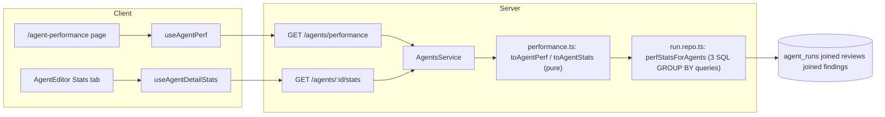

# Agent Performance dashboard + per-agent Stats tab

Two read-only surfaces over the same range-scoped question — "is this agent
worth what it costs?" — built from **one shared aggregation** so the two
never disagree: a **Stats tab** inside `AgentEditor` for one agent, and a
workspace-wide **`/agent-performance`** dashboard ranking every agent. Both
are pure reads over `agent_runs` + `findings`; neither triggers a model call
or exposes a write action.

Shipped per
[`docs/plans/spec-06-agent-performance-dashboard.md`](../plans/spec-06-agent-performance-dashboard.md)
(source spec:
[`specs/SPEC-06-agent-performance-dashboard.md`](../../specs/SPEC-06-agent-performance-dashboard.md)),
on branch `feat/agent-performance-dashboard` (13 commits, HEAD `6969c15`) —
cleared `plan-verifier`'s two-phase gate (Phase 1: PASS with one accepted
non-code deployment blocker, see [Deployment note](#deployment-note-migration-not-yet-applied);
Phase 2 architecture review: 2 Minor + 2 Nit, zero Critical). HTTP/contract
lookup: [`docs/reference/agent-performance-api.md`](../reference/agent-performance-api.md).
Shared-aggregation-in-SQL decision:
[ADR 0011](../adr/0011-shared-sql-aggregation-for-agent-performance.md).

## What it does

1. **Stats tab** — `AgentEditor`'s new `stats` tab
   (`AgentEditor/_components/StatsTab/StatsTab.tsx`) shows one agent's runs,
   avg cost (labeled an estimate), avg latency, accept rate **with its
   decided-findings denominator**, a severity breakdown, and a
   findings-per-run trend sparkline, all for the selected range.
2. **Agent Performance dashboard** — `/agent-performance`
   (`app/agent-performance/_components/AgentPerformanceView/`, reachable from
   the sidebar's `Agent Performance` global-nav entry, shortcut `f`) shows
   four tiles (Total runs with a run-count sparkline, Total cost, Avg
   accept-rate, Most-active agent), two cost donuts (by agent, by model), and
   a per-agent table.
3. **One shared aggregation, reconciled by construction** — both surfaces
   call `perfStatsForAgents` (`server/src/modules/reviews/repository/run.repo.ts`)
   with the same `(workspaceId, agentIds[], range)` shape, then the same pure
   shaping functions (`toAgentStats`/`toAgentPerf`,
   `server/src/modules/agents/performance.ts`). For a given agent and range,
   the dashboard's `runs`, `avg_cost_usd`, `avg_latency_ms` and `accept_rate`
   are the **same numbers** as that agent's Stats tab, not independently
   re-derived (AC-18) — see [ADR 0011](../adr/0011-shared-sql-aggregation-for-agent-performance.md)
   for why that reconciliation is architectural, not a passing test.
4. **Three range modes on both surfaces** — `1d`, `30d` (default), or a
   custom `[start, end]`, resolved server-side to a half-open `[start, end)`
   UTC interval so adjacent ranges never double-count a run, and reflected in
   the URL (`?range=`) so a view is shareable and reload-stable
   (`server/src/modules/agents/helpers.ts`'s `resolveRange`,
   `client/src/lib/hooks/range.ts`'s `rangeFromSearchParams`/`rangeToSearchParams`).
   A custom range is capped at 366 days and validated at the route via zod
   `superRefine` — 422 before the handler runs, never inside it
   (`server/src/modules/agents/routes.ts`'s `RangeQuery`).
5. **Cost is a labeled estimate, never billed/actual** — see
   [Cost: estimate, not billed](#cost-estimate-not-billed).
6. **Accept-rate ranking refuses to rank a small sample** — see
   [Accept-rate ranking](#accept-rate-ranking-the-low-confidence-group).
7. **No model calls, no write actions.** Both endpoints are pure reads;
   reloading, changing range, or sorting issues read-only queries only.

## Where it lives

- **Server:** `server/src/modules/reviews/repository/run.repo.ts`
  (`perfStatsForAgents` — the one shared aggregation, three SQL `GROUP BY`
  queries), `server/src/modules/reviews/repository.ts` (the `ReviewRepository`
  facade method + exported row types `PerfRunAggRow`/`PerfTrendRow`/
  `PerfFindingAggRow`/`PerfRangeResult`), `server/src/modules/agents/performance.ts`
  (pure shaping: `toAgentStats`/`toAgentPerf`), `server/src/modules/agents/helpers.ts`
  (pure range resolution: `resolveRange`/`validateRangeQuery`),
  `server/src/modules/agents/service.ts` (`agentStats`/`performance` methods),
  `server/src/modules/agents/routes.ts` (`GET /agents/:id/stats`,
  `GET /agents/performance`).
- **Client:** `client/src/app/agents/[id]/_components/AgentEditor/_components/StatsTab/`,
  `client/src/app/agent-performance/` (`page.tsx` → `_components/AgentPerformanceView/`,
  the `/ci-runs` shape), `client/src/components/range-selector/RangeSelector.tsx`
  (new shared 1d/30d/custom picker, used by both surfaces), `client/src/lib/hooks/range.ts`
  (shared range query-key/query-string/URL helpers), `client/src/lib/hooks/agents.ts`
  (`useAgentDetailStats`, deliberately **not** named `useAgentStats` — that
  name is already taken by `lib/hooks/multi-agent.ts` for the unrelated
  `GET /agents/stats` endpoint), `client/src/lib/hooks/agent-performance.ts`
  (`useAgentPerf`), `client/src/vendor/ui/nav.ts` (the `agent-performance`
  `GLOBAL`-group entry, the do-not-touch exception's 6th use).
- Contracts: `AgentStats`/`StatPoint`
  (`vendor/shared/contracts/observability.ts`, adopted **unchanged**) and
  `AgentPerf`/`AgentPerfRow`/`PerfCostSegment`
  (`vendor/shared/contracts/productionize.ts`, extended additively — see
  [`docs/reference/agent-performance-api.md`](../reference/agent-performance-api.md)).

`RangeSelector` keeps its styles as an inline module-level `const` rather
than a colocated `styles.ts` — the shape every sibling component in this repo
uses. Noted here as a style-convention gap (`plan-verifier` Phase 2 Minor),
not a functional issue; a future touch of this file should move to
`styles.ts` while it's open.

## The shared aggregation

`perfStatsForAgents` defines the **counted run set** exactly once —
`agent_runs` rows where `workspace_id` matches the caller's workspace,
`ran_at` falls in the half-open range, `status = 'done'`, and `agent_id IS
NOT NULL` — and every number on both surfaces is derived from that set. It
runs three queries, independent of how many agents are asked for and how
many rows are in the counted set:

1. `agent_runs` `GROUP BY (agent_id, model)` — run counts, cost sums (with
   null-cost tracking so a NULL `cost_usd` is never coerced to `0`),
   per-model cost split, avg duration, `last_run_at`.
2. `agent_runs` `GROUP BY (agent_id, width_bucket(ran_at))` — the
   findings-per-run trend, bucketed entirely in SQL via Postgres's
   `width_bucket()`.
3. `findings ⋈ reviews`, inner-joined to `agent_runs` on the same counted-run
   filter, `GROUP BY (reviews.agent_id, findings.severity)` — accepted/
   dismissed counts via `FILTER (WHERE …)`, scoped to `reviews.kind =
   'review'` so summary rows never inflate finding counts.

This SQL-side shape is the result of a fix-loop rewrite — the first cut
loaded the counted run set into Node and summed it there; `plan-verifier`
flagged it as a Major architecture finding (NFR-3's "aggregation happens in
SQL, never by loading rows into Node"), and it was rewritten to the three
`GROUP BY` queries above. See
[ADR 0011](../adr/0011-shared-sql-aggregation-for-agent-performance.md) for
the full decision and its consequences.

`modules/agents/performance.ts` imports its row types
(`PerfRunAggRow`/`PerfTrendRow`/`PerfFindingAggRow`/`PerfRangeResult`)
through the reviews module's facade (`modules/reviews/repository.ts`), never
`repository/run.repo.ts` directly — the onion-architecture boundary the
agents module already crosses via `container.reviewRepo` for
`AgentsService.stats()`. `plan-verifier`'s Phase 2 review flagged this as a
Minor: it works today, but it couples the agents module's shaping logic to
the reviews module's internal `GROUP BY` projection shape rather than a
dedicated port type. Accepted as-is for this feature — a real seam to revisit
if a third consumer of these row shapes appears.

## Cost: estimate, not billed

No provider billing API is integrated anywhere in this codebase. Every cost
number on both surfaces is a DevDigest-computed estimate from
`agent_runs.cost_usd`, and every place it renders says so — "estimate" on
the dashboard's Total cost tile, `stats.costNote` on the Stats tab. This is a
deliberate, documented seam (spec D-8/G-5): the estimate-vs-actual
distinction is left open for a future reconciled-billing source rather than
faking one now.

"Total cost" also means **total attributable spend**, not total spend ever:
runs orphaned by a deleted agent (`agent_id IS NULL`) and non-`done` runs
(failed/cancelled) are excluded from the counted set (D-12/D-17), so real
spend on those runs is invisible to both surfaces. The dashboard's
`totalCostSubtitle` copy says as much. Separately, whenever any counted run
has a NULL `cost_usd`, the response sets `summary.total_cost_partial = true`
and the dashboard renders a "Partial — some runs have no cost data" badge —
never a confident-looking total that's actually an under-count (AC-27, D-14).

## Accept-rate ranking: the low-confidence group

An agent with fewer than **5 decided findings** (`accepted + dismissed`) in
the range is excluded from accept-rate ranking and shown in a separate,
clearly-labeled group instead of being interleaved by an unreliable
percentage — a one-decision, 100%-accept agent is not meaningfully "the
best" (D-15, a product judgement, not a threshold derived from measured
data; `AgentPerformanceView/helpers.ts`'s `LOW_CONFIDENCE_THRESHOLD = 5`,
`rankByAcceptRate`). When every agent in the workspace is below the
threshold, the ranked group is simply empty and the page says "no agent has
enough decided findings yet to rank by accept-rate" rather than silently
picking an arbitrary order (AC-32).

The ranked and low-confidence rows render as **one `<table>` with two
`<tbody>` sections** — a ranked `<tbody>`, then (when non-empty) a
`<tbody>` starting with a spanning group-label row. This shipped after a
fix-loop correction: the first cut used two separate `<table>` elements with
a duplicated `<thead>`, which cannot align columns because each table sizes
its own columns independently. A single table sizes its columns from the
union of every row inside it, so the two sections' columns align by
construction with no manual width bookkeeping.

## Design fidelity notes (scoped down from the mockup, disclosed)

Four gaps between the mockup and what shipped, each a deliberate,
disclosed scope-down rather than a silent miss:

- **Sparkline** — the Total Runs tile's sparkline is fed by a new
  `AgentPerf.summary.runs_trend` field: a workspace-wide run-count-per-bucket
  series, computed server-side. This is additive beyond the plan's original
  two `summary` fields (`total_cost_partial`, `most_active_agent_id`) —
  added in the fix-loop once the mockup's sparkline requirement became
  concrete. It is deliberately **not** derived from `AgentPerfRow.trend`
  (findings-per-run, a different metric) — one series per question, never
  re-derived client-side from the wrong one.
- **Agent icons** — the per-agent table's Agent column reuses `AgentCard`'s
  existing icon-box pattern (`Icon.Cpu` in a small colored badge) rather than
  inventing new per-agent icons. The mockup's per-agent shield/lightning/pin
  icon set has no precedent anywhere in this codebase, including in
  `AgentCard` itself.
- **Threshold-colored accept rate, no directional arrow** — the Accept
  column is colored by threshold (green ≥70%, amber ≥40%, red below, muted
  when there's no rate yet) using the same tokens `MetricCard`'s delta
  indicator already uses. The mockup's ↑/↓ trend arrow is out of scope:
  `AgentPerfRow` carries no accept-rate-over-time series — only a
  findings-per-run `trend` — so a real directional arrow would need a new
  contract field. Threshold-only coloring is an accepted partial fix, not
  a silent drop.

## Deployment note: migration not yet applied

`server/src/db/migrations/0023_small_carmella_unuscione.sql` adds
`agent_runs_workspace_ran_at_idx`, a covering index on `(workspace_id,
ran_at)` — added after `EXPLAIN` (forced off `enable_seqscan`) confirmed the
only existing index, `(workspace_id, source, ran_at)`, can't serve this
feature's range scan, because `source` sits between the two columns the
query actually filters on and this feature deliberately does not constrain
`source` (CI runs count alongside local runs). The migration is generated
and committed but **not applied** to this environment's shared dev Postgres
container: that container's migration state has drifted ahead of this
branch's migration files (an unrelated worktree applied migrations to it
directly, bypassing git), so `pnpm db:migrate` cannot run cleanly there yet.

This is an **operational/deployment gap, not a code defect** — the feature
is correct without the index, just not optimally indexed at the shared
container's current (small) row count, and `plan-verifier`'s own
Testcontainers-backed integration tests (which migrate a fresh, ephemeral
container from this branch's files only) are unaffected. Run `pnpm db:migrate`
once the shared container's drift is resolved.

## Non-goals

- No reconciled billing — cost stays a DevDigest-computed estimate (above).
- No re-running, re-scoring, or re-grading of any review; no write path of
  any kind on either surface.
- No new persisted aggregate table — everything is derived at read time.
- `GET /agents/stats` (no `:id`) is untouched — still serves the multi-agent
  picker's `AgentCostEstimate`, unrelated to this feature. See
  [`docs/reference/agent-performance-api.md`](../reference/agent-performance-api.md#disambiguation-get-agentsstats-vs-get-agentsidstats)
  for the disambiguation.
- No changes to `run-executor.ts`, the review path, or finding
  accept/dismiss semantics.

## Key source map

| Concern | Location |
|---|---|
| Shared aggregation (3 SQL `GROUP BY` queries) | `server/src/modules/reviews/repository/run.repo.ts` (`perfStatsForAgents`) |
| Facade + exported row types | `server/src/modules/reviews/repository.ts` |
| Pure shaping (`AgentStats`/`AgentPerf` projections) | `server/src/modules/agents/performance.ts` |
| Pure range resolution + validation | `server/src/modules/agents/helpers.ts` |
| Service methods | `server/src/modules/agents/service.ts` (`agentStats`, `performance`) |
| Routes | `server/src/modules/agents/routes.ts` |
| Contracts | `vendor/shared/contracts/observability.ts` (`AgentStats`), `vendor/shared/contracts/productionize.ts` (`AgentPerf`) |
| Stats tab | `client/src/app/agents/[id]/_components/AgentEditor/_components/StatsTab/` |
| Dashboard page | `client/src/app/agent-performance/_components/AgentPerformanceView/` |
| Shared range picker | `client/src/components/range-selector/RangeSelector.tsx` |
| Shared range URL/query helpers | `client/src/lib/hooks/range.ts` |
| Client hooks | `client/src/lib/hooks/agents.ts` (`useAgentDetailStats`), `client/src/lib/hooks/agent-performance.ts` (`useAgentPerf`) |
| Nav entry | `client/src/vendor/ui/nav.ts` (`GLOBAL` group, `agent-performance`) |
| Migration (covering index, not yet applied here) | `server/src/db/migrations/0023_small_carmella_unuscione.sql` |
