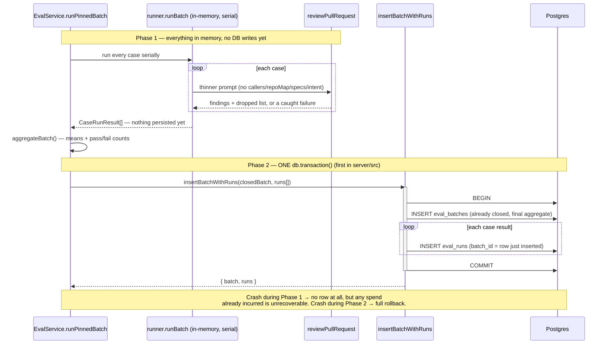

# Eval Pipeline

Turns a reviewer's own accept/dismiss decisions into a code-scored regression
suite for DevDigest's review agents. One click on a decided finding makes an
eval case; one click runs an agent's whole case set as one version-pinned
batch; the resulting recall/precision/citation numbers are comparable across
agent versions — with **zero LLM calls** anywhere in scoring, aggregation or
comparison.

Shipped per [`docs/plans/eval-pipeline.md`](../plans/eval-pipeline.md) (source
spec: [`specs/eval-pipeline.md`](../../specs/eval-pipeline.md)), across three
phases: A (contracts + schema), B (case CRUD, create-from-finding, the pure
scorer), and C (the version-pinned batch runner + read APIs — this document's
main focus, commits `42763c6`/`3fce7db`/`10ab8f6`). HTTP/contract lookup:
[`docs/reference/eval-api.md`](../reference/eval-api.md). Batch-storage
decision: [ADR 0006](../adr/0006-eval-batches-stored-aggregate.md).

## What it does

1. **Create a case from a real finding** (Phase B) — an accepted finding
   becomes a `must_find` expectation, a dismissed one a `must_not_flag`
   expectation, both derived server-side from `accepted_at`/`dismissed_at`,
   never from the request (`server/src/modules/eval/service.ts`'s
   `createFromFinding`). Inputs are pinned at creation (`input_diff`,
   `input_meta`) so a case stays comparable even after the source PR's
   `pr_files` are refreshed.
2. **Score in code — zero model calls** (Phase B) — `scorer.ts`'s
   `matchesExpectation`/`scoreCase`/`aggregateBatch` compute recall,
   precision and citation accuracy by file+line-range intersection over the
   review engine's own (already-shipped) grounding output. Recall/precision
   are computed over the grounded finding set, citation accuracy over the
   pre-gate set (AC-28); an unmeasured metric is `null`, never `1.0` or `0`.
3. **Run a version-pinned batch** (Phase C) — described below.
4. **Read — dashboard, history, compare, zero LLM calls** (Phase C) —
   described below.

## Running a batch — version pinning, a thinner prompt, isolation, caps

`POST /agents/:id/eval-runs` (the whole set) and `POST /eval-cases/:id/run`
(one case, as a one-case batch) both funnel through
`EvalService.runPinnedBatch` (`server/src/modules/eval/service.ts`), so the
same pin/guard/isolate/aggregate sequence governs both entry points:

- **Version pinning (AC-15/AC-16).** The agent's config is read exactly once,
  at batch open: `agent_version`, `provider`, `model`, and a
  `skills_fingerprint` (the ordered `{skill_id, version}` list of the agent's
  currently-**enabled** linked skills, resolved through the new
  `AgentsService.linkedSkillsForRun` — an additive, read-only method added so
  `modules/eval` never imports `AgentsRepository` directly, the same
  cross-module-read discipline `modules/blast/` already follows). A
  mid-batch config edit cannot leak into the already-pinned snapshot.
- **A deliberately thinner prompt than production (D-2, unchanged from the
  spec, exercised for the first time by this phase).** `runner.ts`'s
  `runOneCase` assembles the `ReviewInput` with `systemPrompt`, `model`,
  `diff`, `llm`, `strategy` and (when enabled) `skills` — and **no**
  `callers`, `repoMap`, `specs` or `intent` keys, the four inputs a
  production review derives from a live clone/index. This is what keeps two
  runs of the same case comparable months apart, at the cost of eval numbers
  measuring *relative* movement, not absolute review quality (E-9).
- **Serial execution, per-case timeout, a batch cap (Q-4).** Cases run one
  at a time — never `Promise.all` — because a batch is provider-bound and
  parallelism would multiply spend against the same 10/min rate limit.
  Each case is wrapped in `withTimeout(…, EVAL_CASE_TIMEOUT_MS)`
  (120 000 ms); `MAX_CASES_PER_BATCH = 25` bounds a batch's worst-case spend
  (`server/src/modules/eval/constants.ts`).
- **Per-case failure isolation (AC-20/AC-21).** `runOneCase` never throws —
  a provider error, an unparseable diff, a schema-invalid response, or a
  timeout is caught inside the function and returned as
  `{ ok: false, error }`. One case failing does not fail the batch; a batch
  where *every* case failed is recorded `status: 'failed'` with every metric
  `null`, never a fabricated zero score.
- **An in-process concurrency guard (E-14).** `EvalService.runningBatches`,
  a `Set` keyed `workspaceId:agentId`, rejects a second concurrent batch for
  the same agent with a 409. Explicitly single-process, not a distributed
  lock — the same honest scope `modules/brief/service.ts`'s `inFlight` guard
  already documents.
- **Rate limiting (AC-45).** Both run routes are limited to 10/minute via
  `EVAL_RUN_RATE_LIMIT`, the same shape `modules/reviews/routes.ts` uses for
  its own model-spending routes.

## Persisting a batch — the fix-loop's single atomic transaction

The batch runner's persistence shape changed during `plan-verifier`'s Phase C
review, and the change is worth understanding on its own:

**What shipped first, and the bug it had.** `runPinnedBatch` originally
opened an `eval_batches` row *before* any case ran — a placeholder with
`status: 'failed'`, every count `0`, every metric `null` — then overwrote it
once the real aggregate was known. `listBatchesForOwner` has no status
filter and sorts `ran_at` descending, so that placeholder **was**
`batches[0]` — "the latest batch" — for the entire in-flight window: a
concurrent `GET /agents/:id/eval-dashboard` mid-run saw a real agent's
history replaced by all-null current metrics and computed a fabricated
delta against it. Worse, a process dying mid-batch left that placeholder
permanently in place, indistinguishable from a genuine AC-21 all-failed
batch.

**The fix.** `EvalRepository.insertBatchWithRuns` is now the *only* write to
`eval_batches`/`eval_runs` for a run, and it writes the batch row **already
closed** — after `runner.runBatch()` has returned every case's result fully
in memory — inside a single `db.transaction()` alongside every one of that
batch's `eval_runs` rows (`server/src/modules/eval/repository.drizzle.ts`;
the first use of `.transaction(...)` anywhere in `server/src`). A
still-running batch therefore has **no row at all** until it finishes —
nothing for any read path to pick up — and a throw partway through the
transaction rolls back the batch insert and every run insert together, so a
committed batch's `cases_total` can never diverge from its actual persisted
`eval_runs` row count.

**The residual, accepted tradeoff.** The transaction only protects what it
itself commits. If the process crashes *while* `runBatch()` is still
executing — i.e. before the transaction begins — the spend already incurred
by cases that already completed has no persisted record anywhere and cannot
be recovered. Fixing that fully would mean writing each case's cost as it
finishes, which is exactly the per-case-write design this fix moved away
from — so it is documented as an accepted tradeoff, not silently claimed as
a pure win. See `EvalBatchWrite`'s doc comment
(`server/src/modules/eval/repository.ts`) and `server/INSIGHTS.md`'s
2026-08-21 fix-loop entry for the full detail.

## Reading — dashboard, history, compare (zero LLM calls)

Five read routes (`GET /agents/:id/eval-dashboard`, `GET /eval-dashboard`,
`GET /agents/:id/eval-batches`, `GET /eval-batches/:id`,
`GET /agents/:id/eval-compare`) never call a model regardless of how many
batches they cover (AC-33) — every one reads persisted `eval_batches`/
`eval_runs` rows, scoped through the batch's own `workspace_id` since
`eval_runs` itself still carries none (AC-44).

- **Null-not-fabricated delta semantics (the fix-loop's other revision to
  Recommendation 1).** `EvalDashboard.delta` is `null` outright when an
  agent has fewer than two batches (E-17 — never a zero delta, which reads
  as "no change"). As shipped in this phase's first pass, once two batches
  *did* exist, `buildDashboard` still fell back to a fabricated `0` for any
  individual metric that was itself unmeasured on either side (e.g. a batch
  whose cases had no `must_find` entries, so recall was never scored that
  run) — a real (and wrong) swing. The fix widened each of `delta.recall`/
  `.precision`/`.citation_accuracy` to `.nullable()` too, in both vendored
  `eval-ci.ts` copies, and changed `buildDashboard` to emit `null` per field
  whenever either endpoint's own metric is null — the same honest pattern
  `EvalComparison.delta` and `compare()` already used. See
  `server/src/modules/eval/service.ts`'s `buildDashboard`.
- **Prompt-snapshot degradation in compare (AC-32).** `compare()` reads both
  batches' system prompts from `agent_versions.config_json` via
  `AgentsService.getVersion`, never the agent's *current* prompt. A missing
  snapshot for a recorded `agent_version` degrades to a `null` prompt with
  the batch's own metrics still rendered — it never substitutes the live
  prompt, which would attribute a delta to the wrong edit.

## Known limitations (non-blocking, deferred by user decision)

Three Nits from `plan-verifier`'s Phase C review were deferred rather than
fixed in this fix-loop:

- `insertBatchWithRuns` issues one `INSERT` per `eval_runs` row inside its
  transaction (N+1 statements) rather than a single multi-row `INSERT` —
  correctness is unaffected (the transaction still makes the whole batch
  atomic), only round-trip count.
- `EvalBatchWrite`'s doc comment and `server/INSIGHTS.md` document the
  crash-before-transaction spend-loss tradeoff in general terms but do not
  name the exact "process restarts mid-batch" rollback scenario as its own
  explicit bullet.
- `countCasesForOwner` (`repository.drizzle.ts`) selects every matching
  `eval_cases` row and takes `.length` rather than a SQL `COUNT(*)` —
  correct, but reads more rows than necessary as a workspace's case count
  grows.

## Key source map

| Concern | Location |
|---|---|
| Routes | `server/src/modules/eval/routes.ts` |
| Service (CRUD, create-from-finding, batch orchestration, dashboard/compare) | `server/src/modules/eval/service.ts` |
| Per-case execution (thinner prompt, isolation) | `server/src/modules/eval/runner.ts` |
| Pure scorer | `server/src/modules/eval/scorer.ts` |
| DB port (no Drizzle import) | `server/src/modules/eval/repository.ts` |
| DB adapter (Drizzle, the batch transaction) | `server/src/modules/eval/repository.drizzle.ts` |
| Row ↔ contract mapping helpers | `server/src/modules/eval/helpers.ts` |
| Engineering caps | `server/src/modules/eval/constants.ts` |
| Additive cross-module read | `server/src/modules/agents/service.ts`'s `linkedSkillsForRun` |
| Persistence | `server/src/db/schema/eval.ts` (`evalCases`, `evalBatches`, `evalRuns`) |
| Contracts | `vendor/shared/contracts/eval-ci.ts` (hand-mirrored to client) |
| Tests | `server/test/eval-runner-batch.it.test.ts`, `server/test/eval-read-apis.it.test.ts` |
