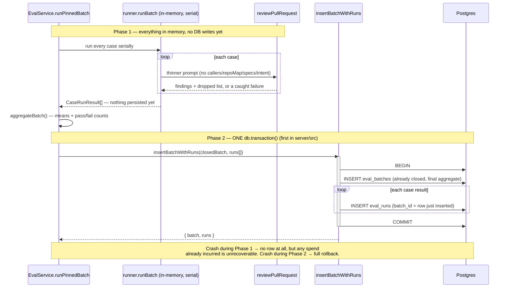
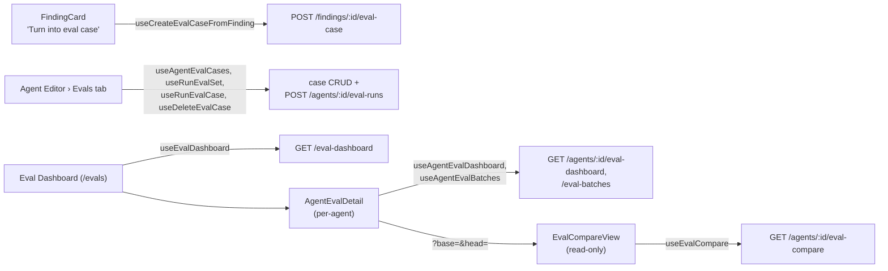

# Eval Pipeline

Turns a reviewer's own accept/dismiss decisions into a code-scored regression
suite for DevDigest's review agents. One click on a decided finding makes an
eval case; one click runs an agent's whole case set as one version-pinned
batch; the resulting recall/precision/citation numbers are comparable across
agent versions — with **zero LLM calls** anywhere in scoring, aggregation or
comparison.

Shipped per [`docs/plans/eval-pipeline.md`](../plans/eval-pipeline.md) (source
spec: [`specs/eval-pipeline.md`](../../specs/eval-pipeline.md)), across five
phases: A (contracts + schema), B (case CRUD, create-from-finding, the pure
scorer), C (the version-pinned batch runner + read APIs, commits
`42763c6`/`3fce7db`/`10ab8f6`), D (the client Evals UI — this document's
"Client" section, commits `6295127`/`89c5edd`/`15fe166`/`0fd084a`), and E (the
`scripts/verify-l06.sh` self-check gate — this document's "Verification gate"
section, commits `ce4d293`/`4bb63c0`). HTTP/contract lookup:
[`docs/reference/eval-api.md`](../reference/eval-api.md). Batch-storage
decision: [ADR 0006](../adr/0006-eval-batches-stored-aggregate.md).

## What it does

1. **Create a case from a real finding** (Phase B) — an accepted finding
   becomes a `must_find` expectation, a dismissed one a `must_not_flag`
   expectation, both derived server-side from `accepted_at`/`dismissed_at`,
   never from the request (`server/src/modules/eval/service.ts`'s
   `createFromFinding`). Inputs are pinned at creation (`input_diff`,
   `input_meta`) so a case stays comparable even after the source PR's
   `pr_files` are refreshed.
2. **Score in code — zero model calls** (Phase B) — `scorer.ts`'s
   `matchesExpectation`/`scoreCase`/`aggregateBatch` compute recall,
   precision and citation accuracy by file+line-range intersection over the
   review engine's own (already-shipped) grounding output. Recall/precision
   are computed over the grounded finding set, citation accuracy over the
   pre-gate set (AC-28); an unmeasured metric is `null`, never `1.0` or `0`.
3. **Run a version-pinned batch** (Phase C) — described below.
4. **Read — dashboard, history, compare, zero LLM calls** (Phase C) —
   described below.

## Running a batch — version pinning, a thinner prompt, isolation, caps

`POST /agents/:id/eval-runs` (the whole set) and `POST /eval-cases/:id/run`
(one case, as a one-case batch) both funnel through
`EvalService.runPinnedBatch` (`server/src/modules/eval/service.ts`), so the
same pin/guard/isolate/aggregate sequence governs both entry points:

- **Version pinning (AC-15/AC-16).** The agent's config is read exactly once,
  at batch open: `agent_version`, `provider`, `model`, and a
  `skills_fingerprint` (the ordered `{skill_id, version}` list of the agent's
  currently-**enabled** linked skills, resolved through the new
  `AgentsService.linkedSkillsForRun` — an additive, read-only method added so
  `modules/eval` never imports `AgentsRepository` directly, the same
  cross-module-read discipline `modules/blast/` already follows). A
  mid-batch config edit cannot leak into the already-pinned snapshot.
- **A deliberately thinner prompt than production (D-2, unchanged from the
  spec, exercised for the first time by this phase).** `runner.ts`'s
  `runOneCase` assembles the `ReviewInput` with `systemPrompt`, `model`,
  `diff`, `llm`, `strategy` and (when enabled) `skills` — and **no**
  `callers`, `repoMap`, `specs` or `intent` keys, the four inputs a
  production review derives from a live clone/index. This is what keeps two
  runs of the same case comparable months apart, at the cost of eval numbers
  measuring *relative* movement, not absolute review quality (E-9).
- **Serial execution, per-case timeout, a batch cap (Q-4).** Cases run one
  at a time — never `Promise.all` — because a batch is provider-bound and
  parallelism would multiply spend against the same 10/min rate limit.
  Each case is wrapped in `withTimeout(…, EVAL_CASE_TIMEOUT_MS)`
  (120 000 ms); `MAX_CASES_PER_BATCH = 25` bounds a batch's worst-case spend
  (`server/src/modules/eval/constants.ts`).
- **Per-case failure isolation (AC-20/AC-21).** `runOneCase` never throws —
  a provider error, an unparseable diff, a schema-invalid response, or a
  timeout is caught inside the function and returned as
  `{ ok: false, error }`. One case failing does not fail the batch; a batch
  where *every* case failed is recorded `status: 'failed'` with every metric
  `null`, never a fabricated zero score.
- **An in-process concurrency guard (E-14).** `EvalService.runningBatches`,
  a `Set` keyed `workspaceId:agentId`, rejects a second concurrent batch for
  the same agent with a 409. Explicitly single-process, not a distributed
  lock — the same honest scope `modules/brief/service.ts`'s `inFlight` guard
  already documents.
- **Rate limiting (AC-45).** Both run routes are limited to 10/minute via
  `EVAL_RUN_RATE_LIMIT`, the same shape `modules/reviews/routes.ts` uses for
  its own model-spending routes.

## Persisting a batch — the fix-loop's single atomic transaction

The batch runner's persistence shape changed during `plan-verifier`'s Phase C
review, and the change is worth understanding on its own:

**What shipped first, and the bug it had.** `runPinnedBatch` originally
opened an `eval_batches` row *before* any case ran — a placeholder with
`status: 'failed'`, every count `0`, every metric `null` — then overwrote it
once the real aggregate was known. `listBatchesForOwner` has no status
filter and sorts `ran_at` descending, so that placeholder **was**
`batches[0]` — "the latest batch" — for the entire in-flight window: a
concurrent `GET /agents/:id/eval-dashboard` mid-run saw a real agent's
history replaced by all-null current metrics and computed a fabricated
delta against it. Worse, a process dying mid-batch left that placeholder
permanently in place, indistinguishable from a genuine AC-21 all-failed
batch.

**The fix.** `EvalRepository.insertBatchWithRuns` is now the *only* write to
`eval_batches`/`eval_runs` for a run, and it writes the batch row **already
closed** — after `runner.runBatch()` has returned every case's result fully
in memory — inside a single `db.transaction()` alongside every one of that
batch's `eval_runs` rows (`server/src/modules/eval/repository.drizzle.ts`;
the first use of `.transaction(...)` anywhere in `server/src`). A
still-running batch therefore has **no row at all** until it finishes —
nothing for any read path to pick up — and a throw partway through the
transaction rolls back the batch insert and every run insert together, so a
committed batch's `cases_total` can never diverge from its actual persisted
`eval_runs` row count.

**The residual, accepted tradeoff.** The transaction only protects what it
itself commits. If the process crashes *while* `runBatch()` is still
executing — i.e. before the transaction begins — the spend already incurred
by cases that already completed has no persisted record anywhere and cannot
be recovered. Fixing that fully would mean writing each case's cost as it
finishes, which is exactly the per-case-write design this fix moved away
from — so it is documented as an accepted tradeoff, not silently claimed as
a pure win. See `EvalBatchWrite`'s doc comment
(`server/src/modules/eval/repository.ts`) and `server/INSIGHTS.md`'s
2026-08-21 fix-loop entry for the full detail.

## Reading — dashboard, history, compare (zero LLM calls)

Five read routes (`GET /agents/:id/eval-dashboard`, `GET /eval-dashboard`,
`GET /agents/:id/eval-batches`, `GET /eval-batches/:id`,
`GET /agents/:id/eval-compare`) never call a model regardless of how many
batches they cover (AC-33) — every one reads persisted `eval_batches`/
`eval_runs` rows, scoped through the batch's own `workspace_id` since
`eval_runs` itself still carries none (AC-44).

- **Null-not-fabricated delta semantics (the fix-loop's other revision to
  Recommendation 1).** `EvalDashboard.delta` is `null` outright when an
  agent has fewer than two batches (E-17 — never a zero delta, which reads
  as "no change"). As shipped in this phase's first pass, once two batches
  *did* exist, `buildDashboard` still fell back to a fabricated `0` for any
  individual metric that was itself unmeasured on either side (e.g. a batch
  whose cases had no `must_find` entries, so recall was never scored that
  run) — a real (and wrong) swing. The fix widened each of `delta.recall`/
  `.precision`/`.citation_accuracy` to `.nullable()` too, in both vendored
  `eval-ci.ts` copies, and changed `buildDashboard` to emit `null` per field
  whenever either endpoint's own metric is null — the same honest pattern
  `EvalComparison.delta` and `compare()` already used. See
  `server/src/modules/eval/service.ts`'s `buildDashboard`.
- **Prompt-snapshot degradation in compare (AC-32).** `compare()` reads both
  batches' system prompts from `agent_versions.config_json` via
  `AgentsService.getVersion`, never the agent's *current* prompt. A missing
  snapshot for a recorded `agent_version` degrades to a `null` prompt with
  the batch's own metrics still rendered — it never substitutes the live
  prompt, which would attribute a delta to the wrong edit.

## Known limitations (non-blocking, deferred by user decision)

Three Nits from `plan-verifier`'s Phase C review were deferred rather than
fixed in this fix-loop:

- `insertBatchWithRuns` issues one `INSERT` per `eval_runs` row inside its
  transaction (N+1 statements) rather than a single multi-row `INSERT` —
  correctness is unaffected (the transaction still makes the whole batch
  atomic), only round-trip count.
- `EvalBatchWrite`'s doc comment and `server/INSIGHTS.md` document the
  crash-before-transaction spend-loss tradeoff in general terms but do not
  name the exact "process restarts mid-batch" rollback scenario as its own
  explicit bullet.
- `countCasesForOwner` (`repository.drizzle.ts`) selects every matching
  `eval_cases` row and takes `.length` rather than a SQL `COUNT(*)` —
  correct, but reads more rows than necessary as a workspace's case count
  grows.

## Client — Evals UI (Phase D)

Four surfaces, all built on one React Query hook layer
(`client/src/lib/hooks/eval.ts`) over `src/lib/api.ts` — no ad-hoc `fetch` in
any component (AC-40):

- **"Turn into eval case" on `FindingCard`** — a third action button, shown
  only when `accepted || dismissed` is true (`FindingCard.tsx:68-70,133-143`,
  AC-4/UX-1). `FindingsPanel.tsx` wires it to
  `useCreateEvalCaseFromFinding`; the success toast reads which expectation
  kind was created **from the mutation's own response**
  (`data.expected_output.must_find.length`), not by re-deriving it
  client-side from the finding's `accepted_at`/`dismissed_at` — the server's
  derivation (AC-3, D-7) is authoritative and the client timestamp can be
  stale relative to it (UX-2, `FindingsPanel.tsx:104-125`).
- **Evals tab in the Agent Editor** (`AgentEditor/_components/EvalsTab/`,
  AC-34/AC-35) — one entry added to `constants.ts`'s `TABS` array (so the
  URL allow-list `TAB_KEYS` follows automatically); the tab renders the
  agent's current metrics, its case list with per-case pass/fail and last
  recall, "New case", and per-case Run/Edit/Delete, backed by
  `CaseEditorModal` (a live `EvalExpectation.safeParse` validity badge on
  the JSON expectation editor) and `CaseRow`.
- **Eval Dashboard** (`/evals`, new sidebar entry under `SKILLS LAB` in
  `client/src/vendor/ui/nav.ts` — AC-36, the sanctioned vendor exception
  already used for the vendored contracts) — `EvalDashboardView` (one row
  per agent with a case or a batch, a sparkline, and a "Run all agents"
  action) drills via `?agent=<id>` into `AgentEvalDetail` (current metrics,
  a trend `LineChart`, and a recent-runs/batches table), which drills via
  `?base=<id>&head=<id>` into the read-only `EvalCompareView`.
- **Data layer** (`lib/hooks/eval.ts`) — the plan's 12 named hooks plus two
  the plan didn't name: `useEvalBatch`/`useEvalBatches` (a `useQueries`-based
  batch fetch, same shape as `hooks/context.ts`'s `useSkillContexts`), added
  because no server endpoint answers "this case's most recent run, across
  whichever batch it last ran in" (AC-35's per-case last-recall). The Evals
  tab's `helpers.ts#buildLastRunByCase` reconstructs it client-side by
  walking an agent's `RECENT_BATCHES_FOR_LAST_RUN = 5` most recent batches
  newest-first and taking the first run matching each `case_id` — correct
  for a whole-set run, but a **known limitation** for a single-case run
  (`POST /eval-cases/:id/run`, a one-case batch): every *other* case's
  displayed last-run can be stale relative to the just-run case, since no
  batch containing it was ever re-walked. Documented in the helper's own
  doc comment and `client/INSIGHTS.md` (2026-08-21), not silently presented
  as exact.

### Key UX decisions from the spec (AC-34…AC-51, UX-1…UX-13)

- **An undefined metric renders "n/a", never a fabricated `1.00`** (UX-4,
  E-11). `AgentEvalDetail.tsx`/`EvalsTab.tsx` both render
  `m.value != null ? "<pct>%" : t("dashboard.na")`, with a `naReason` caption
  when the agent has cases but this metric specifically has none.
- **A batch mean states how many cases contributed** (AC-30, UX-5). This was
  a Major finding closed in the Phase D fix-loop's first iteration: the
  metric tiles originally had no contributing-count caption at all. The fix
  reads `recall_cases`/`precision_cases`/`citation_cases` off
  `dashboard.recent_runs[0]` — the **same** batch `dashboard.current.*` was
  itself sourced from server-side (`buildDashboard`'s `current = { recall:
  latest?.recall, ... }` where `latest = batches[0]`) — deliberately never
  `dashboard.cases_total` (the owner's whole case set, a different and
  usually larger number that would misreport "2 of 8 this run" as "2 of
  20"). See `AgentEvalDetail.tsx:97-104`, `EvalsTab.tsx:72-76`.
- **A first batch shows "first run", not a zero delta** (E-17, UX-12).
  `isFirstRun = dashboard.delta === null && trend.length <= 1` gates the
  delta arrow off and shows `compare.firstRunNothing` instead — the same
  honest-null discipline the server's `buildDashboard` fix from Phase C
  established for `delta`'s per-field nulls.
- **The trend `LineChart` gets an explicit `yMin={0} yMax={1}`** (AC-39,
  E-7, UX-6) — `LineChart`'s own defaults (`yMin=0.6`) would clip exactly
  the region a deliberately-weakened prompt's precision drop lands in,
  which is what the homework's own validation experiment (WI16) is designed
  to produce. A second, separate `LineChart` trap surfaced during Phase D
  and is worked around rather than fixed (the component is vendored,
  do-not-touch): it fills a missing series index with a hard-coded `0`
  (`row[s.name] = s.data[i] ?? 0`), not a gap — passing a `null` metric
  straight through would render as a real, misleadingly low point.
  `AgentEvalDetail`'s `trendSeries` helper filters each metric's nulls out
  independently before handing the series to `LineChart`, at the
  documented cost that the two lines no longer share the same x index when
  their null patterns differ (a caption under the chart says so).
- **Compare view always shows snapshot prompts, never the live prompt**
  (AC-32, UX-8). `EvalCompareView` reads `base_prompt`/`head_prompt` off the
  `EvalComparison` the server already resolved through
  `agent_versions.config_json` snapshots; a missing snapshot renders
  `compare.promptUnavailable` text, never a silent fallback to the agent's
  current prompt. Prompts render in a plain `<pre>`, never through a second
  markdown/HTML renderer (A05 — a stored system prompt is exactly the kind
  of content that must never reach a second renderer).
- **The skills-fingerprint caveat on version badges** (Q-3, E-8, UX-7).
  Every batch row/column is labelled `v<agent_version>` with a `title`
  tooltip stating skills may have changed without bumping that version;
  `EvalCompareView/helpers.ts#sameVersionDifferentSkills` structurally
  compares two batches' `skills_fingerprint` arrays and, when they differ at
  the same `agent_version`, the compare view renders an explicit
  `compare.sameVersionDifferentSkills` note above the metrics.
- **Relative, not absolute, framing** (E-9, UX-13) — `dashboard.
  relativeScoresNote` is rendered near the metric tiles on all three eval
  pages/tab, stating that an eval run skips the repo context (callers, repo
  map, specs, intent) a live review gets.

### Known limitations — client (Phase D, deferred by user decision)

`plan-verifier`'s Phase 2 review found zero Critical findings for Phase D;
two Minor findings were reported and were **deliberately left open by user
decision**, not fixed in this fix-loop:

- Two UI strings are hardcoded English instead of routed through
  `next-intl`: the "estimate assumes one call per case — a case using
  strategy 'auto' ... can cost more" caveat
  (`EvalDashboardView.tsx`'s `s.autoNote`, AC-47/E-10) and the "run all
  agents" per-agent failure toast's fallback string
  (`` `Run failed for agent ${d.owner_id}` `` in `EvalDashboardView.tsx`'s
  `runAllAgents`). Both fall outside AC-41's enumerated new-key list, which
  is why `eval.json`/`prReview.json` weren't extended for them.
- The `nav.ts` item key ↔ `messages/en/shell.json`'s `nav.<key>` coupling
  (`useShellCommands.ts`'s `t(`nav.${it.key}`)`) is an **untyped runtime
  string join**, not a type-checked one — this exact mismatch (`nav.eval`
  vs. the registered key `"evals"`) broke `next build`'s static generation
  in the Phase D fix-loop's first iteration and was closed for *this* key
  by renaming `shell.json`'s entry plus adding a static key-diff test
  (`components/app-shell/nav.test.ts`) and a real-`next-intl` runtime hook
  test (`useShellCommands.test.tsx`); the coupling mechanism itself — any
  future `nav.ts` key addition could reproduce the same class of break —
  remains untyped by design choice, not by oversight.

Separately, and unrelated to the UI: `next.config.mjs` gained a
`webpack.resolve.extensionAlias` (`{ ".js": [".ts", ".tsx", ".js"] }`) in
the fix-loop's first iteration — the only value (non-type) client import of
the `@devdigest/shared` barrel, `CaseEditorModal.tsx`'s
`EvalExpectation.safeParse`, 500'd every tab of `/agents/:id` under `next
build`/`next dev` even though `tsc --noEmit` and Vitest both stayed green,
because Next's webpack doesn't resolve the barrel's relative `./contracts/
*.js` → `.ts` specifiers the way `tsc`'s `Bundler` resolution and Vite's
alias do. The alias makes the barrel (and any contract file) safely
value-importable everywhere going forward, not just at this one call site.

## Verification gate (Phase E)

Phase E (commits `ce4d293`, `4bb63c0`) ships no application code — it is the
self-check gate that proves Phases A–D's deliverables still compile, still
respect the module boundary rules, and still pass their tests, as one
pre-submission command (Q-5's plan decision).

- **`./scripts/verify-l06.sh`** — five fail-fast lanes, in order: (1) server
  typecheck (`tsc --noEmit -p tsconfig.json`); (2) server `arch:check`
  (`depcruise --config .dependency-cruiser.cjs src`); (3) server unit tests
  narrowed to the four L06 suites (`test/eval-ci-contracts.test.ts`,
  `test/eval-helpers.test.ts`, `test/eval-runner.test.ts`,
  `test/eval-scorer.test.ts`) with `--exclude '**/*.it.test.ts'`; (4) client
  typecheck; (5) client's full `vitest run`. It follows
  `scripts/verify-l03.sh`'s conventions exactly: `set -euo pipefail`, a
  `--help` block, ordered lanes that name the failing one and stop there,
  local binaries invoked directly (`./node_modules/.bin/tsc`/`vitest`/
  `depcruise`, never `pnpm <script>` — root `INSIGHTS.md`'s
  `ERR_PNPM_ABORTED_REMOVE_MODULES_DIR_NO_TTY` note), and a prerequisite check
  that fails with an actionable message when `server/node_modules` or
  `client/node_modules` is missing. Designed to pass with **Docker stopped** —
  the unit lane excludes `*.it.test.ts`. `reviewer-core` is deliberately
  excluded: unlike L03 (which touched `reviewer-core/src/prompt.ts`), the Eval
  Pipeline consumes `reviewPullRequest` exactly as-is and never imports or
  modifies `reviewer-core` at all (Scope: "a second grounding implementation
  is forbidden"), so there is nothing there for a `reviewer-core` lane to
  verify.
- **A boundary-check gap the gate itself closes**
  (`server/.dependency-cruiser.cjs`'s new `no-other-module-file-to-db-or-adapter`
  rule). `plan-verifier`'s Phase 2 architecture review found it: the four
  pre-existing rules only named files literally called `service.ts` /
  `routes.ts` / `helpers.ts`, so a new module's *other* files — `modules/eval/
  runner.ts`, `scorer.ts`, `constants.ts`, and the port `repository.ts` itself
  — could import `src/db/(schema|client)` or a concrete `src/adapters/**`
  completely undetected by `pnpm arch:check`. The new rule is a catch-all: any
  file in a non-`PRE_EXISTING_MODULES` module folder other than `routes.ts` /
  `service.ts` / `helpers.ts` / `repository.drizzle.ts` (the one file a module
  may touch Drizzle/Postgres from) is now forbidden from importing those
  paths. `modules/eval/` is the first module the widened rule actually covers.
  The scan's `exclude` also now names `server/src/modules/orders/orders.ts` —
  a deliberately-broken review-bait fixture, never registered in
  `modules/index.ts` and already excluded from `tsc` via `tsconfig.json`'s own
  `exclude` — since it was never meant to satisfy any architecture rule and
  would otherwise false-positive against the new catch-all.
- **The validation experiment (WI16) is not part of this gate, and is not
  done.** Creating ≥8 real eval cases from real findings, running a batch,
  editing the agent's system prompt, and re-running to show recall/precision
  movement in the compare view is human-run only per the plan — it spends
  real provider money and needs a browser. Pending the user; `verify-l06.sh`
  does not (and cannot) exercise it.

### Client surface map

The server-side diagram above (persisting a batch) answers "what happens
inside one transaction"; this one answers a different question — which UI
surface calls which route — so both stay under the "one diagram per
document" default with a stated reason rather than being merged:

## Key source map

| Concern | Location |
|---|---|
| Routes | `server/src/modules/eval/routes.ts` |
| Service (CRUD, create-from-finding, batch orchestration, dashboard/compare) | `server/src/modules/eval/service.ts` |
| Per-case execution (thinner prompt, isolation) | `server/src/modules/eval/runner.ts` |
| Pure scorer | `server/src/modules/eval/scorer.ts` |
| DB port (no Drizzle import) | `server/src/modules/eval/repository.ts` |
| DB adapter (Drizzle, the batch transaction) | `server/src/modules/eval/repository.drizzle.ts` |
| Row ↔ contract mapping helpers | `server/src/modules/eval/helpers.ts` |
| Engineering caps | `server/src/modules/eval/constants.ts` |
| Additive cross-module read | `server/src/modules/agents/service.ts`'s `linkedSkillsForRun` |
| Persistence | `server/src/db/schema/eval.ts` (`evalCases`, `evalBatches`, `evalRuns`) |
| Contracts | `vendor/shared/contracts/eval-ci.ts` (hand-mirrored to client) |
| Tests (server) | `server/test/eval-runner-batch.it.test.ts`, `server/test/eval-read-apis.it.test.ts` |
| Client data layer | `client/src/lib/hooks/eval.ts` |
| Client: create-from-finding | `FindingCard.tsx`, `FindingsPanel.tsx` (both under `client/src/app/repos/[repoId]/pulls/[number]/_components/`) |
| Client: Agent Editor tab | `client/src/app/agents/[id]/_components/AgentEditor/_components/EvalsTab/` (`EvalsTab.tsx`, `CaseEditorModal/`, `CaseRow/`, `helpers.ts`) |
| Client: dashboard/detail/compare | `client/src/app/evals/_components/` (`EvalDashboardView/`, `AgentEvalDetail/`, `EvalCompareView/`) |
| Client: nav registry entry | `client/src/vendor/ui/nav.ts` (`SKILLS LAB` group, key `"evals"`) |
| Client: i18n | `client/messages/en/eval.json`, `prReview.json`, `shell.json` |
| Client: webpack fix for barrel value-imports | `client/next.config.mjs` (`webpack.resolve.extensionAlias`) |
| Tests (client) | `client/src/app/evals/_components/**/*.test.tsx`, `EvalsTab.test.tsx`, `FindingsPanel.test.tsx`, `client/src/i18n/eval-l06-keys.test.ts`, `client/src/components/app-shell/nav.test.ts`, `useShellCommands.test.tsx` |
| Verification gate (Phase E) | `scripts/verify-l06.sh`; boundary-check widening in `server/.dependency-cruiser.cjs` |
