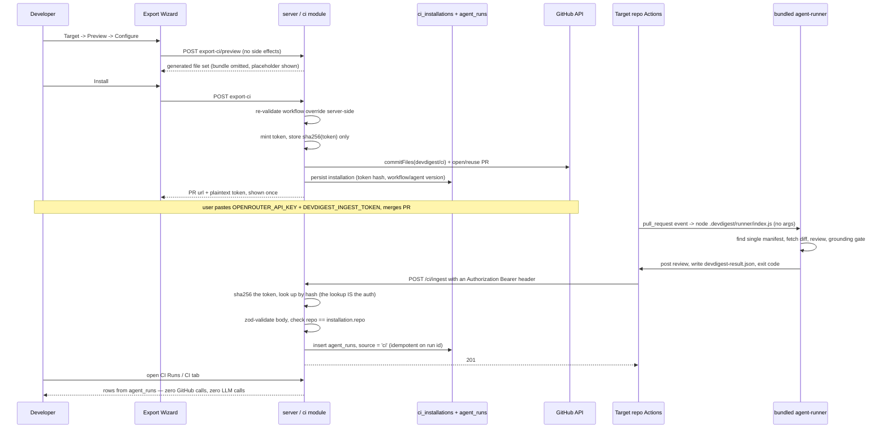

# Export to CI

Turns a locally-tuned DevDigest review agent into a **versioned configuration
checked into a target repository**, reviewed automatically on every pull
request by that repository's own GitHub Actions. A four-step **Export
Wizard** generates a previewable, least-privilege file set; **Install**
commits it to a `devdigest/ci` branch as an ordinary pull request and mints a
one-time ingest token; the generated workflow runs the embedded
`agent-runner` bundle and POSTs its result to one authenticated endpoint,
which writes a single `agent_runs` row with `source = 'ci'` that the **CI
Runs** page and the agent's **CI** tab render.

Shipped per [`docs/plans/spec-04-export-to-ci.md`](../plans/spec-04-export-to-ci.md)
(source spec: [`specs/SPEC-04-export-to-ci.md`](../../specs/SPEC-04-export-to-ci.md)),
across five phases — A (contracts, schema, dependencies, `65d8e82`), B (the
`ci` module's generator half, `0f8ce3a`), C (persistence, Install, ingest,
read APIs, `cd5cd43`), D (client data layer, CI tab, Export Wizard, `c9493da`),
E (CI Runs page, navigation, final sweep, `fac5cdb`) — plus one fix-loop
iteration (`26ad30b`) and a post-implementation amendment to the spec itself
(`b2117f5`) that this document reflects as the **shipped** design. HTTP/
contract lookup: [`docs/reference/ci-api.md`](../reference/ci-api.md).
Ingest-auth decision: [ADR 0007](../adr/0007-ci-ingest-bearer-token-hash-lookup.md).

`agent-runner/` (the CLI this feature's output is consumed by) is a
prerequisite this feature does not modify — see
[`agent-runner/README.md`](../../agent-runner/README.md) for its own contract
(manifest loading, diff fetching, the grounding gate, the deterministic
verdict, posting, exit codes). This document only covers the studio-side
half: what generates the files the runner reads, and what receives what the
runner posts back.

## What it does

1. **The Export Wizard** (`client/.../ExportWizard/`) — four steps, **Target
   → Preview → Configure → Install**, all state held in the wizard's parent
   component so Back/Continue never discards a hand-edited workflow
   (`ExportWizard.tsx`). Steps 1–3 are free of side effects: Preview is a
   mutation the user triggers (`useCiPreview`), never a query that fires on
   mount, and nothing mints a token or writes to GitHub before Install.
   - **Target** — `owner/name` repo field; GitHub Actions is the only
     activatable target (CircleCI/Jenkins/Generic CLI render disabled). The
     server independently rejects anything but `gha`
     (`routes.ts`'s `assertGhaTarget`).
   - **Preview** — the file list on the left, the selected file's exact
     generated contents on the right. Only the workflow is editable, as a
     plain textarea; the runner bundle entry shows a placeholder ("~N KB,
     never uploaded/downloaded") instead of its real bytes.
   - **Configure** — trigger checkboxes (`opened`/`synchronize` on by
     default, `reopened` off), "Post results as" (GitHub review / PR comment
     / none), the ingest URL field, and the "Secrets expected" panel naming
     `OPENROUTER_API_KEY`, `GITHUB_TOKEN`, `DEVDIGEST_INGEST_TOKEN` with their
     distinct statuses. Changing a trigger or `post_as` here re-fetches the
     Preview so what's shown on step 2 always matches what Install will
     commit.
   - **Install** — "Open a PR with these files" or "Copy files as a zip",
     plus (on create) the one-time ingest-token display.
2. **Generation** (`server/src/modules/ci/{manifest,workflow,helpers,bundle}.ts`)
   — described in its own section below.
3. **Install** (`CiService.install`, `server/src/modules/ci/service.ts:271-441`)
   — mints the token, commits, opens/reuses the PR, persists the installation
   last.
4. **Ingest** (`CiService.ingest`, `service.ts:487-569`) — the one
   authenticated endpoint results arrive on. Described below, and the place
   this document is most careful to describe the **shipped**, not the
   originally-specified, design.
5. **Read surfaces** — the CI Runs page (`client/src/app/ci-runs/`) and the
   agent's CI tab (`.../AgentEditor/_components/CiTab/`), both plain reads
   over `agent_runs`/`ci_installations`, zero GitHub calls, zero LLM calls.

## Generation — one generator, no abstraction, safety by construction

Every generator invariant lives once, in `server/src/modules/ci/constants.ts`,
and both the generator (`workflow.ts`, `manifest.ts`) and the re-validator
(`workflow-validate.ts`) import from it — the plan's Recommendation 2,
adopted precisely because this feature shipped with no test suite (see
"Known limitations" below) and a shared source of truth was the only thing
keeping the two from silently drifting apart.

- **The manifest** (`manifest.ts`'s `buildManifest`/`emitManifestYaml`) is a
  direct field mapping from the agent row — `name`, `model`,
  `system_prompt`, `strategy`, `ci_fail_on` map unchanged; `provider` is
  **always** the literal `openrouter`, because `agent-runner` constructs
  `OpenRouterProvider` unconditionally and never reads the manifest's
  `provider` field (`agent-runner/src/index.ts:39`). Skills are the ordered
  slugs of the agent's **enabled** linked skills, read via
  `AgentsService.linkedSkillsForRun` — never a direct import of
  `AgentsRepository`. YAML is emitted via the `yaml` package's `stringify`,
  never string concatenation, and `assertManifestRoundTrips` re-parses the
  emitted YAML and re-validates it against the same `AgentManifest` Zod
  contract `agent-runner` validates with before the export can succeed —
  this is what makes a `\n---\nci_fail_on: never\n` value inside a system
  prompt harmless: it can only ever be encoded as literal text inside its own
  scalar, never as a document break.
- **Slugs** (`helpers.ts`'s `slugify`/`disambiguate`) reject or rewrite a
  path separator, `..`, a leading dot, a Windows reserved device name, and an
  all-punctuation name (falling back to `untitled` rather than an empty
  string); two skills that slugify identically get deterministic `-2`, `-3`
  suffixes rather than one silently overwriting the other.
- **The workflow** (`workflow.ts`'s `buildWorkflow`/`emitWorkflowYaml`) is
  built as a `yaml.Document` object graph, never a template string, so the
  two pinned actions' version comments attach as real trailing YAML comments.
  Its invariants, all sourced from `constants.ts`:
  - `on:` is `pull_request` and only `pull_request`, with `types:` limited to
    the caller's selection intersected against `ALLOWED_TRIGGERS` — an
    unexpected trigger value can never reach the emitted YAML regardless of
    what called the generator.
  - `permissions:` is exactly `{ contents: read, pull-requests: write }`, or
    `{ contents: read, pull-requests: read }` when `post_as === 'none'` — no
    job-level `permissions:` block is ever emitted to widen it.
  - The job carries a fork guard (`FORK_GUARD_EXPR` —
    `github.event.pull_request.head.repo.full_name == github.repository`) so
    it never executes for a PR from a fork, where secrets are withheld
    anyway and `pull_request_target` (the tempting "fix") is forbidden
    outright by never appearing in `FORBIDDEN_EVENTS`'s complement.
  - `actions/checkout` and `actions/setup-node` are pinned to full 40-hex
    commit SHAs (`PINNED_ACTIONS`, resolved via `git ls-remote --tags` on
    2026-08-23 — v4.2.2 and v4.4.0 respectively), with the human-readable
    version as a trailing comment. `node-version: '22'`, matching the
    runner's own documented floor (`agent-runner/src/github.ts:6-12`) and
    root `AGENTS.md`'s Node ≥ 22 pin.
  - The review step runs **exactly** `node .devdigest/runner/index.js` — no
    subcommand, no flags, never `index.mjs` — with `continue-on-error: true`
    so the reporting step still runs after a blocking review, and an `env:`
    map carrying `OPENROUTER_API_KEY`, `GITHUB_TOKEN`, `GITHUB_REPOSITORY`,
    `PR_NUMBER`, `DEVDIGEST_POST_AS`. No fail-on value travels through the
    workflow in any form — the gate reaches CI **only** through the
    manifest's `ci_fail_on`, so there is never a second channel that can
    disagree with it.
  - The reporting step (`if: always()`) is a plain `curl`, not a third-party
    action, keeping the workflow's action surface at exactly two. It derives
    its own `status` (`succeeded` / `no_findings` / `failed`) from the
    artifact's own `findings_count` — **not** from the review step's exit
    code — because the review step's exit code is deliberately non-zero
    whenever the gate triggers `REQUEST_CHANGES`; conflating the two would
    make a correctly-blocking review indistinguishable from a pre-review
    crash and would make `no_findings` unreachable (fixed in fix-loop
    iteration 1, "finding 3").
  - A final gate step re-fails the job when the review step's outcome was
    `failure`, so `continue-on-error` on the review step never turns a
    blocking review green.
- **Hand-edited overrides are re-validated server-side**
  (`workflow-validate.ts`'s `validateWorkflowOverride`), never trusted from
  the client. It parses the submitted YAML first (an unparseable override is
  refused outright) and then asserts **over the parsed object**, not the raw
  string — a regex over text is trivially bypassable via comments, quoting,
  or flow style. The one string-equality check kept is the review step's
  `run:` value against the exact `RUN_COMMAND` constant, which is what
  refuses `node .devdigest/runner/index.js --agent other`.
- **The runner bundle** (`bundle.ts`'s `readRunnerBundle`) is read from
  `agent-runner/dist/index.js` at export time, resolved from
  `import.meta.url` rather than `process.cwd()` (so it's correct whether the
  server runs under `tsx` or from a built `dist/`). It's git-ignored and
  absent on a fresh clone by design — a missing bundle fails the export with
  a message naming the exact path and the command that produces it
  (`cd agent-runner && pnpm build`), before any GitHub call and before any
  token is minted. Preview never sends or receives the real bytes — it shows
  a one-line size placeholder (`preview_omitted: true` on that `CiFile`);
  Install and the zip export re-read the bundle from disk and swap in the
  real contents just before committing/zipping.

## Ingest auth — the shipped design (Bearer token + hash-keyed lookup)

**This is the one place the Spec changed after implementation, and this
document describes only what shipped.** The generated workflow's reporting
step sends a single header:

```
Authorization: Bearer <token>
```

(`workflow.ts`'s `reportScript`, `INGEST_TOKEN: '${{ secrets.DEVDIGEST_INGEST_TOKEN }}'`).
The server (`CiService.ingest`, `service.ts:487-569`) parses that header,
hashes the presented token with SHA-256, and looks up the installation whose
stored `token_hash` matches:

```ts
const token = parseBearerToken(authorizationHeader);
const hash = createHash('sha256').update(token, 'utf8').digest('hex');
const installation = await this.repo.findInstallationByTokenHash(hash);
if (!installation) throw new UnauthorizedError(...);
```

The **lookup itself is the authentication** — a hash match both identifies
the installation and proves possession of the token in one step, so there is
no separate installation-identifying value and no `timingSafeEqual`
constant-time comparison anywhere on this path. `ci_installations` stores
only `sha256(token)` (`token_hash`, plain-indexed, not unique — a hash
collision is outside this feature's threat model) and never the plaintext;
the plaintext exists only in the immediate Install response
(`CiExport.ingest_token`), shown once, and is never re-fetchable, logged, or
present on an update response.

**Why this differs from the original spec.** AC-51 and D-1 originally called
for a *separate* installation-identifying header plus a constant-time
comparison against that installation's stored hash. That design could not
actually work: Preview must produce byte-identical output to what Install
later commits (AC-5), and Preview runs **before** any installation exists —
there is no installation id to bake into the generated workflow at
generation time. The original ingest endpoint therefore read two custom
headers (`x-devdigest-installation` / `x-devdigest-token`) the generator
never emitted, so the ingest path could never authenticate in production.
`plan-verifier`'s Phase 1 audit caught this; fix-loop iteration 1 replaced it
with the single-`Authorization`-header, hash-keyed-lookup design described
above, and the Spec's AC-51/D-1 were amended post-implementation
(`b2117f5`) to describe the design that actually shipped. See
[ADR 0007](../adr/0007-ci-ingest-bearer-token-hash-lookup.md) for the full
before/after and why the hash-keyed lookup needs no constant-time comparison
to be safe.

Everything else about the ingest path is unchanged from the Spec's original
intent:

- `getContext` is **never called** on `POST /ci/ingest` — tenancy is derived
  entirely from `ci_installations.agent_id → agents.workspace_id`, resolved
  from the authenticated installation, because the table carries no
  `workspace_id` column of its own.
- The route deliberately does **not** declare a zod `body` schema at the
  Fastify level (unlike every other route in this codebase) — automatic
  schema validation runs *before* the handler, which would validate an
  unauthenticated caller's body before the header check. `CiService.ingest`
  does the zod parse itself, strictly after the auth check succeeds, so an
  unauthenticated caller learns nothing about whether their body was even
  well-formed.
- A reported `repo` that doesn't string-equal the installation's own `repo`
  is rejected (a single equality check, never a GitHub lookup — a renamed
  repository therefore silently stops reporting until re-exported).
- The `(ci_installation_id, actions_run_id)` unique index makes a duplicated
  POST (a retried Actions step) a no-op success rather than a duplicate row.
- Every column on the `agent_runs` insert is assigned explicitly — nothing
  is spread from the request body.



## The CI tab and CI Runs

- **CI tab** (`.../AgentEditor/_components/CiTab/CiTab.tsx`) — a
  per-installation row (repo, target label, last-run status + relative time
  or "never ran"), a drift banner naming both versions when
  `agent.version` has moved past the installation's recorded
  `agent_version`, an editable **Fail CI on** select (persists through the
  existing agent-update path — no new route), **Update CI config** (reopens
  the wizard pre-filled, same generation/validation/PR path as a first
  install), and **Remove installation** (deletes the row; the committed
  workflow keeps running and its reports simply start getting rejected,
  since `agent_runs.ci_installation_id` is `ON DELETE SET NULL` so past runs
  stay readable). Rendering the tab issues zero export requests and zero
  GitHub calls.
- **CI Runs** (`client/src/app/ci-runs/_components/CiRunsView/CiRunsView.tsx`)
  — one server-side filter (time window, default 7 days) plus four
  client-side filters (agent, repo, status, source) narrowing the same
  fetched set. Columns: timestamp, pull request (number + title), agent,
  source, duration, findings (severity split when known, else the total,
  else an honest dash — never a fabricated zero), cost, status
  (`succeeded`/`no_findings`/`failed`/`running`, rendered distinctly), and a
  per-row link to the CI **job** URL (there is no run trace for a CI row —
  the runner emits a result and nothing else). Manual Refresh only; the page
  never polls.
- The **source** column renders whatever free-form label the authenticated
  caller reported (`"github_actions"` from the generated workflow, but the
  server validates and branches on nothing there) — a different concept from
  `agent_runs.source`'s `'local' | 'ci'` enum, which is the page's *filter
  predicate*, never a rendered column.

## Known limitations (honest, non-blocking)

- **Upgrade caveat — migration `0022` has no default for
  `ci_installations.manifest_path`.** Fix-loop iteration 1 added
  `manifest_path` as `NOT NULL` with no default. That's safe for anyone
  migrating fresh (`0021` creates the table and `0022` adds the column in
  the same run against an empty table) — it only breaks a developer who
  checked out this branch **before** the fix-loop commit *and* had already
  performed a real Install. **If that's you: run `delete from
  ci_installations;` before running `pnpm db:migrate`.** (A three-statement
  nullable→backfill→`SET NOT NULL` migration would have avoided this, but
  hand-editing a generated migration is against this repo's rules —
  `server/src/db/migrations/**` is do-not-touch.)
- **Preview and Install can disagree on the manifest's displayed path label**
  for a renamed or previously-replaced installation. Fix-loop iteration 1
  made the manifest path a stable, persisted property of the installation
  (`ci_installations.manifest_path`) so a second export of an
  already-installed agent always reuses its own path rather than
  re-deriving it from the agent's *current* name (which used to leave two
  manifest files in the target tree — a repository `agent-runner` then
  refuses to start in, `findManifestPath` throws on more than one). Only
  `install()` passes that stable path through; the Preview route still
  re-derives the path fresh each time from the agent's current name. The
  committed file's **contents** are identical either way — only the
  **displayed path label** on Preview can differ from what Install actually
  commits, for a renamed or previously-replaced agent. Non-blocking; not
  sent to a second fix-loop iteration.
- **No test suite ships with this feature.** The Development Plan removed
  `test-writer` from this workflow by explicit user decision; AC-19–AC-31's
  twelve generator invariants, AC-32's four named attack strings, and the
  ingest fail-closed ordering are all verified by manual reads recorded in
  the plan's work items, backstopped structurally by the shared
  `constants.ts` (Recommendation 2) — not by an automated test. This is the
  plan's largest recorded, deliberate gap; see the plan's Risk 1.
- **A renamed target repository silently stops reporting** (the ingest
  path's `repo` check is a string equality, never a GitHub lookup) until the
  installation is re-exported. Accepted for v1 rather than designed around.
- **The zip export path mints no installation and no ingest token** — it's a
  "take these files and install them yourself" escape hatch; CI Runs won't
  record anything for a repo installed this way until it's later installed
  through the PR path instead.

## Key source map

| Concern | Location |
|---|---|
| Routes | `server/src/modules/ci/routes.ts` |
| Service (Preview, Install, ingest, reads, delete) | `server/src/modules/ci/service.ts` |
| Manifest field mapping + YAML emission | `server/src/modules/ci/manifest.ts` |
| Workflow generator | `server/src/modules/ci/workflow.ts` |
| Workflow re-validator (hand-edited overrides) | `server/src/modules/ci/workflow-validate.ts` |
| Slugs, repo-ref parsing, provider-notice predicate | `server/src/modules/ci/helpers.ts` |
| Runner bundle read | `server/src/modules/ci/bundle.ts` |
| Generator invariants (single source of truth) | `server/src/modules/ci/constants.ts` |
| DB port (no Drizzle import) | `server/src/modules/ci/repository.ts` |
| DB adapter (Drizzle) | `server/src/modules/ci/repository.drizzle.ts` |
| Persistence | `server/src/db/schema/ci.ts` (`ciInstallations`, unwritten `ciRuns`), `server/src/db/schema/runs.ts` (`agentRuns`'s CI linkage columns) |
| Contracts | `vendor/shared/contracts/eval-ci.ts` (hand-mirrored to client) |
| Client data layer | `client/src/lib/hooks/ci.ts` |
| Client: CI tab | `client/src/app/agents/[id]/_components/AgentEditor/_components/CiTab/` |
| Client: Export Wizard | `client/src/app/agents/[id]/_components/AgentEditor/_components/ExportWizard/` |
| Client: CI Runs page | `client/src/app/ci-runs/` |
| Client: nav entry | `client/src/vendor/ui/nav.ts` (key `ci-runs`) |
| Client: i18n | `client/messages/en/ci.json` |
| Consumed, unmodified | `agent-runner/` — see [`agent-runner/README.md`](../../agent-runner/README.md) |
