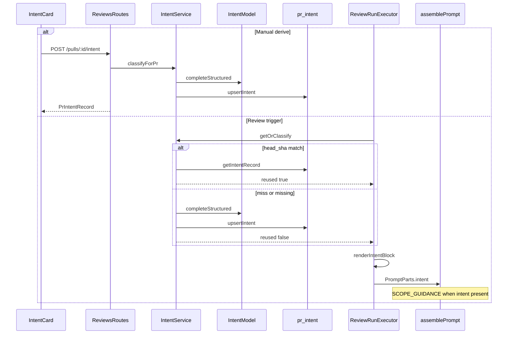

# Intent Layer

Derives a pull request's **intent** (what it claims to do) and **scope**
(in / out of scope) from cheap, non-diff inputs, persists one record per PR,
shows it on the PR Overview tab before review results, and injects it into the
reviewer prompt so out-of-scope noise is de-prioritised without suppressing a
genuine `CRITICAL`.

This document describes what shipped. Prompt-assembly detail for reviewer agents
lives in [`docs/agent-prompts/README.md`](../agent-prompts/README.md). Design
decisions are recorded in ADRs
[0001](../adr/0001-intent-service-in-reviews-module.md),
[0002](../adr/0002-model-owned-scope-filtering.md), and
[0003](../adr/0003-specs-read-reuse-for-intent.md). HTTP/contract lookup:
[`docs/reference/intent-api.md`](../reference/intent-api.md).

## What it does

1. **Classify** — a separate flash-class OpenRouter call (`review_intent`
   feature model, default `openrouter` / `deepseek/deepseek-v4-flash`) produces
   `intent`, `in_scope[]`, `out_of_scope[]`, `confidence`, `risk_areas[]`
   (at most 5 short bullets, e.g. "New dependency: ioredis"), and
   `missing_context[]`.
2. **Persist** — one `pr_intent` row per PR (`pr_id` PK), including
   `head_sha`, server-computed `sources[]`, `risk_areas`, provider/model, and
   `classified_at`.
3. **Show** — `IntentCard` on the PR Overview tab (empty → derive; classified;
   stale when `record.head_sha !== pr.head_sha`; error), alongside a
   `PrBriefBanner` and a `BlastRadiusCard` — see [UI surface](#ui-surface).
4. **Scope the review** — server renders a plain-text block (now including a
   "Risk areas:" section when present) into `PromptParts.intent`;
   `assemblePrompt` adds `## Derived intent & scope` and system-side
   `SCOPE_GUIDANCE` only when that block is present.

`risk_areas` is a real, persisted field of `Intent` (short classifier-authored
bullets) — **not** the same thing as the separate, still-unbuilt `Risks`
contract (`Risk` objects with `severity`/`file_refs`) in `brief.ts`. Blast
Radius compute and its API remain unbuilt: the Overview tab now has a
`BlastRadiusCard` panel, but it always renders an honest "unavailable" empty
state (no `GET /blast-radius` route, no `BlastRadius` data anywhere) — see
[UI surface](#ui-surface) for what that panel actually does today.

## When classification runs

| Trigger | Behaviour |
|---|---|
| Review run (`ReviewRunExecutor.executeRuns`) | After `loadDiff`, before the per-agent loop: reuse persisted intent when `head_sha` matches; otherwise classify. Failure → log and continue with no intent (never fails the review). |
| `POST /pulls/:id/intent` | Always force re-classify (manual derive / re-derive). Rate-limited like `POST /pulls/:id/review` (10/min). |
| `GET /pulls/:id/intent` | Returns persisted `PrIntentRecord` or `null` (HTTP 200 — "not classified yet" is a normal empty state). |
| Head SHA change | **No** automatic re-run. The card shows stale + re-derive. |

`getOrClassify` returns `{ record, reused }`. `reused: true` means no files were
opened and no LLM call ran this invocation — callers must not populate
`RunTrace.specs_read` from a cache hit (see [ADR 0003](../adr/0003-specs-read-reuse-for-intent.md)).

## Runtime flow

## Classifier inputs (no hunk bodies)

Built only from strings assembled in `IntentService.classify` /
`intent-inputs.ts`. The narrowed `IntentDiffSummary` type has no `raw` field and
no hunk body text — "never feed diff bodies to the classifier" is a
signature-level guarantee.

| Source | Behaviour on failure |
|---|---|
| PR title | Always present |
| PR description (≤ 4000 chars) | Empty → source omitted |
| Linked issue (`#N` via GitHub port) | Unresolved source + `missing_context` + confidence cap |
| Local `.md` paths (≤ 3 files × 20k chars, path-traversal guarded) | Unresolved if no clone / missing / escapes clone |
| Changed files + synthesized `@@ … @@` headers (≤ 200 files × 20 hunks) | Fall back to path/±counts only when needed |
| External URLs (Jira/Notion/Linear/foreign GitHub) | **Never fetched** — always `resolved: false` |

`sources[].resolved` is **server-computed**. The classifier's local Zod schema
has no `sources` field; the service merges deterministic provenance after the
call. Confidence is capped at `0.5` when any source is unresolved
(`capConfidence`).

Writes scrub NUL bytes at the repository boundary (`pull.repo.ts`) — cheap
models can emit them and Postgres `text` rejects them.

## Prompt injection into the review

- Server: `renderIntentBlock(intent)` → plain text handed to reviewer-core
  (same already-rendered-string contract as `callers` / `repoMap`).
- User message: `## Derived intent & scope` after `## PR description`, before
  `## Skills / rules`, wrapped in `<untrusted source="intent">`.
- System message: `SCOPE_GUIDANCE` appended after `INJECTION_GUARD` **only**
  when intent is present — no-intent runs stay byte-identical to before this
  feature.
- Scope filtering is **model-owned** soft guidance, not a post-hoc filter on
  findings ([ADR 0002](../adr/0002-model-owned-scope-filtering.md)).
  `groundFindings` remains a citation gate only.

## UI surface

The PR Overview tab (`OverviewTab.tsx`) is a **3-panel layout**, top to
bottom:

1. `PrBriefBanner` (full width) — reuses the existing `VerdictBanner`, fed
   from the PR's latest completed review (most-recently-created `kind:
   'review'` row with a verdict, same semantics as the PR-list score/cost
   fields). No review yet → honest compact empty state, still occupying the
   panel slot.
2. `IntentCard` and `BlastRadiusCard`, side by side as a responsive
   two-column CSS grid (`OverviewTab/styles.ts`'s `intentBlastRow`:
   `repeat(auto-fit, minmax(380px, 1fr))`, so the pair stacks to one column
   under roughly 900px container width — pure CSS, no JS media-query hook).
   `BlastRadiusCard` **always** renders the honest "unavailable" empty
   state — there is no blast-radius compute or `GET /blast-radius` API
   anywhere in the codebase yet; treat this panel as a placeholder slot, not
   a working feature, until that follow-on ships.
3. `Description` (full width), only when the PR has a body — never counted
   as one of the three panels.

Inside the classified state, `IntentCard`'s internal order is (top to
bottom): objective (`record.intent`, primary prose) → two-column **In
Scope | Out of Scope** (`scopeGrid`, same `auto-fit`/`minmax` responsive
pattern, stacks under ~640px) → **Risk Areas** (short bullets with a
keyword-heuristic icon per bullet — `Shield` for auth, `Boxes` for
dependencies, `Zap` for perf/cache, else a neutral warning icon; the whole
subsection is omitted, not shown empty, when `risk_areas` is `[]`) →
confidence + provider/model, as a secondary badge row next to Re-derive in
the `SectionLabel` (not inline in the body) → collapsed `
`
"Sources" toggle (`Fetched` / `Unavailable` labels — deliberately not
"Resolved" / "Unresolved", so an unresolved source doesn't read as "no
problem") → Missing Context, truncated to the first item at ~160 chars plus
a "+N more" line, so a long model-authored list can't outrank the
objective/scope/risk hierarchy above it.

- Mount: `client/.../pulls/[number]/_components/OverviewTab/OverviewTab.tsx`
  composes `PrBriefBanner` (nested under `OverviewTab/_components/`, single
  consumer), `IntentCard`, and `BlastRadiusCard` (both top-level siblings
  under `_components/`, reused/reusable outside Overview).
- Hooks: `usePrIntent` / `useClassifyIntent` in `client/src/lib/hooks/reviews.ts`
  (unchanged by this round).
- Copy: `prReview.intent.*` in `client/messages/en/prReview.json` for
  `IntentCard` (including new `riskAreas`, `fetched`, `unavailable` keys);
  `brief.title` / `brief.block.blast` / `brief.unavailable` /
  `brief.unavailableHint` in `client/messages/en/brief.json` for
  `PrBriefBanner` and `BlastRadiusCard` — that pre-existing `brief`
  namespace is now actively used by both, not reserved for an unbuilt PR
  Brief.
- Run trace: `prompt_assembly.intent` slot in `TraceBody`;
  `trace.prompt.intent` in `runs.json` — unchanged as a slot, but its
  rendered text now includes risk areas when the classifier returned any.

## Key source map

| Concern | Location |
|---|---|
| Classify + cache | `server/src/modules/reviews/intent-service.ts` |
| Pure builders / caps / render | `server/src/modules/reviews/intent-inputs.ts` |
| Routes | `server/src/modules/reviews/routes.ts` |
| Review wiring | `server/src/modules/reviews/run-executor.ts` |
| Persistence | `server/src/modules/reviews/repository/pull.repo.ts`, `db/schema/reviews.ts` (`prIntent`) |
| Contracts | `vendor/shared/contracts/brief.ts`, `review-api.ts`, `trace.ts`, `platform.ts` |
| Prompt | `reviewer-core/src/prompt.ts` (`SCOPE_GUIDANCE`, `PromptParts.intent`) |
| Overview layout | `client/.../OverviewTab/OverviewTab.tsx`, `OverviewTab/styles.ts` |
| PR Brief banner | `client/.../OverviewTab/_components/PrBriefBanner/PrBriefBanner.tsx` |
| Intent card | `client/.../IntentCard/IntentCard.tsx`, `IntentCard/helpers.ts` |
| Blast radius placeholder | `client/.../BlastRadiusCard/BlastRadiusCard.tsx` |
