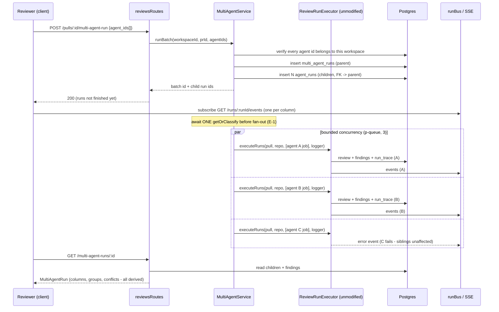

# Multi-Agent Review with live statuses

Let a reviewer pick an explicit **subset** of workspace agents (not just "one"
or "all") and run them concurrently against one PR as a single addressable
batch, grouped under a `multi_agent_runs` parent. The results page reads that
batch two ways — **Columns** (one live-updating card per agent) and **Tabs**
(one tab per agent's own findings) — plus two views **derived** at read time
over the same findings: near-duplicate **finding groups** and a **where agents
disagree** block that treats "did not flag" as a first-class verdict, never an
omission.

Shipped per
[`docs/plans/spec-04-multi-agent-review.md`](../plans/spec-04-multi-agent-review.md)
(source spec:
[`specs/SPEC-04-multi-agent-review.md`](../../specs/SPEC-04-multi-agent-review.md)),
committed at `0a35802`. HTTP/contract lookup:
[`docs/reference/multi-agent-api.md`](../reference/multi-agent-api.md).
Concurrency-without-modifying-`run-executor.ts` decision:
[ADR 0006](../adr/0006-concurrency-without-modifying-run-executor.md).

## What it does

1. **Configure** — `/repos/:repoId/multi-agent` (reachable from the sidebar's
   `Multi-Agent Review` item, or from a new button next to `RunReviewDropdown`
   on the PR detail page — both land on the same screen/state,
   `PrDetailHeader.tsx:44-47`, `vendor/ui/nav.ts:40-46`) lists **every**
   workspace agent as a checkbox card, with no allow-list — a user-created
   agent appears automatically. Each card shows that agent's own historical
   average duration/cost scoped to its **current** model (`GET /agents/stats`,
   `AgentsService.stats`, `agents/service.ts:180-212`), or an explicit "no
   estimate yet" when it has none (`agentEstimateFor`,
   `ConfigureRunView/helpers.ts:54-63`) — never a fabricated number. The
   rolled-up estimate for the whole selection sums cost but takes the
   **maximum** per-agent average duration (`computeSelectionEstimate`,
   `ConfigureRunView/helpers.ts:25-44`), because the agents run in parallel,
   not in sequence.
2. **Run** — `POST /pulls/:id/multi-agent-run` validates every agent id
   against the caller's workspace **before** creating any row (an IDOR
   otherwise), creates one `multi_agent_runs` parent + N `agent_runs`
   children, and returns the batch id + child run ids **immediately**
   (`MultiAgentService.runBatch`, `multi-agent-service.ts:55-116`). The
   client seeds its own read cache from that response so the results page
   never shows a loading flash for data it was just handed
   (`useStartMultiAgentRun`, `hooks/multi-agent.ts:50-59`).
3. **Execute** — in the background, one `intent.getOrClassify` call is
   `await`ed **before** the fan-out starts, so every agent's own execution
   reuses the same persisted intent record instead of racing to classify it
   N times; then each agent runs via its **own** single-element
   `ReviewRunExecutor.executeRuns()` call, queued through a `p-queue` at
   concurrency 3 (`MultiAgentService.executeBatch`,
   `multi-agent-service.ts:129-156`; concurrency constant:
   `MULTI_AGENT_CONCURRENCY`, `constants.ts:20`). `run-executor.ts` itself has
   zero diff from this feature — see the ADR.
4. **Read** — `GET /multi-agent-runs/:id` assembles the `MultiAgentRun`
   response: per-column terminal state (including the persisted `error` text
   for a `failed`/`cancelled` column), wall-clock `total_duration_ms` (first
   child start → last child finish, **not** a sum), `total_cost_usd` (sum of
   known costs) flagged `total_cost_partial` when any child's cost is
   unknown, and the two derived views below (`MultiAgentReadService.getBatch`,
   `multi-agent-read.ts:17-123`). Always addressed by a **specific** batch id
   — never "the latest batch for this PR."
5. **Derive** — `deriveFindingGroups`/`deriveConflicts`
   (`multi-agent-derive.ts`) build one per-location index (which participating
   agent flagged a location, and which stayed silent) and apply two different
   filters over it: groups additionally require the same `category`;
   conflicts are category-agnostic. Neither mutates a `findings` row or
   persists a second copy — both are recomputed on every read.
6. **Act** — Accept/Dismiss reuse the existing per-finding route unchanged.
   `Learn` (`POST /findings/:id/learn`) writes one `memory` row with
   `embedding: null` and calls the embedder **never**. `Turn into eval case`
   (`POST /findings/:id/eval-case`) creates one `eval_cases` row seeded as a
   draft. Both are idempotent at the **database** level, not just
   check-then-insert in the service.

## Where it lives

- Server: `server/src/modules/reviews/multi-agent-service.ts` (orchestration),
  `multi-agent-derive.ts` (pure derivation), `multi-agent-read.ts` (batch
  assembly), `eval-case.ts` (Turn-into-eval-case), `findings.ts` (Learn,
  extending the existing accept/dismiss switch), `repository/knowledge.repo.ts`
  (memory + eval_cases data access), `repository/run.repo.ts` (batch +
  stats queries), `diff-loader.ts` (memoization), `constants.ts` (concurrency +
  batch-size caps), `routes.ts` (route registration).
- Client: `client/src/app/repos/[repoId]/multi-agent/` (configure-run +
  results page and every colocated `_components/`),
  `client/src/lib/hooks/multi-agent.ts` (the four new hooks), one new button
  in `PrDetailHeader.tsx`, one new item in `vendor/ui/nav.ts`.
- Three new review personas — Junior Mentor, Customer-Facing, Architecture —
  seeded in `server/src/db/seed.ts`/`seed-prompts.ts`, prompt bodies mirrored
  into `docs/agent-prompts/{junior-mentor,customer-facing,architecture}.md`.

## Orchestration flow

## Live status — Columns and Tabs

Both view modes read the **same** `MultiAgentRun` — they are two layouts,
not two data sources (`MultiAgentResultsView.tsx:83-105`). `AgentColumnCard`
subscribes to `useRunEvents` for **only its own** `run_id` while
`status === 'running'`, and stops subscribing once it settles
(`AgentColumnCard.tsx:40-41`) — each column's `LiveLogStream` is therefore its
own private stream, never a merged one for the whole batch. This falls out of
`run-executor.ts`'s existing per-invocation `RunLogger` (constructed over
whichever `runId`s are in that call's `jobs` array) combined with the
single-element-`jobs`-array shape described in the ADR — no new plumbing was
needed to keep columns independent.

A failed or cancelled column renders its own persisted `error` inline
(`AgentColumnCard.tsx:59-63`) rather than the existing global SSE error toast
(`hooks/reviews.ts`) firing once per failing agent — with six agents, a toast
storm with no per-agent attribution would be a regression, not a feature.

**One shared trace drawer, not one per column.** The whole results page holds
exactly one `openRunId: string | null` state value; every "View trace"
affordance in either view mode — a Columns card's footer button, a Tabs
header — sets that same state, and one conditionally-rendered
`RunTraceDrawer` mount reads it (`MultiAgentResultsView.tsx:31,50-51,110-119`).
`RunTraceDrawer` and `LiveLogStream` are reused completely unmodified.

## Finding groups vs. "where agents disagree"

Both views are filters over the **same** per-location index that
`multi-agent-derive.ts` builds once per batch read — not two independent
scans of `findings` (`multi-agent-derive.ts:70-234`):

| | Groups (`deriveFindingGroups`) | Conflicts (`deriveConflicts`) |
|---|---|---|
| Match key | normalized file + **same category** + overlapping range | normalized file + exact `start_line` (category-agnostic) |
| Line-range rule | ±3-line expansion, but only for findings spanning ≤20 lines (a wider finding never expands, so it can't swallow unrelated findings) | not applicable — exact line only |
| A silent participant | not part of the grouping key at all | contributes a `verdict: 'ignored'` take, rendered as a first-class "did not flag" cell, never an empty one |
| Who participates | only runs whose `status === 'done'` | only runs whose `status === 'done'` — a `failed`/`cancelled` run is excluded outright, never reported as `'ignored'` |
| Persistence | recomputed on every read; no `findings` row is ever mutated, merged, or deleted | same |

A same-line finding from a security agent and a performance agent, filed
under different categories, is therefore **not** a group (grouping requires
matching category) but **is** a shared location in the disagreement block
(conflicts don't care about category) — a deliberate difference in what
"same" means for the two views, not a bug.

**"Show only conflicts."** The server emits every shared location
unfiltered — a location two or more participating agents both reached, agreed
or not. The client-side toggle (`DisagreementSection/helpers.ts:34-40`)
narrows to AC-30's actual conflict definition when turned on: at least one
participating agent stayed silent, OR two-or-more non-silent takes disagree
on severity. Off (the default) shows every shared location, so the block is
never mysteriously empty on a PR where every agent agreed.

**Groups stay verbatim.** Expanding a group shows every member's own title,
rationale, suggestion, and confidence exactly as that agent produced them
(`FindingGroupsSection.tsx:73-86`) — never a merged or paraphrased summary,
because collapsing distinct LLM opinions into one voice would destroy the
per-agent attribution the whole feature exists to preserve. `FindingCard` is
reused unforked, so Accept/Dismiss/Learn/Turn-into-eval-case act on exactly
one finding id and never ripple to a group's siblings — there is no bulk
"dismiss all in group" action.

## Learn → memory and Turn into eval case

Both actions verify the finding → review → PR → workspace ownership chain
before writing (`findings.ts:26-29`, `eval-case.ts:25-28`) and whitelist every
field they copy — neither spreads a client-supplied object, since each
route's only input is the `:id` path param.

- **Learn** (`findings.ts:70-100`) inserts one `memory` row with
  `kind: 'learning'`, `scope: 'repo'`, content built verbatim from the
  finding's title/rationale/suggestion, and `sources = [{ pr, context }]`
  naming the PR number and `file:line · agent name`. `embedding` is always
  `null`; the embedder is never called, not even conditionally. Idempotency is
  a **database** guarantee: `memory.learned_finding_id` carries a unique index
  (`schema/knowledge.ts`), and `insertMemory` catches a Postgres
  `unique_violation` (`err.code === '23505'`) and re-fetches the row the
  winning concurrent request just committed
  (`repository/knowledge.repo.ts:40-76`), rather than only relying on an
  app-level check-then-insert. Learn is additive — it never sets
  `accepted_at`/`dismissed_at` — so a finding can be learned and still
  accepted or dismissed afterward.
- **Turn into eval case** (`eval-case.ts`) inserts one `eval_cases` row with
  `ownerKind: 'finding'`, the finding's PR diff/files as input, `inputMeta`
  recording the originating agent/run/head SHA, and `expectedOutput` seeded
  from the finding's own severity/category/file/line/suggestion as a draft
  pending human edit. Idempotency is likewise a database guarantee — a unique
  index on `(workspace_id, owner_kind, owner_id)`
  (`eval_cases_ws_owner_uq`, `schema/eval.ts`) — and the insert helper
  re-fetches on a race the same way `insertMemory` does. There is no Eval
  Dashboard or Memory browsing screen; both actions confirm with a lightweight
  notification and navigate nowhere.

## Non-goals (explicitly out of scope)

- No Eval Dashboard page — Turn-into-eval-case only creates the record.
- No Memory browsing/retrieval UI, and no wiring of `memory` into any agent's
  prompt — `memory.embedding` stays `null` and unread; that is a separate,
  not-yet-built feature.
- No cross-agent consensus/arbitration — the product surfaces disagreement,
  it never resolves it, votes on it, or asks a referee agent.
- No change to the grounding gate, prompt assembly, or `findings` schema
  semantics.
- `agent-runner/` as a separate package does not exist in this repo; the
  single-agent execution path is, and remains, `run-executor.ts`.
- Multi-replica correctness is out of scope: `runBus` is in-memory and
  `reapStaleRuns()` assumes a single API process (`server/AGENTS.md`) — a
  batch is bound to one process, same as every other run in this app.

## Key source map

| Concern | Location |
|---|---|
| Orchestration (batch create + fan-out) | `server/src/modules/reviews/multi-agent-service.ts` |
| Pure derivation (groups + conflicts) | `server/src/modules/reviews/multi-agent-derive.ts` |
| Batch read/assembly | `server/src/modules/reviews/multi-agent-read.ts` |
| Learn → memory | `server/src/modules/reviews/findings.ts` |
| Turn into eval case | `server/src/modules/reviews/eval-case.ts` |
| Memory + eval_cases data access | `server/src/modules/reviews/repository/knowledge.repo.ts` |
| Batch + stats data access | `server/src/modules/reviews/repository/run.repo.ts` |
| Diff memoization | `server/src/modules/reviews/diff-loader.ts` |
| Concurrency + batch-size constants | `server/src/modules/reviews/constants.ts` |
| Routes | `server/src/modules/reviews/routes.ts`, `server/src/modules/agents/routes.ts` (`GET /agents/stats`) |
| Contracts | `vendor/shared/contracts/observability.ts`, `vendor/shared/contracts/knowledge.ts` |
| Schema | `server/src/db/schema/runs.ts` (`agentRuns.multiAgentRunId`), `schema/eval.ts` (`ownerKind` + unique index), `schema/knowledge.ts` (`memory.learnedFindingId` + unique index) |
| Client hooks | `client/src/lib/hooks/multi-agent.ts` |
| Configure-run screen | `client/src/app/repos/[repoId]/multi-agent/_components/ConfigureRunView/` |
| Results page + trace-drawer sharing | `client/src/app/repos/[repoId]/multi-agent/_components/MultiAgentResultsView/` |
| Columns view | `.../MultiAgentResultsView/_components/AgentColumnCard/` |
| Tabs view | `.../MultiAgentResultsView/_components/AgentTabsView/` |
| Finding groups | `.../MultiAgentResultsView/_components/FindingGroupsSection/` |
| Disagreement block | `.../MultiAgentResultsView/_components/DisagreementSection/` |
| PR-page entry point | `client/.../pulls/[number]/_components/PrDetailHeader/PrDetailHeader.tsx` |
| Sidebar entry point | `client/src/vendor/ui/nav.ts` |
| New personas | `server/src/db/seed-prompts.ts`, `server/src/db/seed.ts`, `docs/agent-prompts/{junior-mentor,customer-facing,architecture}.md` |
