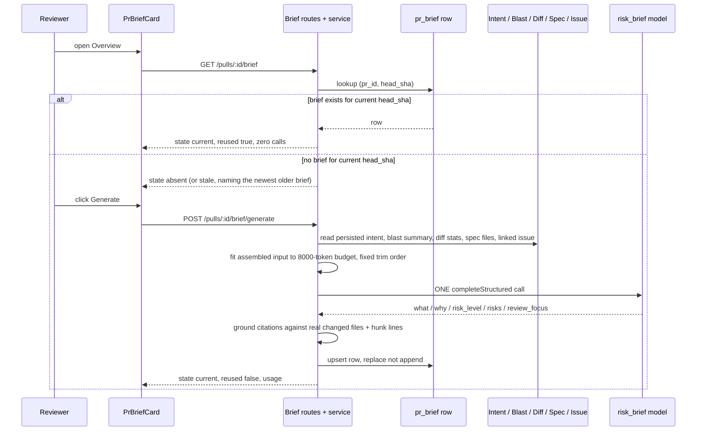

# PR Brief & Why Timeline

A server-composed `Brief { what, why, risk_level, risks[], review_focus[] }`
per (PR, `head_sha`) — one structured LLM call, cached, grounded against the
PR's real changed files and hunk ranges, under a hard 8 000-token input
budget. `PrBriefCard` replaces the old no-op `PrBriefBanner` on the PR
Overview tab, and each `review_focus[]` entry deep-links to `path:line` in
the Files-changed tab. The Why Timeline is a collapsed disclosure inside the
same card listing the briefs a PR has accumulated across head SHAs.

Shipped per
[`docs/plans/spec-03-pr-brief-and-why-timeline.md`](../plans/spec-03-pr-brief-and-why-timeline.md)
(source spec:
[`specs/SPEC-03-pr-brief-and-why-timeline.md`](../../specs/SPEC-03-pr-brief-and-why-timeline.md)).
HTTP/contract lookup: [`docs/reference/brief-api.md`](../reference/brief-api.md).
Persistence-model decision:
[ADR 0005](../adr/0005-composite-key-brief-persistence.md).

## What it does

1. **Compose** — one `risk_brief`-feature-model structured call
   (`resolveFeatureModel(container, workspaceId, 'risk_brief')`, default
   `openai`/`gpt-4.1` — a premium model, unlike Intent's flash default) reads,
   never recomputes: the persisted `pr_intent` record, `BlastService`'s
   already-composed output, per-file diff **stats and hunk headers only**
   (never hunk bodies), the PR's linked issue (resolved through the same
   reference-extraction path the intent classifier uses), and the `.md` files
   the PR description itself references (via the intent record's resolved
   `sources[]`, re-read fresh from the clone at generation time — no new
   document-attachment mechanism, no Project Context involvement).
2. **Cache by (`pr_id`, `head_sha`)** — re-opening a PR state costs zero model
   calls; only an explicit Generate/Regenerate spends one. A brief for a
   non-current SHA can never be requested (`server/src/modules/brief/service.ts:87-91`).
3. **Ground** — every `risks[].file_refs` path and every
   `review_focus[].path`/`.line` is re-verified against the PR's real
   changed-file set and real hunk ranges *after* the call, in code, and
   dropped (never repaired) if it doesn't check out
   (`server/src/modules/brief/grounding.ts`).
4. **Budget** — the fully assembled system+user input is measured with the
   DI tokenizer before the call; if it exceeds 8 000 tokens, whole inputs are
   dropped in a fixed order, never truncated mid-item
   (`server/src/modules/brief/budget.ts`).
5. **Why Timeline** — every persisted brief for the PR, newest first, read
   with zero model calls; activating an older entry renders that entry's
   already-fetched `BriefRecord` with no new request.
6. **Deep-link** — clicking a `review_focus[]` entry navigates to the
   Files-changed tab, expands the right file, and scrolls to the right line,
   in both the "smart" and "original" diff order modes.

## Where it lives — Overview panel placement

`PrBriefCard` occupies the same full-width slot `PrBriefBanner` used to,
above `IntentCard | BlastRadiusCard`
(`client/.../OverviewTab/OverviewTab.tsx:46-61`). Net panel count stays 3 —
the Why Timeline is not a fourth panel, it is a collapsed `
` inside
the card, the same disclosure pattern `IntentCard` already uses for its
Sources toggle. The score gauge keeps its existing deterministic source:
`VerdictBanner`, rendered only when a completed review exists
(`PrBriefCard.tsx:230-242`) — the model's `risk_level` is a distinct,
visually separate judgement, never merged into that number.

## Request / generate / cache flow

## The `BriefState` split — persisted read states vs transient generate outcomes

`BriefState` is `'current' | 'stale' | 'absent' | 'corrupt' | 'budget_exceeded' | 'failed'`
(`server/src/vendor/shared/contracts/review-api.ts:166-178`). The first four
are **read states**, derivable from storage and returned by
`GET /pulls/:id/brief`. The last two are **transient, generate-only
outcomes** returned by `POST …/generate` with `record: null` and are *never
persisted* — by construction there is no row to read them back from later
(a budget-exceeded attempt makes zero calls; a failed attempt persists
nothing and leaves any prior row for that SHA untouched). `PrBriefCard`
gives every one of the six a distinguishable render path
(`PrBriefCard.tsx:244-340`).

A real bug shaped this split's client-side enforcement: `useGeneratePrBrief`'s
`onSuccess` originally wrote every mutation result — including
`budget_exceeded`/`failed`, whose `record` is always `null` — into the exact
cache key `usePrBrief()` reads, which could silently erase an already-good
persisted brief the moment a regenerate attempt failed. Fixed by guarding the
cache write with the same state check already applied to the timeline
invalidation (`client/src/lib/hooks/brief.ts:40-51`); `PrBriefCard` reads the
two transient states from the mutation's own `generate.data` instead, so a
bad regenerate attempt renders a banner *in place* over whatever good
`record` the read-cache still holds, rather than replacing it.

## Grounding

`groundBrief` (`server/src/modules/brief/grounding.ts`) mirrors
`reviewer-core/src/grounding.ts`'s `buildLineIndex` rule by hand — it can't
be imported, because `platform/grounding.ts` re-exports only
`groundFindings`/`groundingSummary`/`GroundingResult`, and Brief's items
aren't `Finding`s. The discard contract is the same one `groundFindings` and
`ConventionsService.groundCandidates` already use: drop the offending
citation, never repair it. A `risks[]` entry survives with an emptied
`file_refs` list rather than being dropped itself; a `review_focus[]` entry
is dropped outright if its path is unknown *or* its line falls outside every
changed hunk range for that file. Survivors are capped at `MAX_RISKS = 6` /
`MAX_FOCUS_ITEMS = 5` regardless of what the model returned. An
all-ungrounded response still persists — with the relevant list empty — never
a fabricated entry and never a failed generation.

## Budget and the fixed trim order

`fitBriefToBudget` (`server/src/modules/brief/budget.ts`) never drops the
floor — PR title, persisted intent block, blast summary line — to make room;
if the floor alone exceeds 8 000 tokens, the caller makes zero calls and
returns `budget_exceeded`. Above the floor, spec-file text has its own
sub-cap (`SPEC_INPUT_TOKEN_SUBCAP = 2 500`, whole-document admission only —
a document that would push the running spec total over the sub-cap
contributes *nothing*, never an excerpt). If still over budget, whole inputs
are dropped in this fixed order, never truncated mid-item:

1. Spec excerpts, whole-document, from the lowest-priority (last-referenced)
   end.
2. The linked-issue block.
3. Hunk headers, collapsed to `path (+a/-d)` lines.
4. The changed-file list, reduced to the largest-by-size N files via a binary
   search on N, always with a `+N more files not shown` marker.

Every stage that drops something appends a human-readable string to
`dropped_inputs[]`, which the card's collapsed **Inputs** disclosure
surfaces when non-empty (`PrBriefCard.tsx:96-125`) — a reviewer can see that
a brief lost a citation or an input, not just read a quieter card.

## Why Timeline

`GET /pulls/:id/brief/timeline` is a deliberate "two endpoints, not three"
design: each `BriefTimelineEntry` carries the **full** `BriefRecord` inline,
so activating an older entry in the UI (`BriefTimeline.tsx`) swaps
`PrBriefCard`'s displayed content to that entry's already-fetched record —
zero additional requests, zero model calls — rather than triggering a second
fetch. Entries are newest-first; one whose `risk_level` differs from the
entry before it (the next-older one) is visually marked. The disclosure line
states the gap honestly using `brief_count`/`commit_count` (e.g. "3 briefs
generated across 12 commits") — there is no backfill and no
auto-generation, so a typical PR's timeline starts as a single row and only
grows when a reviewer notices staleness and chooses to spend a call.

## Deep-link into Files-changed

`review_focus[]` entries render as `path:line — reason`
(`PrBriefCard.tsx:36-70`); activating one sets `?file=&line=` on the PR-page
URL (`page.tsx:81-108`) alongside the pre-existing `tab`/`trace`/`run`/
`severity`/`finding` params, so the link is shareable and survives reload.
Both diff viewers implement the resulting jump independently:
`SmartDiffViewer` reuses its own `onJumpToLine`; the plain `DiffViewer`
(used in "original" order mode) gained the capability from scratch as an
**optional focus overlay** — only the focused file is forced open via
`FileCard`'s controlled `open`/`onOpenChange` props, so every other file
keeps its normal uncontrolled `AUTO_EXPAND_MAX_LINES` auto-expand behaviour
unchanged (`DiffViewer.tsx:28-54`). A focus entry whose file isn't in the
currently loaded diff — because the PR advanced past the brief's `head_sha`,
or because a historical brief is being viewed — degrades to a disabled,
explanatory state and navigates nowhere (`OverviewTab.tsx:21-25`,
`PrBriefCard.tsx:50-58`).

A real bug shaped part of this mechanism: the deep-link originally failed
**silently** for a file inside an initially-collapsed `SmartDiffViewer` role
group (e.g. `boilerplate`) — `onJumpToLine` opened the target file's own
state but never the separate group-collapse state `RoleGroup` owned
privately, so the `scrollIntoView` query found nothing to scroll to. Fixed
by lifting group-open state (`groupOpenMap`) out of `RoleGroup` and into
`SmartDiffViewer`, so `onJumpToLine` opens both the group and the file before
scrolling (`SmartDiffViewer.tsx:52-141`, `RoleGroup.tsx:29-45`). Anyone
extending either component should know the collapse state is split this way
*because* of that bug, not because it's the obviously natural ownership
split.

## Known, accepted tradeoffs (non-blocking)

- **Duplicate spend under true concurrency.** The composite `(pr_id,
  head_sha)` primary key makes the persisted **row** idempotent — a second
  write replaces rather than appends. It does not prevent duplicate
  **spend**: the in-process `inFlight` map (`service.ts:46-52`) is the actual
  guard against two simultaneous requests paying for two calls, and it only
  protects one API process. Two truly concurrent processes still both pay;
  the later write simply overwrites. See
  [ADR 0005](../adr/0005-composite-key-brief-persistence.md) for the full
  rationale and alternatives considered.
- **`helpers.ts` hand-mirrors a Drizzle row type.** `helpers.ts:16-30`'s
  `BriefRow` interface is a structural duplicate of `repository.ts`'s
  `PrBriefRow`, not an import of it — `arch:check`'s `no-helpers-to-io` rule
  forbids `helpers.ts` importing anything under `src/db/`. Accepted as a
  documented tradeoff; a future column addition to one must be mirrored by
  hand in the other.
- **One extra DB read per generation.** `sources.node.ts:27-33` re-queries
  the pull/repo rows `service.ts` already holds, because the brief module's
  own narrowed `BriefPull`/`BriefRepoRow` types don't satisfy
  `reviews/diff-loader.ts`'s `PullRow` expectations. Cheap relative to the
  LLM call the generation is about to make; documented in-file rather than
  worked around.
- **The transient-outcome banner sits directly above the last-known-good
  cost line.** When a regenerate attempt fails or exceeds budget, the card
  shows "nothing was charged" immediately above `generate.lastCost`, which
  reports the *previous* successful generation's cost — read carefully,
  the two lines can momentarily seem to contradict each other. Cosmetic
  only; no functional impact.

## Key source map

| Concern | Location |
|---|---|
| Routes | `server/src/modules/brief/routes.ts` |
| Service (composition, cache, concurrency) | `server/src/modules/brief/service.ts` |
| Pure read-state / row-mapping helpers | `server/src/modules/brief/helpers.ts` |
| Prompt assembly | `server/src/modules/brief/prompt.ts` |
| Token budget + trim order | `server/src/modules/brief/budget.ts` |
| Grounding | `server/src/modules/brief/grounding.ts` |
| DB port (no Drizzle import) | `server/src/modules/brief/repository.ts` |
| DB adapter (Drizzle, NUL-scrub) | `server/src/modules/brief/repository.drizzle.ts` |
| Non-DB input port | `server/src/modules/brief/sources.ts` |
| Non-DB input adapter (fs/git/blast/GitHub) | `server/src/modules/brief/sources.node.ts` |
| Engineering caps | `server/src/modules/brief/constants.ts` |
| Persistence | `server/src/db/schema/reviews.ts` (`prBrief`) |
| Contracts | `vendor/shared/contracts/brief.ts`, `review-api.ts` |
| Client hooks | `client/src/lib/hooks/brief.ts` |
| Brief card | `client/.../OverviewTab/_components/PrBriefCard/PrBriefCard.tsx` |
| Why Timeline panel | `client/.../PrBriefCard/_components/BriefTimeline/BriefTimeline.tsx` |
| Deep-link URL params + helper | `client/.../pulls/[number]/page.tsx` |
| Deep-link in smart-order viewer | `client/.../SmartDiffViewer/SmartDiffViewer.tsx`, `_components/RoleGroup/RoleGroup.tsx` |
| Deep-link in original-order viewer | `client/src/components/diff-viewer/DiffViewer/DiffViewer.tsx` |
| i18n | `client/messages/en/brief.json` (`card.*`, `focus.*`, `timeline.*`, `generate.*`, `inputs.*`) |
