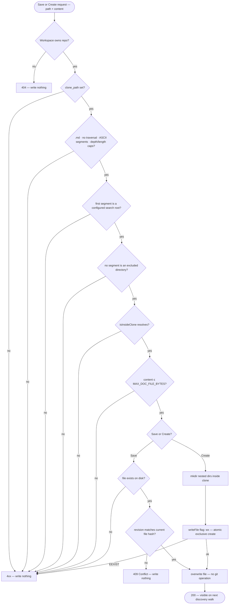

# Project Context

A per-repo page that discovers a repo's `.md` documents (specs, docs,
insights), lets a Skill or an Agent attach a subset of them, and injects the
attached set into the reviewer prompt's existing `## Project context` block
at run time — so a review can be checked against the project's own written
requirements. This document describes what shipped, across two sessions
committed together at `32c6721`: the discovery/attach/injection baseline
(AC-1–AC-28) and the same day's amendment delta (AC-29–AC-53) — a coverage
indicator, in-app document editing and creation, and a dirty-clone guard on
resync. Design decisions are recorded in
[ADR 0004](../adr/0004-write-back-to-working-copy.md). Spec:
[`specs/SPEC-01-project-context.md`](../../specs/SPEC-01-project-context.md).
Development plan for the delta:
[`docs/plans/spec-01-project-context-authoring.md`](../plans/spec-01-project-context-authoring.md).

## What it does

1. **Discover.** `discoverDocuments` (`server/src/modules/project-context/discover.ts`)
   recursively walks a repo's local clone under a server-configured set of
   search roots — `specs`, `docs`, `insights` by default
   (`AppConfig.projectContextRoots`, env `PROJECT_CONTEXT_ROOTS`,
   `server/src/platform/config.ts:80,100`) — collecting every `.md` file's
   repo-relative path, source folder and byte size. Symlinks are never
   followed, excluded directories (`EXCLUDED_DIRS`,
   `server/src/modules/repo-intel/constants.ts:17-26`) are skipped, and every
   resolved path is checked with `isInsideClone`
   (`server/src/modules/reviews/intent-inputs.ts:138`) before any `stat`/read.
   The walk is bounded (`MAX_DISCOVERED_DOCS`) and content is read on demand,
   never cached — `ProjectContextService.listDocuments`
   (`server/src/modules/project-context/service.ts:61-127`) reads each file
   fresh on every page load and estimates its token count via the DI
   `Tokenizer` port.
2. **Attach.** Two independent surfaces persist attachment **paths only**
   (never a text copy): a Skill's Context tab and an Agent's Context tab
   (`GET`/`POST /skills/:id/context`, `/agents/:id/context`,
   `server/src/modules/project-context/routes.ts`). An agent's *effective*
   set at run time is the union of its direct attachments and the
   attachments of its **enabled** linked skills, deduped by path
   (`ProjectContextService.resolveEffectiveSet`, `service.ts:334-404`).
3. **Inject.** `ReviewRunExecutor` resolves that effective set and passes it
   as `PromptParts.specs` (`server/src/modules/reviews/run-executor.ts:274,513-532`)
   — the exact prompt slot `reviewer-core/src/prompt.ts:68,142-145,165` already
   rendered as `## Project context`, `wrapUntrusted`-delimited per entry. No
   new prompt section, no reviewer-core change, and — because attachment is
   manual-only (no scoring, no embeddings) — **no extra LLM call**. A
   document unreadable at run time is skipped and logged, never fails the
   run; the whole set is cut to a token budget in persisted order when it
   would otherwise exceed it.
4. **Cost visibility.** The page shows "N files indexed · ≈X tokens" over
   whatever subset is currently filtered, and a **coverage indicator** — the
   percentage of listed documents with `used_by_agents > 0` — computed
   client-side from data the listing response already carries
   (`ProjectContextView/helpers.ts:computeCoverage`); no new endpoint.
5. **Author in place** *(the amendment delta)*. A document open in the
   Preview panel can be switched to Edit and saved back to the same file the
   discovery walk reads (`PUT /repos/:id/context/document`), and a new `.md`
   file can be created under a configured root
   (`POST /repos/:id/context/document`). Both writes go through a shared
   guard chain and perform **no git operation** — see
   [Write paths](#write-paths-editing-and-creation) and
   [ADR 0004](../adr/0004-write-back-to-working-copy.md) for why.

## Discovery, attachment and injection (baseline)

The reader side needs no diagram beyond this summary: discovery returns
metadata only; attachment persists paths, never text; injection re-reads
each attached path fresh at run time, dedupes agent-direct and enabled-skill
attachments by path (keeping the earliest persisted order), truncates each
document's text to `MAX_DOC_CHARS`, and walks the ordered candidate list
accumulating tokens until `PROJECT_CONTEXT_TOKEN_BUDGET` (8000) would be
exceeded — the remainder is skipped and logged, not silently dropped.

A document attached both directly to an agent and via one of that agent's
enabled skills is injected exactly once (dedup keeps the lower persisted
order). A skill that is linked but **disabled** contributes nothing —
neither to injection nor to `used_by_agents`, and therefore not to
coverage either (the same enabled-only rule applies in all three places,
grounded in `service.ts:349` and `service.ts:87`).

The run trace's Prompt assembly panel shows the exact injected text plus a
per-document path and size row, in a row distinct from the unrelated
"Specs read" row that intent classification populates
(`docs/adr/0003-specs-read-reuse-for-intent.md`) — this part of the baseline
predates the amendment and is unchanged by it.

## Coverage indicator

`computeCoverage` (`client/src/app/repos/[repoId]/context/_components/ProjectContextView/helpers.ts:34-41`)
is a pure client-side reduction over the array the page already holds — no
new endpoint, no new query:

- Numerator: listed, non-`missing` documents with `used_by_agents > 0`.
- Denominator: all listed, non-`missing` documents.
- Documents flagged `missing: true` (an attachment whose file no longer
  exists on disk) are excluded from **both** — counting them would inflate
  coverage with files that don't exist.
- Returns `null` when there are zero eligible documents, so the page renders
  no percentage rather than `0` or `NaN`; a repo with documents but no
  attachments at all correctly shows `0%`, which is distinguishable from
  the null case in the UI (`ProjectContextView.tsx:73-88`).
- Recomputed over the **same filtered array** the "N files indexed · ≈X
  tokens" summary already uses (`ProjectContextView.tsx:53-55`), so search
  narrows both consistently — one filter path feeds both numbers, never two
  independently-scoped reads.

## Document editing

Selecting a document's Preview/Edit toggle
(`DocumentPanel.tsx`) re-fetches the document before populating the editor —
never from the already-rendered body — so Edit always starts from the
current on-disk content. Saving:

- Overwrites the file at its resolved path inside `repos.clone_path`, the
  same file the discovery walk reads. No copy of the text is ever persisted
  to the database (`ProjectContextService.saveDocument`, `service.ts:157-207`).
- Requires the caller's `revision` — a sha256 hex of the file's bytes,
  returned by the read endpoint — to still match the file's current hash.
  A mismatch (the file moved since the editor loaded it) is rejected with
  `ConflictError` (HTTP 409), distinct from a generic write failure, so the
  client can render "changed on disk, reload" instead of a plain error
  (`DocumentPanel.tsx:88-95`). A content hash was chosen over an mtime
  specifically because the dev environment is win32, where a same-tick
  out-of-band write can share an mtime with the read that preceded it
  (`helpers.ts:42-51`).
- Requires the target to already exist as a file — a save never creates; a
  missing target is rejected and the user is pointed at the create action
  instead.
- Performs **no git operation** — no staging, no commit, no push, no branch
  change.
- On failure (permissions, read-only mount, disk error) returns an error and
  reports no success — unlike the run-time read path, which is best-effort
  and never fails a run, a user-initiated write is fail-closed.

## Document creation

The "+" action on the page opens a dialog (`NewDocumentDialog.tsx`) with a
root picker over the server-reported `roots` (the same configured list
discovery uses), a relative-path field, and a content textarea; the UI
appends `.md` so most rejections are unreachable from the dialog, while the
server still validates independently. `ProjectContextService.createDocument`
(`service.ts:217-260`):

- Clears the same guard chain as save (below).
- Creates missing nested directories inside the clone (`mkdir(..., {
  recursive: true })`), each already-validated segment excluded-directory-
  checked.
- Writes with `writeFile(abs, content, { flag: 'wx' })` — an exclusive
  create, so the must-not-exist check is atomic with the write itself
  rather than a separate `stat` that would race on a case-insensitive
  filesystem (win32, where `docs/A.md` and `docs/a.md` collide). An
  `EEXIST` becomes a 4xx; the file that already existed is left untouched.
- Keeps no "manually added" record of any kind — the created file enters
  the product on the **next** discovery walk, exactly like any other file
  on disk.

## Write paths (editing and creation)

Both writes clear the same ordered guard chain
(`server/src/modules/project-context/write-guards.ts`) before any
filesystem call — deliberately more than `isInsideClone` alone, because
containment permits `.git/hooks/pre-commit` and the server runs git against
this very clone, so a written hook could execute under the API process.

Path-shape rejection is a distinct, unit-testable reason per clause
(`WriteGuardRejection` in `write-guards.ts:34-44`) — non-`.md` extension, a
`.`/`..` segment, a non-`/` separator, an absolute/drive-letter (`C:/`)/UNC
(`\\?\`) form, a non-ASCII-allowlist segment, and depth/length caps
(`MAX_DOC_PATH_DEPTH = 8`, `MAX_DOC_PATH_LENGTH = 200` — the latter kept
safely under win32's 260-character `MAX_PATH` once the clone-dir prefix is
added). The per-document content cap is `MAX_DOC_FILE_BYTES` (256 KB).
Every route resolves `getContext(...)` first, so a repo belonging to a
different workspace 404s before any filesystem touch
(`project-context/routes.ts:38-72`).

## Clone integrity: the dirty-clone resync guard

In-app writes land in a clone that `GitClient.sync()` otherwise treats as a
disposable, resettable mirror
(`server/src/adapters/git/simple-git.ts:78-101`). Before this delta, a
resync ran `git fetch` then unconditionally `reset --hard origin/<branch>`,
which would silently discard an unsaved in-app edit (a tracked file's
edit is lost outright; a newly created file is untracked and normally
survives, unless upstream introduces a file at the same path).

`sync()` now runs `git status --porcelain --untracked-files=all` **before**
any fetch or reset and throws `DirtyCloneError` (carrying the dirty paths,
`server/src/adapters/git/errors.ts`) when the output is non-empty —
untracked files are included in the check specifically because a created
document is untracked, not modified. A clean clone is unaffected: same
fetch, same reset, same returned head, no extra network call.

`RepoIntelService.resyncRepo` catches `DirtyCloneError` before its generic
catch (`server/src/modules/repo-intel/service.ts:150-166`) and returns the
existing degraded envelope with a distinct `dirty_clone:<paths>` reason —
never folded into the generic `sync_failed:` string a network problem would
produce — and persists that reason via `touchIndexState` so it's observable
at `GET /repos/:id/index-state` even though the job handler that normally
calls `resyncRepo` swallows its return value. On the client,
`ResyncBlockedNotice` (`ProjectContextView/_components/ResyncBlockedNotice/ResyncBlockedNotice.tsx`)
renders that reason as an instruction, not a failure: it names the affected
paths (as display text only — never fed to another filesystem/shell call)
and tells the user to commit or discard using their own git tooling, with a
"Check again" button that only re-attempts the resync. This feature adds no
commit or discard action itself. The notice lives only on the Project
Context page, not on either Skill/Agent Context tab, because editing and
creation are the only in-app operations that can make a clone dirty.

## Where authoring does and doesn't live

Editing and creation live **only** on the Project Context page. The Skill
and Agent Context tabs stay attach-only, with the same read-only preview
they already had — a document can't be mutated from inside a per-agent or
per-skill configuration screen. See
[ADR 0004](../adr/0004-write-back-to-working-copy.md) for the write-target
decision this surface restriction depends on.

## Non-goals carried into the shipped code

- No in-app delete or rename — only create and edit.
- No commit/discard action for a dirty clone — resolving it stays a git
  operation in the user's own tooling.
- No automatic, PR-content-based document selection — attachment is
  manual-only, which is also why this feature costs zero extra LLM calls.
- `.gitignore` is not honored by the discovery walk or the write guards — a
  gitignored `.md` can be listed, attached, and edited; such an edit
  neither blocks a resync nor is destroyed by one, since `git status
  --porcelain` omits ignored files. Recorded as a known, accepted gap
  (Q8 in the spec), not fixed by this delta.

## Grounded in

- `server/src/modules/project-context/discover.ts` — recursive walk
- `server/src/modules/project-context/service.ts` — listing, run-time
  resolution, save, create
- `server/src/modules/project-context/write-guards.ts` — path-shape /
  root / excluded-dir / clone-containment / size guard chain
- `server/src/modules/project-context/helpers.ts` — revision hashing,
  UTF-8-safe read, entry-text building
- `server/src/modules/project-context/constants.ts` — every numeric cap
- `server/src/modules/project-context/routes.ts` — the four HTTP surfaces
- `server/src/adapters/git/simple-git.ts:78-101`,
  `server/src/adapters/git/errors.ts` — the dirty-clone precondition
- `server/src/modules/repo-intel/service.ts:150-166` — degraded-envelope
  wiring for the refusal
- `server/src/modules/reviews/run-executor.ts:274,513-532` — injection into
  `PromptParts.specs`
- `client/src/app/repos/[repoId]/context/_components/ProjectContextView/`
  — page, coverage helper, DocumentPanel, NewDocumentDialog,
  ResyncBlockedNotice
- `client/src/lib/hooks/context.ts` — data layer
- `specs/SPEC-01-project-context.md` AC-1–AC-53, D-1–D-12, E-1–E-26
