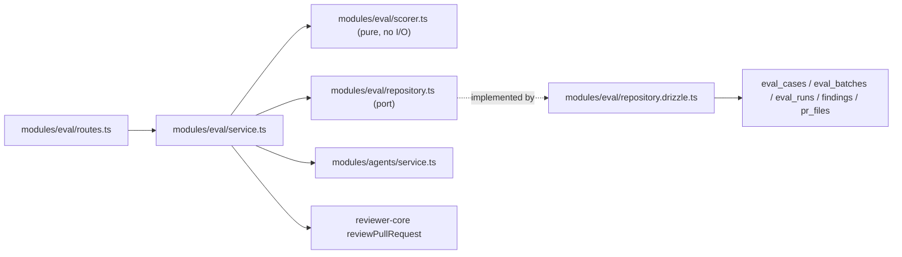

# Development Plan: Eval Pipeline

Source spec: [`specs/eval-pipeline.md`](../../specs/eval-pipeline.md)
(committed on `L06-Evals-homework`, `7c0822b` — 53 EARS ACs, 17 edge cases,
D-1…D-9, Q-1…Q-6). Every fact the spec established with a `file:line` citation
is taken as given here and not re-derived; this plan only adds the decisions the
spec deliberately left open (Q-1…Q-6), the sequencing, and the per-item skill
assignment.

## Objective

Turn reviewers' existing accept/dismiss decisions into a code-scored regression
suite for DevDigest's own review agents: one click makes an eval case from a
decided finding, one click runs an agent's whole set as one version-pinned
batch, and the resulting recall / precision / citation numbers are comparable
across agent versions — with zero LLM calls anywhere in scoring, aggregation or
comparison.

## Scope

- **Packages/modules touched:** `server/` (new `src/modules/eval/`,
  `src/db/schema/eval.ts` + generated migration, `src/db/schema.ts`,
  `src/platform/container.ts`, `src/modules/index.ts`, one additive read method
  on `src/modules/agents/service.ts`, both vendored contract copies) ·
  `client/` (new `/evals` App Router page + `_components/`, new `EvalsTab` in
  `AgentEditor`, one new action on `FindingCard`, `src/lib/hooks/eval.ts`,
  `src/lib/types.ts`, `src/vendor/ui/nav.ts`, `messages/en/{eval,prReview}.json`)
  · `scripts/verify-l06.sh`.
- **Execution mode:** **multi-agent** — the full handoff chain from
  [`agents/README.md`](../../agents/README.md)#handoff-chain
  (`implementer` → `test-writer` → `plan-verifier` → `doc-writer`), driven by
  the `run-plan` skill. Test authorship and documentation are therefore **not**
  work items here; each work item's Definition of done names the behaviour
  `test-writer` must cover, and the `docs/adr/0006-*` ADR that D-3 asks for is
  `doc-writer`'s, not `implementer`'s.
  **Number of implementer passes:** the 14 work items are grouped into
  **five phases (A–E)**, each a coherent, independently-verifiable increment
  that ends in its own commit. Recommended: run `run-plan` **once per phase**
  (five implementer invocations) rather than one pass over all 14 items —
  Phase A is a schema/contract change that must be typechecked and migrated
  before anything can compile against it, and Phases C/D are the only ones that
  can spend money. A single pass over the whole plan also works without editing
  this file; only the number of `run-plan` invocations changes.
  *(Pending the user's confirmation — see the Blocking question in the report
  accompanying this plan. Nothing in the plan body changes either way.)*
- **Explicitly out of scope (feature-specific):** `reviewer-core/**` (consumed
  exactly as-is — AC-17, AC-27; a second grounding implementation is forbidden);
  `mcp/`, `e2e/`; `conformance_checks` / `composed_reviews`; the Stats and CI
  editor tabs; `owner_kind: 'skill'` (D-9 — the enum keeps both values, only
  `'agent'` is implemented); auto-creation of cases on accept/dismiss (D-6); a
  "promote"/"revert" action on the compare view (D-8, and see Q-2 below);
  changing `isConfigChange` or `POST /agents/:id/skills` so skill edits bump
  `agents.version` (D-4, and see Q-3 below); a harness-side `evals/` skill eval
  for `pr-description`.

## Constraints

**Architectural / repo rules**

- New module lives at `server/src/modules/eval/`, following routes → service →
  port ← adapter. It is **not** in `PRE_EXISTING_MODULES`
  (`server/.dependency-cruiser.cjs:10-11`), so all four boundary rules apply to
  it in full: `service.ts` must not import `src/db/(schema|client)` or
  `src/adapters/**`; `routes.ts` must not import either; `helpers.ts` must stay
  I/O-free. `pnpm arch:check` (= `depcruise --config .dependency-cruiser.cjs
  src`) is the gate — WI3 and WI15 run it. — skill: `onion-architecture`.
- **Cross-module reads.** `.claude/skills/onion-architecture/rules/dependency-rule.md`
  ("Cross-module access") forbids a module importing another module's
  `repository.ts` — and explicitly names `conventions/service.ts` →
  `repos/repository.ts` and `brief/repository.drizzle.ts` →
  `reviews/repository.ts` as pre-existing violations *not* to copy. So:
  - agent config, version snapshots and linked skills come from
    **`AgentsService`** (constructed with the `Container`, exactly as
    `brief/sources.node.ts:45` constructs `BlastService`) — service → service.
    One additive read method on `AgentsService` is needed (WI7); no behaviour
    change to the agents module.
  - finding / review / pull / `pr_files` reads for case creation go through
    the eval module's **own** port + Drizzle adapter (`modules/blast/` and
    `modules/smart-diff/` precedent: a small consumer module whose repository
    reads tables another module's domain owns, without importing that module's
    repository file).
- Contracts change in `server/src/vendor/shared/contracts/eval-ci.ts` and are
  **hand-mirrored byte-identically** into
  `client/src/vendor/shared/contracts/eval-ci.ts` (root `AGENTS.md` — no sync
  script). Both barrels already re-export `./contracts/eval-ci.js`, so no
  barrel edit is needed. `contracts/knowledge.ts` is **not** edited — that
  file's header states eval-ci extends the barrel rather than modifying
  existing contract files; the read-side case shape is a new
  `EvalCaseRecord` in `eval-ci.ts`, not a change to `knowledge.ts`'s `EvalCase`.
- Schema changes go in `server/src/db/schema/eval.ts` + `pnpm db:generate`.
  `server/src/db/migrations/**` is **do-not-touch** — never hand-edited. The
  generated `.sql`, `meta/_journal.json` **and** `meta/*_snapshot.json` must all
  be committed together (SPEC-02's `plan-verifier` FAIL was exactly this being
  missed — root `INSIGHTS.md`, 2026-08-14). — skill: `drizzle-orm-patterns`,
  `postgresql-table-design`.
- Routes declare zod `params`/`body`/`querystring` schemas; never
  `Schema.parse(req.body)` inside a handler (`server/AGENTS.md`; AC-49). —
  skill: `fastify-best-practices`, `zod`.
- Client: UI imported **only** from the `@devdigest/ui` barrel; all data
  fetching through `src/lib/hooks/*`; feature logic in colocated
  `_components/<Name>/` folders; markdown only through the centralized
  `Markdown.tsx` (`client/AGENTS.md`; AC-38, AC-40). — skills:
  `next-best-practices`, `react-best-practices`, `react-project-structure`.
- Security is threaded through the work items, not appended as a late pass —
  the spec's Non-functional Requirements already ran the OWASP Top 10:2025
  analysis (A01 IDOR on `owner_id`/run reads, A05 prompt-injection + stored
  XSS, A06 one-click cost fan-out, A08 untyped `jsonb` integrity, A09 logging,
  A10 fail-closed nulls). Every work item that touches one of those surfaces
  names the `security` skill.

**INSIGHTS.md entries that bind this plan**

- Root `INSIGHTS.md` → *Tool & Library Notes*: `pnpm <script>` can abort with
  `ERR_PNPM_ABORTED_REMOVE_MODULES_DIR_NO_TTY` in this non-interactive shell;
  call `./node_modules/.bin/<bin>` (extensionless under Git Bash) directly.
  This is why AC-52 forbids `pnpm <script>` inside `verify-l06.sh`, and why the
  Test plan below uses direct binaries.
- Root `INSIGHTS.md` → *Tool & Library Notes*: Docker Desktop is not
  auto-started here — `*.it.test.ts` and `pnpm db:migrate` need it up. Plan for
  unit-level verification to stand alone.
- Root `INSIGHTS.md` → *Recurring Errors & Fixes*: `git commit` with no
  pathspec commits the whole staged index — each phase's commit must name its
  paths explicitly.
- Root `INSIGHTS.md` → *Session Notes* (2026-08-13): adding a
  non-optional-with-`.default()` field to a Zod contract ripples into every
  hand-built object literal typed against its **output** type, on both sides.
  WI1 widens several `EvalDashboard` fields to nullable — expect exactly that
  ripple in any existing fixture, and none in product code (grep confirms zero
  client references to any eval contract today).
- `server/AGENTS.md`: rate limiting is fully **disabled** under `NODE_ENV=test`
  (AC-45's test must enable it explicitly); `bodyLimit` is hardcoded to 1 MB
  (AC-46's cap must sit below it).

## Module shape



Data model (the level D-3 adds): `eval_batches` **1—N** `eval_runs` **N—1**
`eval_cases`. `eval_runs.batch_id` is nullable and `ON DELETE SET NULL`; the
batch row stores its own aggregate so deleting a case can never rewrite a past
score (E-3). — skill: `mermaid-diagram` (the spec's sequence + flowchart
diagrams are not duplicated here; read them there).

## Recommendations

1. **`EvalDashboard` and `EvalTrendPoint` must be widened to nullable, or
   AC-24/25/27 cannot be represented.** `EvalDashboard.current.recall` /
   `.precision` / `.citation_accuracy` and the whole `delta` block are
   non-nullable `z.number()` today (`eval-ci.ts:72-84`), and `EvalTrendPoint`'s
   metrics likewise (`:57-64`) — but the spec requires an undefined metric to be
   `null`, never `1.0` or `0.0` (E-11), and a first batch to have no delta
   (E-17). The spec's contract list didn't call this out. Folded into WI1 as a
   required change, not an optional one.
   **Revised during Phase C's plan-verifier fix-loop (2026-08-21, Major
   finding #2):** WI1 as originally shipped left `EvalDashboard.delta`'s
   three fields (`recall`/`precision`/`citation_accuracy`) NON-nullable as a
   whole block only — once ≥2 batches existed and a delta was rendered,
   `buildDashboard` had no honest way to represent "one side's own metric is
   unmeasured" and fell back to a fabricated `0` for that field, which reads
   as a real (and wrong) swing. Fixed by widening each field to
   `.nullable()` too (both vendored `eval-ci.ts` copies) and changing
   `buildDashboard` to emit `null` per field whenever either endpoint's own
   metric is null — the same honest pattern `EvalComparison.delta` and
   `compare()` already used. See `server/src/modules/eval/service.ts`'s
   `buildDashboard` and the contract's own doc comment for the detail.
2. **Close E-8 by recording a skills fingerprint on the batch, instead of only
   documenting it.** D-4 leaves "a skill change is invisible to
   `agents.version`" as a documented gap, and Q-3 asks whether to fix it by
   changing the agents module. Third option, taken here: the batch stores
   `skills_fingerprint` — the ordered `{skill_id, version}` list of the agent's
   *enabled* linked skills at batch start (`skills.version` already exists,
   `db/schema/skills.ts:18`). Two batches both labelled "v7" then become
   distinguishable, and the compare view can say *"same agent version, different
   skills"* — with **zero** behaviour change to `modules/agents`. Cost: one
   extra jsonb column. This is why Q-3 is answered "record and surface, do not
   change `isConfigChange`" below.
3. **Score before you run.** WI6 (the pure scorer) is sequenced *before* WI7
   (the batch runner) even though the runner is the more visible feature: the
   scorer is the only part with no database and no provider, so its whole unit
   table (AC-23–AC-30) can be green before a single model call is made, and a
   later metric bug can be bisected to one pure file.
4. **Make `verify-l06.sh` run `depcruise`, not just `tsc`/`vitest`.** This
   lesson adds the repo's first new module since the boundary rules were
   written; a gate that typechecks but doesn't check the boundary would pass a
   `service.ts → db/schema` import. Three lines, same direct-binary convention.
   (Answers Q-5, below.)
5. **Not recommended, and deliberately not planned:** widening the precision
   denominator (Q-1) or adding a revert action (Q-2). Both are recorded as
   resolved-with-reasons below rather than silently dropped.

## Resolved open questions (Q-1 … Q-6)

The spec left these to this stage. Each is now a plan decision; `implementer`
must not re-open them, and `plan-verifier` should treat them as binding.

- **Q-1 — precision denominator → keep D-5's `TP / (TP + FP)` over annotated
  regions.** Findings matching neither list stay excluded from both terms and
  are counted separately as `findings_total` (AC-26), which is what keeps the
  E-6 dilution blind spot visible. No config flag, no second mode: it is one
  line in `scorer.ts` and a comment naming D-5/E-6/Q-1, so changing it later is
  a one-line change with a failing unit test to guide it. Implemented in WI6.
- **Q-2 — revert action on the compare view → no.** The compare view stays
  read-only (D-8). Rationale unchanged from the spec: a revert is a
  config-mutating endpoint reachable from an eval screen, it needs its own
  decision about whether reverting bumps or rewinds the version, and the
  pre-authored copy contains no string for it (UX-10). Recorded in
  "Explicitly out of scope".
- **Q-3 — skill changes bumping `agents.version` → no; record and surface.**
  `isConfigChange` (`modules/agents/helpers.ts`) and `POST /agents/:id/skills`
  (`modules/agents/routes.ts:152-165`) are untouched. Instead the batch records
  `skills_fingerprint` (Recommendation 2) and the UI surfaces the caveat
  (UX-7). Implemented in WI1 (contract), WI2 (column), WI7 (capture), WI13
  (surface).
- **Q-4 — latency / timeout / concurrency → serial, per-case timeout, capped
  set, one in-flight batch per agent.** Cases run **serially** (a batch is
  provider-bound; parallelism multiplies the spend rate against the same
  10/min limit AC-45 sets, and E-10 means one case can already be several
  calls). Per-case timeout `EVAL_CASE_TIMEOUT_MS = 120_000` via the existing
  `withTimeout` (`server/src/platform/resilience.ts:13`) — a timed-out case is
  a failed case under AC-20, not a failed batch. `MAX_CASES_PER_BATCH = 25`
  bounds the worst-case spend. An in-process guard keyed by
  `workspaceId:agentId` rejects a second concurrent batch for the same agent
  (E-14) — same honest scope as `modules/brief/service.ts:50-51`'s guard: one
  process, not a distributed lock, and the code comment must say so.
  Implemented in WI3 (constants) and WI7 (runner).
- **Q-5 — `verify-l06.sh` lane set → five lanes, `reviewer-core` excluded.**
  (1) server typecheck, (2) server `arch:check` via `depcruise` (see
  Recommendation 4), (3) server unit tests narrowed to the L06 suites with
  `--exclude '**/*.it.test.ts'`, (4) client typecheck, (5) client's full
  `vitest run`. `reviewer-core` is excluded because this feature does not touch
  it *at all* (unlike L03, where the exclusion was a scoping call over files
  that had actually changed) — the script's header comment must say that, in
  `verify-l03.sh`'s voice. Implemented in WI14.
- **Q-6 — full-file-kind findings → file-only matching, decided at case
  creation.** An expectation carries `match_scope: 'range' | 'file'`, derived
  **server-side** at creation from the source finding's `findings.kind`
  (`db/schema/reviews.ts:43`): `kind ∈ {secret_leak, lethal_trifecta, phantom,
  hook}` → `'file'`, everything else → `'range'` (default). This mirrors the
  exemption `reviewer-core/src/grounding.ts:16,59-70` already grants those
  kinds, without re-implementing grounding and without the scorer needing any
  knowledge of finding kinds. The four-kind list is duplicated as a constant in
  `modules/eval/constants.ts` with a comment pointing at `grounding.ts:16` —
  necessary because `FULL_FILE_KINDS` is module-private in `reviewer-core` and
  exporting it would mean touching a package this feature must not touch.
  Implemented in WI1 (field), WI5 (derivation), WI6 (matching).

---

## Work items

### Phase A — contracts + schema (commit 1)

**Status: DONE — 2026-08-20 22:40** (commits `e545d5c`, `1a9ba62`, `33bffd4`,
`1cec960` — build, tests, fix-loop for 2 Major findings, ADR 0006)

Nothing else compiles against the new shapes until this lands.

**WI1. Define `EvalExpectation` and the batch/compare contracts; mirror both
vendored copies.**

- Files: `server/src/vendor/shared/contracts/eval-ci.ts` →
  hand-mirrored to `client/src/vendor/shared/contracts/eval-ci.ts`.
- Applicable skills: `zod`, `typescript-expert`, `security` (A08 — every
  untyped `jsonb` surface gets a schema on write *and* on read).
- Content:
  - `EvalExpectationEntry` = `{ file: z.string().min(1), start_line:
    z.number().int().min(0), end_line: z.number().int().min(0), match_scope:
    z.enum(['range','file']).default('range'), severity: z.string().nullish(),
    category: z.string().nullish(), title: z.string().nullish(),
    source_finding_id: z.string().nullish() }` (AC-11, AC-12, Q-6). A comment
    must state that only `file` + the line range + `match_scope` participate in
    matching.
  - `EvalExpectation` = `{ version: z.literal(1), must_find: array.default([]),
    must_not_flag: array.default([]) }` — the `version` discriminator is what
    lets AC-13 degrade a legacy row honestly.
  - Replace `EvalCaseInput.expected_output`'s `z.unknown()` (`eval-ci.ts:27`)
    with `EvalExpectation`, for read and write.
  - New `EvalCaseRecord` (read shape): the case fields plus
    `expected_output: EvalExpectation.nullable()` and `expectation_status:
    z.enum(['ok','unusable'])` — AC-13/E-12's degradation contract, matching
    SPEC-03's `pr_brief.json` precedent. Do **not** edit
    `contracts/knowledge.ts`'s `EvalCase`.
  - New `EvalBatchRecord` = `{ id, owner_kind, owner_id, agent_version:
    z.number().int(), provider, model, skills_fingerprint: z.array(z.object({
    skill_id: z.string(), version: z.number().int() })).default([]), ran_at,
    status: z.enum(['completed','failed']), cases_total, cases_passed,
    cases_failed, recall/precision/citation_accuracy each `.nullable()`,
    recall_cases / precision_cases / citation_cases (the contributing counts,
    AC-30), findings_total, duration_ms, cost_usd nullable, error nullish }`.
  - `EvalRunRecord` gains `batch_id: z.string().nullable()`, `findings_total:
    z.number().int().nullable()`, `error: z.string().nullish()`.
  - `EvalComparison` = `{ base: EvalBatchRecord, head: EvalBatchRecord, delta:
    { recall, precision, citation_accuracy, cost_usd } all `.nullable()`,
    base_prompt: z.string().nullable(), head_prompt: z.string().nullable() }` —
    a null prompt means "snapshot missing", never "current prompt" (AC-32).
  - **Widen for nulls** (Recommendation 1): `EvalDashboard.current.*` →
    `.nullable()`, `EvalDashboard.delta` → `.nullable()` as a whole block (a
    first batch has no delta at all, E-17), `EvalTrendPoint`'s metrics →
    `.nullable()` plus new `batch_id` and `agent_version` fields (the trend is
    reinterpreted as one point per **batch**, and UX-7 needs the version tag).
    `EvalDashboard.recent_runs` → `z.array(EvalBatchRecord)` (D-3).
  - New `EvalCaseFromFindingInput` = `{ name: z.string().min(1).nullish() }` —
    everything else server-derived (AC-3, D-7). The finding id is a route param,
    never a body field.
- Definition of done: `cd server && ./node_modules/.bin/tsc --noEmit -p
  tsconfig.json` clean; `git diff --no-index
  server/src/vendor/shared/contracts/eval-ci.ts
  client/src/vendor/shared/contracts/eval-ci.ts` prints **nothing** (AC-11's
  byte-identity requirement — this exact command is the check).

**WI2. Add the `eval_batches` table and `eval_runs.batch_id`; generate the
migration.**

- Files: `server/src/db/schema/eval.ts`, `server/src/db/schema.ts` (re-export),
  `server/src/db/migrations/**` (**generated only** — via `pnpm db:generate`).
- Applicable skills: `drizzle-orm-patterns`, `postgresql-table-design`.
- Content:
  - `evalBatches`: `id` uuid PK default random; `workspaceId` → `workspaces`
    `onDelete: 'cascade'` (the tenancy anchor `eval_runs` lacks, AC-44);
    `ownerKind` text enum `['skill','agent']` (D-9 keeps both values);
    `ownerId` uuid (plain, no FK — consistent with `eval_cases.ownerId` and
    E-15's orphan tolerance); `agentVersion` integer notNull; `provider`,
    `model` text notNull; `skillsFingerprint` jsonb; `ranAt` timestamptz
    default now notNull; `status` text enum `['completed','failed']` notNull;
    `casesTotal`/`casesPassed`/`casesFailed` integer notNull; `recall`,
    `precision`, `citationAccuracy` doublePrecision **nullable**;
    `recallCases`/`precisionCases`/`citationCases` integer notNull;
    `findingsTotal` integer; `durationMs` integer; `costUsd` doublePrecision;
    `error` text.
  - Index on `(workspaceId, ownerId, ranAt)` — the dashboard/history read path.
  - `evalRuns.batchId`: nullable uuid → `evalBatches.id`, `onDelete: 'set
    null'` (nullable per the spec's storage note; a deleted batch must not
    cascade away the per-case rows).
  - Index on `evalCases (workspaceId, ownerId)` — the case-list read path.
  - Run `cd server && pnpm db:generate`, then `pnpm db:migrate` (needs Docker
    up — root `INSIGHTS.md`).
- Definition of done: `server/src/db/migrations/<n>_*.sql`,
  `migrations/meta/_journal.json` **and** `migrations/meta/<n>_snapshot.json`
  all exist and are staged together; no migration file hand-edited; server
  typecheck clean; `pnpm db:migrate` applies cleanly against a fresh database.

### Phase B — server module, case CRUD, create-from-finding, scorer (commit 2)

**Status: DONE — 2026-08-21 00:13** (commits `9dac19b`, `cf7c0ee`, `136f22c` —
build, tests, fix-loop iteration 1/3 for 1 blocking + 1 Major finding; docs
phase concluded "nothing new to write"; 3 Minor findings deferred to Phase C
per user decision)

**WI3. Scaffold `modules/eval/` and register it.**

- Files: new `server/src/modules/eval/{routes.ts,service.ts,repository.ts,
  repository.drizzle.ts,constants.ts,helpers.ts}`;
  `server/src/platform/container.ts` (a lazy `get evalRepo()` plus an
  `evalRepo?` entry in `ContainerOverrides`, following `briefRepo` at
  `container.ts:74,104,160-162` — the override entry is what lets integration
  tests swap it); `server/src/modules/index.ts` (one import + one entry).
- Applicable skills: `onion-architecture`, `fastify-best-practices`.
- Content: `repository.ts` is an **interface + plain types only, no Drizzle
  import** (`modules/blast/repository.ts` is the model); `repository.drizzle.ts`
  is the only file in the module that touches `db/schema`. `constants.ts` holds
  the engineering caps (`MAX_INPUT_DIFF_BYTES = 256_000` — comfortably under the
  1 MB `bodyLimit`, AC-46; `MAX_CASES_PER_BATCH = 25`; `EVAL_CASE_TIMEOUT_MS =
  120_000`; `EVAL_RUN_RATE_LIMIT = { max: 10, timeWindow: '1 minute' }`;
  `FULL_FILE_KINDS` per Q-6), following `modules/project-context/constants.ts`.
- Definition of done: `cd server && ./node_modules/.bin/depcruise --config
  .dependency-cruiser.cjs src` reports zero errors with the new module present;
  the app boots (`tsc --noEmit` clean and the module appears in `modules`).

**WI4. Case CRUD + tenancy + caps + read-side degradation.**

- Files: `server/src/modules/eval/{routes.ts,service.ts,repository.ts,
  repository.drizzle.ts,helpers.ts}`.
- Applicable skills: `fastify-best-practices`, `zod`, `security` (A01 IDOR,
  A08 integrity, A10 fail-closed), `onion-architecture`.
- Content:
  - Routes (all with zod `params`/`body`/`querystring` schemas declared on the
    route, AC-49): `GET /agents/:id/eval-cases`, `GET /eval-cases/:id`,
    `POST /eval-cases`, `PATCH /eval-cases/:id`, `DELETE /eval-cases/:id`.
  - Every route calls `getContext(container, req)` **first** (AC-42), then
    verifies `owner_id` names an agent in that workspace before create *or*
    update (AC-43 — this is the spec's worst IDOR surface: `EvalCaseInput.
    owner_id` is a bare `z.string()`). Resolve it through `AgentsService.get`,
    not a raw id comparison.
  - `expected_output` validated with `EvalExpectation` on write; re-parsed on
    read, and a row that fails parse is returned as
    `expectation_status: 'unusable'` with `expected_output: null` rather than
    throwing (AC-13, E-12).
  - `input_diff` rejected above `MAX_INPUT_DIFF_BYTES` with a clear message
    (AC-46); nothing from the request body is spread into a DB write.
  - `owner_kind` accepted only as `'agent'` at the API level this iteration
    (D-9) even though the enum carries both.
- Definition of done: server typecheck + `arch:check` clean; cross-workspace
  reads/writes 404 rather than 403-with-detail; an oversized diff and an
  invalid expectation both fail with a named error code; a hand-corrupted
  `expected_output` row still renders the case list.

**WI5. One-click "create case from finding".**

- Files: `server/src/modules/eval/{routes.ts,service.ts,repository.ts,
  repository.drizzle.ts,helpers.ts}`.
- Applicable skills: `onion-architecture`, `security` (A01, A05 — stored
  attacker-influenced diff), `drizzle-orm-patterns`, `zod`.
- Content:
  - `POST /findings/:id/eval-case`, body `EvalCaseFromFindingInput` (optional
    name only). Registered by the **eval** module, not `modules/reviews` — same
    route-prefix-doesn't-imply-module-ownership pattern the repo already uses.
  - The eval repository's own finding-context query resolves finding → review →
    pull → workspace (the same join `modules/reviews/repository.ts:115-119`
    performs, re-implemented in this module's adapter rather than imported —
    see "Cross-module reads" above) and 404s for a finding outside the caller's
    workspace (AC-5).
  - Expectation kind derived **server-side** from `accepted_at`/`dismissed_at`
    (AC-3, D-7): accepted → one `must_find`, dismissed → one `must_not_flag`,
    neither → refuse and write nothing. A body-supplied kind is impossible by
    construction (the input schema has no such field) — assert it in a unit test
    anyway.
  - `match_scope` derived from `findings.kind` per Q-6.
  - Owner = `reviews.agent_id` with `owner_kind: 'agent'`; a null `agent_id`
    refuses rather than guessing (AC-6).
  - Inputs **pinned at creation** (AC-7, E-1): `input_diff` reassembled from
    the finding's file's `pr_files.patch` rows in exactly the shape
    `diffFromPrFiles` builds (`modules/reviews/diff-loader.ts:36-42` — four
    lines per file: `diff --git`, `---`, `+++`, patch); `input_files` = the file
    path list; `input_meta` = `{ title, body }` from the PR. No `pr_files` row
    with a non-null patch → refuse with a message, never an empty diff (AC-8).
  - `source_finding_id` recorded on the expectation (AC-9).
- Definition of done: creating from an accepted and from a dismissed finding
  produces the two opposite expectation kinds; a pending finding, a
  null-`agent_id` review, a patchless file and a foreign-workspace finding each
  refuse and write nothing; refreshing the source PR (which deletes and
  reinserts `pr_files`, `modules/pulls/routes.ts:232-244`) leaves the stored
  diff unchanged.

**WI6. The pure scorer.**

- Files: new `server/src/modules/eval/scorer.ts`.
- Applicable skills: `typescript-expert`, `onion-architecture` (this file must
  import nothing from `db/`, `adapters/` or `platform/` — pure functions over
  plain inputs, so it is unit-testable with no database and no provider).
- Content:
  - `matchesExpectation(finding, expectation)` — true iff `finding.file ===
    expectation.file` **and** (`match_scope === 'file'` **or** `[start_line,
    end_line]` ranges intersect) (AC-23 + Q-6).
  - `scoreCase({ expectation, grounded, droppedCount })` →
    `{ recall, precision, citation_accuracy, pass, findings_total }` where:
    recall = share of `must_find` matched by ≥1 grounded finding, **null** when
    there are no `must_find` entries (AC-24); precision = `TP / (TP + FP)` over
    annotated regions only, **null** when `TP + FP === 0` (AC-25, D-5, Q-1);
    `citation_accuracy = kept / (kept + dropped)` from the pre-gate set,
    **null** when the run produced no findings at all (AC-27); `pass` = every
    `must_find` matched **and** zero `must_not_flag` matches (AC-29);
    `findings_total` = the raw count including unjudged findings (AC-26, E-6).
  - `aggregateBatch(caseResults)` → unweighted mean over **non-null** values
    per metric, plus the contributing count per metric (AC-30); all-failed batch
    → null metrics + `status: 'failed'`, never zeros (AC-21).
  - A header comment stating the ordering AC-28 requires: recall/precision over
    the **grounded** set, citation accuracy over the **pre-gate** set.
- Definition of done: zero imports outside the module and the contracts;
  `arch:check` clean; the whole AC-23…AC-30 table expressible as unit tests
  with no fixtures beyond plain objects (test authorship is `test-writer`'s).

### Phase C — batch execution (commit 3)

**Status: DONE — 2026-08-21** (commits `42763c6`, `3fce7db`, `10ab8f6`,
`c583613`, `1bc999a` — build, tests, fix-loop for 2 Major + 2 Minor findings
across 2 iterations, docs incl. ADR 0006 amendment, live smoke test against
real Postgres + real OpenRouter)

**WI7. Version-pinned batch runner.**

- Files: `server/src/modules/eval/{routes.ts,service.ts,runner.ts,
  repository.ts,repository.drizzle.ts,constants.ts}`; **additive** read method
  on `server/src/modules/agents/service.ts`.
- Applicable skills: `onion-architecture`, `fastify-best-practices`, `security`
  (A06 cost abuse, A05 prompt injection, A09 logging, A10 fail-closed),
  `typescript-expert`.
- Content:
  - New `AgentsService.linkedSkillsForRun(agentId)` returning
    `{ skill_id, name, body, enabled, version, order }[]` — the shape the eval
    runner needs, which the existing `skillLinks` (ids + order only,
    `agents/service.ts:144-147`) cannot provide. Read-only, additive, no
    behaviour change to any existing agents route. This exists so the eval
    module never touches `AgentsRepository` directly (`onion-architecture`
    cross-module rule); `modules/reviews/run-executor.ts:231` reaching into the
    agents repository is the pre-existing pattern the skill says not to copy.
  - `POST /agents/:id/eval-runs` (run the whole set) and
    `POST /eval-cases/:id/run` (single case → a one-case batch, so AC-14's
    invariants hold for both paths). Both rate-limited at 10/min via the route
    config, exactly as `modules/reviews/routes.ts:41-44,62-66` does (AC-45).
  - Batch opens by reading the agent once (`AgentsService.get`) and pinning
    `agent_version = agent.version`, `provider`, `model` and
    `skills_fingerprint` (enabled linked skills' `{skill_id, version}`, ordered)
    at that moment; a mid-batch config change does not affect the running batch
    (AC-15, AC-16, Recommendation 2).
  - Per case, serially (Q-4): `reviewPullRequest({ systemPrompt, model,
    strategy, skills, prDescription: input_meta.body, diff:
    parseUnifiedDiff(case.input_diff), llm })` — and **no** `callers`, no
    `repoMap`, no `specs`, no `intent` keys (AC-18, D-2). Assert their absence
    in a unit test on the assembled input, not just by reading the code.
  - Per-case isolation (AC-20): provider error, unparseable diff, schema-invalid
    response or `withTimeout` expiry records that case as failed with its reason
    and continues; all cases failed → batch `status: 'failed'` with null metrics
    (AC-21).
  - In-process concurrency guard keyed `workspaceId:agentId` (E-14), with a
    comment stating its honest scope (one process, not a lock) —
    `modules/brief/service.ts:50-51` is the precedent.
  - Persist per case: `actual_output`, the three metrics, `pass`,
    `findings_total`, `duration_ms`, `cost_usd`, `error`, `batch_id`; then close
    the batch with the aggregate (AC-19, AC-30).
  - Logging (AC-48, A09): batch id, agent id, version, case count, metrics,
    model, tokens, cost — **never** `input_diff` contents, the assembled prompt,
    or the raw model response. `modules/reviews/intent-service.ts:36-39` is the
    stated rule.
- Definition of done: 8 cases → 8 `eval_runs` rows sharing one `batch_id` and
  one recorded `agent_version`; a provider that throws on the third case still
  produces 8 rows and a completed batch; an all-throwing provider produces a
  `failed` batch with null metrics; the mock provider's `complete` /
  `completeStructured` call counts equal the review engine's own calls and
  scoring adds none (AC-22); server typecheck + `arch:check` clean.

**WI8. Read APIs — dashboard, history, compare (zero model calls).**

- Files: `server/src/modules/eval/{routes.ts,service.ts,repository.ts,
  repository.drizzle.ts}`.
- Applicable skills: `fastify-best-practices`, `zod`, `security` (A01, A10).
- Content:
  - `GET /agents/:id/eval-dashboard` (per-agent `EvalDashboard`),
    `GET /eval-dashboard` (workspace-wide, one entry per agent — what the
    dashboard page renders), `GET /agents/:id/eval-batches` (history),
    `GET /eval-batches/:id` (batch + its per-case rows),
    `GET /agents/:id/eval-compare?base=<id>&head=<id>` (`EvalComparison`).
  - Every run/batch read scoped through the batch's or case's `workspace_id` —
    never by run id alone (AC-44).
  - Compare reads both prompts from `agent_versions.config_json` via
    `AgentsService.getVersion` (which already parses through
    `AgentVersionConfig`, `contracts/knowledge.ts:240-248`); a missing snapshot
    yields `null` prompt + metrics still rendered, never the current prompt
    (AC-32).
  - Trend = one point per batch, carrying `batch_id` and `agent_version`.
  - Delta = `null` when the agent has fewer than two batches (E-17), never `0`.
- Definition of done: every read route makes zero LLM calls regardless of batch
  count (AC-33); a foreign-workspace run/batch id 404s; a deleted
  `agent_versions` row degrades the compare view instead of substituting the
  live prompt.

### Phase D — client (commit 4)

**Status: DONE — 2026-08-22** (commits `6295127`, `89c5edd`, `15fe166`,
`0fd084a` — build, tests, fix-loop across 2 iterations (a webpack
`extensionAlias` break that 500'd every `/agents/:id` tab, and a
`shell.json`/`nav.ts` i18n key mismatch the iteration-1 fix introduced),
docs incl. ADR 0006 client-side addendum; live smoke test pending)

**WI9. Client data layer.**

- Files: new `client/src/lib/hooks/eval.ts`; `client/src/lib/hooks/index.ts`
  (barrel entry); `client/src/lib/types.ts` (re-export the eval contract types
  from `@devdigest/shared` — the file's own header says to add them there rather
  than redefine locally).
- Applicable skills: `react-project-structure`, `react-best-practices`,
  `typescript-expert`.
- Content: React Query hooks over `src/lib/api.ts` only —
  `useAgentEvalCases`, `useEvalCase`, `useCreateEvalCase`,
  `useCreateEvalCaseFromFinding`, `useUpdateEvalCase`, `useDeleteEvalCase`,
  `useRunEvalSet`, `useRunEvalCase`, `useEvalDashboard`,
  `useAgentEvalDashboard`, `useAgentEvalBatches`, `useEvalCompare`. Structural
  copy of `hooks/brief.ts` (read queries + explicit-invalidate mutations). **No
  ad-hoc `fetch` anywhere in a component** (AC-40, `client/AGENTS.md`).
- Definition of done: `cd client && ./node_modules/.bin/tsc --noEmit` clean;
  grep finds zero `fetch(` outside `src/lib/api.ts` in the new client code.

**WI10. i18n additions (no key collisions).**

- Files: `client/messages/en/eval.json`, `client/messages/en/prReview.json`.
- Applicable skills: none (copy only) — but AC-41 is a hard constraint: the
  pre-authored `eval.json` (84 lines) and `agents.json:46-53` are the source of
  truth and **no existing key may be redefined or reworded**.
- Content — genuinely new copy only: `prReview.finding.turnIntoEvalCase` plus
  the two confirmation strings UX-2 requires ("will assert this **is** found" /
  "will assert this is **not** flagged"); `eval.dashboard.runAllAgents` and its
  cost/multiplier estimate string (AC-47, UX-9); an `eval.compare.*` block
  (title, base/head labels, prompt-diff heading, "prompt unavailable",
  "first run — nothing to compare", "same version, different skills" per Q-3);
  `eval.dashboard.na` + the reason string for an undefined metric (UX-4, E-11);
  `eval.dashboard.relativeScoresNote` (UX-13, E-9).
- Definition of done: a unit test asserting no key added here already existed in
  `eval.json` / `agents.json` / `prReview.json` (AC-41).

**WI11. `FindingCard` action: "Turn into eval case".**

- Files: `client/src/app/repos/[repoId]/pulls/[number]/_components/FindingCard/`
  (`FindingCard.tsx`, `styles.ts`), and the parent that owns `onAction`.
- Applicable skills: `react-best-practices`, `react-testing-library`,
  `security` (A05 stored XSS — the confirmation renders a case name and a file
  path; plain text or the centralized `Markdown.tsx`, never a second renderer).
- Content: the button appears **only** when `accepted || dismissed` — the two
  booleans the card already derives at `FindingCard.tsx:60-61` (AC-4, UX-1);
  the confirmation states which kind of case was created (UX-2); it is a third
  button in a currently-two-button row, so the row's layout is part of this item
  and not a mockup copy (UX-3).
- Definition of done: component tests over all three finding states (pending /
  accepted / dismissed) show the action only in the last two, and the
  confirmation text differs between accepted and dismissed.

**WI12. Evals tab in the Agent Editor.**

- Files: `client/src/app/agents/[id]/_components/AgentEditor/constants.ts`
  (add to `TABS` — `TAB_KEYS` is derived from it, so the URL allow-list follows
  automatically, `constants.ts:17-20`), `AgentEditor.tsx` (one branch),
  new `_components/EvalsTab/` (`EvalsTab.tsx`, `_components/`, `styles.ts`,
  `index.ts`) including the case editor (name, diff / PR-meta tabs, expected
  output with the JSON-validity badge).
- Applicable skills: `react-best-practices`, `react-project-structure`,
  `react-testing-library`, `next-best-practices` (client-component boundaries).
- Content: metrics + case list with per-case pass/fail and last recall, "New
  case", per-case Run / Edit / Delete, and `evalsTab.emptyCases` when there are
  none — all from the pre-authored `eval.evalsTab.*` / `eval.caseEditor.*` keys
  (AC-34, AC-35, AC-10). Case-editor validity badge uses
  `caseEditor.validJson` / `invalidJson`. A case whose owner agent no longer
  exists must still render (E-15); a case with `expectation_status:
  'unusable'` renders as clearly unusable, not as a crash (AC-13).
- Definition of done: `?tab=evals` renders the tab and does not snap back to
  Config; populated and empty states both covered; `client/src/test/smoke.test.tsx`
  still passes (it mounts `/showcase` and fails on any broken vendored export).

**WI13. Eval Dashboard page, per-agent detail and compare view.**

- Files: `client/src/vendor/ui/nav.ts` — **exception to the client
  do-not-touch rule, and the only vendored client file this plan edits**: AC-36
  requires the sidebar entry, and `nav.ts` is the registry. Add
  `{ key: "evals", label: "Eval Dashboard", icon: "Gauge", href: "/evals",
  gKey: "e" }` to the `SKILLS LAB` group (`nav.ts:41-53`) plus the matching
  `SHORTCUTS` entry (`g e` is currently unused). New
  `client/src/app/evals/page.tsx` + `client/src/app/evals/_components/`
  (`EvalDashboardView/`, `AgentEvalDetail/`, `EvalCompareView/`).
- Applicable skills: `next-best-practices` (App Router page, thin page +
  colocated `_components/`), `react-best-practices`, `react-project-structure`,
  `react-testing-library`.
- Content:
  - Per agent: the three current metrics + a trend, and a recent-runs table with
    exactly the columns `dashboard.table.*` names — ran-at, recall, precision,
    citation, pass, cost (AC-37), rows being **batches** (D-3).
  - Charts reuse `MetricCard`, `Sparkline`, `LineChart` from the
    `@devdigest/ui` barrel; **no new chart component** (AC-38).
  - **`LineChart` must be passed an explicit `yMin={0}` `yMax={1}`** (AC-39,
    E-7, UX-6). Its defaults are `yMin = 0.6, yMax = 1.0`
    (`charts/LineChart.tsx:22-23`), handed straight to Recharts' `YAxis domain`
    (`:46`), which **clips** anything below 0.6 — precisely the region the
    homework's own validation experiment (WI16) is designed to produce. This is
    a first-class work item, not a detail to discover during WI16: a component
    test must assert the passed domain, and the manual check renders a 0.3
    precision point and confirms it is visible.
  - An undefined metric renders as an explicit "n/a" with its reason — never
    `1.00` (UX-4, E-11); a batch mean states how many cases contributed
    (`dashboard.casesSummary`, AC-30, UX-5); a null cost renders as null, never
    an invented figure (E-16); a first batch shows "first run", not a zero delta
    (E-17, UX-12); every run is labelled with its recorded `agent_version` plus
    the skills-fingerprint caveat (UX-7, Q-3); the relative-not-absolute framing
    is shown near the metric tiles (UX-13, E-9).
  - Compare view: two batches side by side with per-metric deltas, cost delta,
    and both **snapshot** system prompts — never the agent's current prompt
    (AC-32, UX-8). Read-only; no promote, no revert (D-8, Q-2).
  - Before any run, state the number of model calls and the last comparable
    run's cost; the run-all-agents action states the multiplied figure and
    notes that `strategy: 'auto'` can turn one case into several calls (AC-47,
    E-10, UX-9).
- Definition of done: nav-registry component test sees the new entry under
  `SKILLS LAB`; dashboard/table/compare component tests pass; the LineChart
  domain assertion passes; `client/src/test/smoke.test.tsx` still passes.

### Phase E — gate + validation experiment (commit 5)

**WI14. `./scripts/verify-l06.sh`.**

- Files: new `scripts/verify-l06.sh`.
- Applicable skills: none (shell) — the binding reference is
  `scripts/verify-l03.sh`, whose conventions AC-52 requires **exactly**:
  `set -euo pipefail`; a `--help` block; ordered fail-fast lanes that name the
  failing lane; local binaries invoked directly (`./node_modules/.bin/tsc`,
  `./node_modules/.bin/vitest`, `./node_modules/.bin/depcruise` —
  extensionless, per root `INSIGHTS.md`'s Git-Bash refinement) and **never**
  `pnpm <script>`; `--exclude '**/*.it.test.ts'` so the gate passes with Docker
  stopped; a prerequisite check that fails with an actionable message when
  `server/node_modules` or `client/node_modules` is missing. Invoked as a path,
  not as a `pnpm verify:l06` script (there is no root `package.json`).
- Content — the five lanes decided in Q-5: (1) server typecheck; (2) server
  `depcruise --config .dependency-cruiser.cjs src`; (3) server unit tests
  narrowed to the L06 suites (the eval scorer / service / create-from-finding /
  contract tests `test-writer` adds) with `--exclude '**/*.it.test.ts'`; (4)
  client typecheck; (5) client's full `vitest run`. A header comment must state
  why `reviewer-core` is excluded (this feature does not touch it at all —
  unlike L03, where the exclusion was a scoping call over files that *had*
  changed) and why `pnpm <script>` is never used.
- Definition of done: `./scripts/verify-l06.sh` exits 0 on a clean checkout
  **with Docker stopped**; a deliberately introduced type error makes it fail at
  lane 1 with a non-zero exit and the lane named (then reverted, `git diff`
  clean) — the same live verification `verify-l03.sh` got.

**WI15. Full-repo boundary + suite check before handing off.**

- Files: none (verification only).
- Applicable skills: `onion-architecture` (the `arch:check` gate it names).
- Content: `pnpm arch:check` equivalent (`./node_modules/.bin/depcruise
  --config .dependency-cruiser.cjs src`) plus both packages' typecheck and unit
  suites, and the byte-identity check on the two vendored `eval-ci.ts` copies.
- Definition of done: all green; `git status` shows only intended paths.

**WI16. The validation experiment (AC-50, AC-51) — human-run, not
implementer-run.**

- Files: none in the repo; produces screenshots + numbers for the lesson
  submission.
- Applicable skills: none.
- Content: create **≥ 8 eval cases** for one agent, every one from a real
  finding, mixing both expectation kinds (AC-50). Then: run the set → edit the
  system prompt → run again (recall and/or precision move) → deliberately
  weaken the prompt → run again (precision drops). Both movements must be
  visible in the compare view (AC-51), and the precision drop must be visible
  **on the chart**, which is what WI13's explicit `[0, 1]` domain exists for.
- **Why this is not an `implementer` work item:** it spends real money against a
  real provider and requires a running Docker/Postgres plus a browser. Root
  `INSIGHTS.md` (2026-08-13, SPEC-01 WI13) records the precedent — an agent
  cannot obtain the human approval this needs within one turn, and reporting it
  as blocked is correct behaviour, not a skipped item. `implementer` should
  leave this item explicitly **not done** and say so; the user runs it.
- Definition of done (for the human): 8+ cases visible in the Evals tab; two
  compare screenshots showing the two movements; the numbers recorded in the
  lesson submission.

---

## Test plan

Authorship of new tests belongs to `test-writer`; these are the commands to run
(direct binaries, per root `INSIGHTS.md`'s `ERR_PNPM_ABORTED_…` note — the
`pnpm exec` forms in `server/AGENTS.md` are equivalent when a TTY is available).

```bash
# server — typecheck, boundary, unit (no Docker needed)
cd server && ./node_modules/.bin/tsc --noEmit -p tsconfig.json
cd server && ./node_modules/.bin/depcruise --config .dependency-cruiser.cjs src
cd server && ./node_modules/.bin/vitest run --exclude '**/*.it.test.ts'

# server — integration (Docker + `pnpm db:migrate` first)
cd server && ./node_modules/.bin/vitest run .it.test

# client — typecheck + full suite (jsdom only, no Docker)
cd client && ./node_modules/.bin/tsc --noEmit
cd client && ./node_modules/.bin/vitest run

# vendored-contract byte identity (AC-11)
git diff --no-index server/src/vendor/shared/contracts/eval-ci.ts \
                    client/src/vendor/shared/contracts/eval-ci.ts

# the lesson gate (must pass with Docker stopped)
./scripts/verify-l06.sh
```

Notes `test-writer` needs: rate limiting is fully disabled under `NODE_ENV=test`
(`server/AGENTS.md`), so AC-45's test must enable it explicitly; integration
tests require `pnpm db:migrate` to have run against a live Postgres, which is
not auto-started in this environment (root `INSIGHTS.md`).

## Risks / Open questions

- **Q-1…Q-6 are resolved above** and are binding plan decisions, not open
  questions. If the user disagrees with any of them, that is a plan revision,
  not something `implementer` may decide mid-build.
- **The migration artifacts must be committed together.** SPEC-02's
  `plan-verifier` FAIL was a Drizzle journal/snapshot never committed, so the
  feature's columns did not exist on a fresh checkout (root `INSIGHTS.md`,
  2026-08-14). WI2's Definition of done exists specifically to prevent a repeat.
- **`eval_runs` still has no workspace column** and this plan does not add one
  (the schema is shipped scaffolding). Tenancy therefore depends entirely on
  every read being scoped through the case or the batch (AC-44) — a single
  future route that queries `eval_runs` by id alone reintroduces the IDOR. Worth
  a comment on the table in `schema/eval.ts`.
- **Residual E-8 gap.** The skills fingerprint (Q-3) makes a skill change
  *visible*, but `agents.version` still does not move for it. A reader who
  ignores the fingerprint can still misread two "v7" batches as identical
  configs. Accepted for this iteration; the UI copy in WI10/WI13 is the
  mitigation.
- **`nav.ts` lives under `client/src/vendor/ui/**`, which `client/AGENTS.md`
  lists as do-not-touch.** AC-36 requires the sidebar entry and `nav.ts` is the
  registry, so WI13 edits it deliberately — flagged here so `plan-verifier`
  reads it as an intentional, spec-mandated exception rather than a violation.
  It is the only vendored client file this plan changes (the vendored
  `eval-ci.ts` mirror in WI1 is the separately-sanctioned hand-mirror path).
- **Cost.** One batch is `cases × strategy-dependent calls` (E-10); the
  validation experiment is at least three batches over ≥8 cases. The caps
  (`MAX_CASES_PER_BATCH`, the 10/min limit, the pre-click estimate) bound it,
  but WI16 is genuinely money-spending and is deliberately human-gated.
- **Docker availability gates WI2's `db:migrate` and every `*.it.test.ts`.** If
  Docker is down in the implementing session, say so and fall back to
  typecheck + unit verification rather than claiming a live check (root
  `INSIGHTS.md`).
- **`docs/adr/0006-*` is `doc-writer`'s deliverable, not `implementer`'s** (D-3
  says so explicitly). If the chain is cut short before `doc-writer`, the ADR
  is missing — track it rather than letting `implementer` improvise one.

## Explicitly out of scope

Architecture review and security review are `plan-verifier`'s Phase 2, and
documentation (including the `docs/adr/0006-*` ADR D-3 asks for, the
`docs/features/` page, and the `AGENTS.md` docs-index entry) is `doc-writer`'s
— see [`agents/README.md`](../../agents/README.md)#handoff-chain. Neither is a
work item here. Feature-specific exclusions are listed under **Scope** above.
