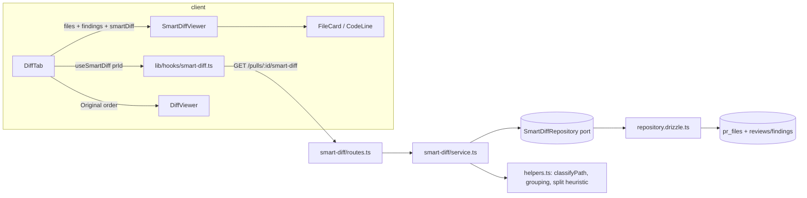

# Development Plan: Smart Diff (reviewer-ordered diff)

## Objective

Sort a PR's changed files by review risk so a reviewer reads business logic
first and lockfiles/generated code last. Classification is **deterministic and
path-based — no LLM call, no new model spend**. The existing `SmartDiff` Zod
contract is already scaffolded in both vendor mirrors; this plan wires it up
end to end: a new `GET /pulls/:id/smart-diff` endpoint plus a
`SmartDiffViewer` on the PR detail page's *Files changed* tab, with a
Smart/Original order toggle and a large-PR split banner.

`pseudocode_summary` stays `null` in this iteration (the contract field
already allows it). The UI renders a "what this does" line only when the field
is non-null, so a later LLM-backed iteration can fill it without a UI change.
**No heuristic summary text may be invented.**

## Scope

- **Packages/modules touched:**
  - `server/` — new module `src/modules/smart-diff/`, one entry in
    `src/modules/index.ts`, one lazy getter in `src/platform/container.ts`.
  - `client/` — new `_components/SmartDiffViewer/` under the PR detail route,
    `DiffTab` integration, new `src/lib/hooks/smart-diff.ts`, two additive
    props on shared diff-viewer components, `messages/en/prReview.json`.
  - `client/INSIGHTS.md` — correct the stale "Smart Diff needs an LLM" entry
    (WI12).
- **Explicitly out of scope:**
  - `reviewer-core/`, `e2e/` — no prompt change, no new browser scenario.
  - Any DB migration. Smart Diff derives everything from existing `pr_files`
    and `reviews`/`findings` rows; nothing is persisted.
  - Any contract edit to `brief.ts` / `review-api.ts`. `SmartDiff`,
    `SmartDiffRole`, `SmartDiffFile`, `SmartDiffGroup`, `ProposedSplit`,
    `SmartDiffResponse` already exist and already match this feature. If the
    implementer finds an unavoidable contract change, it must be hand-mirrored
    into **both** `server/src/vendor/shared/` and `client/src/vendor/shared/`
    and flagged in the report — do not treat it as a routine edit.
  - `repo-intel`'s `getFileRank` / `getTopFilesByRank`. It exists and is live,
    but the product decision is a path/pattern classifier: no repo clone, no
    index dependency, works offline and on a never-indexed repo. Not used.
  - LLM-generated per-file summaries (`pseudocode_summary`) — deliberate
    follow-on.
  - Persisting the Smart/Original toggle in the URL or in settings — local
    component state only.

## Constraints

- **Onion architecture is machine-enforced for new modules.**
  `server/.dependency-cruiser.cjs` exempts only the pre-existing module list
  (`agents|polling|pulls|repo-intel|repos|reviews|settings|workspace|_shared`).
  `smart-diff` is new, so all four rules apply automatically: `service.ts` may
  not import `db/schema`/`db/client`/`drizzle-orm`/`postgres` or anything under
  `src/adapters/`; `routes.ts` may not touch the DB or an adapter directly;
  `helpers.ts` must stay pure. Do **not** add `smart-diff` to
  `PRE_EXISTING_MODULES`. Verify with `cd server && pnpm arch:check`.
- **Do not fatten `modules/pulls/routes.ts`.** It is already a fat-handler
  module (`GET /pulls/:id` does GitHub refresh + persistence + DTO shaping
  inline) and is grandfathered out of the boundary check. Putting the new
  endpoint there would inherit that exemption and dodge the architecture the
  repo now enforces. New module, per
  `.claude/skills/onion-architecture/rules/module-structure.md` file order:
  `repository.ts` → `repository.drizzle.ts` → `helpers.ts` → `service.ts` →
  `routes.ts` → `modules/index.ts` → `platform/container.ts`.
- **Vendor mirror convention** (root `AGENTS.md`): `@devdigest/shared` is
  hand-copied into both packages, no sync script. This plan is designed to
  require **zero** contract edits — see Scope.
- **Migrations** (root + `server/AGENTS.md` do-not-touch): none needed. If a
  work item ever seems to need one, stop and flag it — it means the design
  drifted from "derive, don't persist".
- **`server/AGENTS.md` → Non-default conventions:** routes declare zod
  `params` schemas (`_shared/schemas.ts` → `IdParams`); never hand-roll
  `Schema.parse(req.body)` in a handler. Services take port interfaces so tests
  swap a fake instead of module-mocking.
- **`server/INSIGHTS.md` → Codebase Patterns ("PR-list `score` is NOT an
  aggregate"):** the established semantics for "the PR's review" is *the single
  most-recently-created `reviews` row*, not a rollup across agents. Smart Diff
  must use the same rule for `finding_lines` — latest review only.
- **`client/AGENTS.md` → Non-default conventions:** all data fetching goes
  through `src/lib/hooks/*` (never `fetch` in a component); UI imports only
  from the `@devdigest/ui` barrel; feature code lives in colocated
  `_components/<Name>/` folders with their own `*.test.tsx`; pages stay thin.
- **`client/INSIGHTS.md` (Codebase Patterns):** grep `client/messages/en/*.json`
  before writing UI copy — pre-authored keys are authoritative. Done:
  `prReview.json` → `smartDiff.*` already has `coreLabel`, `wiringLabel`,
  `boilerplateLabel`, `largeTitle`, `largeBody`, `filesCount`, `findingLines`,
  `groupedByRole`. Reuse them; only add what the mock needs beyond them (WI11).
- **`client/INSIGHTS.md` → Open Questions is WRONG about this feature.** It
  states Smart Diff "needs a new LLM-backed server endpoint (something has to
  generate the per-file summary + role classification)". The product decision
  is path-based classification with `pseudocode_summary: null`. WI12 corrects
  this; the planner cannot (write scope is `docs/plans/` only).
- **Root `INSIGHTS.md` → Tool & Library Notes:** `pnpm <script>` can abort with
  `ERR_PNPM_ABORTED_REMOVE_MODULES_DIR_NO_TTY` in this Windows shell — fall
  back to `.\node_modules\.bin\vitest.cmd run` /
  `.\node_modules\.bin\tsc.cmd --noEmit -p tsconfig.json`. Docker is not
  auto-started, so `.it.test.ts` files won't run without `docker ps` first —
  this plan deliberately adds none.
- **`client/INSIGHTS.md`:** no browser automation exists on this machine;
  verification is `tsc --noEmit` + Vitest/RTL, not a live click-through.

## Data flow



Note the split of responsibilities on the client: the **endpoint supplies role
grouping, order and `finding_lines`**; the **patch bodies come from the already
loaded `usePullDetail` payload**, and **severity colours come from the existing
`FindingRecord[]` the page already passes into `DiffTab`**. Nothing is fetched
twice and the response stays contract-shaped (no severity field added).

## Work items

### WI1 — Server: classification constants

- **Files:** `server/src/modules/smart-diff/constants.ts` (new)
- **Applicable skills:** `typescript-expert`
- **Content (fixed decisions, no TBDs):**
  - `BOILERPLATE_MATCHERS` — evaluated first: lockfiles (`pnpm-lock.yaml`,
    `package-lock.json`, `yarn.lock`, `bun.lockb`, `Cargo.lock`, `poetry.lock`,
    `composer.lock`, `Gemfile.lock`, `go.sum`); generated/output dirs as a path
    segment (`dist`, `build`, `out`, `.next`, `coverage`, `node_modules`,
    `vendor`, `migrations`, `__snapshots__`); generated/binary extensions
    (`.snap`, `.map`, `.min.js`, `.d.ts`, `.generated.*`, `.gen.ts`, `.pb.go`,
    `.svg`, `.png`, `.jpg`, `.jpeg`, `.gif`, `.ico`, `.woff`, `.woff2`, `.ttf`,
    `.pdf`).
  - `WIRING_MATCHERS` — evaluated second: `*.config.{ts,js,mjs,cjs,json}`,
    `tsconfig*.json`, `package.json`, `.env*`, `Dockerfile`,
    `docker-compose*.{yml,yaml}`, any path under a `.github` segment, bootstrap
    basenames (`index.ts`, `index.tsx`, `index.js`, `server.ts`, `app.ts`,
    `main.ts`, `bootstrap.ts`, `container.ts`, `middleware.ts`), test files
    (`*.test.*`, `*.spec.*`, or a `test`/`tests`/`__tests__`/`e2e` path
    segment), docs (`*.md`, `*.mdx`, `LICENSE`), styles (`*.css`, `*.scss`),
    and any remaining `*.json`/`*.yml`/`*.yaml`.
  - Everything unmatched falls through to `core` (the default).
  - `SPLIT_SUGGESTION_MAX_LINES = 400` — `too_big` above this.
  - `MAX_FINDING_LINES_PER_FILE = 50` — cap on `finding_lines` per file.
  - No new dependency: matching is plain segment/basename/extension checks on a
    POSIX-normalised, lower-cased path. No glob library.
- **Definition of done:** file exports the three matcher groups + two numeric
  constants, each with a one-line comment stating *why* that pattern is in that
  bucket; `pnpm typecheck` clean. Two known-lossy rules are commented as
  deliberate: every `index.ts(x)` is `wiring` (barrels dominate, real logic in
  an `index` file is misfiled), and tests are `wiring` (worth skimming, not the
  logic under review).

### WI2 — Server: pure classifier + grouping helpers

- **Files:** `server/src/modules/smart-diff/helpers.ts` (new)
- **Applicable skills:** `typescript-expert`, `onion-architecture`
- **Exports:**
  - `classifyPath(path: string): SmartDiffRole` — boilerplate → wiring → core,
    in that order.
  - `groupFiles(files, findingsByPath): SmartDiffGroup[]` — groups in fixed
    role order `core, wiring, boilerplate`; **empty groups are omitted**; files
    inside a group sorted by `additions + deletions` desc, ties broken by path
    ascending (stable, deterministic).
  - `findingLinesFor(findings, path): number[]` — unique, ascending
    `start_line` values of that file's findings, clamped to `>= 1`, capped at
    `MAX_FINDING_LINES_PER_FILE`. Ranges are **not** expanded into every
    covered line (a 400-line finding would otherwise dominate the payload);
    `start_line` is the scroll anchor the UI needs.
  - `buildSplitSuggestion(groups, totalLines)` — `too_big = totalLines >
    SPLIT_SUGGESTION_MAX_LINES`; `proposed_splits` is one entry per non-empty
    role group **only when `too_big` and there are ≥2 non-empty groups**
    (splitting a single-role PR is not a split), otherwise `[]`. Each
    `ProposedSplit.name` is the raw role string (`"core"` / `"wiring"` /
    `"boilerplate"`) so display copy stays in client i18n, not in the API.
  - `pseudocode_summary` is always set to `null` here, explicitly, with a
    comment pointing at this plan.
- **Definition of done:** no imports from `src/db/**`, `src/adapters/**`, or
  `platform/container.ts` (enforced by the `no-helpers-to-io` rule); functions
  are pure and total (a file with `additions: 0, deletions: 0` still
  classifies).

### WI3 — Server: repository port + Drizzle adapter + container getter

- **Files:** `server/src/modules/smart-diff/repository.ts` (new),
  `server/src/modules/smart-diff/repository.drizzle.ts` (new),
  `server/src/platform/container.ts` (edit — one private field + one lazy
  getter, following `_skillsRepo`/`get skillsRepo()`)
- **Applicable skills:** `onion-architecture`, `drizzle-orm-patterns`,
  `typescript-expert`
- **Port (`repository.ts`) — exactly three methods, no speculative CRUD:**
  - `getPull(workspaceId: string, prId: string): Promise<{ id: string } | undefined>`
    — workspace-scoped existence check (drives the 404).
  - `getPrFiles(prId): Promise<{ path: string; additions: number; deletions: number }[]>`
    — from `pr_files`.
  - `latestReviewFindings(prId): Promise<{ file: string; start_line: number }[]>`
    — findings of the **single most-recently-created `reviews` row** for the
    PR (mirrors `reviewsForPull`'s `orderBy(desc(createdAt))` and the
    "latest-review, not an aggregate" rule in `server/INSIGHTS.md`). Returns
    `[]` when the PR has no review yet.
  - No Drizzle imports in this file — interface + plain types only.
- **Adapter:** `DrizzleSmartDiffRepository implements SmartDiffRepository`, the
  only file in the module importing `db/schema`. May read
  `modules/reviews/repository/pull.repo.ts` for query shape but must not depend
  on `ReviewRepository` (keeps the module's port narrow).
- **Definition of done:** `pnpm arch:check` passes; `container.smartDiffRepo`
  resolves lazily and is cached like every other getter.

### WI4 — Server: service

- **Files:** `server/src/modules/smart-diff/service.ts` (new)
- **Applicable skills:** `onion-architecture`, `typescript-expert`, `zod`
- **Behaviour:** `SmartDiffService` takes the `SmartDiffRepository` interface in
  its constructor. One method:
  `getSmartDiff(workspaceId, prId): Promise<SmartDiffResponse>`.
  1. `getPull` → `NotFoundError('Pull request not found')` when missing.
  2. Load `pr_files` and latest-review findings in parallel.
  3. `groupFiles` + `buildSplitSuggestion` from WI2;
     `total_lines = Σ(additions + deletions)` over **all** PR files, including
     boilerplate (it is the honest PR size, and the mock's banner says
     "changed lines").
  4. Zero `pr_files` rows → `{ groups: [], split_suggestion: { too_big: false,
     total_lines: 0, proposed_splits: [] } }`. This is a real state: `pr_files`
     is only populated once `GET /pulls/:id` has run for that PR. Never call
     GitHub from here — the endpoint stays deterministic and offline-safe.
- **Definition of done:** no DB/adapter import (arch rule
  `no-service-to-db` / `no-service-to-adapter-impl`); returns a value that
  `SmartDiffResponse.parse()` accepts.

### WI5 — Server: route + module registration

- **Files:** `server/src/modules/smart-diff/routes.ts` (new),
  `server/src/modules/index.ts` (edit — one import + one registry entry,
  key `smartDiff`)
- **Applicable skills:** `fastify-best-practices`, `onion-architecture`, `zod`
- **Route:** `GET /pulls/:id/smart-diff`, `schema: { params: IdParams }`,
  `getContext(app.container, req)` for `workspaceId`, service constructed from
  `app.container.smartDiffRepo`. Handler is a pass-through — no business logic,
  no `Schema.parse` in the handler (zod runs at the edge). Return type
  annotated `Promise<SmartDiffResponse>`.
- **Definition of done:** route reachable via `app.inject`; unknown PR id →
  404 with the standard error envelope; invalid (non-uuid) id → 422 before the
  handler runs; `pnpm arch:check` clean.

### WI6 — Client: `useSmartDiff` hook

- **Files:** `client/src/lib/hooks/smart-diff.ts` (new),
  `client/src/lib/hooks/index.ts` (edit — add `export * from "./smart-diff";`)
- **Applicable skills:** `react-best-practices`, `next-best-practices`,
  `typescript-expert`
- **Shape:** mirrors `usePrIntent` in `lib/hooks/reviews.ts` —
  `useQuery({ queryKey: ["smart-diff", prId], queryFn: () =>
  api.get<SmartDiffResponse>(\`/pulls/${prId}/smart-diff\`), enabled: !!prId })`.
  No polling, no mutation (nothing to re-run — it's deterministic).
- **Definition of done:** hook is the only place this URL appears; no component
  calls `fetch` or `api.get` directly.

### WI7 — Client: additive props on shared diff-viewer components

- **Files:** `client/src/components/diff-viewer/FileCard/FileCard.tsx` (edit),
  `client/src/components/diff-viewer/CodeLine/CodeLine.tsx` (edit)
- **Applicable skills:** `react-best-practices`, `typescript-expert`
- **Changes (both strictly backward compatible — `DiffViewer`'s existing call
  sites pass neither prop and behave exactly as today):**
  - `FileCard` gains optional `open?: boolean` + `onOpenChange?: (open: boolean)
    => void`. When `open` is `undefined` the component keeps its current
    internal state and the `AUTO_EXPAND_MAX_LINES` heuristic; when provided it
    is fully controlled. Needed because Smart Diff must open a collapsed file
    when a reviewer clicks one of its finding dots — a `defaultOpen` prop
    could not re-open a file the user had collapsed.
  - `CodeLine` adds `data-diff-line={`${path}:${line.newNo}`}` on the row
    wrapper when `line.newNo != null`. This is the scroll anchor; it mirrors
    the existing `data-finding-id` + `querySelector(...).scrollIntoView`
    pattern in `FindingsPanel.tsx`, rather than inventing a second mechanism.
- **Definition of done:** `client/src/test/smoke.test.tsx` and the existing
  diff-viewer-dependent tests still pass unchanged.

### WI8 — Client: `SmartDiffViewer` (presentational)

- **Files (new):**
  `client/src/app/repos/[repoId]/pulls/[number]/_components/SmartDiffViewer/SmartDiffViewer.tsx`,
  `.../SmartDiffViewer/styles.ts`, `.../SmartDiffViewer/index.ts`,
  `.../SmartDiffViewer/_components/RoleGroup/RoleGroup.tsx` (+ `index.ts`),
  `.../SmartDiffViewer/_components/SplitSuggestionBanner/SplitSuggestionBanner.tsx`
  (+ `index.ts`)
- **Applicable skills:** `react-project-structure`, `react-best-practices`,
  `next-best-practices`, `typescript-expert`
- **Props:** `{ smartDiff: SmartDiffResponse; files: PrFile[]; findings:
  FindingRecord[]; commenting?: DiffCommentApi; onFocusFindings?:
  (opts: FocusFindingsOptions) => void }`. **It does not call the hook** —
  `DiffTab` owns fetching (WI9), which keeps this component trivially
  renderable in RTL without a `QueryClientProvider`.
- **Rendering rules (fixed):**
  - One `RoleGroup` per returned group, in the response's order. Header:
    role label + subtitle + file count (`smartDiff.filesCount`) + total
    findings badge for the group.
  - Group default open state: `core` open, `wiring` open, `boilerplate`
    collapsed. (Mock pins core-open/boilerplate-collapsed; `wiring` open is
    this plan's decision — its *files* stay collapsed unless they have
    findings, so the group costs one line of screen space.)
  - File default open state: open when the file has ≥1 `finding_lines` entry;
    otherwise open only when `role === "core"` and
    `additions + deletions <= AUTO_EXPAND_MAX_LINES`; otherwise collapsed.
  - Patch body: looked up from `files` by path. A group file with no matching
    `PrFile` renders its header only (`FileCard` already handles a null patch).
  - **Coverage fallback:** any path present in `files` but absent from every
    group is appended to the `core` group (matching the classifier's own
    default) — the two payloads read the same `pr_files` rows, so this only
    triggers on a mid-session GitHub refresh. No client-side re-classification
    beyond that one default.
  - Finding dots on the file header: one dot per `finding_lines` entry,
    coloured from the matching `FindingRecord` severity via the existing
    `client/src/components/diff-viewer/findings.ts` helpers
    (`severityCountsForFile`, `mostSevereFinding`) — no new severity logic, and
    no severity field added to the API contract. Clicking a dot sets the
    controlled `open` for that file to `true` and scrolls
    `[data-diff-line="<path>:<line>"]` into view
    (`{ behavior: "smooth", block: "center" }`), same as `FindingsPanel`.
  - `pseudocode_summary` renders as a muted "what this does" line **only when
    non-null**. It is always `null` this iteration — the branch is scaffolding,
    and no fallback text may be substituted.
  - `SplitSuggestionBanner` renders only when `split_suggestion.too_big`, using
    the existing `smartDiff.largeTitle` / `largeBody` copy plus one row per
    `proposed_splits` entry (name mapped through i18n by role key).
- **Definition of done:** component is pure-presentational (no data fetching),
  every string comes from `useTranslations("prReview")`, UI imports come from
  the `@devdigest/ui` barrel only.

### WI9 — Client: `DiffTab` integration + order toggle

- **Files:**
  `client/src/app/repos/[repoId]/pulls/[number]/_components/DiffTab/DiffTab.tsx`
  (edit)
- **Applicable skills:** `react-best-practices`, `next-best-practices`,
  `react-project-structure`
- **Changes:**
  - Call `useSmartDiff(prId)`; keep local `const [order, setOrder] =
    useState<"smart" | "original">("smart")`.
  - Header becomes the mock's `REVIEWER-ORDERED DIFF` (`SectionLabel`, existing
    uppercase treatment) with a segmented `Smart order | Original order`
    control in the `right` slot, alongside the existing comments toggle.
  - `order === "smart"` **and** smart-diff data loaded → `SmartDiffViewer`;
    otherwise the existing `DiffViewer` (unchanged flat list).
  - **Degradation is explicit:** while loading, render `DiffViewer` (the tab is
    never blank); on error, force `original`, disable the `Smart order` button
    and show the `smartDiff.unavailable` message. Never render a fabricated
    grouping.
  - `SplitSuggestionBanner` renders above the viewer in **both** modes when
    `too_big` (the warning is about the PR, not about the ordering).
  - The page (`page.tsx`) is untouched — `DiffTab` already receives `prId`,
    `files`, `findings`, `onFocusFindings`.
- **Definition of done:** original-order behaviour, inline commenting and
  finding markers are byte-for-byte the same as today when the toggle is on
  `Original order`.

### WI10 — Tests

- **Files (new):** `server/test/smart-diff-classifier.test.ts`,
  `server/test/smart-diff-service.test.ts`,
  `client/src/app/repos/[repoId]/pulls/[number]/_components/SmartDiffViewer/SmartDiffViewer.test.tsx`,
  `client/src/app/repos/[repoId]/pulls/[number]/_components/DiffTab/DiffTab.test.tsx`
- **Applicable skills:** `react-testing-library` (client), `typescript-expert`
  (server); authorship belongs to the `test-writer` agent per
  `agents/README.md`#handoff-chain — `implementer` runs the existing suites and
  leaves these for that pass.
- **Server coverage:** `classifyPath` per bucket incl. the two documented lossy
  rules (`index.ts` → wiring, `*.test.ts` → wiring) and the `core` default;
  group ordering + omission of empty groups; `finding_lines` dedup/sort/clamp/
  cap; `too_big` at 400/401 lines; `proposed_splits` empty when not `too_big`
  and when only one role group is non-empty; service returns the empty shape
  for a PR with zero `pr_files`; service output round-trips through
  `SmartDiffResponse.parse()`. Uses an in-memory fake `SmartDiffRepository`
  (no DB, no Docker) — that is exactly why the port exists.
- **Client coverage:** groups render in response order with counts;
  boilerplate collapsed by default; a file with findings starts open; clicking
  a finding dot opens the file and calls `scrollIntoView` on the
  `data-diff-line` target (jsdom stub); banner only when `too_big`; toggling to
  `Original order` renders the flat `DiffViewer`; no "what this does" text when
  `pseudocode_summary` is `null`. Render via `NextIntlClientProvider` with the
  real `messages/en/prReview.json`, following
  `BlastRadiusCard.test.tsx`'s harness.
- **Definition of done:** no new `.it.test.ts` (nothing here needs Postgres);
  both suites green.

### WI11 — Client: i18n

- **Files:** `client/messages/en/prReview.json` (edit, `smartDiff` namespace)
- **Applicable skills:** `next-best-practices`
- **Reuse as-is:** `largeTitle`, `largeBody`, `filesCount`, `findingLines`.
- **Repoint existing labels to mock copy** (safe — grep confirms nothing reads
  `smartDiff.*` today): `coreLabel` → "Core logic", `wiringLabel` → "Wiring",
  `boilerplateLabel` → "Boilerplate".
- **Add:** `title` ("Reviewer-ordered diff"); `order.smart` ("Smart order"),
  `order.original` ("Original order"), `order.label` (aria-label for the
  segmented control); `subtitle.core` / `subtitle.wiring` /
  `subtitle.boilerplate` (mock's one-line group descriptions);
  `findingsBadge` (ICU plural); `jumpToLine`; `split.core` / `split.wiring` /
  `split.boilerplate` (display names for `proposed_splits[].name` role keys);
  `unavailable` ("Smart order unavailable — showing original order.");
  `whatThisDoes` (label for the future non-null `pseudocode_summary`).
- **Definition of done:** no hardcoded user-facing string in WI8/WI9; keys read
  via `useTranslations("prReview")` (namespace = filename, per
  `src/i18n/request.ts`).

### WI12 — Correct the stale `client/INSIGHTS.md` entry

- **Files:** `client/INSIGHTS.md` (edit), plus the normal end-of-session
  INSIGHTS update in `server/INSIGHTS.md` / `client/INSIGHTS.md`
- **Applicable skills:** `engineering-insights`
- **What is wrong:** the Open Questions entry "Smart Diff … is unwired
  scaffolding" concludes that building it "needs a new LLM-backed server
  endpoint (something has to generate the per-file summary + role
  classification)". That is now false: role classification is deterministic and
  path-based, and `pseudocode_summary` stays `null`. Move the entry out of Open
  Questions into Codebase Patterns / Session Notes, stating that Smart Diff is
  built, costs zero tokens, and that only the per-file summary remains
  LLM-shaped scaffolding.
- **Definition of done:** no remaining sentence in `client/INSIGHTS.md`
  claiming Smart Diff requires an LLM; the entry passes the cold-read test.

## Test plan

Commands as documented in each package's `AGENTS.md`; the `.\node_modules\.bin`
form is the documented fallback for this shell's pnpm TTY abort (root
`INSIGHTS.md`).

```
cd server && pnpm typecheck
cd server && pnpm arch:check
cd server && pnpm exec vitest run --exclude '**/*.it.test.ts'
cd client && pnpm typecheck
cd client && pnpm test
```

Fallbacks: `server> .\node_modules\.bin\tsc.cmd --noEmit -p tsconfig.json`,
`server> .\node_modules\.bin\vitest.cmd run --exclude "**/*.it.test.ts"`,
`client> .\node_modules\.bin\vitest.cmd run`.

Not run / not added: server integration tests (`pnpm exec vitest run .it.test`)
need Docker Postgres and this feature adds no DB-backed behaviour worth an
integration test; `e2e/` unchanged.

## Risks / Open questions

- **`index.ts` → `wiring` misfiles real logic.** Deliberate: barrels dominate
  in practice and content inspection would need the patch body. Documented in
  `constants.ts`. If it proves wrong on real PRs, the fix is a content check on
  `patch` in the classifier, not a new bucket.
- **`pr_files` can be empty.** It is populated by `GET /pulls/:id`, so a PR
  whose detail page was never opened returns empty groups. The client always
  has `files` from `usePullDetail` by the time `DiffTab` renders, so this is
  invisible in the UI — but a direct API consumer will see an empty response.
  Accepted; documented in the service.
- **`total_lines` counts boilerplate.** A PR that is 900 lines of lockfile
  trips `too_big` even though there's little to review. Accepted for
  honesty/simplicity this iteration; a "core-only" threshold is a follow-on if
  it proves noisy.
- **`SPLIT_SUGGESTION_MAX_LINES = 400` is a judgement call**, not derived from
  data. It lives alone in `constants.ts` precisely so it can be retuned in one
  place.
- **`client/INSIGHTS.md` is stale on this exact feature** (see WI12) — the
  planner cannot edit it. If the implementer hits any other guidance that
  contradicts the code, flag it rather than silently working around it.
- No other ambiguity: all scope questions were resolved by the user before
  planning (no LLM call, both toggle and split banner in scope, mock UI is
  authoritative).

## Explicitly out of scope

Architecture review, spec-compliance verification, security review, new-test
authorship and docs — separate agents own these; see
`agents/README.md`#handoff-chain.
