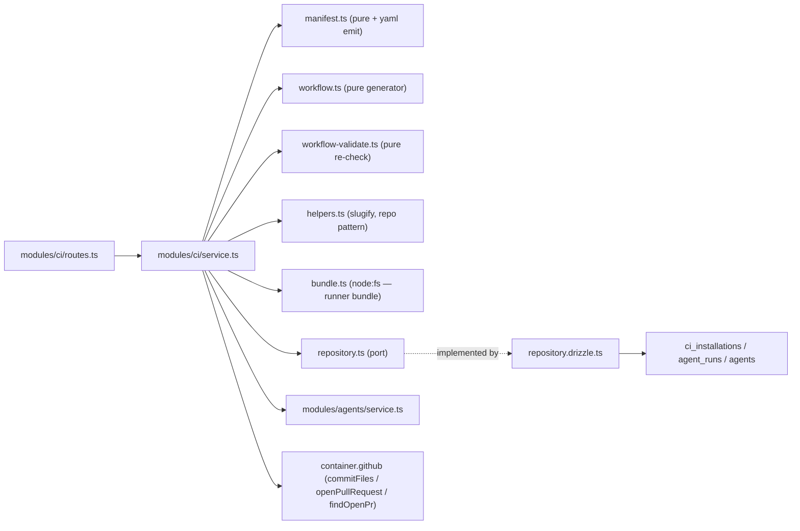

# Development Plan: Export to CI

Source spec: [`specs/SPEC-04-export-to-ci.md`](../../specs/SPEC-04-export-to-ci.md)
(committed on `emdash/l07-ci-export-pndgk`, `7c21809` — 82 EARS ACs across
sections A–J, 31 edge cases E-1…E-31, decisions D-1…D-15, open questions
Q-1…Q-8, 20 UX items). Every fact the Spec established with a `file:line`
citation is taken as given here and not re-derived. This plan adds only what
the Spec deliberately left to it: the answers to Q-1…Q-8, the phase sequencing,
the file-level work breakdown, and the per-item skill assignment.

---

## ⚠️ Read this before executing any phase

**1. No tests are written in this pass. At all.**
Every phase's deliverable is **implementation code only**. There is no
`test-writer` stage in this workflow, no unit tests, no integration tests, no
component tests. The Spec's acceptance criteria each carry a `(verify: …)`
clause; those clauses are **retained in the references below as documentation of
intent** — they describe what a test *would* assert, and they are the
specification of correct behaviour the implementer must satisfy by construction.
They are **not** instructions to write that test now.

This is a deliberate, user-chosen deferral, not an oversight. It is recorded
again in [For the human coordinator](#for-the-human-coordinator--what-an-independent-plan-reviewer-should-scrutinise)
as a known gap, and it is the single largest risk this plan carries — see
[Risks](#risks--open-questions), item 1.

**2. At most five `implementer` invocations for the implementation work.**
The 23 work items are grouped into **five phases, A–E**. Each phase is executed
by **one** `implementer` run, ending in its own commit, with a **human review
pause between phases**. No phase may be split across two implementer runs and no
phase may be merged with another to "save a run" — the budget is five and the
grouping below is the budget's allocation.

**3. No `test-writer`, and no automatic downstream agents.**
After Phase E, the plan **stops**. The `architecture-reviewer` and
`plan-verifier` stages are **options offered to the human coordinator**, not
phases the implementer runs — see
[Recommended next steps](#recommended-next-steps--for-the-human-coordinator).

**4. If `plan-verifier` is run and returns `FAIL` or
`PASS-WITH-REQUIRED-FIXES`, the fix loop is capped at 2 iterations and at most
2 fix subagents.** This is deliberately tighter than the 3-iteration cap
`run-plan` / `sdd-build` use by default. Two iterations, two agents, then stop
and hand the residue back to the human as a written list — do not open a third.

---

## Objective

Turn a locally-tuned DevDigest review agent into a **versioned configuration
checked into someone else's repository** that reviews every pull request in that
repo's own GitHub Actions, and get the results back: a four-step Export Wizard
generates a previewable, least-privilege file set; Install commits it to a
`devdigest/ci` branch as an ordinary pull request and mints a one-time ingest
token; the generated workflow runs the embedded `agent-runner` bundle and POSTs
its result to one authenticated endpoint, which writes a single `agent_runs` row
with `source = 'ci'` that the new top-level CI Runs page and the agent's new CI
tab render.

## Scope

- **Packages/modules touched:** `server/` (new `src/modules/ci/`;
  `src/db/schema/ci.ts` + `src/db/schema/runs.ts` + one generated migration;
  `src/platform/container.ts`; `src/modules/index.ts`; both vendored contract
  copies; `package.json` for two new dependencies) · `client/` (new `/ci-runs`
  App Router page + `_components/`; new `CiTab` + `ExportWizard` under
  `AgentEditor/_components/`; `src/lib/hooks/ci.ts`; `src/lib/types.ts`;
  `src/vendor/ui/nav.ts`; `messages/en/ci.json`) · root `.gitignore` (Q-4, four
  lines).
- **Execution mode:** **five sequential `implementer` runs, one per phase (A–E),
  pausing for human review between phases.** Not concurrent multi-agent, and not
  the repo's usual `implementer → test-writer → plan-verifier → doc-writer`
  chain — `test-writer` is removed from the flow entirely (callout 1 above), and
  the verification stages are optional and human-triggered (callout 3).
- **Explicitly out of scope (feature-specific):** `agent-runner/src/**` and
  `agent-runner/dist/**` (consumed exactly as-is — the bundle is read from disk,
  never rebuilt or committed by this feature); `reviewer-core/**` (untouched);
  `mcp/`, `e2e/`; the multi-agent review service and the PR feed / PR list
  (AC-80); the `ci_runs` table (D-11, Q-2 — left in place, never written); any
  CircleCI / Jenkins / Generic-CLI generator (D-12); a DevDigest GitHub App;
  setting the target repo's Actions secrets (AC-72); polling GitHub for results
  (D-1); re-running or cancelling a CI run from the studio; a run trace for CI
  runs (E-30); CI Runs retention, pruning or pagination; token rotation,
  revocation flows, request signing, nonces or replay protection (D-1, E-14);
  the live end-to-end GitHub walkthrough (manual QA the human performs after
  the feature ships — no automated test may attempt it).

## Constraints

**Architectural / repo rules**

- The new module lives at **`server/src/modules/ci/`** — the path
  `agent-runner/CLAUDE.md` ("Read When" → *"Changing what gets embedded in the
  exported PR / workflow generation → `server/src/modules/ci/`"*) and
  `agent-runner/src/manifest.ts:9-10` and `agent-runner/src/index.ts:5` all
  already name as this feature's owner. It is **not** in `PRE_EXISTING_MODULES`
  (`server/.dependency-cruiser.cjs:10-11`), so all five boundary rules apply in
  full: `service.ts` must not import `src/db/(schema|client)`, `drizzle-orm`,
  `postgres` or `src/adapters/**`; `routes.ts` must not touch either;
  `helpers.ts` must stay I/O-free; and `no-other-module-file-to-db-or-adapter`
  covers every other file in the module (`manifest.ts`, `workflow.ts`,
  `bundle.ts`, `constants.ts`, `repository.ts`) — only `repository.drizzle.ts`
  may import Drizzle. `pnpm arch:check` (= `depcruise --config
  .dependency-cruiser.cjs src`) is the gate (AC-78). — skill:
  `onion-architecture`.
- **`node:fs` is allowed in a non-`service.ts` module file.** The bundle read
  (AC-17) needs the filesystem and no dependency-cruiser rule forbids it; the
  grounded precedent is `modules/onboarding/facts.ts:11`, which imports
  `node:fs/promises` directly and passes `arch:check`. `service.ts` still must
  not import `node:fs` — it calls `bundle.ts`.
- **No generator abstraction.** The GitHub Actions path is plain functions in
  `modules/ci/` (AC-78, D-12, D-15). No `CiTargetGenerator` interface, no
  registry, no strategy map, no "seam for when CircleCI arrives". `CiTarget`
  (`eval-ci.ts:311`) is used as-is for the disabled labels and everything but
  `gha` is rejected at the route.
- **Contract edits are hand-mirrored byte-identically** into
  `server/src/vendor/shared/contracts/eval-ci.ts` **and**
  `client/src/vendor/shared/contracts/eval-ci.ts` — there is no sync script
  (root `AGENTS.md`; AC-79). Both barrels already re-export
  `./contracts/eval-ci.js`, so no barrel edit is needed. The check is
  `git diff --no-index` between the two files printing nothing.
- **Schema changes go through `pnpm db:generate`.** `server/src/db/migrations/**`
  is do-not-touch — never hand-edited (AC-79). The generated `.sql`,
  `migrations/meta/_journal.json` **and** `migrations/meta/<n>_snapshot.json`
  must be committed **together**; SPEC-02's `plan-verifier` FAIL was exactly
  this being missed (root `INSIGHTS.md`, 2026-08-14). — skills:
  `drizzle-orm-patterns`, `postgresql-table-design`.
- **Routes declare zod `params`/`body`/`querystring` schemas** on the route
  config; never `Schema.parse(req.body)` inside a handler (`server/AGENTS.md`;
  AC-76). — skills: `fastify-best-practices`, `zod`.
- **Secrets only through the injected `SecretsProvider`.** The `ci` module must
  contain **zero** `process.env` reads; `LocalSecretsProvider`
  (`adapters/secrets/local.ts:37-42`) is the one chokepoint (AC-73,
  `server/AGENTS.md`). Note the deliberate asymmetry: `agent-runner` *does* read
  `process.env` directly and correctly — that exemption is scoped to that
  package (`agent-runner/CLAUDE.md`) and does not travel back into `server/`.
- **Client:** UI imported **only** from the `@devdigest/ui` barrel; all data
  fetching through `src/lib/hooks/*` (never an ad-hoc `fetch` in a component);
  feature logic in colocated `_components/<Name>/` folders; markdown only
  through the centralized `Markdown.tsx` (`client/AGENTS.md`). — skills:
  `next-best-practices`, `react-best-practices`, `react-project-structure`.
- **Security is threaded through the work items, not appended as a late pass.**
  The Spec already ran OWASP Top 10:2025 (A01 unauthenticated cross-tenant
  write on ingest, A02 the generated workflow *is* a security configuration,
  A03 action pinning, A04 the token's CSPRNG/hash/hash-keyed-lookup handling, A05
  YAML + workflow + path injection, A06 the trust model, A08 the ingest
  boundary, A09 logging, A10 fail-closed). Every work item touching one of
  those surfaces names the `security` skill.

**INSIGHTS.md entries that bind this plan**

- Root `INSIGHTS.md` → *Tool & Library Notes*: `pnpm <script>` can abort with
  `ERR_PNPM_ABORTED_REMOVE_MODULES_DIR_NO_TTY` in this non-TTY shell. Call
  `./node_modules/.bin/<bin>` (extensionless under Git Bash) directly. **This
  bites hardest in Phase A**, which must add two dependencies — see WI3's note.
- Root `INSIGHTS.md` → *Tool & Library Notes*: Docker Desktop is not
  auto-started here. `pnpm db:migrate` (WI2) needs it up; if it is down, say so
  and stop rather than claiming a live migration.
- Root `INSIGHTS.md` → *Recurring Errors & Fixes*: `git commit` with no pathspec
  commits the **whole** staged index. Each phase's commit must name its paths
  explicitly (`git commit -- <paths>`).
- `server/AGENTS.md`: rate limiting is fully **disabled** under `NODE_ENV=test`;
  `bodyLimit` is hardcoded to 1 MB in `app.ts:49` (AC-59's cap must sit under
  it); the DI container has **lazy, cached** adapter getters and
  `invalidateSecretCaches()` must be called after `SecretsProvider.set()`.
- `client/AGENTS.md`: `src/test/smoke.test.tsx` mounts `/showcase` and fails on
  any broken vendored export — it is the tripwire for the `nav.ts` edit in
  Phase E. Root `INSIGHTS.md` also records that the eval-pipeline plan's
  equivalent `nav.ts` change broke on a `shell.json` ↔ `nav.ts` key mismatch;
  `shell.json`'s `nav["ci-runs"]` key **already exists** and the nav item's
  `key` must be exactly `ci-runs` to match it.

## Module shape



Two write paths, one read surface:

- **Export/Install** — `routes → service → {manifest, workflow, bundle} →
  GitHubClient` + one `ci_installations` upsert. Zero LLM calls, at most three
  GitHub calls.
- **Ingest** — `routes → service`, authenticated by the installation token, not
  by `getContext`; one `agent_runs` insert with `source = 'ci'`.
- **Read** — CI Runs list and installation list, both workspace-scoped by
  joining through `agents.workspace_id` (`ci_installations` has no
  `workspace_id` column — E-23).

## Recommendations

1. **Generate everything server-side at Install; never let the client upload a
   generated file.** The client submits *only* the hand-edited workflow text
   (AC-6 makes exactly one file editable). Every other file is regenerated from
   the agent row at Install time. This is what makes AC-32's server-side
   re-validation a real trust boundary rather than a formality: there is only
   one attacker-controlled string in the whole install payload, and it gets
   parsed and checked before it is committed. It also resolves Q-3 for free
   (the multi-megabyte bundle never crosses the wire in either direction).
2. **Put every workflow invariant in `constants.ts` as a named value, and make
   `workflow-validate.ts` check the *emitted* YAML against those same
   constants.** AC-19–AC-31 are twelve invariants that must hold for
   generated **and** hand-edited YAML. If the generator's forbidden-event list
   and the validator's forbidden-event list are two literals in two files, they
   will drift, and the drift direction that matters is "the validator forgot
   something the generator never emits". One `FORBIDDEN_EVENTS`, one
   `PERMISSIONS`, one `RUN_COMMAND`, one `PINNED_ACTIONS`, imported by both.
   With no tests in this pass (callout 1), shared constants are the *only*
   remaining mechanism keeping those two lists honest — this recommendation is
   load-bearing, not stylistic.
3. **`workflow-validate.ts` should validate a parsed YAML document, not a
   string.** AC-32's four named attacks (`pull_request_target`,
   `permissions: write-all`, an unpinned `uses:` tag, and a `--agent other`
   flag appended to the run command) are all trivially bypassable against a
   regex over raw text (comments, quoting, flow style, anchors). Parse with
   `yaml`, then assert over the object; keep exactly one string-level check —
   the run command's exact equality — and derive it from `RUN_COMMAND`.
4. **Do not add a `regenerate token` button, but do add
   `DELETE /ci/installations/:id`.** E-14 and Q-6 both state the v1 remedy for a
   leaked token is *"delete the installation and re-export"*. That sentence is
   only true if a delete exists; today nothing can remove an installation short
   of deleting the agent (E-24). One route and one CI-tab action (~20 lines)
   makes the documented remedy executable. This is the **only** addition in this
   plan not directly demanded by an AC — flagged deliberately so `plan-verifier`
   reads it as intentional. See Q-6 below.
5. **Sequence generation before persistence.** Phase B builds the whole
   generator (manifest, workflow, slugs, bundle, override validation) and the
   side-effect-free Preview route, and touches no table and no GitHub API. That
   is the security-critical half of the feature and the half with the most
   invariants, and it can be reasoned about — and reviewed by a human between
   phases — with no database, no token, and no risk of writing into someone
   else's repository.
6. **Not recommended, and deliberately not planned:** dropping the `ci_runs`
   table (Q-2), auto-mapping OpenRouter model ids (Q-1), and a latency-target
   SLO (Q-7). All three are recorded as resolved-with-reasons below rather than
   silently dropped.

## Resolved open questions (Q-1 … Q-8)

The Spec left these to this stage. Each is now a binding plan decision;
`implementer` must not re-open them.

- **Q-1 — OpenRouter model-id mapping → warn, never map.** The manifest writes
  `provider: openrouter` (D-4) and `model` **verbatim** from `agents.model`, with
  no transformation, no lookup against OpenRouter's model list, and no
  namespacing heuristic. The wizard shows the AC-12 notice when
  `agent.provider !== 'openrouter'`, and shows a second sentence when
  `agent.model` contains no `/` (a bare id like `gpt-4.1` is the shape that will
  fail at OpenRouter). One pure predicate in `helpers.ts`, no network call, no
  mapping table. Rationale: no in-repo mapping exists to anchor on, a wrong
  auto-map is worse than an honest warning, and a model list fetch would make
  export depend on a provider being reachable. Implemented in WI7 + WI20.
- **Q-2 — drop the unwritten `ci_runs` table → no.** Left in place, never
  written (D-11). WI2 adds a doc comment above `ciRuns` in
  `server/src/db/schema/ci.ts` stating that SPEC-04 deliberately does not write
  it and that `agent_runs` with `source = 'ci'` is the single run store — so the
  next reader does not "wire up the obvious table". A drop migration is risk
  with no benefit here, and SPEC-03 set the precedent by leaving `PrBrief`
  scaffolding in place.
- **Q-3 — how the runner bundle travels through the wizard → it does not.**
  Preview returns the bundle as a `CiFile` whose `contents` is a one-line
  human-readable placeholder naming its size, with `editable: false` and a new
  `preview_omitted: true` flag on `CiFile` (WI1). Install **re-reads the bundle
  from disk server-side** and commits the real bytes; the client never receives
  them and never sends them. This follows directly from Recommendation 1 and is
  the simplest option per D-15: no digest scheme, no chunking, no second
  endpoint. Consequence to be honest about: AC-5's "the previewed body equals
  the payload later submitted" holds for every file **except** the one marked
  `preview_omitted` — which is precisely what the flag exists to declare.
  Implemented in WI1, WI11, WI20.
- **Q-4 — the stale root `.gitignore` comment → fix the comment and remove the
  inert negation.** `.gitignore:3-4` explains its `!agent-runner/dist/**`
  negation with a marketplace-action delivery model that `agent-runner/CLAUDE.md`
  explicitly rejects, and the negation does not take effect anyway because
  `agent-runner/.gitignore:2` wins (verified by `git check-ignore -v`, E-1,
  E-26). WI4 deletes the negation and rewrites the comment to state the actual
  model: the bundle is a **build artifact**, produced by `cd agent-runner &&
  pnpm build`, read from disk by the export, embedded in the target repo — never
  committed here. The bundle is **not** committed to git as part of this work.
- **Q-5 — pinned action SHAs and the Node floor → two actions, resolved to real
  SHAs, Node 22.** The generated workflow uses exactly two actions:

  | `uses:` | Trailing comment | Resolved |
  |---|---|---|
  | `actions/checkout@11bd71901bbe5b1630ceea73d27597364c9af683` | `# v4.2.2` | `git ls-remote --tags https://github.com/actions/checkout` (2026-08-23) |
  | `actions/setup-node@49933ea5288caeca8642d1e84afbd3f7d6820020` | `# v4.4.0` | `git ls-remote --tags https://github.com/actions/setup-node` (2026-08-23) |

  Node floor: **`node-version: '22'`** — the runner's GitHub client is built on
  native `fetch` and its source documents Node 22 (`agent-runner/src/github.ts:6-12`),
  and root `AGENTS.md` pins Node ≥ 22. The mockup's `node-version: 20` is below
  the floor and must not be emitted (E-29, AC-29). The **reporting step uses no
  action at all** — it is a plain `curl` in a `run:` block with the token
  supplied via that step's `env:` (AC-30), which keeps the supply-chain surface
  at two actions. Both SHAs live in `PINNED_ACTIONS` in
  `modules/ci/constants.ts` with a comment naming the `git ls-remote` command
  and the date, since refreshing them is a standing maintenance cost (AC-24,
  NFR Maintainability). **If a future refresh cannot reach the network, the
  implementer must stop and report — never invent or guess a SHA.** A wrong SHA
  is a workflow that fails at its first step in a stranger's repository.
- **Q-6 — replacing a leaked ingest token → delete the installation and
  re-export, and make that possible.** No rotation, no `regenerate` button, no
  revocation list (D-1 is explicit). WI16 adds `DELETE /ci/installations/:id`
  (workspace-scoped through the `agents` join) and WI19 surfaces it as a
  **Remove installation** action on the CI tab, with copy stating that removing
  it stops runs being recorded and that re-exporting mints a new token the user
  must paste again. See Recommendation 4 — this is the one addition beyond the
  AC list, taken because E-14's stated remedy is otherwise not executable.
- **Q-7 — latency and timeout targets → no target set, and none invented.**
  Recorded as an explicit gap, as SPEC-01 Q7 / SPEC-02 Q9 / SPEC-03 Q-2 each
  did. Nothing in this plan is blocked by it. Two concrete limits *are* fixed
  because ACs demand them, and they live in `constants.ts`: the export route at
  `{ max: 10, timeWindow: '1 minute' }` (AC-77, matching
  `modules/reviews/routes.ts:43,65`) and the ingest route at
  `{ max: 60, timeWindow: '1 minute' }` (AC-59 — one installation posts a
  handful of times per PR event; 60/min bounds E-18's fan-in without throttling
  a busy repo). Existing adapter timeouts on `commitFiles` / `openPullRequest`
  are inherited unchanged.
- **Q-8 — how the wizard learns the studio's reachable ingest URL → the wizard
  asks for it, on the Configure step.** `CiExportInput` gains
  `ingest_url: z.string().url()`, validated server-side to an
  `http:`/`https:` absolute URL, persisted on `ci_installations.ingest_url`, and
  emitted as a literal into the generated workflow's reporting step. The
  Configure step prefills `http://localhost:3001/ci/ingest` **and renders an
  explicit warning** that a GitHub-hosted runner cannot reach `localhost` and
  that runs will review and post normally but will not appear in CI Runs until
  the URL is reachable (E-13, UX-19). Rejected alternatives: reading it from
  server config (adds an env var and a deploy concern for a value that differs
  per user), and defaulting silently (produces a wizard that looks successful
  and silently never records a run). Implemented in WI1, WI2, WI8, WI13, WI20.

---

## Work items

### Phase A — contracts, schema, dependencies (commit 1)

*One `implementer` run. Nothing else compiles or persists against the new shapes
until this lands. No feature behaviour ships in this phase.*

**WI1. Extend the CI contracts; mirror both vendored copies byte-identically.**

- Files: `server/src/vendor/shared/contracts/eval-ci.ts` → hand-mirrored to
  `client/src/vendor/shared/contracts/eval-ci.ts`.
- Applicable skills: `zod`, `typescript-expert`, `security` (A08 — every shape
  crossing the ingest boundary is schema-validated on write *and* on read).
- Satisfies: AC-10, AC-18, AC-50, AC-53, AC-62, AC-64, AC-68, AC-76, AC-79;
  Q-3, Q-8.
- Content — **additive only**; `AgentManifest`, `CiTarget` and `CiResultArtifact`
  are **not** modified (AC-10 depends on `AgentManifest` staying byte-identical
  to what `agent-runner/src/manifest.ts:69-76` validates against):
  - `CiFile` gains `preview_omitted: z.boolean().default(false)` (Q-3), with a
    comment stating that a `true` value means `contents` is a placeholder and
    the real bytes are supplied server-side at Install.
  - `CiExportInput` gains: `workflow_override: z.string().nullish()` (AC-6,
    AC-32 — the *only* generated file the client may submit),
    `ingest_url: z.string().url()` (Q-8),
    `replace_existing: z.boolean().default(false)` (AC-39's explicit
    confirmation). `target` keeps its four-value enum and is rejected at the
    route for anything but `gha` (AC-3) — do **not** narrow the contract enum.
  - `CiInstallation` gains `workflow_version: z.number().int()`,
    `agent_version: z.number().int()` (AC-18, AC-47), `ingest_url: z.string()`,
    `post_as`, `triggers: z.array(z.string())`, `base: z.string()` (so AC-45's
    "Update CI config" can re-run with the installation's own options), and a
    nullable last-run summary `last_run: z.object({ ran_at, status, findings_count }).nullable()`
    (AC-43, UX-10). It carries **no token and no hash**, ever (AC-50, AC-60).
  - `CiExport` gains `ingest_token: z.string().nullable()` — the one-time
    plaintext, present **only** in the immediate Install response and `null` on
    every other path (AC-50, AC-38's token-preserving update returns `null`).
    A comment must say so.
  - New `CiIngestInput` = `{ result: CiResultArtifact.nullable(), repo:
    z.string(), head_sha: z.string(), pr_number: z.number().int().nullable(),
    actions_run_id: z.string(), job_url: z.string().url(), source:
    z.string().min(1).max(64), status: CiRunStatus, duration_ms:
    z.number().int().nullable(), error: z.string().nullish() }` (AC-53, AC-58 —
    `result: null` is the failure-shaped body; `source` is free-form and
    deliberately unvalidated against `CiTarget`, D-13/AC-62).
  - `CiRun` gains `repo: z.string().nullable()`, `head_sha`,
    `pr_title: z.string().nullish()`, `agent_id: z.string().nullable()` and the
    severity split `critical` / `warning` / `suggestion`, each
    `z.number().int().nullable()` (AC-64, AC-66 — nullable so an unknown split
    renders as absent, never as `0`). `github_url` is reused as the CI **job**
    URL (AC-68); a comment must say so, since there is no trace to link (E-30).
  - New `CiRunFilters` querystring shape = `{ since_days: z.coerce.number().int().default(7),
    agent_id, repo, status, source }`, the last four `.nullish()` (AC-63).
- Definition of done: `cd server && ./node_modules/.bin/tsc --noEmit -p
  tsconfig.json` clean; `git diff --no-index
  server/src/vendor/shared/contracts/eval-ci.ts
  client/src/vendor/shared/contracts/eval-ci.ts` prints **nothing** (AC-79 — this
  exact command is the check); `cd client && ./node_modules/.bin/tsc --noEmit`
  clean.

**WI2. Schema: `ci_installations` gains its secret + version + option columns;
`agent_runs` gains the CI linkage fields and the dedupe constraint.**

- Files: `server/src/db/schema/ci.ts`, `server/src/db/schema/runs.ts`,
  `server/src/db/migrations/**` (**generated only**, via `pnpm db:generate`).
- Applicable skills: `drizzle-orm-patterns`, `postgresql-table-design`,
  `security` (A04 — the column stores a hash and is named to say so).
- Satisfies: AC-18, AC-38, AC-50, AC-55, AC-56, AC-57, AC-65, AC-79; Q-2, Q-8;
  NFR Performance (the CI Runs index).
- Content:
  - `ciInstallations` adds: `tokenHash` text notNull (AC-50 — **hash only, never
    the token**; the column comment must say `sha256(token)`), `ingestUrl` text
    notNull (Q-8), `workflowVersion` integer notNull default `1`,
    `agentVersion` integer notNull default `1` (AC-18), `postAs` text enum
    `['github_review','pr_comment','none']` notNull default `'github_review'`,
    `triggers` jsonb `$type<string[]>()` notNull, `baseBranch` text notNull
    default `'main'`, `updatedAt` timestamptz default now notNull.
  - `ciInstallations` adds a **unique index on `(agentId, repo)`** — AC-38's
    "update, don't duplicate" enforced by the database, not only by the service.
  - `agentRuns` adds: `ciInstallationId` uuid → `ciInstallations.id`
    `onDelete: 'set null'`, `repo` text, `externalPrNumber` integer, `headSha`
    text, `actionsRunId` text, `jobUrl` text, `sourceLabel` text, and `critical`
    / `warning` / `suggestion` integer — all nullable, because a local run has
    none of them and a failed CI run has no metrics (AC-56, AC-58, AC-66).
    `prId` stays nullable and untouched (AC-56, E-25).
  - `agentRuns` adds a **unique index on `(ciInstallationId, actionsRunId)`**
    (AC-57). Both columns are NULL for local runs and Postgres treats NULLs as
    distinct, so local runs are unaffected — state that in a comment above the
    index, because it is the non-obvious reason this constraint is safe to add
    to a table full of existing rows.
  - `agentRuns` adds an index on `(workspaceId, source, ranAt)` — the CI Runs
    list is a workspace-scoped scan filtered to `source = 'ci'` and ordered by
    time (AC-65, NFR Performance).
  - Doc comment above `ciRuns` recording Q-2/D-11: deliberately not written by
    SPEC-04; `agent_runs` with `source='ci'` is the single run store.
  - Run `cd server && pnpm db:generate`, then `pnpm db:migrate` (**needs Docker
    up** — root `INSIGHTS.md`).
  - Note on the two new `notNull`-without-default columns (`tokenHash`,
    `ingestUrl`): safe because `ci_installations` has never been written by
    anything (the Spec verified this by grep). If `db:generate` emits a
    statement that would fail on a non-empty table, **do not hand-edit the
    migration** — report it.
- Definition of done: `server/src/db/migrations/<n>_*.sql`,
  `migrations/meta/_journal.json` **and** `migrations/meta/<n>_snapshot.json` all
  exist and are staged together; no migration file hand-edited; server typecheck
  clean; `pnpm db:migrate` applies cleanly against a fresh database (or is
  reported as unverified with Docker down).

**WI3. Add the two server dependencies.**

- Files: `server/package.json`, `server/pnpm-lock.yaml`.
- Applicable skills: `dependency-checker` (the skill's own description names
  "reviewing whether it's safe to add a new dependency" as an entry point).
- Satisfies: AC-13 (a real YAML emitter is *required*, not a preference),
  AC-33, AC-37.
- Content:
  - **`yaml`** — the manifest must be serialized by an emitter that quotes or
    block-scalars every value and must never be built by string concatenation
    (AC-13, E-20); the hand-edited override must be *parsed* to be validated
    (AC-32, AC-33, Recommendation 3). `agent-runner` already depends on `yaml`
    and parses the manifest with it (`agent-runner/src/manifest.ts:3`), so this
    is the same library on both ends of the contract — not a new one in the repo.
  - **`jszip`** — AC-37's "downloadable archive". Pure JS, no native build step.
    Rejected alternative: hand-rolling a stored-mode ZIP writer (CRC32 + local
    file headers, ~70 lines of binary format) to avoid a dependency — writing a
    binary container format by hand is more risk than one well-known package,
    and there is no test in this pass to catch a malformed archive.
  - **Installation note (root `INSIGHTS.md`):** `pnpm add` in this shell can
    abort with `ERR_PNPM_ABORTED_REMOVE_MODULES_DIR_NO_TTY`. If it does, report
    it rather than working around it by hand-editing `package.json` without
    updating the lockfile.
- Definition of done: both packages resolve, `pnpm-lock.yaml` is updated and
  staged with `package.json`, and server typecheck is clean.

**WI4. Correct the root `.gitignore` comment and drop the inert negation
(Q-4).**

- Files: `.gitignore` (root) — four lines.
- Applicable skills: none.
- Satisfies: Q-4, E-1, E-26.
- Content: remove `!agent-runner/dist/**` (it never took effect —
  `agent-runner/.gitignore:2` wins, verified by `git check-ignore -v`) and
  replace the comment that describes the marketplace-action delivery model with
  one describing the real one: `agent-runner/dist/index.js` is a **build
  artifact** produced by `cd agent-runner && pnpm build`, read from disk at
  export time (AC-17), embedded into the *target* repo as
  `.devdigest/runner/index.js`, and never committed to this repository. Note
  that `.gitignore` already carries an unrelated uncommitted modification in
  this worktree — commit only this file's intended hunk, per root `INSIGHTS.md`'s
  pathspec rule.
- Definition of done: `git check-ignore -v agent-runner/dist/index.js` still
  reports `agent-runner/.gitignore` as the deciding rule; no file under
  `agent-runner/dist/` becomes tracked.

---

### Phase B — the `ci` module's generator half (commit 2)

*One `implementer` run. The security-critical half: it produces the file set
that will execute in a repository DevDigest does not own. It writes no table,
mints no token and makes no GitHub call.*

**WI5. Scaffold `modules/ci/`, register it, and fill `constants.ts`.**

- Files: new `server/src/modules/ci/{routes.ts,service.ts,repository.ts,
  repository.drizzle.ts,constants.ts,helpers.ts}`;
  `server/src/platform/container.ts` (a lazy `get ciRepo()` plus a `ciRepo?`
  entry in `ContainerOverrides`, following `briefRepo` / `evalRepo` at
  `container.ts:74,104,160-162`); `server/src/modules/index.ts` (one import +
  one entry, `ci`).
- Applicable skills: `onion-architecture`, `fastify-best-practices`.
- Satisfies: AC-78; and pre-positions AC-19–AC-31 per Recommendation 2.
- Content: `repository.ts` is an **interface + plain types only, no Drizzle
  import** (`modules/blast/repository.ts` and `modules/eval/repository.ts` are
  the models); `repository.drizzle.ts` is the only file in the module that
  touches `db/schema`. `constants.ts` holds every generator invariant as a named
  value (Recommendation 2), following `modules/project-context/constants.ts`'s
  precedent:
  - `DEVDIGEST_DIR = '.devdigest'`, `AGENTS_SUBDIR`, `SKILLS_SUBDIR`,
    `RUNNER_PATH = '.devdigest/runner/index.js'`,
    `MEMORY_PATH = '.devdigest/memory.jsonl'`,
    `WORKFLOW_PATH = '.github/workflows/devdigest-review.yml'` (AC-9).
  - `RUN_COMMAND = 'node .devdigest/runner/index.js'` — the exact string, no
    subcommand, no flags (AC-25, D-2, D-14).
  - `FORBIDDEN_EVENTS = ['pull_request_target','issue_comment',
    'pull_request_review_comment','workflow_run','workflow_dispatch']` (AC-20).
  - `ALLOWED_TRIGGERS = ['opened','synchronize','reopened']` (AC-19).
  - `PERMISSIONS_POST = { contents: 'read', 'pull-requests': 'write' }` and
    `PERMISSIONS_NO_POST = { contents: 'read', 'pull-requests': 'read' }`
    (AC-21, AC-22).
  - `PINNED_ACTIONS` — the two entries resolved in Q-5, each `{ name, sha,
    version }`, with a comment naming the `git ls-remote --tags` command, the
    resolution date, and the rule that a SHA is never guessed.
  - `NODE_VERSION = '22'` (AC-29), `CI_BRANCH = 'devdigest/ci'` (AC-34),
    `WORKFLOW_VERSION = 1` (AC-18 — bumped by hand whenever `workflow.ts`
    changes what it emits), `INGEST_TOKEN_BYTES = 32` (AC-50, ≥ 256 bits),
    `EXPORT_RATE_LIMIT = { max: 10, timeWindow: '1 minute' }` (AC-77),
    `INGEST_RATE_LIMIT = { max: 60, timeWindow: '1 minute' }` (AC-59, Q-7),
    `MAX_INGEST_BODY_BYTES` set safely below `app.ts`'s 1 MB `bodyLimit`
    (AC-59).
- Definition of done: `cd server && ./node_modules/.bin/depcruise --config
  .dependency-cruiser.cjs src` reports zero errors with the new module present;
  `tsc --noEmit` clean; the module appears in `modules`.

**WI6. Slugs, repo validation and the provider notice predicate (`helpers.ts`).**

- Files: `server/src/modules/ci/helpers.ts`.
- Applicable skills: `typescript-expert`, `security` (A05 *path injection* — an
  agent or skill name becomes a file path inside a foreign repository).
- Satisfies: AC-4, AC-14, AC-15; Q-1.
- Content — pure functions, no I/O (the `no-helpers-to-io` rule applies):
  - `slugify(name)` → lowercase, restricted to `[a-z0-9-]`, collapsed dashes,
    trimmed, length-capped. It must **reject or rewrite**, never pass through:
    a path separator, `..`, a leading dot, a Windows reserved device name
    (`CON`, `PRN`, `AUX`, `NUL`, `COM1`–`COM9`, `LPT1`–`LPT9`), and an
    all-punctuation name (which must fall back to a deterministic non-empty
    value, not an empty string) (AC-14).
  - `disambiguate(slugs)` → deterministic suffixing so two skills that slugify
    identically (`Secret Leakage Gate` vs `secret-leakage-gate`, E-5) each get
    their own file and every `skills[]` entry in the manifest resolves to that
    skill's own body (AC-15). Deterministic means: stable ordering in, stable
    suffixes out — the same agent exported twice produces the same filenames.
  - `parseRepoRef(repo)` → strict `^[A-Za-z0-9._-]+/[A-Za-z0-9._-]+$` with no
    `..` segment, returning `{ owner, name }` or refusing. Every API path,
    branch name, commit message and file path derives from the parsed result,
    never from the raw string (AC-4).
  - `needsModelIdNotice(provider, model)` → the Q-1 predicate: true when
    `provider !== 'openrouter'`, plus a second flag when `model` contains no
    `/`.
- Definition of done: `arch:check` clean (the file imports nothing outside the
  module and the contracts); each named hostile input above is handled by an
  explicit branch, not incidentally.

**WI7. `manifest.ts` — field mapping, YAML emission, self-validation.**

- Files: new `server/src/modules/ci/manifest.ts`.
- Applicable skills: `zod`, `security` (A05 *YAML injection* — E-20's
  `\n---\nci_fail_on: never\n` prompt is the attack this file exists to make
  impossible), `typescript-expert`.
- Satisfies: AC-10, AC-11, AC-12, AC-13, AC-16, AC-28; Q-1.
- Content:
  - `buildManifest(agent, orderedEnabledSkills)` → an `AgentManifest` object.
    `name`, `model`, `system_prompt`, `strategy`, `ci_fail_on` map **directly**
    from the agent row (`db/schema/agents.ts:13-31`); `provider` is **always**
    the literal `'openrouter'` regardless of `agents.provider` (AC-12, D-4);
    `skills` is the ordered slugs of the agent's **enabled** linked skills. No
    transformation, no format version, no diff against a previous export
    (AC-11).
  - The skill source is **`AgentsService.linkedSkillsForRun(agentId)`**
    (`modules/agents/service.ts:158-170`) — it already returns
    `{ skill_id, name, body, enabled, version, order }`, exactly the shape needed,
    and it exists precisely so a consumer module never imports
    `AgentsRepository` (`onion-architecture` "Cross-module access"). Filter to
    `enabled === true`, sort by `order`. **Do not add a method to
    `AgentsService` and do not touch `modules/agents`** — nothing is missing.
  - `emitManifestYaml(manifest)` → `yaml`'s `stringify` with options that force
    quoting/block scalars for string values. **String concatenation or template
    interpolation to build manifest YAML is forbidden** (AC-13).
  - `assertManifestRoundTrips(yamlText, manifest)` → parse the emitted YAML back
    and `AgentManifest.safeParse` it, then compare field-for-field against the
    input. A mismatch **fails the export** — it must never ship a manifest that
    would fail validation in CI, and it must never ship one whose `ci_fail_on`
    differs from the agent's, since the manifest is the sole carrier of the gate
    policy (AC-10, AC-13, AC-28, E-20).
  - `emitSkillFile(skill)` → the skill body verbatim as
    `.devdigest/skills/<slug>.md`.
  - `emitMemoryPlaceholder()` → **empty string** for
    `.devdigest/memory.jsonl` (AC-16, D-5, E-27). Nothing reads or writes it.
- Definition of done: `arch:check` clean; grep of this file finds no template
  literal or `+` producing YAML; the round-trip assertion is on the *export*
  path, not behind a flag.

**WI8. `workflow.ts` — the GitHub Actions generator.**

- Files: new `server/src/modules/ci/workflow.ts`.
- Applicable skills: `security` (A02 the workflow *is* the security
  configuration, A03 supply chain, A05 workflow/command injection, A04 secret
  handling), `typescript-expert`.
- Satisfies: AC-19, AC-20, AC-21, AC-22, AC-23, AC-24, AC-25, AC-26, AC-27,
  AC-28, AC-29, AC-30, AC-31, AC-71; Q-5, Q-8; D-2, D-6, D-7, D-14; E-4, E-29.
- Content — `buildWorkflow({ triggers, postAs, ingestUrl })` emits YAML via the
  `yaml` emitter (same rule as WI7 — build an object, then stringify; never
  concatenate). Every value below comes from `constants.ts`, never a local
  literal (Recommendation 2):
  - `on: { pull_request: { types: <selected ∩ ALLOWED_TRIGGERS> } }` and nothing
    else (AC-19). No `FORBIDDEN_EVENTS` member may appear anywhere in the
    emitted document, for any trigger combination — this is a generator
    invariant, not a default (AC-20, E-4).
  - Workflow-level `permissions:` = `PERMISSIONS_POST`, or `PERMISSIONS_NO_POST`
    when `postAs === 'none'`. No job-level `permissions:` block at all, so
    nothing can widen it (AC-21, AC-22, D-7).
  - Job-level fork guard: the job does not execute when the PR's head repo is a
    fork (AC-23, D-6, E-3). This is an `if:` expression — permitted, because
    AC-30 forbids `${{ github.event.* }}` inside `run:` blocks, not inside `if:`.
  - Steps, in order: `actions/checkout@<sha> # v4.2.2` →
    `actions/setup-node@<sha> # v4.4.0` with `node-version: '22'` → the review
    step → the reporting step → the gate step. Every `uses:` is a full 40-hex
    SHA with the version as a trailing comment; no tag, no branch, no floating
    major, and never `uses: devdigest/review-action@v1` (AC-24, AC-25, E-29).
  - The **review step** runs exactly `RUN_COMMAND` — `node
    .devdigest/runner/index.js`, no subcommand, no flags, not `index.mjs`
    (AC-25, D-2, D-14) — carries `id: review` and `continue-on-error: true`
    (so the reporting step can still run, AC-31), and passes exactly this
    `env:` map (AC-27, per `agent-runner/README.md` "Runtime environment"):
    `OPENROUTER_API_KEY: ${{ secrets.OPENROUTER_API_KEY }}`,
    `GITHUB_TOKEN: ${{ secrets.GITHUB_TOKEN }}`,
    `GITHUB_REPOSITORY: ${{ github.repository }}`,
    `PR_NUMBER: ${{ github.event.pull_request.number }}`,
    `DEVDIGEST_POST_AS: <post_as>`. **No fail-on value in any form** — the gate
    reaches CI only through the manifest's `ci_fail_on`, and a second channel is
    a second thing that can disagree with it (AC-28).
  - **No agent-identifying token** anywhere in the emitted workflow outside the
    manifest's own path — which agent runs is decided solely by which single
    manifest the export wrote (AC-26, D-3, D-14, E-2).
  - The **reporting step** is `if: always()` (AC-31, AC-58, E-12) and is a plain
    `curl` POST of `devdigest-result.json` plus repo, head SHA, PR number,
    Actions run id, job URL, `source: 'github_actions'` and a status derived
    from `steps.review.outcome`, to the literal `ingestUrl` (Q-8). The token and
    every other value reach the script through **that step's `env:` block** and
    are referenced as shell variables — no `${{ secrets.* }}` and no
    `${{ github.event.* }}` expression may appear inside any `run:` body
    (AC-30, AC-71). When the artifact is missing (the runner's hard-fail path
    writes none), the step still POSTs a failure-shaped body with null metrics
    (AC-58, E-12) — it must not invent zeros.
  - The **gate step** re-fails the job when `steps.review.outcome == 'failure'`,
    so `continue-on-error` on the review step does not turn a blocking review
    green. A red check is what branch protection turns into a blocked merge —
    DevDigest never blocks a merge itself (D-9).
- Definition of done: `arch:check` clean; every value listed above traceable to
  a `constants.ts` export; a manual read of the emitted YAML for each of the
  trigger × `post_as` combinations confirms the AC-19–AC-31 invariants (no test
  is written — callout 1; this manual read is the substitute and the implementer
  must state in its report that it performed it, and for which combinations).

**WI9. `workflow-validate.ts` — server-side re-validation of a hand-edited
workflow.**

- Files: new `server/src/modules/ci/workflow-validate.ts`.
- Applicable skills: `security` (A10 fail-closed, A02, A03, A05),
  `typescript-expert`.
- Satisfies: AC-32, AC-33; E-19.
- Content: `validateWorkflowOverride(text)` → `{ ok: true } | { ok: false,
  violated: <invariant name> }`.
  - Parse with `yaml` first; unparseable → refuse (AC-33).
  - Then assert **over the parsed object**, not over the raw string
    (Recommendation 3): the `on:` block contains only `pull_request` with an
    allowed `types` subset; no `FORBIDDEN_EVENTS` key appears; `permissions:`
    equals `PERMISSIONS_POST` or `PERMISSIONS_NO_POST` exactly and no job-level
    `permissions` exists; every `uses:` matches `<owner>/<repo>@<40-hex>`; the
    fork guard is present; no `run:` body contains a `${{ github.event.* }}` or
    `${{ secrets.* }}` expression; the review step's `run:` equals `RUN_COMMAND`
    **exactly** (this is the one string-equality check, and it is what refuses
    `node .devdigest/runner/index.js --agent other`).
  - **Refuse, never sanitize.** The refusal names the violated invariant and the
    export commits nothing (AC-32, A10). Client-side editing is not a trust
    boundary (E-19).
- Definition of done: `arch:check` clean; each of AC-32's four named attack
  strings is refused by a specific, named branch — verified by the implementer
  reading the code against the list and stating so (no test in this pass).

**WI10. `bundle.ts` — read the runner bundle, fail loudly.**

- Files: new `server/src/modules/ci/bundle.ts`.
- Applicable skills: `security` (A10 fail-closed), `typescript-expert`.
- Satisfies: AC-17; E-1.
- Content: `readRunnerBundle(deps?: { readFile })` returns the contents of
  `agent-runner/dist/index.js`.
  - Resolve the path from `import.meta.url`, **not** from `process.cwd()` — the
    server runs from `server/` under `tsx` and from `server/dist/` after a
    build, and in both layouts the module's own directory is exactly four levels
    below the repo root (`ci → modules → src|dist → server → <root>`). State
    that in a comment; a `cwd`-relative path silently breaks under one of the
    two layouts.
  - `node:fs` here is permitted and consistent with
    `modules/onboarding/facts.ts:11`; `service.ts` must **not** import
    `node:fs` — it calls this function.
  - If the file is absent or unreadable: **fail the export** with a message
    naming the exact path and the command that produces it (`cd agent-runner &&
    pnpm build`), commit nothing, open no pull request, and persist no
    installation (AC-17, E-1). The bundle is git-ignored and absent on a fresh
    clone — this failure is the normal first-run experience and must read as
    actionable, not as a crash.
  - `previewPlaceholder(bytes)` returns the one-line `preview_omitted`
    placeholder text used by Preview (Q-3).
- Definition of done: `arch:check` clean; with `agent-runner/dist/` absent (its
  current state), calling the export path produces the named actionable error
  and no side effect.

**WI11. Preview: assemble the file set and expose it side-effect-free.**

- Files: `server/src/modules/ci/service.ts`, `server/src/modules/ci/routes.ts`.
- Applicable skills: `fastify-best-practices`, `zod`, `onion-architecture`,
  `security` (A01 — the agent must be workspace-scoped before anything is read).
- Satisfies: AC-2, AC-3, AC-4, AC-5, AC-9, AC-16, AC-75, AC-76; Q-3.
- Content:
  - `CiService.generateFiles(workspaceId, agentId, input)` → `CiFile[]` in
    exactly this order and no others: `.devdigest/agents/<agent-slug>.yaml`, one
    `.devdigest/skills/<skill-slug>.md` per enabled linked skill **in the
    agent's configured order**, `.devdigest/memory.jsonl`,
    `.devdigest/runner/index.js`, `.github/workflows/devdigest-review.yml`
    (AC-9). Only the workflow has `editable: true`; the runner entry has
    `preview_omitted: true` and placeholder contents (Q-3, AC-6); the memory
    entry is empty and labelled by the UI as a reserved placeholder (AC-16).
  - `POST /agents/:id/export-ci/preview` — zod `params` + `body`
    (`CiExportInput`), `getContext` **first**, 404 for an agent outside the
    caller's workspace (AC-75), `target !== 'gha'` rejected at the route (AC-3),
    `repo` validated by `parseRepoRef` (AC-4).
  - **Zero side effects** (AC-2): no `commitFiles`, no `openPullRequest`, no
    token, no `ci_installations` row, no GitHub call of any kind. `bundle.ts` is
    still called, so a missing bundle fails at Preview rather than surprising
    the user at Install (AC-17).
  - Logging (AC-74, A09): repository, agent id, file count, outcome. **Never**
    generated file contents, the system prompt, skill bodies or request bodies.
- Definition of done: `arch:check` + typecheck clean; the Preview route is
  reachable, returns the five-plus-N file set for an agent with linked skills,
  and a grep of the module confirms no GitHub client call on this path.

---

### Phase C — persistence, Install, ingest, read APIs (commit 3)

*One `implementer` run. This phase mints secrets and writes into someone else's
repository. It is the phase to review most carefully between commits.*

**WI12. The repository port and its Drizzle adapter.**

- Files: `server/src/modules/ci/repository.ts` (port; **no Drizzle import**),
  `server/src/modules/ci/repository.drizzle.ts`.
- Applicable skills: `drizzle-orm-patterns`, `onion-architecture`, `security`
  (A01 — every query joins through `agents.workspace_id`).
- Satisfies: AC-38, AC-52, AC-55, AC-56, AC-57, AC-65, AC-75; E-23, E-24.
- Content — every method that takes a `workspaceId` **joins through
  `agents.workspace_id`**, because `ci_installations` has no tenancy column
  (E-23). A method that reads an installation by a caller-supplied identifier
  alone must not exist; the ingest path's single exception resolves the
  installation from the *authenticated* token instead and returns the resolved
  `workspaceId` with the row so the caller cannot forget it (AC-52). **Amended
  in fix-loop iteration 1**: the original method here was `findInstallationById`
  (by installation id, read after a separate token check) — superseded by
  `findInstallationByTokenHash` once WI14's ingest auth design changed to a
  hash-keyed lookup (see WI14's amendment note); `findInstallationById` was
  removed as dead code.
  - `listInstallationsForAgent(workspaceId, agentId)` — with each row's last-run
    summary (AC-43).
  - `findInstallationByAgentAndRepo(workspaceId, agentId, repo)` (AC-38).
  - `findInstallationsByRepo(workspaceId, repo)` — for AC-39's different-agent
    conflict.
  - `upsertInstallation(...)` — keyed on the `(agentId, repo)` unique index;
    **never overwrites `tokenHash` on update** (AC-38, UX-12).
  - `deleteInstallation(workspaceId, id)` (Q-6).
  - `findInstallationByTokenHash(hash)` → row + resolved `workspaceId`, backed
    by a plain index on `token_hash` (ingest only; amended, see above).
  - `insertCiRun(row)` — `source: 'ci'`, relying on the
    `(ciInstallationId, actionsRunId)` unique index for idempotency; a conflict
    is a **no-op success**, not an error (AC-57, E-16).
  - `listCiRuns(workspaceId, filters)` — `source = 'ci'` only, never local runs
    (AC-65); filters applied **after** the workspace predicate, never instead of
    it (AC-63, AC-75). Left-joins `pull_requests` for the title where a local
    row happens to exist, and falls back to the denormalized repo + external PR
    number where it does not (AC-56, E-25). Orphaned runs whose agent was
    deleted must still return (E-24).
- Definition of done: `arch:check` clean (`repository.ts` imports no Drizzle);
  every method signature carries `workspaceId` except the two ingest-path
  methods, each of which has a comment stating why.

**WI13. Install — token, conflict handling, branch, pull request, zip.**

- Files: `server/src/modules/ci/service.ts`, `server/src/modules/ci/routes.ts`.
- Applicable skills: `security` (A04 CSPRNG + hash-only storage, A06 the trust
  model, A10 fail-closed, A09 logging), `fastify-best-practices`, `zod`,
  `onion-architecture`.
- Satisfies: AC-2, AC-3, AC-4, AC-6, AC-17, AC-32, AC-33, AC-34, AC-35, AC-36,
  AC-37, AC-38, AC-39, AC-40, AC-45, AC-50, AC-71, AC-72, AC-73, AC-75, AC-76,
  AC-77; D-8, D-10; E-9, E-10; Q-6, Q-8.
- Content:
  - `POST /agents/:id/export-ci` — zod `params` + `CiExportInput` body,
    `getContext` first, `{ rateLimit: EXPORT_RATE_LIMIT }` (AC-77), `gha`-only
    (AC-3), `parseRepoRef` (AC-4). Order of operations, all of which must
    succeed before anything is written:
    1. Regenerate the **whole** file set server-side (Recommendation 1). The
       only client-supplied file content is `workflow_override`.
    2. If `workflow_override` is present, `validateWorkflowOverride` it and
       refuse the export naming the violated invariant on failure (AC-32,
       AC-33). Otherwise use the generated workflow.
    3. `readRunnerBundle()` — a missing bundle fails here, before any GitHub
       call and before any token (AC-17, E-1).
    4. Conflict check: an installation for the same `(agent, repo)` → **update**
       it and **keep its existing token** (AC-38, UX-12). An installation for
       the same repo but a **different agent** → refuse unless
       `replace_existing` is true, and on replace remove the other agent's
       manifest path from the tree so `.devdigest/agents/` never holds two
       manifests (AC-39, D-3, E-2) — the runner refuses to start otherwise.
    5. Mint the token **only when creating** a new installation:
       `randomBytes(INGEST_TOKEN_BYTES)` from `node:crypto`, base64url-encoded;
       persist **only** `sha256(token)`; return the plaintext exactly once in
       `CiExport.ingest_token` (AC-50). It is never logged, never re-fetchable,
       and never present on an update response.
    6. `commitFiles(repo, { branch: CI_BRANCH, base, files, message })` then
       `findOpenPr(repo, CI_BRANCH)` and, only if none exists,
       `openPullRequest`. Never commit to or force-push the base branch (AC-34,
       AC-36, E-9, E-10). Reuse the adapter as-is — **no new GitHub port
       method** (D-10, AC-80). DevDigest never merges, approves, or requests an
       elevated scope (AC-35, AC-72).
    7. Persist the installation with `workflowVersion`, `agentVersion =
       agent.version`, `ingestUrl`, `postAs`, `triggers`, `base` (AC-18, Q-8).
    - **No half-state** (AC-40, A10): if `commitFiles` succeeds and
      `openPullRequest` throws, report the failure **naming the branch that was
      written** and do **not** record the installation as complete.
  - The workspace `GITHUB_TOKEN` reaches the adapter only through the injected
    `SecretsProvider` / `container.github`; the module contains **zero**
    `process.env` reads (AC-73).
  - `POST /agents/:id/export-ci/zip` — same body, same validation, returns
    `application/zip` (JSZip) of the identical file set including the real
    bundle bytes, and performs **zero GitHub writes** (AC-37).
    **Plan decision:** the zip path creates **no installation and mints no
    token** — it is a "take these files and install them yourself" escape hatch.
    AC-50 mints a token "when an installation is created", and this path creates
    none. The Install step's copy must say plainly that no ingest token is
    issued on this path and that CI Runs will therefore not record runs until
    the user installs via the PR path. *(Flagged for the human reviewer — this
    is an interpretation of AC-37 against AC-50, not a literal reading of
    either.)*
  - `POST /agents/:id/export-ci` is also AC-45's **Update CI config** path —
    same generation, same validation, same branch, same PR reuse. No second
    route.
  - Logging (AC-74, A09): repository, agent id, installation id, workflow
    version, agent version, outcome. **Never** the token, the hash, file
    contents, the system prompt, or skill bodies.
- Definition of done: `arch:check` + typecheck clean; a grep of
  `server/src/modules/ci/` finds zero `process.env` occurrences (AC-73) and zero
  log calls carrying `token`, `hash`, `contents`, `systemPrompt` or `body`
  (AC-74).

**WI14. Ingest — one authenticated endpoint, fail-closed.**

> **Post-implementation amendment (fix-loop iteration 1, see SPEC-04's AC-51
> amendment note):** this work item originally called for a separate
> installation-id header plus a `timingSafeEqual` comparison. That design
> shipped broken — the generated workflow (WI8) had no way to carry an
> installation id, since Preview must produce byte-identical output to Install
> (AC-5) and no installation exists yet at Preview time — so the ingest
> endpoint's two custom headers never matched anything the workflow actually
> sent. The fixed, final design below authenticates via a single
> `Authorization: Bearer <token>` header and a hash-keyed lookup, which needs
> neither a separate installation identifier nor a constant-time comparison
> (the only value ever compared is a hash of an attacker-supplied token, and a
> match is itself the proof of possession).

- Files: `server/src/modules/ci/routes.ts`, `server/src/modules/ci/service.ts`.
- Applicable skills: `security` (A01 the product's first unauthenticated-shaped
  write, A04 CSPRNG token + hash-keyed lookup, A08 integrity at the trust
  boundary, A09 logging, A10 fail-closed), `fastify-best-practices`, `zod`.
- Satisfies: AC-49, AC-51 (amended), AC-52, AC-53, AC-54, AC-55, AC-56, AC-57,
  AC-58, AC-59, AC-60, AC-62; D-1 (amended), D-13; E-11, E-15, E-16, E-18, E-23.
- Content — `POST /ci/ingest`, and it is the **only** result-accepting route in
  the module (AC-49). No file upload, no polling, no second path. The order in
  the Spec's own flowchart is binding:
  1. `{ rateLimit: INGEST_RATE_LIMIT }` (AC-59, E-18) and the body size cap
     under `app.ts`'s 1 MB `bodyLimit` (AC-59).
  2. Read a single `Authorization: Bearer <token>` **header**. Hash the
     presented token with `sha256` and look up the installation whose stored
     hash matches — the lookup itself is the authentication, since a match
     both identifies the installation and proves possession of the token.
     Absent header, malformed header, or no matching hash → **401, write
     nothing**, and the response body carries neither the token nor the hash
     (AC-51, AC-60).
  3. **`getContext` is not called on this route** (AC-52). Tenancy is derived
     entirely from `ci_installations.agent_id → agents.workspace_id`, and the
     write goes only into that workspace. This is the sharpest access-control
     surface in the product — a forgotten join here is an unauthenticated
     cross-tenant write, not an IDOR against a logged-in user (E-23, NFR A01).
  4. Zod-validate the body against `CiIngestInput` (which embeds
     `CiResultArtifact` unchanged). Failure → **422, no partial or coerced
     record** (AC-53, E-15).
  5. Compare the body's `repo` to the installation's `repo` by string equality —
     a single check, never a GitHub lookup — and reject otherwise (AC-54). A
     renamed repository therefore stops reporting; that is accepted for v1 and
     the fix is to re-export (E-11).
  6. Insert one `agent_runs` row with `source = 'ci'`, carrying agent,
     installation, repo, external PR number, head SHA, Actions run id, job URL,
     the reported `source` label, findings count, severity split, cost, duration
     and status (AC-55). `pr_id` stays **null** (AC-56, E-25). A duplicate
     `(installation, actions_run_id)` leaves exactly one row (AC-57, E-16).
     A failure-shaped body persists as a failed run with **null** metrics — no
     invented zeros (AC-58, E-12).
  7. The `source` label is stored and displayed verbatim, validated against
     nothing and branched on nowhere (AC-62, D-13, E-31).
  - **Nothing from the body is spread into the insert** — every column is
    assigned explicitly (A08).
  - Logging (AC-60, AC-74): installation id, Actions run id, head SHA, findings
    count, cost, outcome. Never the token, the hash, or the request body.
- Definition of done: `arch:check` + typecheck clean; every failure branch above
  returns before any write (a read of the handler confirms there is no path from
  a caught error to an insert); the module exposes exactly one result-accepting
  route.

**WI15. Read APIs — CI Runs list and the agent's installations.**

- Files: `server/src/modules/ci/routes.ts`, `server/src/modules/ci/service.ts`.
- Applicable skills: `fastify-best-practices`, `zod`, `security` (A01, A10),
  `onion-architecture`.
- Satisfies: AC-43, AC-44, AC-47, AC-48, AC-61, AC-63, AC-64, AC-65, AC-66,
  AC-67, AC-68, AC-75, AC-76.
- Content:
  - `GET /ci/runs` — zod `querystring` (`CiRunFilters`), `getContext` first,
    `source = 'ci'` only (AC-65), the five filters applied after the workspace
    predicate (AC-63, AC-75). Returns `CiRun[]` with the severity split, honest
    nulls for absent cost/duration/findings (AC-64, AC-66), a status from the
    four-state `CiRunStatus` (AC-67), and `github_url` as the CI **job** link
    (AC-68).
  - `GET /agents/:id/ci-installations` — `getContext` first, 404 outside the
    workspace, returns `CiInstallation[]` with `workflow_version`,
    `agent_version` and the last-run summary (AC-43, AC-47).
  - **Zero GitHub API calls on either route** (AC-48) and zero LLM calls
    anywhere in this module.
  - AC-44's **Fail CI on** editing needs **no new route**: `agents.ci_fail_on`
    is already writable through the existing agent update path
    (`contracts/knowledge.ts:221,246`, and `client/src/lib/hooks/agents.ts:54`
    already lists `ci_fail_on`). Do not add one.
- Definition of done: `arch:check` + typecheck clean; a local run and a CI run
  in the same workspace produce a list containing only the CI run.

**WI16. `DELETE /ci/installations/:id` (Q-6).**

- Files: `server/src/modules/ci/routes.ts`, `server/src/modules/ci/service.ts`,
  `server/src/modules/ci/repository.drizzle.ts`.
- Applicable skills: `fastify-best-practices`, `security` (A01), `zod`.
- Satisfies: Q-6, E-14 (makes the documented remedy executable). **Not demanded
  by any AC** — see Recommendation 4; keep it to one route and one repository
  method.
- Content: `getContext` first, workspace-scoped through the `agents` join, 404
  outside the workspace. Deleting the installation sets `agent_runs
  .ci_installation_id` to null (the FK is `set null`), so past CI runs stay
  readable (E-24's precedent). It performs **no** GitHub call — the committed
  workflow keeps running and simply starts getting 401s from ingest, which the
  CI-tab copy must state (WI19).
- Definition of done: `arch:check` + typecheck clean; a cross-workspace delete
  404s and removes nothing.

---

### Phase D — client: data layer, i18n, CI tab, Export Wizard (commit 4)

*One `implementer` run.*

**WI17. i18n — correct the wrong string, add only genuinely new keys.**

- Files: `client/messages/en/ci.json`.
- Applicable skills: none (copy only).
- Satisfies: AC-8, AC-12, AC-16, AC-41, AC-43, AC-44, AC-46, AC-47, AC-50,
  AC-61, AC-63, AC-64, AC-66, AC-69; D-9; E-28; UX-3, UX-4, UX-5, UX-6, UX-9,
  UX-11, UX-12, UX-17, UX-19, UX-20; Q-6, Q-8.
- Content:
  - **Correct `exportWizard.blockMergeDesc`.** It currently reads *"Requires a
    GitHub App — not available with PAT in local mode"*, which is factually
    wrong (D-9, E-28, UX-6). Replace it with copy keeping the two halves
    distinct: DevDigest makes the check go **red** (via the agent's `Fail CI on`
    and the runner's deterministic gate); a **required status check in the target
    repo's branch protection** is what makes red mean blocked, and that is
    configured by the repo owner in GitHub. No GitHub App is involved.
  - **Reword `runs.emptyBody`.** The shipped string implies runs appear once you
    export. They appear only when the workflow can reach this studio — a repo
    with a missing secret or an unreachable URL reviews every PR and reports
    none (E-13, E-17, UX-19). The empty state must point at the connection
    first.
  - **Leave `runs.autoRefresh` in place and unused.** Results arrive by push;
    the page does not poll. An "auto-refresh on" indicator over a page that does
    not poll is worse than none (UX-20). Render `runs.refresh` only.
  - Genuinely new keys: the Configure step's trigger labels **with their cost
    note** (`synchronize` fires on every push to an open PR — UX-3); the
    "Secrets expected" panel's three entries with their **distinct statuses**
    (`OPENROUTER_API_KEY` — you add it; `GITHUB_TOKEN` — auto-provided by
    Actions, keep UX-5's wording; `DEVDIGEST_INGEST_TOKEN` — DevDigest generates
    it, you paste it) plus the disclaimer that DevDigest cannot read, set or
    verify any repository secret and that these are **checklist items, not a
    live check** (AC-8, AC-72, UX-4); the ingest-URL label, hint and the
    `localhost` warning (Q-8); the one-time token block — title, the "shown
    once, copy it now" warning that must be readable **before** the dialog can
    be dismissed, and a copy affordance label (AC-50, UX-9); the provider notice
    naming the model string sent to OpenRouter verbatim (AC-12, Q-1); the
    memory-placeholder label (AC-16); the zip card including "no ingest token is
    issued on this path" (WI13's decision); the AC-39 conflict confirmation; the
    setup-docs link label (AC-41); the CI tab's installed-count, last-run /
    never-ran, `Fail CI on` label + its "only affects CI after re-export"
    note (AC-44, UX-11), Update CI config, the drift banner naming **both**
    versions (AC-47, E-7), "your existing token is preserved" (UX-12), Remove
    installation + the no-rotation note (Q-6); the CI Runs `allSources` filter,
    the `agent` and `duration` column headers, the severity-split labels, and an
    explicit "not measured" string for a null cell (AC-63, AC-64, AC-66,
    UX-15, UX-17).
  - **No existing key may be silently redefined** beyond the two corrections
    named above, each of which is required by an AC or a UX item.
    `shell.json`'s `nav["ci-runs"]` and `agents.json`'s `editor.tabs.ci` both
    **already exist** — do not add or rename them.
- Definition of done: `ci.json` parses; `cd client && ./node_modules/.bin/tsc
  --noEmit` clean; the two corrected strings no longer contain the false claims.

**WI18. Client data layer (`hooks/ci.ts`).**

- Files: new `client/src/lib/hooks/ci.ts`; `client/src/lib/hooks/index.ts`
  (barrel entry); `client/src/lib/types.ts` (re-export the CI contract types
  from `@devdigest/shared` — the file's own header says to add them there rather
  than redefine locally).
- Applicable skills: `react-project-structure`, `react-best-practices`,
  `typescript-expert`.
- Satisfies: AC-46, AC-48; `client/AGENTS.md`'s no-ad-hoc-`fetch` rule.
- Content: React Query hooks over `src/lib/api.ts` only — `useCiRuns(filters)`,
  `useAgentCiInstallations(agentId)`, `useCiPreview()` (mutation — Preview must
  not fire on mount, AC-46), `useCiExport()`, `useCiExportZip()`,
  `useDeleteCiInstallation()`. Structural copy of `hooks/eval.ts` /
  `hooks/brief.ts` (read queries + explicit-invalidate mutations). **No ad-hoc
  `fetch` in any component.**
- Definition of done: client typecheck clean; grep finds zero `fetch(` outside
  `src/lib/api.ts` in the new client code.

**WI19. The CI tab on the agent detail page.**

- Files: `client/src/app/agents/[id]/_components/AgentEditor/constants.ts` (add
  `{ key: "ci", labelKey: "editor.tabs.ci", icon: <IconName> }` to `TABS` —
  `TAB_KEYS` is derived from it at `constants.ts:21`, so the `?tab=` allow-list
  follows automatically); `AgentEditor.tsx` (one branch, alongside the existing
  `skills` / `context` / `evals` branches at `AgentEditor.tsx:26-31`); new
  `client/src/app/agents/[id]/_components/AgentEditor/_components/CiTab/`
  (`CiTab.tsx`, `styles.ts`, `index.ts`, plus any colocated sub-components).
- Applicable skills: `react-best-practices`, `react-project-structure`,
  `next-best-practices` (client-component boundaries).
- Satisfies: AC-42, AC-43, AC-44, AC-45, AC-46, AC-47, AC-48; Q-6; UX-10, UX-11,
  UX-12.
- Content:
  - Deployment status as a **count of repositories**, and a per-installation row
    with CI provider, last run status and a relative time. An installation that
    has never produced a run says so — it does not render an empty status cell
    (AC-43, UX-10).
  - **Fail CI on** editable, persisting through the existing agent update hook
    (`useUpdateAgent`, which already accepts `ci_fail_on`), with the note that
    it affects CI only after the manifest is re-exported (AC-44, AC-28, UX-11).
  - **Update CI config** re-runs the export for an existing installation through
    the same generation/validation/PR path as a first install (AC-45), with the
    "your existing token is preserved" note (UX-12, AC-38).
  - **Drift**: where `agent.version` differs from the installation's recorded
    `agent_version`, mark it as running an older configuration and name **both**
    versions (AC-47, E-7).
  - **Remove installation** (Q-6), with copy stating that the committed workflow
    keeps running and its reports will start being rejected.
  - Empty state offering **+ Add to CI**, and **no export request on mount**
    (AC-46). Rendering the tab makes **no** GitHub call (AC-48).
- Definition of done: client typecheck clean; `?tab=ci` selects the tab rather
  than snapping back to Config (AC-42 — verify by running the app or by reading
  `TAB_KEYS`'s derivation, and say which); `client/src/test/smoke.test.tsx`
  still passes.

**WI20. The four-step Export Wizard.**

- Files: new
  `client/src/app/agents/[id]/_components/AgentEditor/_components/ExportWizard/`
  (`ExportWizard.tsx`, per-step sub-components, `helpers.ts`, `styles.ts`,
  `index.ts`).
- Applicable skills: `react-best-practices`, `react-project-structure`,
  `next-best-practices`, `security` (A05 — the preview renders untrusted agent
  and skill text; plain text or the centralized `Markdown.tsx`, never a second
  renderer).
- Satisfies: AC-1, AC-2, AC-3, AC-5, AC-6, AC-7, AC-8, AC-12, AC-16, AC-37,
  AC-39, AC-41, AC-50; Q-1, Q-3, Q-8; UX-1, UX-2, UX-3, UX-4, UX-7, UX-8, UX-9.
- Content:
  - Four steps in order — **Target → Preview → Configure → Install** — with a
    progress indicator marking completed steps and Back/Continue between them.
    **Back must restore the prior step's state intact**, including a hand-edited
    workflow: a breadcrumb with a checkmark that silently discarded an edit is a
    checkmark that lied (AC-1, UX-1).
  - **Target**: GitHub Actions pre-selected and labelled recommended; CircleCI,
    Jenkins and Generic CLI rendered as **visibly disabled, non-activatable**
    cards with a reason — not merely "not selected" (AC-3, UX-8, E-22). Required
    `owner/name` field (AC-4; the server re-validates regardless).
  - **Preview**: file list left, contents right (UX-2 — this is the feature's
    trust surface). Only the workflow is editable, as a **plain textarea** — no
    structured form, no as-you-type validation, no diff view (AC-6, Simplicity
    constraints). The runner entry renders its `preview_omitted` placeholder as
    an explicit "not shown here" notice with its size (Q-3); the memory entry is
    labelled a reserved placeholder that nothing currently reads (AC-16, D-5).
    **Nothing in this UI may display the mockup's fictional strings** —
    `devdigest/review-action@v1`, `secrets.OPENAI_API_KEY`, `index.mjs review
    --agent …`, `@v4` tags (UX-7, E-29, AC-25).
  - **Configure**: `opened` + `synchronize` selected by default, `reopened`
    unselected (AC-7), each labelled with what it costs in runs (UX-3). "Post
    results as" → GitHub review (recommended, default) / PR comment / None
    (AC-7). The **ingest URL** field with its `localhost` warning (Q-8). The
    "Secrets expected" panel with the three names, their distinct statuses and
    the disclaimer — presented as a checklist the user owns, never as a live
    check (AC-8, AC-72, UX-4). The AC-12 provider notice when the agent's studio
    provider is not `openrouter` (Q-1).
  - Changing `post_as` or the triggers on Configure must **re-fetch the
    preview**, so the workflow shown on step 2 matches what Install will commit
    (UX-1).
  - **Install**: "Open a PR with these files" or "Copy files as a zip" (AC-37,
    with WI13's no-token caveat stated in the copy); the AC-39 conflict
    confirmation when the repo already has a different agent installed; a link
    to setup documentation (AC-41); and the **one-time token display** — the
    highest-stakes moment in the wizard: shown once, never re-fetchable, with a
    copy affordance and a warning the user must be able to read before
    dismissing (AC-50, UX-9).
  - **Steps 1–3 are free of side effects.** Preview is a mutation the user
    triggers, never a query that fires on mount; nothing mints a token or writes
    to GitHub before Install is activated (AC-2, AC-46).
- Definition of done: client typecheck clean; the wizard runs end-to-end against
  the Phase C routes for at least one agent (or, if the API cannot be started,
  the implementer says so explicitly rather than claiming it); smoke test passes.

---

### Phase E — client: CI Runs page, navigation, final sweep (commit 5)

*One `implementer` run.*

**WI21. Nav entry + shortcut.**

- Files: `client/src/vendor/ui/nav.ts`.
- Applicable skills: `react-project-structure`.
- Satisfies: AC-70, AC-80; UX-13.
- Content: add `{ key: "ci-runs", label: "CI Runs", icon: <IconName>, href:
  "/ci-runs", gKey: "i" }` plus the matching `SHORTCUTS` entry (`g i` — `p`,
  `x`, `o`, `a`, `s`, `c`, `e` and `,` are taken; `i` is free). The `key` must
  be exactly **`ci-runs`** because `messages/en/shell.json`'s `nav["ci-runs"]`
  already exists and the label resolves through it — root `INSIGHTS.md` records
  a `shell.json` ↔ `nav.ts` key mismatch breaking the eval-pipeline plan's
  equivalent change.
  **The change must be purely additive** — neighbouring design entries (Memory,
  Multi-Agent Review, Agent Performance) belong to a parallel worktree and must
  not be added or modified here (AC-70, AC-80).
  **`nav.ts` lives under `client/src/vendor/ui/**`, which `client/AGENTS.md`
  lists as do-not-touch.** AC-70 requires the entry and `nav.ts` is the
  registry, so this edit is a deliberate, spec-mandated exception — the same
  exception the eval-pipeline plan took for `/evals`. It is the **only**
  vendored client file this plan edits outside the sanctioned `eval-ci.ts`
  hand-mirror.
- Definition of done: client typecheck clean; the entry appears under
  `SKILLS LAB`; no existing entry is modified; `smoke.test.tsx` passes.

**WI22. The CI Runs page.**

- Files: new `client/src/app/ci-runs/page.tsx` and
  `client/src/app/ci-runs/_components/CiRunsView/` (`CiRunsView.tsx`,
  `helpers.ts`, `styles.ts`, `index.ts`), following
  `client/src/app/evals/`'s thin-page + colocated-`_components/` shape.
- Applicable skills: `next-best-practices` (App Router page, thin page +
  colocated components), `react-best-practices`, `react-project-structure`.
- Satisfies: AC-61, AC-62, AC-63, AC-64, AC-65, AC-66, AC-67, AC-68, AC-69;
  D-13; E-30; UX-14, UX-15, UX-16, UX-17, UX-18, UX-19, UX-20.
- Content:
  - Headed "CI Runs" with the subtitle "Agent reviews executed inside CI · not
    local runs" (`ci.json` `runs.title` / `runs.subtitle`), with exactly these
    columns: **timestamp, pull request (number and title), agent, source,
    duration, findings, cost, status**, plus a per-row link out. **No other
    column, no bulk action, no export, no saved view** (AC-61, UX-18).
  - The **source** column renders the reported label verbatim — "GitHub
    Actions", "CircleCI", anything — and changes no behaviour. The local-vs-CI
    distinction is the page's *filter predicate*, not this column (AC-62, D-13,
    E-31).
  - Exactly five filters — time window, agent, repository, status, source —
    each defaulting to everything-visible except the time window, which defaults
    to **the last 7 days** (AC-63, UX-18).
  - **Findings** renders the severity split (critical / warning / suggestion);
    when the split is absent it falls back to the total and renders **no zero
    for a severity it does not know** (AC-64, UX-15).
  - A null cost, duration or findings count renders as an honest dash, never a
    fabricated `0` — a failed run measured nothing, which is a different claim
    from measuring zero (AC-66, UX-17).
  - Four distinct status renderings — `succeeded`, `no_findings`, `failed`,
    `running` — with `no_findings` visually distinct from `succeeded`, because a
    green run over an effectively empty diff (E-8) must not read identically to
    a substantive clean review (AC-67, UX-16).
  - Every row links to its **CI job** via the ingested job URL — the only path
    to ground truth. **No trace affordance for a CI row**: the runner emits a
    result and no trace, so `run_traces` has no row to serve and the mockup's
    Trace link would lead nowhere (AC-68, E-30, UX-14).
  - Empty state per WI17's reworded `runs.emptyBody` (AC-69, UX-19). Manual
    **Refresh** only — no polling, no auto-refresh indicator (UX-20).
- Definition of done: client typecheck clean; the page renders populated, empty
  and null-metric rows correctly against the Phase C API (or the implementer
  states it could not run the API); smoke test passes.

**WI23. Final sweep before handing back to the human.**

- Files: none (verification only).
- Applicable skills: `onion-architecture` (the `arch:check` gate it names).
- Satisfies: AC-73, AC-78, AC-79, AC-80.
- Content, all of which must pass and be reported individually:
  - `cd server && ./node_modules/.bin/tsc --noEmit -p tsconfig.json`
  - `cd server && ./node_modules/.bin/depcruise --config
    .dependency-cruiser.cjs src` (AC-78)
  - `cd client && ./node_modules/.bin/tsc --noEmit`
  - `cd client && ./node_modules/.bin/vitest run` (the **pre-existing** suite —
    no new tests are written; this confirms nothing was broken, especially
    `smoke.test.tsx` after the `nav.ts` edit)
  - `git diff --no-index server/src/vendor/shared/contracts/eval-ci.ts
    client/src/vendor/shared/contracts/eval-ci.ts` → must print nothing (AC-79)
  - `grep -rn "process.env" server/src/modules/ci/` → must find nothing (AC-73)
  - `git status` against AC-80's write-surface list: the `ci` module and its
    routes, the CI Runs page, the agent CI tab, the shared contracts, the
    `ci_installations` / `agent_runs` schema additions plus the generated
    migration, the additive nav entry, the CI i18n namespace, `container.ts`,
    `modules/index.ts`, `server/package.json` + lockfile, and root `.gitignore`.
    **Anything outside that list is a deviation and must be reported, not
    quietly kept** — in particular, no change to the multi-agent review service
    or the PR feed / PR list, and **no new GitHub adapter method**.
- Definition of done: all green; `git status` shows only the paths above.

---

## Verification plan (no tests are written)

There is no `test-writer` stage and no new test file in this pass (callout 1).
Verification is therefore **the commands below plus explicit, stated manual
reads** by the implementer at the points each work item names. An implementer
that cannot run one of these must say so rather than assert it passed.

```bash
# server — typecheck + architecture boundary (no Docker needed)
cd server && ./node_modules/.bin/tsc --noEmit -p tsconfig.json
cd server && ./node_modules/.bin/depcruise --config .dependency-cruiser.cjs src

# server — the PRE-EXISTING suite only; confirms nothing broke. No new tests.
cd server && ./node_modules/.bin/vitest run --exclude '**/*.it.test.ts'

# client — typecheck + the PRE-EXISTING suite (jsdom, no Docker)
cd client && ./node_modules/.bin/tsc --noEmit
cd client && ./node_modules/.bin/vitest run

# vendored-contract byte identity (AC-79)
git diff --no-index server/src/vendor/shared/contracts/eval-ci.ts \
                    client/src/vendor/shared/contracts/eval-ci.ts

# secrets chokepoint (AC-73)
grep -rn "process.env" server/src/modules/ci/    # must return nothing

# migration (Docker must be up — root INSIGHTS.md)
cd server && pnpm db:migrate
```

Direct binaries, per root `INSIGHTS.md`'s `ERR_PNPM_ABORTED_…` note; the
`pnpm exec` forms in `server/AGENTS.md` are equivalent when a TTY is available.

## Risks / Open questions

1. **No tests, and this feature's correctness is unusually test-shaped.** The
   Spec expresses AC-19–AC-31 as twelve *generator invariants* — exactly the
   kind of property a cheap unit test over emitted YAML pins forever and a code
   review pins only until the next edit. AC-32's four named attack strings, the
   hash-keyed ingest lookup (AC-51, amended in fix-loop iteration 1), the
   fail-closed ingest ordering and the AC-71
   secret-scan are all likewise assertions, not designs. This pass ships them as
   **construction plus stated manual reads**. Recommendation 2 (single-source
   constants shared by generator and validator) is the main structural
   mitigation, and it is load-bearing precisely because no test backstops it.
   **This prediction materialized once, exactly as described**: the ingest
   endpoint's original header contract and the generated workflow's headers
   were never expressed as a shared constant (the one pair Recommendation 2
   was not applied to), and they silently disagreed — plan-verifier's Phase 1
   audit caught it, fixed in fix-loop iteration 1 (WI14's amendment note). The
   fix itself introduced no new shared constant either; Phase 2's re-review
   flagged this as a standing structural risk, not fully closed.
   **This is the plan's largest known gap and it is deliberate** — it must be
   re-raised, not quietly retired, when the feature is next touched.
2. **`agent-runner/dist/index.js` does not exist on a fresh clone** and is
   git-ignored (E-1, Q-4). Every export path fails until `cd agent-runner &&
   pnpm build` has run. AC-17 makes that a loud, actionable failure rather than
   a pull request containing a zero-byte runner, but it also means the wizard
   cannot be demonstrated at all until the bundle is built. Build it before
   attempting any manual verification in Phase B or later.
3. **The ingest endpoint is the first unauthenticated-shaped write in this
   product.** Every other route resolves a human's workspace through
   `getContext`; this one resolves tenancy entirely from
   `ci_installations.agent_id → agents.workspace_id` because the table has no
   `workspace_id` (E-23). A single future route that reads an installation by id
   without that join reintroduces a cross-workspace write. WI12 keeps the
   join inside the repository methods for that reason; a comment on the table in
   `schema/ci.ts` should say so too.
4. **The zip path mints no token** (WI13's plan decision). That is an
   interpretation of AC-37 against AC-50, not a literal reading of either.
   If the human coordinator disagrees, it is a plan revision — `implementer`
   must not decide it mid-build.
5. **`DELETE /ci/installations/:id` is not demanded by any AC** (Recommendation
   4, Q-6). Included so E-14's stated remedy is executable. Flagged so
   `plan-verifier` reads it as intentional scope, not drift.
6. **Pinned action SHAs are a standing maintenance cost, deliberately** (AC-24,
   Q-5). The two resolved in Q-5 were read from `git ls-remote` on 2026-08-23.
   They will age. Refreshing them means re-running that command — never
   guessing.
7. **Two `notNull` columns are added to `ci_installations` without defaults**
   (WI2). Safe only because the table has never been written. If `db:generate`
   produces a statement that would fail against an existing row, **report it**;
   do not hand-edit the migration (`src/db/migrations/**` is do-not-touch).
8. **Docker gates WI2's `pnpm db:migrate`.** If Docker is down in the
   implementing session, say so and fall back to typecheck + `db:generate`
   verification rather than claiming a live migration (root `INSIGHTS.md`).
9. **The live end-to-end GitHub walkthrough is human-only** — fork a demo repo,
   add the two real secrets, merge the wizard's PR, watch Actions run, verify a
   required check goes red. It spends real money against a real provider,
   requires a reachable ingest URL, and the Spec forbids any automated test from
   attempting it. No implementer work item covers it; the human coordinator runs
   it after Phase E.
10. **`ci_runs` stays in the schema, unwritten** (Q-2, D-11). A future reader may
    "helpfully" wire it up and create a second source of truth for one event.
    WI2's doc comment is the whole mitigation.
11. **A renamed target repository silently stops reporting** (E-11, AC-54). The
    string equality check is the accepted v1 cost of not calling GitHub on every
    ingest; the fix is to re-export. Recorded, not designed around.
12. **Q-1 and Q-7 stay open as product questions** (OpenRouter model-id mapping;
    latency targets). Neither blocks a work item — Q-1 is answered as "warn,
    never map" and Q-7 as "no SLO, two concrete rate limits" — but both remain
    genuine gaps a later iteration should close.
13. **Migration `0022` (fix-loop iteration 1) has no default/backfill for
    `ci_installations.manifest_path`.** Recorded by the fix-loop re-verification,
    not fixed there: `ADD COLUMN manifest_path text NOT NULL` with no default
    fails against a non-empty `ci_installations` table. This is safe for anyone
    pulling this branch fresh (`0021` creates the table and `0022` adds the
    column in the same `pnpm db:migrate` run against an empty table), and only
    breaks a developer who checked out this branch **before** fix-loop
    iteration 1's commit **and** had already performed a real Install. The
    correct fix (add nullable → backfill → `SET NOT NULL` as three statements)
    would require hand-editing a generated migration, which root `AGENTS.md`
    forbids — so the accepted remedy is a release note, not a code change: *"if
    you installed a CI export on this branch before the ingest-auth fix, run
    `delete from ci_installations;` before migrating."*
14. **Preview and Install can disagree on the manifest's file path** (AC-5) for
    a renamed or previously-replaced installation. Fix-loop iteration 1 made
    the manifest path a stable, persisted property of the installation
    (`ci_installations.manifest_path`) to fix AC-39's real bug — but only
    `install()` passes that stable path into `generateFiles`; the Preview route
    still re-derives it from the agent's *current* name every time
    (`server/src/modules/ci/routes.ts`'s preview handler,
    `server/src/modules/ci/service.ts`'s `generateFiles`). The committed file's
    **contents** are identical either way; only the displayed **path label**
    can differ from what Install will actually commit, for an agent that was
    renamed or was the winning side of an AC-39 replace. plan-verifier's
    Phase 2 re-review flagged this as small and non-blocking, and it was not
    sent to a second fix-loop iteration. Fix direction, when picked up: have
    the Preview route look up an existing installation for the (agent, repo)
    pair and pass its `manifestPath` into `generateFiles`, the same way
    `install()` does.

## Explicitly out of scope

- **Tests of any kind** — no unit, integration or component tests are written in
  this pass, and `test-writer` is not part of this workflow (callout 1). The
  `(verify: …)` clauses quoted from the Spec document intent; they are not work
  items here.
- **Architecture review and spec-compliance verification** — offered as
  human-triggered options below, not executed by any phase (callout 3).
- **Documentation** — no `docs/features/`, `docs/reference/` or ADR page is
  written by this plan. If the human coordinator wants them, `doc-writer` runs
  after verification, as a separate decision.
- Feature-specific exclusions are listed under [Scope](#scope) above.

## Recommended next steps — for the human coordinator

After Phase E is committed and reviewed, these are **options to choose from**,
not a continuation the implementer runs automatically. Pick none, one, or both.

**Option (a) — an `architecture-reviewer` pass.** A read-only semantic
architecture review that goes beyond what `pnpm arch:check` can express:
whether the module's layering is real or merely rule-compliant, whether the
generator stayed plain functions rather than growing a target abstraction
(D-12, D-15, AC-78), whether the client kept feature logic in colocated
`_components/` and out of the page, and whether the `ci` module reaches into
another module's repository anywhere.
**Note on availability:** there is **no standalone `architecture-reviewer`
persona** in `agents/`, `.claude/agents/`, `.codex/agents/` or `.cursor/agents/`
in this repo — it was merged into `plan-verifier` as its **Phase 2** on
2026-08-07 (`agents/README.md` § "Why plan-verifier and architecture-reviewer
merged into one agent"). A usable standalone persona does exist as an eval
fixture at
[`evals/agents/architecture-reviewer/fixtures/architecture-reviewer.md`](../../evals/agents/architecture-reviewer/fixtures/architecture-reviewer.md).
So option (a) is either "run that fixture persona standalone" or "run
`plan-verifier` and read its Phase 2 section" — it is not a separate installed
agent, and choosing (b) already includes an architecture pass.

**Option (b) — a `plan-verifier` pass** as the final spec-compliance +
architecture gate: Phase 1 walks the 82 ACs against the shipped diff and ends in
a locked `VERDICT:`; Phase 2 runs `pnpm arch:check` first and then reports what
the tool cannot express. Give it this plan **and** `specs/SPEC-04-export-to-ci.md`,
and tell it explicitly that **no tests exist by design** so it grades
construction and code reading rather than treating missing tests as an
unexplained omission (otherwise every `(verify: …)` clause reads as a failed
criterion).

**If option (b) returns `FAIL` or `PASS-WITH-REQUIRED-FIXES`:** the fix loop is
capped at **2 iterations, with at most 2 fix subagents raised** — deliberately
tighter than the 3-iteration cap `run-plan` / `sdd-build` use. After the second
iteration, stop and hand any remaining findings back to the human as a written
list. Do not open a third iteration and do not raise a third fix agent.

**Not offered, and deliberately so:** a `test-writer` pass (out of scope for
this workflow by the user's decision) and a `doc-writer` pass (a separate
decision to make once the feature is verified).

## For the human coordinator — what an independent plan reviewer should scrutinise

*(Required by SPEC-04 AC-82. Review the **plan**, not the code — at the time
this section was written, no SPEC-04 feature code existed.)*

1. **Is the shared-secret ingest of D-1 implemented fail-closed?** Read WI14's
   seven-step ordering against the Spec's own flowchart — note WI14's
   amendment note (fix-loop iteration 1): the auth mechanism changed from a
   separate installation-id header + `timingSafeEqual` compare to a single
   `Authorization: Bearer` header authenticated by a hash-keyed lookup, after
   the original design shipped unreachable (Preview's byte-identity guarantee,
   AC-5, ruled out carrying an installation id in the generated workflow).
   Every branch — absent/malformed header, no matching hash, oversized body,
   schema failure, repo mismatch — must return **before** any write, and no
   caught error may fall through to an insert. Check specifically that
   `getContext` is *not* on that route (AC-52) and that tenancy comes only from
   `ci_installations.agent_id → agents.workspace_id` — with no `workspace_id`
   column on the table, that join is the *entire* authorization for the first
   unauthenticated-shaped write in this product (E-23). Also check that the
   hash-keyed lookup reasoning holds (a match is proof of possession because
   the compared value is a hash of the caller's own input, not a secret worth
   timing an early-exit against) and that the response never echoes the token
   or hash in a 401 or a 200 body (AC-51, AC-60).
2. **Are the workflow-generator invariants of AC-19–AC-31 enforceable, given
   that this pass writes no tests?** This is the sharpest question about this
   plan. The Spec expected each invariant to be a unit test over emitted YAML;
   the plan substitutes single-source constants shared by `workflow.ts` and
   `workflow-validate.ts` (Recommendation 2) plus stated manual reads across the
   trigger × `post_as` combinations. Judge whether that is sufficient for a
   generator whose output executes with two credentials in a repository
   DevDigest does not own — and if it is not, whether the right answer is to add
   a sixth phase for tests, to fold a minimal invariant test into Phase B
   despite callout 1, or to accept the gap explicitly and record it. Note also
   that WI9 validates a **parsed document** rather than a regex over text
   (Recommendation 3); check whether that choice actually closes AC-32's four
   named bypasses.
3. **Has the plan stayed inside the Spec's "Simplicity constraints for v1"?**
   Look for reintroduced abstraction: is the generator plain functions, or did a
   `CiTargetGenerator` / registry / strategy map appear? Is preview editing a
   plain textarea? Is manifest generation pure field mapping with no format
   version and no diff-against-previous? Is `CiTarget` used as-is rather than
   extended? Are the CI Runs columns and filters exactly the mockup's set? The
   plan's two deliberate additions beyond the AC list are **WI16's
   `DELETE /ci/installations/:id`** (Recommendation 4 / Q-6) and **two new
   dependencies, `yaml` and `jszip`** (WI3) — decide whether each is justified
   or is the first crack in D-15.
4. **Are the three plan-level interpretations acceptable?** (a) the zip path
   mints no token and creates no installation (WI13 — AC-37 read against
   AC-50); (b) the runner bundle never crosses the wire, so AC-5's
   "previewed bytes == committed bytes" holds for every file *except* the one
   flagged `preview_omitted` (Q-3); (c) the wizard asks for the ingest URL
   rather than the server configuring it (Q-8). Each is defensible and each is a
   place where a different reader would have chosen differently.
5. **Is the five-phase split the right allocation of a five-run budget?** Phase
   B is by far the largest (seven work items, the whole generator) and Phase E
   the smallest (three). The split was chosen so that the phase which mints
   secrets and writes into a foreign repository (Phase C) is preceded by a
   human review pause and is not entangled with the generator. Check whether a
   different grouping would give the human a better review checkpoint —
   noting the budget is five runs and cannot grow.
