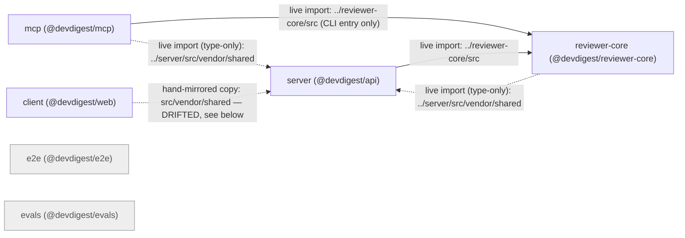

# Dependency report — 2026-08-19

## Executive summary

6 packages scanned (`client`, `server`, `reviewer-core`, `mcp`, `e2e`,
`evals`); combined measured installed size is **~2317.3 MB** across the 5
packages with `node_modules` present (`e2e` not installed, not measured).
Headline risks: `client/src/vendor/shared` has **actively drifted** from its
source-of-truth copy in `server/src/vendor/shared` (4 of 4 files differ);
`server` has a **prod** SQL-injection advisory in `drizzle-orm`; and every
pnpm-managed package (`client`, `server`, `evals`, plus `reviewer-core`/`mcp`
on npm) carries a **critical** dev-only `vitest` advisory
(GHSA-5xrq-8626-4rwp) via a shared `vitest@2.1.x` pin. AGENTS.md's claim that
"`reviewer-core/` is the only package on npm" is also stale — `mcp` and
`e2e` are npm too.

**Top 3 actions:** (1) resolve the `client`/`server` `@devdigest/shared`
drift, (2) patch-bump `mermaid` and `next` in `client` (fixes 11 advisories
for a semver-compatible bump), (3) bump `drizzle-orm` in `server` past
0.45.2 to close the prod SQLi advisory.

## Package inventory

| Package | Manager | Direct prod deps | Direct dev deps | Installed size |
|---|---|---|---|---|
| `client` (`@devdigest/web`) | pnpm | 11 | 12 | 560.7 MB |
| `server` (`@devdigest/api`) | pnpm | 21 | 8 | 1211.4 MB |
| `reviewer-core` (`@devdigest/reviewer-core`) | npm | 2 | 4 | 72.6 MB |
| `mcp` (`@devdigest/mcp`) | npm | 2 | 4 | 149.7 MB |
| `e2e` (`@devdigest/e2e`) | npm | 0 | 3 | not measured — `node_modules` not installed |
| `evals` (`@devdigest/evals`) | pnpm | 2 | 5 | 322.9 MB |

## Internal dependency graph

- **Solid arrows** = live, compiler-enforced tsconfig path imports.
- **`mcp`/`reviewer-core` → `server`** is a live *type-only* import straight
  into `server/src/vendor/shared` — neither package holds its own physical
  copy, so this edge cannot drift (it's the same file, not a copy).
- **`client` → `server`** (dashed) is the one **hand-mirrored, not
  compiler-enforced** copy edge in the repo — `client/src/vendor/shared` is
  a separate physical file tree that must be updated by hand, and it has
  already drifted (see Drift & risk flags). `client/src/vendor/ui` has no
  counterpart elsewhere in the repo, so it isn't drawn as an edge.
- `e2e` and `evals` have no internal (repo-to-repo) dependency edges —
  both are leaf packages.

## Size ranking

Top direct dependencies by installed size (single largest install
instance; `node_modules` is not shared across packages, so the same name
is measured independently per package):

| Rank | Dependency | Package(s) | Size | Type |
|---|---|---|---|---|
| 1 | `next` | client | 139.5 MB | prod |
| 2 | `mermaid` | client | 76.3 MB | prod |
| 3 | `lucide-react` | client | 28.6 MB | prod |
| 4 | `typescript` | client, server, reviewer-core, mcp, evals (5 separate installs) | ~23.6 MB each | dev |
| 5 | `js-tiktoken` | server | 22.4 MB | prod |
| 6 | `drizzle-orm` | server | 8.2 MB | prod |
| 7 | `drizzle-kit` | server | 7.8 MB | dev |
| 8 | `react-dom` | client | 7.3 MB | prod |
| 9 | `recharts` | client | 4.7 MB | prod |
| 10 | `@modelcontextprotocol/sdk` | mcp | 4.3 MB | prod |

`typescript` isn't hoisted anywhere in this repo (no workspace tool), so it
is installed **5 separate times** — combined that's ~118 MB spent on the
same devDependency, more than any single production package. `openai`
(server, reviewer-core, evals) and `zod` (client, server, reviewer-core,
mcp) are each installed 3–4 times too, at ~4.2 MB and ~3.6 MB per copy
respectively — expected given no workspace hoisting, not a bug, but worth
knowing before assuming `du` numbers add up cleanly.

`drizzle-kit` (7.8 MB) is dev-only — it's a build/CI cost, not something
that ships, so don't weigh it the same as `drizzle-orm`'s prod 8.2 MB when
prioritizing trims.

## Version consistency

- `typescript`: `^5.7.2` in client/server/reviewer-core/mcp/e2e, but `evals`
  pins `^5.6.0` — an older floor.
- `vitest`: `^2.1.8` everywhere else, `evals` pins `^2.1.0`.
- `@types/node`: `^22.10.0` everywhere else, `evals` pins `^22.0.0`.
- `tsx`: `^4.19.2` everywhere else, `evals` pins `^4.19.0`.

`evals` consistently declares an older floor than the rest of the repo on
every shared dev-tooling dependency. Not currently causing a resolution
conflict (each package installs independently), but it's the kind of gap
that turns into a real "works in evals, breaks elsewhere" bug once a fix
lands that depends on the newer floor.

`zod` and `openai` are pinned to the *same* range across every package that
declares them (`^3.24.1` and `^4.77.0` respectively) — no drift there
despite differing installed patch versions.

## Outdated dependencies

**Minor/patch behind** (selected, current → latest within reach):
- client: `next` 15.5.19 → 15.5.21 (see Security — this alone closes 6
  advisories), `mermaid` 11.15.0 → 11.16.1 (closes 5 advisories),
  `@tanstack/react-query` → 5.101.4, `postcss` → 8.5.26, `tailwindcss` →
  4.3.3, `@tailwindcss/postcss` → 4.3.3.
- server: `fastify` 5.8.5 → 5.12.1, `@fastify/*` family minor bumps,
  `drizzle-kit` → 0.31.10, `tsx` → 4.23.12.
- reviewer-core/mcp: `tsx` → 4.23.12.

**Major version(s) behind** (selected — full lists in the raw JSON, this is
the "latent risk" set):
- client: `next` → 16.3.1 (1 major), `zod` → 4.4.3 (1 major), `recharts` →
  3.10.1 (1 major), `react-markdown` → 10.1.0 (1 major), `next-intl` →
  4.13.7 (1 major — also see Security, current version has an open-redirect
  advisory), `lucide-react` → 1.32.0 (1 major), `vitest` → 4.1.11 (2
  majors), `typescript` → 7.0.2 (2 majors), `jsdom` → 30.0.1 (5 majors).
- server: `drizzle-orm` → 0.45.2 (see Security — closes a prod SQLi
  advisory), `openai` → 7.5.0 (3 majors), `@anthropic-ai/sdk` → 0.117.1,
  `octokit` → 5.0.5, `p-queue` → 9.3.3, `@fastify/cors` → 11.3.0,
  `dependency-cruiser` → 18.2.0, `testcontainers`/`@testcontainers/postgresql`
  → 12.1.0 (2 majors), `typescript` → 7.0.2, `vitest` → 4.1.11.
- reviewer-core/mcp: `openai` → 7.5.0, `zod` → 4.4.3, `typescript` → 7.0.2,
  `vitest` → 4.1.11.
- evals: `@anthropic-ai/claude-agent-sdk` 0.3.198 → 0.3.235 (patch-only,
  despite the version gap), `openai` → 7.5.0, `typescript` → 7.0.2,
  `vitest` → 4.1.11.
- `e2e`: clean — nothing outdated (`npm outdated --json` returned `{}`).

## Security advisories

- **client**: 1 critical, 10 high, 18 moderate, 3 low. Notable prod-facing:
  `next` (6 advisories, current 15.5.19, all fixed by → **15.5.21**,
  SSRF/DoS/cache-confusion, several high), `mermaid` (5 advisories, current
  11.15.0, all fixed by → **11.16.1**, prototype pollution/CSS injection/DoS),
  `next-intl` (2 moderate: open redirect, prototype pollution, current
  3.26.5, fixed by → 4.9.2 — a major bump), `dompurify`→`mermaid` transitive
  (4 advisories, low/moderate, XSS/prototype pollution). The critical
  finding (`vitest` GHSA-5xrq-8626-4rwp) is dev-only — see below.
- **server**: 1 critical, 17 high, 14 moderate, 3 low. Notable prod-facing:
  **`drizzle-orm` SQL injection via improperly escaped identifiers** (high,
  current 0.38.4, fixed by → 0.45.2), `find-my-way` DDoS via HTTP2 (high,
  transitive via `fastify`), `fast-uri` host confusion (high, transitive
  via `fastify`'s `ajv` chain, multiple advisories). Same dev-only critical
  `vitest` finding as client.
- **reviewer-core**: 1 critical, 4 high, 3 moderate — all dev-only
  (`esbuild`/`vite`/`vite-node`/`form-data`/`nanoid`/`postcss` via `vitest`'s
  toolchain). No prod-dependency findings — `openai` and `zod` are clean.
- **mcp**: 1 critical, 1 high, 3 moderate — same dev-only `vitest` toolchain
  cluster as reviewer-core. `@modelcontextprotocol/sdk` and `zod` clean.
- **evals**: 1 critical, 8 high, 10 moderate, 1 low. Notable: `fast-uri`
  (high, prod, via `@anthropic-ai/claude-agent-sdk`'s bundled MCP SDK),
  `ip-address` SSRF/trust-boundary bypass (high×2 + moderate, prod, same
  chain), `hono` ReDoS/data-disclosure (moderate×3, prod, same chain),
  `js-yaml` quadratic CPU DoS (high, dev, via `gray-matter`). Same dev-only
  critical `vitest` finding.
- **e2e**: 1 low (`esbuild` arbitrary file read on Windows dev server,
  dev-only). Nothing else.

**The critical finding appears in every pnpm-audited package plus
`reviewer-core`/`mcp`** (GHSA-5xrq-8626-4rwp: Vitest's UI server, if
listening, allows arbitrary file read/execute — CVSS 9.8, but only
exploitable if `vitest --ui` is actually running and reachable). It's
dev-only everywhere; not a production exposure, but it's the single most
repeated finding in this sweep because `vitest@^2.1.x` (or `^2.1.0` in
evals) is pinned repo-wide and the fix requires `vitest@>=3.2.6` — likely a
`vitest@4.x` jump given the current pins, which is a real (if
mechanical) migration, not a drop-in bump.

This is a basic repo-wide sweep, not a full security review — if any of
the prod-facing findings above (especially the `drizzle-orm` SQLi) look
serious enough to act on immediately, use this repo's `security` skill or
a dedicated audit rather than triaging further here.

## Drift & risk flags

- **`client/src/vendor/shared` has diverged from `server/src/vendor/shared`
  (the source of truth) in all 4 mirrored files** —
  `adapters.ts`, `contracts/eval-ci.ts`, `contracts/knowledge.ts`,
  `contracts/productionize.ts` all differ (confirmed via direct diff). This
  is exactly the failure mode AGENTS.md's "manually mirrored, no sync
  script" warning describes, and it has already happened.
- **AGENTS.md's package-manager claim is stale.** It states "`reviewer-core/`
  is the only package on npm — every other package is pnpm." On disk today:
  `mcp` and `e2e` are also on npm (`package-lock.json`, no
  `pnpm-lock.yaml`). Only `client`, `server`, `evals` are pnpm.
- **`mcp` and `reviewer-core` don't hold their own `@devdigest/shared`
  copy.** Their tsconfig `paths` alias `@devdigest/shared` directly to
  `../server/src/vendor/shared/*` (type-only import) rather than mirroring
  it into their own tree. This is actually the *safer* of the two patterns
  (no copy to drift), but it means the "hand-mirrored, no sync script"
  language in AGENTS.md applies to exactly one pairing in the repo
  (`server` ↔ `client`), not three.
- **`e2e/node_modules` is not installed** — sizing was skipped for this
  package per instruction rather than estimated from the lockfile.
- All `pnpm outdated`/`npm outdated`/`pnpm audit`/`npm audit` calls
  returned parseable JSON on every package that has `node_modules`
  installed; none were skipped for network/registry reasons.

## Recommendations

1. **Resolve the `client`/`server` `@devdigest/shared` drift.** Diff the 4
   files, decide which side is correct (or reconcile both), and re-sync the
   copy — this is a live data-integrity gap between two contract sources
   right now, not a hypothetical.
2. **Bump `mermaid` to `^11.16.1` in `client`.** Patch-level, no known
   breaking change, closes 5 advisories (2 moderate DoS/CSS-injection, 2
   moderate/low prototype-pollution, 1 low) in one command.
3. **Bump `next` to `^15.5.21` in `client`.** Patch-level on the currently
   installed 15.5.19, closes 6 SSRF/DoS/cache-confusion advisories (3 high)
   without a major-version migration.
4. **Bump `drizzle-orm` to `>=0.45.2` in `server`.** Closes a **high**
   SQL-injection advisory in a production dependency; this is a real minor
   version jump (0.38→0.45) so budget time to check the changelog for
   breaking query-builder changes, but it's the highest-severity prod
   finding in the whole sweep.
5. **Correct AGENTS.md's package-manager claim** (add `mcp` and `e2e` to
   the npm list) — zero-risk documentation fix, prevents the next person
   from trusting a claim this sweep just disproved.
6. **Align `evals`' floor versions** for `typescript`, `vitest`,
   `@types/node`, and `tsx` to match the rest of the repo — cheap `pnpm add
   -D` bumps, removes the one place a fix could land elsewhere and silently
   not apply here.
7. **Plan a `vitest` major-version bump** (`^2.1.x` → `>=3.2.6`, likely
   `4.x`) across every package that declares it (`client`, `server`,
   `reviewer-core`, `mcp`, `evals`). This is the one finding repeated in
   every package's audit (critical severity, dev-only exposure), but
   because it's a 1–2 major jump it needs its own migration pass rather
   than a drive-by bump — schedule it separately from the other,
   lower-effort items above.
8. **Install `e2e/node_modules`** next time you're in that package, so a
   future run of this report can include real numbers instead of "not
   measured."
