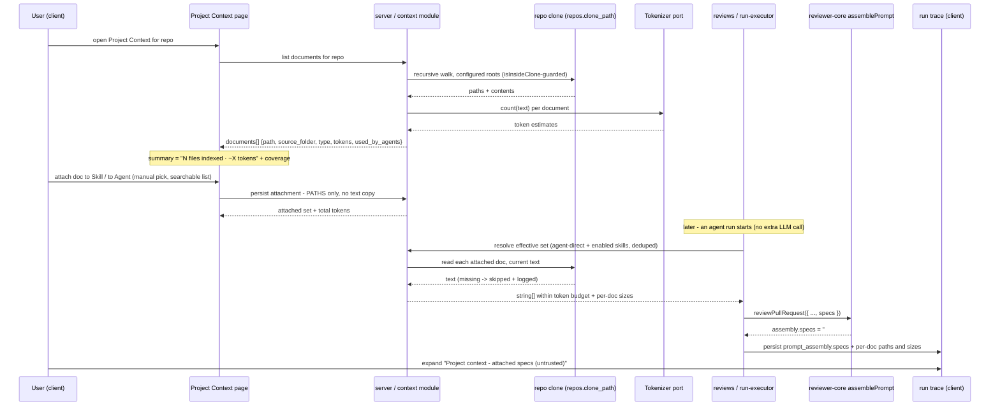
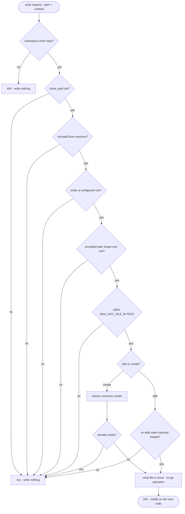

# Spec: Project Context
Spec ID: SPEC-01
Status: draft
Supersedes: —
Modules: server, client

## Problem & User

A DevDigest user (repo owner / reviewer author) keeps the knowledge that
explains their codebase — PRDs, specs, architecture notes, incident
write-ups — as Markdown files inside the repo. Today none of it reaches a
review. A review agent sees the diff, its system prompt, its linked skills,
repo-intel context and the derived intent, but never the project's own
written requirements, so it cannot tell whether a change contradicts the
documented contract.

Two things are missing, and only two:

1. There is no place in the product where those documents are visible as a
   set, and no way to say "this agent should read these".
2. Nothing populates the prompt slot that already exists for them.
   `reviewer-core/src/prompt.ts:68` declares `PromptParts.specs?: string[]`
   ("Project-context spec chunks (untrusted content)"), renders it at
   `prompt.ts:142-145,165` as a `## Project context` block of
   `wrapUntrusted`-delimited entries, and mirrors it into the run trace at
   `prompt.ts:203`. The run executor never passes it: the call at
   `server/src/modules/reviews/run-executor.ts:242-268` spreads `callers`,
   `repoMap`, `skills`, `prDescription`, `intent` — and no `specs`. The
   block therefore never appears in any real run.

This is the same gap `specs/skills-feature.md` §0 recorded for
`parts.skills` before that feature wired it (`run-executor.ts:228-237`
now does for skills exactly what this Spec asks for documents).

Secondary problem: the user cannot predict cost. A document's size is
invisible until it has already been paid for in a run.
`specs/skills-feature.md` §7 ("Cost/token budget") already flagged this as
a known gap for skill bodies and suggested "a soft UI warning (e.g. 'this
skill is N tokens')" — this Spec generalizes that to documents.

Third problem, added by amendment: the documents are read-only in the
product. A user who spots a wrong sentence in a spec, or who has no spec at
all yet, must leave the app to touch the filesystem — and the page that
knows exactly which documents exist and which are attached to nothing is
the natural place to fix both.

## Goals / Non-goals

### Goals

- One page per repo listing every Markdown document found recursively in
  that repo's local clone under the configured search roots (`specs/`,
  `docs/`, `insights/` by default), with a read-only preview.
- A per-document estimated token count, shown before attaching, plus a
  running total on the page itself ("N files indexed · ≈X tokens").
- Two independent attachment surfaces: documents attached to a **Skill**
  (inherited by every agent using that skill) and documents attached
  directly to an **Agent**. Attachment is **manual only** — the user picks
  the documents; nothing scores or selects them automatically (see
  Non-goals).
- The effective document set for a run is read at run time and injected as
  plain text into the existing `## Project context` prompt block.
- The exact injected text is inspectable per run in the trace's Prompt
  assembly panel, alongside the per-document paths and their sizes.
- A "Used by N agents" indicator per document — a plain count over the
  attachment records.
- A **coverage indicator** on the Project Context page: the share of
  discovered documents that are actually attached to at least one agent,
  derived from the same `used_by_agents` count and shown per the page's
  current filtered scope.
- **In-app editing** of a discovered document from the Preview panel, saved
  back to the file in the repo clone's working copy — the same file the
  discovery walk reads. No git operation is performed.
- **Manual creation** of a new `.md` document inside the repo clone, under
  one of the configured search roots, which then enters the product through
  the ordinary discovery walk like any other file.
- Demonstrable grounding: a review of a PR that violates a rule stated in
  an attached document produces a finding that points back at that
  document.

### Non-goals (this iteration)

- **Automatic, PR-content-based document selection.** Deliberately split
  off as a separate future feature, not an oversight. This iteration
  attaches exactly what the user ticked — no relevance scoring, no
  similarity search against the diff, no LLM-driven "which specs matter for
  this PR" step. A direct consequence, and a property worth preserving:
  assembling project context costs **zero extra LLM calls** — it is a
  filesystem read plus string assembly. A future selector feature would
  reintroduce that cost and must justify it on its own.
- **Chunk-level retrieval / embeddings / RAG.** Whole documents only. The
  `code_chunks` table (`server/src/db/schema/context.ts:31-47`) already
  declares `source: enum('code','docs','spec')` plus a pgvector `embedding`
  column, but nothing anywhere writes to it (grep: the identifier appears
  only in the schema file and the barrel `server/src/db/schema.ts:36,70`).
  Reusing it would force a chunking + embedding pipeline the stated
  requirements do not need, and embeddings are off by default anyway
  (`server/AGENTS.md`: `EMBEDDINGS_ENABLED=false` makes
  `Container.embedder()` throw before constructing a client).
- **The design's chunk counter.** Screenshot 1's "Indexed: 12 files ·
  1,240 chunks" keeps its file count but drops the chunk count entirely —
  there is no chunking pipeline and none is planned. The freed space
  carries the token total instead (see Goals, AC-6).
- **Any git operation on the clone.** Editing and creating write the
  working-tree file and stop there — no staging, no commit, no push, no
  branch change (AC-38). Committing stays the user's job in the repo, which
  is the original D-5 rationale scoped down rather than reversed. The
  durability consequence is real and recorded (E-19, D-7), not hand-waved.
- **A general file-upload / file-management endpoint.** The two new write
  paths accept a repo-relative `.md` path under a configured search root
  and text content — nothing else. No client-supplied absolute path, no
  arbitrary extension, no binary or multipart body, no writing outside the
  configured roots (AC-43, AC-45, AC-47).
- **In-app delete or rename of a document.** Only create and edit are in
  scope. Removing a document stays a repo operation, and an
  attached-then-deleted file keeps its existing E-2 behaviour.
- **Commit / discard actions for a dirty clone.** Blocking a resync on
  uncommitted changes (AC-50) tells the user what to do; it does not do it
  for them. Resolving the dirty state is a git operation in the user's own
  tooling, per the Non-goal above.
- **Editing or creating from the two Context tabs.** Those surfaces stay
  attach-only; their preview panel (AC-11) remains read-only. Authoring
  lives on the Project Context page (D-11).
- **Pre-push CLI / CI parity.** `mcp/src/cli.ts:191-198` calls the same
  `reviewPullRequest` engine but resolves its agent locally with
  `skills: []` hardcoded (`mcp/src/cli/agent.ts:27`) and has no DB. Project
  context in the pre-push CLI is deferred.
- **Cross-repo or workspace-global document libraries.** Documents belong
  to the repo clone they were found in (see Edge cases E-8).
- **Community/shared document catalogue**, mirroring
  `specs/skills-feature.md` §6's same deferral for skills.

## User stories

- As a repo owner, I open **Project Context** for my repo and see every
  `.md` document the project has, so I stop guessing what exists.
- As an agent author, I open a Skill's **Context** tab, search the document
  list, tick two specs, and every agent using that skill now reviews
  against them.
- As an agent author, I open one agent's **Context** tab and attach a
  security baseline to that agent alone, without touching its skills.
- As a cost-conscious user, I see the token estimate for a document — and
  for the set I am looking at — before I save, so I know what each run will
  cost.
- As a repo owner, I glance at the coverage indicator and see that most of
  my documents are attached to no agent at all, so I know the set is
  configured, not merely discovered.
- As a spec author, I spot a wrong sentence while previewing a spec, switch
  the panel to Edit, fix it and save — the file on disk changes, and I
  commit it myself in the repo.
- As a repo owner starting from nothing, I create `specs/api-rules.md` from
  the page, paste the rule in, and attach it, without leaving the app to
  touch the filesystem.
- As a reviewer reading a completed run, I open Prompt assembly, expand
  **Project context — attached specs (untrusted)**, and read the exact text
  the model saw, with each document's path and size listed.
- As an architect, I attach the document stating "the `api/` module must
  not import `db/` directly", and when someone opens a PR that does exactly
  that, the review tells me which document the violation contradicts.

## Acceptance criteria (EARS)

AC numbering is **append-only**: shipped code cites AC numbers in comments
(`project-context/service.ts`, `discover.ts`), so this amendment adds
AC-29–AC-53 and renumbers nothing.

### Discovery & listing

- **AC-1** WHEN a user opens the Project Context page for a repo, the
  system shall list every `.md` document found by a **recursive** walk of
  that repo's local clone under the configured search roots, each shown
  with its repo-relative path, its source-folder tag, and its document
  type. The roots are a server-side configuration value with the documented
  default `**/{specs,docs,insights}/**/*.md` — not hardcoded at the call
  site, and not a per-repo UI setting (see D-3). (verify: integration test
  against the documents-listing endpoint with a fixture clone containing a
  nested `docs/adr/0001-x.md`)
- **AC-2** The system shall display, for every listed document, an
  estimated token count derived from that document's full text. (verify:
  unit test with a stub `Tokenizer`)
- **AC-3** IF the repo has no local clone (`repos.clone_path` is null,
  `server/src/db/schema/repos.ts:16`), THEN the system shall render an
  explanatory empty state and shall not return an error. (verify:
  integration test with `clone_path` null — same degradation the intent
  service already applies at
  `server/src/modules/reviews/intent-service.ts:215-219`)
- **AC-4** WHEN a user selects a listed document, the system shall render
  its Markdown read-only in the preview panel. (verify: component test)
- **AC-5** WHEN a document's content on disk changes, the system shall
  reflect the new content and the recomputed token count on the next load
  of the page — no stale cached body is served as current. (verify:
  integration test, write file then re-request)
- **AC-6** The Project Context page shall show a running summary of the
  discovered set in the form "N files indexed · ≈X tokens", where X is the
  sum of the per-document estimates of AC-2. It shall not show a chunk
  count. (verify: component test with a stubbed listing response)
- **AC-7** WHEN a user selects or filters a subset of documents on the
  page, the summary of AC-6 shall reflect the currently relevant subset, so
  the user can see what that set would add to a run. (verify: component
  test)
- **AC-8** The system shall show, per listed document, the number of agents
  that would inject it — counting both direct agent attachments and
  attachments inherited through that agent's enabled skills. (verify:
  integration test with one direct and one inherited attachment)

### Attachment

- **AC-9** WHEN a user checks a document on a Skill's Context tab, the
  system shall persist that attachment against the skill and shall show the
  updated "N attached" count after reload. (verify: integration test
  against the skill-context endpoint)
- **AC-10** WHEN a user checks a document on an Agent's Context tab, the
  system shall persist that attachment against the agent, independently of
  any skill attachment. (verify: integration test — attach on agent, assert
  the agent's linked skills are unchanged)
- **AC-11** Both Context tabs shall present the selectable document list
  with the document's repo-relative path and type, a **search/filter box**
  over that list, and a per-document preview — so a repo with hundreds of
  documents stays usable on the attach surfaces, not only on the standalone
  Project Context page. (verify: component test — type a query, assert the
  list narrows and non-matching attached rows stay attached)
- **AC-12** The system shall display the total estimated token count of the
  currently attached set on both Context tabs.
- **AC-13** WHEN a user reorders attached documents, the system shall
  persist that order and shall inject them in that order at run time.
  (verify: integration test asserting order in the assembled prompt)
- **AC-14** WHERE a document is attached both to an enabled skill of an
  agent and directly to that agent, the system shall include it exactly
  once in that run's project-context block and count its tokens exactly
  once. (verify: integration test — attach the same document on both
  surfaces, assert one occurrence in the assembled prompt)
- **AC-15** WHERE a skill linked to an agent is disabled, the system shall
  not inject documents attached to that skill — matching the existing
  enabled-only rule for skill bodies at `run-executor.ts:228-229`
  ("linking ≠ trusting"). (verify: integration test, disabled skill →
  its documents absent from the prompt)
- **AC-16** IF an attach request names a document path that does not
  resolve inside the repo's clone directory, THEN the system shall reject
  the request with a 4xx and shall persist nothing. (verify: integration
  test with `../../etc/passwd`-style input against the `isInsideClone`
  guard, `server/src/modules/reviews/intent-inputs.ts:138`)

### Run-time injection

- **AC-17** WHEN an agent run starts, the system shall resolve that agent's
  effective document set from the stored **paths** — attachments persist
  path metadata, never a copy of the document text — and read each
  document's current text from the repo clone at that moment.
- **AC-18** The system shall pass that text as `PromptParts.specs`
  (`reviewer-core/src/prompt.ts:68`) so it renders in the existing
  `## Project context` block with each entry delimiter-wrapped by
  `wrapUntrusted` (`prompt.ts:142-145,165`) and covered by the system
  message's `INJECTION_GUARD` (`prompt.ts:16-28`). No new prompt section is
  introduced. (verify: unit test on the run executor's assembled
  `PromptParts`)
- **AC-19** Each injected entry shall carry its repo-relative path inside
  the untrusted block, so a finding can be traced back to the document that
  produced it and the trace reader can tell which text came from where.
  (verify: unit test on the assembled prompt string)
- **AC-20** IF a document cannot be read at run time (deleted, renamed,
  unreadable), THEN the system shall skip it, emit a run-log line naming
  its path, and complete the review normally — never fail the run. (verify:
  integration test; same best-effort contract as
  `buildCallersDigest`/`buildRepoMapDigest`/`buildOrLoadIntent`,
  `run-executor.ts:394-396,470-485`)
- **AC-21** IF the effective document set is empty, THEN the assembled
  prompt shall be byte-identical to a run of the same agent before this
  feature existed. (verify: unit test on `assemblePrompt` — the same
  byte-identical guarantee `prompt.ts:92-96` states for `intent`)
- **AC-22** IF the effective set's total estimated tokens exceed the
  configured project-context budget, THEN the system shall inject documents
  in their persisted order until the budget is reached, skip the remainder,
  and emit a run-log line naming each skipped path. (verify: integration
  test with a low budget)
- **AC-23** The system shall never execute a document's content, never
  render it as HTML, and never use it to construct a shell command or file
  path — it is prompt text only, on every path, regardless of source.
  (verify: manual — code review; same rule as `specs/skills-feature.md` §7
  "no execution, ever")

### Grounding

- **AC-24** WHERE the project-context eval case is run — a PR fixture that
  violates a rule stated in an attached document (reference case: a
  document stating "the `api/` module must not import `db/` directly", and
  a PR that adds exactly such an import) — the review is **expected** to
  produce at least one finding whose rationale references that document's
  repo-relative path. (verify: an `eval_cases` + `eval_runs` fixture,
  mirroring the two-run control experiment in `specs/skills-feature.md` §4;
  tables already exist at `server/src/db/schema/eval.ts:7,22`. Run the same
  fixture with the document detached as the control — the finding is
  expected to be absent or unreferenced there.)

  This is deliberately phrased as a measured eval expectation, not an
  unconditional "shall always cite its source": no prompt construction can
  guarantee a model's citation behaviour on every input, and an
  unfalsifiable "always" claim would be untestable. AC-19 is the
  deterministic half — the path is *present* in the prompt on every run,
  and that is independently verifiable.

### Run trace

- **AC-25** WHEN a user opens a completed run whose project-context set was
  non-empty, the system shall show a **Project context** block in the
  Prompt assembly panel containing exactly the text injected into that
  request, expandable and copyable. (verify: this already renders today
  from `prompt_assembly.specs != null` —
  `client/src/app/repos/[repoId]/pulls/[number]/_components/RunTraceDrawer/_components/TraceBody/TraceBody.tsx:82-84`,
  label `client/messages/en/runs.json:50` "Project context (dynamic)" — so
  the verification is an integration test that a real run now populates the
  field, plus a label change to match the design's "Project context —
  attached specs (untrusted)")
- **AC-26** The trace shall additionally list, per injected document, its
  repo-relative path **and that document's individual size** (tokens, or
  characters where only characters are recorded) — not only the aggregate
  size of the concatenated block that `assemblePrompt` already emits
  (`prompt.ts:188`, section `specs`, source `project-specs`). A reader must
  be able to tell which of five attached documents accounted for most of
  the cost. (verify: integration test asserting one entry per injected
  document with a non-null size)
- **AC-27** The Configuration panel shall present injected project-context
  document paths in a row distinct from the existing "Specs read" row
  (`TraceBody.tsx:36-51`, fed by `RunTrace.specs_read`), which continues to
  mean paths opened by intent classification only, per
  `docs/adr/0003-specs-read-reuse-for-intent.md`. (verify: integration test
  asserting the two lists are populated from different fields)
- **AC-28** WHILE a run failed or was cancelled, the trace shall not claim
  a project-context block — the failure-path trace hardcodes
  `specs: null` (`run-executor.ts:500`) and shall keep doing so unless the
  prompt was actually assembled. (verify: integration test on a failing
  run)

### Coverage

Derived entirely from the AC-1 listing response — `used_by_agents` already
exists on the contract
(`server/src/vendor/shared/contracts/platform.ts:261-263`, computed at
`project-context/service.ts:87`). No new endpoint, no new data source, no
new query, and no server cost.

- **AC-29** The Project Context page shall show a coverage indicator whose
  value is the count of listed documents with `used_by_agents > 0`, divided
  by the total count of listed documents, expressed as a percentage.
  Documents flagged `missing: true` (E-2) shall be excluded from **both**
  the numerator and the denominator (E-24). (verify: component test — a
  stubbed listing of 4 present documents, 3 with `used_by_agents > 0`,
  renders 75; a fifth `missing: true` document changes nothing)
- **AC-30** WHERE a document is attached only to a *disabled* skill, the
  coverage numerator shall not count it — the same enabled-only rule
  AC-15/E-7 apply to injection and to `used_by_agents`. (verify:
  integration test — a document attached solely to a disabled skill returns
  `used_by_agents: 0` and therefore contributes nothing to coverage)
- **AC-31** WHEN a user filters the document list, the coverage indicator
  shall recompute over the filtered subset, consistent with how the AC-6
  token summary already behaves under AC-7. (verify: component test — type
  a query, assert the indicator changes together with the summary)
- **AC-32** IF the current scope contains zero eligible documents, THEN the
  system shall render no coverage percentage rather than a zero, an error,
  or `NaN`. (verify: component test on the E-14 empty listing, and on a
  listing containing only `missing: true` rows)

### Document editing

- **AC-33** WHEN a user has a document open in the Preview panel, the
  system shall offer a Preview/Edit toggle (design screenshot 1), and
  selecting Edit shall populate the editor from a fresh read of the file,
  never from a cached body — the rule AC-5 states, already implemented at
  `service.ts:115-127`. (verify: component test)
- **AC-34** WHEN a user saves an edited document, the system shall
  overwrite the file at its resolved path inside `repos.clone_path` — the
  same file the AC-1 walk reads — and shall not persist a copy of the text
  in the database. (verify: integration test against a fixture clone —
  assert the file's bytes on disk changed and that no row holds the
  document text)
- **AC-35** IF a save request names a path that does not resolve inside the
  repo's clone via `isInsideClone` (`intent-inputs.ts:138`), THEN the
  system shall reject the request with a 4xx and shall write nothing.
  (verify: integration test with `../../etc/passwd`-style input, mirroring
  AC-16's test)
- **AC-36** IF a save request names a path that is not an existing `.md`
  file under one of the configured search roots
  (`AppConfig.projectContextRoots`, `server/src/platform/config.ts:80,100`),
  THEN the system shall reject the request with a 4xx and shall write
  nothing — resolving inside the clone is necessary but not sufficient
  (NFR A05, E-22). (verify: integration test — `package.json`, and a `.md`
  outside every configured root, one case each)
- **AC-37** IF the file's state on disk no longer matches the state the
  editor loaded, THEN the system shall reject the save with a 4xx and shall
  write nothing, so a concurrent change is never silently overwritten.
  (verify: integration test — load, mutate the file out of band, save,
  assert the rejection and that the out-of-band content survives)
- **AC-38** WHEN a document is saved, the system shall perform no git
  operation — no staging, no commit, no push, no branch or ref change.
  (verify: integration test — after a save, the fixture clone's
  `git status --porcelain` shows the file modified and `HEAD` is unchanged)
- **AC-39** IF a write fails (permissions, read-only mount, disk error),
  THEN the system shall return an error the UI surfaces and shall report no
  success — the best-effort, never-fail contract of AC-20 governs *run-time
  reads* only and shall not be extended to a user-initiated write. (verify:
  integration test against a non-writable fixture path)
- **AC-40** WHEN a save succeeds, the next load of the Project Context page
  shall show that document's new content and its recomputed token count
  (AC-5). (verify: integration test — save, then re-request the listing)

### Document creation

- **AC-41** WHEN a user invokes the new-document action with a
  repo-relative path under a configured search root and initial content
  (which may be empty), the system shall create that file inside the repo
  clone. (verify: integration test asserting the file exists on disk with
  the given content)
- **AC-42** WHEN a document has been created, it shall appear in the
  listing through the ordinary AC-1 discovery walk on the next page load —
  the system shall keep no separate "manually added" record and shall not
  inject the document into the listing by any path that bypasses the walk.
  (verify: integration test — create, then re-request the listing and
  assert the document is present with its `source_folder` set by the walk)
- **AC-43** IF a creation request names a path that does not resolve inside
  the clone (`isInsideClone`), that does not sit under one of the
  configured search roots, or whose extension is not `.md` (`DOC_EXT`,
  `project-context/constants.ts:10`), THEN the system shall reject the
  request with a 4xx and shall create nothing — one rejection case each, on
  the same 4xx-and-persist-nothing contract AC-16 states for attach
  requests. (verify: integration test, one case per condition)
- **AC-44** IF a file already exists at the requested path, THEN the system
  shall reject the request with a 4xx and shall leave the existing file
  untouched — creation shall never double as an overwrite, and the
  existence check shall be atomic with the write rather than a separate
  prior check (E-23). (verify: integration test — create the same path
  twice; assert the second call fails and the first call's content
  survives)
- **AC-45** The creation endpoint shall accept a repo-relative path and
  text content and nothing else — no absolute path, no path containing a
  traversal segment, no alternative extension, no binary or multipart body.
  (verify: integration test, one rejected shape per clause)
- **AC-46** WHERE the requested path names directories that do not yet
  exist under a configured root (e.g. `docs/adr/` in a repo without it),
  the system shall create them inside the clone only, each resolved segment
  still passing `isInsideClone`, and shall not create a directory the
  discovery walk excludes (`EXCLUDED_DIRS`,
  `server/src/modules/repo-intel/constants.ts:17-26`), which would make the
  new document invisible the moment it was created (E-21). (verify:
  integration test — a nested create succeeds; a path under `node_modules/`
  or `.git/` is rejected)
- **AC-47** The system shall validate the requested path's shape
  **server-side**, independently of any client-side constraint, and shall
  reject with a 4xx: a path whose extension is not `.md`; any segment
  outside the accepted character set; any `.` or `..` segment; any
  separator other than `/`; any absolute, drive-letter (`C:/`) or UNC
  (`\\?\`) form; and any path exceeding the configured depth and length
  caps (D-12). (verify: integration test, one rejected shape per clause,
  including the win32-specific drive-letter and backslash forms)

### Write-path guarantees (editing and creation)

- **AC-48** WHERE an edit or creation request addresses a repo that does
  not belong to the caller's workspace, the system shall respond 404 and
  shall write nothing — the same `getContext(...)`-first rule every
  existing Project Context route already follows
  (`project-context/routes.ts:19-21,33`). (verify: integration test — a
  repo of workspace A addressed by a caller in workspace B)
- **AC-49** IF the submitted content exceeds the per-document byte cap
  `MAX_DOC_FILE_BYTES` (`project-context/constants.ts:19`), THEN the system
  shall reject with a 4xx and shall write nothing — otherwise a saved
  document could exceed the size the discovery walk is willing to list
  (`discover.ts:105`) and would vanish from the page it was authored on.
  (verify: integration test just above the cap)

### Clone integrity

In-app writes land in a clone the system otherwise treats as a disposable
read-only mirror. `SimpleGitAdapter.sync()` advances it with
`reset --hard origin/<branch>` (`simple-git.ts:86`) and justifies that
in-comment (line 80) with *"safe here because we never commit to or run
code from the clone"* — the exact assumption editing breaks. Rather than
warn the user after the fact, the resync is blocked while the clone is
dirty.

- **AC-50** WHILE the repo clone has uncommitted changes, the system shall
  not advance its working tree — `sync()` shall check the clone's status
  (`git status --porcelain`, **including untracked files**, since a
  created document is untracked rather than modified) and shall refuse
  before `reset --hard` runs. (verify: integration test — edit a tracked
  file in a fixture clone, call resync, assert the working tree and `HEAD`
  are unchanged)
- **AC-51** IF a resync is refused because the clone is dirty, THEN the
  operation shall degrade rather than throw, and shall report a reason
  **distinguishable from a fetch/network failure** — the existing degraded
  envelope of `RepoIntelService.resyncRepo` already carries a free-text
  `reason` alongside `no_clone` and `sync_failed:<msg>`
  (`repo-intel/service.ts:143-161`), so a distinct dirty-clone reason needs
  no contract widening. (verify: integration test asserting the degraded
  status and the distinct reason, not a `sync_failed:` string)
- **AC-52** The refusal shall tell the user how to resolve it — commit or
  discard using their own git tooling — and shall name the affected paths,
  bounded to a readable count. This feature adds no commit or discard
  action (Non-goals). (verify: component test on the refusal state)
- **AC-53** WHERE the clone has no uncommitted changes, `sync()` shall
  behave exactly as it does today — same fetch, same `reset --hard`, same
  returned head, no additional network call. (verify: regression test on a
  clean fixture clone, asserting the pre-amendment return value)

## Edge cases

Each grounded in a real file, the design description, or an explicit
constraint above.

- **E-1 No clone.** `repos.clone_path` is nullable
  (`server/src/db/schema/repos.ts:16`). Listing degrades to empty (AC-3);
  a run whose repo has no clone injects nothing (AC-21 applies).
- **E-2 Attached document deleted or renamed in the repo.** The attachment
  row outlives the file — attachments store paths, not text (AC-17).
  Run-time skip + log line (AC-20); the Project Context page shows it as
  missing rather than silently dropping the attachment.
- **E-3 Oversized document.** The repo-intel walker already caps files at
  `MAX_FILE_SIZE` 400 KB and total files at `MAX_INDEXED_FILES` 5000
  (`server/src/modules/repo-intel/pipeline/walk.ts:1-70`), and the intent
  service caps spec text at `MAX_SPEC_FILE_CHARS` and file count at
  `MAX_SPEC_FILES` (`intent-service.ts:214,237`). This feature needs its
  own equivalents — a per-document cap and the budget of AC-22 — otherwise
  one 400 KB PRD silently dominates the prompt.
- **E-4 Empty or whitespace-only document.** Must not emit an empty
  `<untrusted>` entry; `assemblePrompt` only omits the whole section when
  the array is empty (`prompt.ts:142-145`), not per-entry.
- **E-5 Non-UTF8 / binary file with a `.md` extension.** Read must not
  throw the run; skip like E-2.
- **E-6 Same document attached via two different skills of one agent.**
  Dedupe (AC-14), otherwise the text is paid for twice.
- **E-7 Document attached to a skill that is later disabled.** No
  injection (AC-15) — but the token totals shown on the Agent Context tab
  (AC-12), the "Used by N agents" count (AC-8) and the coverage indicator
  (AC-30) must apply the same enabled-only rule, or the displayed cost,
  usage and coverage all lie.
- **E-8 Repo-scoped documents vs. workspace-scoped attachment surfaces.**
  `agents` and `skills` are `workspaceId`-scoped
  (`server/src/db/schema/agents.ts:10-12`,
  `server/src/db/schema/skills.ts:7-9`), while documents live in one repo's
  clone (`repos.workspace_id` → many repos per workspace). An agent
  attached to `payments-api/specs/public-api.md` may be run on a *different*
  repo of the same workspace. Behaviour must be defined: skip silently,
  skip with a run-log line, or refuse the attachment. Proposal:
  attachments record `repo_id`; at run time only documents whose `repo_id`
  matches the PR's repo are injected, and any skipped mismatch is logged.
- **E-9 `.gitignore` is not honored.** `walk.ts:14-19` documents this
  explicitly as "NOT YET HANDLED". A gitignored local `notes.md` would be
  listed and attachable, and its content would ship to the LLM provider.
- **E-10 Path traversal / symlink escape.** Both the recursive listing walk
  and every attach request must resolve through the existing
  `isInsideClone` guard (`intent-inputs.ts:138`); a symlink inside the
  clone pointing at `~/.devdigest/secrets.json` is the concrete attack
  (AC-16). Recursion makes this sharper, not softer.
- **E-11 Token count staleness.** The count shown at attach time — and the
  page-level total of AC-6 — is computed from the files as they were then;
  they may change before the run. The per-document sizes recorded in the
  trace (AC-26) are the authoritative after-the-fact numbers, and the UI
  must not present the pre-run estimate as exact.
- **E-12 Design/implementation label mismatch.** The design's "SERIALIZES
  AS" box (screenshot 2) shows `## Project specifications`, while the
  actual assembled header is `## Project context` (`prompt.ts:165`) — which
  the Agent Context tab's own footnote in screenshot 3 states correctly.
  The preview must show what is really emitted, not a third spelling.
- **E-13 Nav item lives in a do-not-touch file.** The sidebar registry is
  `client/src/vendor/ui/nav.ts:21-42`, and `client/AGENTS.md` lists
  `src/vendor/ui/**` under Do-not-touch (hand-mirrored, no sync script).
  Adding a "Project Context" nav item — repo-scoped, so `:repoId`-templated
  like `/repos/:repoId/conventions` at `nav.ts:36-38` — has to go through
  that manual-mirror convention deliberately, not casually.
- **E-14 Empty discovery set.** A repo with a clone but no `.md` file under
  any configured search root must render the AC-6 summary as zero files /
  zero tokens, not a broken or absent summary.
- **E-15 Deep or wide document trees.** Recursive discovery (AC-1) means a
  repo whose `docs/` holds hundreds of nested files is a normal case, not
  an outlier: it drives the walk bound (E-3), the Context-tab search box
  (AC-11), and the page-level total's performance constraint (NFR
  Performance).
- **E-16 A configured search root that does not exist in a given repo.**
  Not every repo has all three of `specs/`, `docs/`, `insights/`. A missing
  root contributes nothing and must not error or warn.
- **E-17 Concurrent edit / stale write.** The editor loads a snapshot; the
  file may change on disk — another user, a developer's `git pull`, a
  resync — before Save. AC-37 defines the outcome explicitly instead of
  letting last-write-wins happen by omission.
- **E-18 Editing a document that has gone missing.** A `missing: true` row
  (E-2, `service.ts:95-106`) has no file on disk. Editing it is rejected by
  AC-36; the user recreates it through the creation action (AC-41), which
  keeps the create/edit distinction — and its 4xx surface — unambiguous.
- **E-19 The clone is a disposable mirror, and writing to it breaks a
  stated invariant.** `SimpleGitAdapter.sync()` runs
  `reset --hard origin/<branch>` (`simple-git.ts:86`) and justifies it
  in-comment (line 80) with *"safe here because we never commit to or run
  code from the clone"* — precisely the assumption in-app editing violates.
  The precise blast radius, which matters for the mechanism:
  - **Edited existing documents are tracked files**, so `reset --hard`
    discards the edit outright. This is the real loss.
  - **Created documents are untracked**, so `reset --hard` normally leaves
    them alone — they are at risk only when upstream introduces a file at
    the same path. Nothing in the codebase calls `git clean`.
  - **`clone()` is not the hazard.** On an already-cloned repo it takes the
    fetch-only branch (`simple-git.ts:57-61`); its `rm -rf`
    (`simple-git.ts:64`) fires only for a partial directory with no
    `.git`, which cannot hold in-app edits.
  - **Gitignored documents are invisible to the check.** E-9 lets a
    gitignored `.md` be listed and edited, but `git status --porcelain`
    omits ignored files, so such an edit neither blocks a resync nor is
    destroyed by one. Benign, but it means "clean" does not mean "no
    in-app edits exist".
  Policy: block the resync while the clone is dirty rather than warn after
  the fact (AC-50–AC-53, D-7).
- **E-20 Read-only or permission-denied clone.** A write that cannot land
  must fail loudly (AC-39), unlike the run-time read path's silent skip
  (AC-20). The two paths have deliberately opposite failure contracts.
- **E-21 Creation under an excluded directory.** `EXCLUDED_DIRS`
  (`repo-intel/constants.ts:17-26`, including `.git`, `node_modules`,
  `vendor`) is skipped by the walk (`discover.ts:91`). A file created under
  such a directory inside a configured root would be written and then be
  invisible — rejected instead (AC-46).
- **E-22 A `.git`-adjacent write is the sharpest attack, not `../`.**
  `isInsideClone` alone permits `.git/hooks/pre-commit`, and the server
  runs git against this very clone (`simple-git.ts:59,68,85-86`), so a
  written hook would execute under the API process. The root-containment
  and `.md` constraints (AC-36, AC-43) are what actually close this — the
  traversal guard alone does not.
- **E-23 Case-insensitive filesystem collision on create.** The development
  environment is win32, where `docs/A.md` and `docs/a.md` are the same
  file. A stat-then-write existence check is both wrong there and a TOCTOU
  race; AC-44 requires the existence check to be atomic with the write.
- **E-24 Coverage denominator and missing documents.** `listDocuments`
  appends attached-but-absent paths to `documents` and counts them in
  `total_files` (`service.ts:95-108`). Such a row necessarily has
  `used_by_agents > 0`, so counting it would inflate coverage with files
  that no longer exist. They are excluded from both numerator and
  denominator (AC-29) — a listing of only `missing: true` rows therefore
  shows no percentage at all (AC-32), not 100%.
- **E-25 Coverage with zero agents.** A repo full of documents and no
  attachments is 0%, a legitimate and informative value — not an error and
  not a hidden indicator. Contrast E-14/AC-32, where the *denominator* is
  zero.
- **E-26 An edit changes cost for every inheriting agent at once.**
  Document text is read fresh at run time (AC-17), so editing a document
  attached via a skill changes the prompt — and the token bill — of every
  agent using that skill, with no review step in between. The token
  counters (AC-2, AC-12) are the only feedback loop.

## Non-functional requirements

Checked against the `security` skill (OWASP Top 10:2025), re-run for the
two new write paths; non-security categories covered where the feature
actually implicates them.

**Security**

- **A05 Injection / prompt injection.** Document text is untrusted data.
  It is already defended structurally: `wrapUntrusted` escapes any embedded
  `</untrusted>` (`prompt.ts:30-34`) and `INJECTION_GUARD`
  (`prompt.ts:16-28`) is appended to every system prompt on every review
  path. This feature must route document text through `PromptParts.specs`
  and nothing else — no bespoke string concatenation into the user message
  (AC-18). In-app editing changes nothing here: an edited document is the
  same untrusted text on the same path.
- **A05 XSS.** Preview rendering — on the Project Context page and on both
  Context tabs (AC-11) — must go through the single centralized
  `react-markdown` instance (`client/src/vendor/ui/primitives/Markdown.tsx`
  per `client/AGENTS.md`); no `dangerouslySetInnerHTML`, no second
  renderer. The Edit mode is a plain-text editor, not a rich renderer, and
  switching back to Preview re-enters the same centralized path.
- **A05 Command/path injection & A08.** Every document path arriving from
  the client is attacker-controllable input. Resolve via `isInsideClone`
  before any `readFile`, never `path.join(clonePath, req.body.path)`
  directly (AC-16, E-10).
  **The two new write paths need strictly more than this.** `isInsideClone`
  is a containment check, not an authorization check: `.git/hooks/pre-commit`
  and `package.json` both resolve inside the clone, and the server runs git
  against that clone (`simple-git.ts:59,68,85-86`), so a written hook would
  execute under the API process (E-22). Every write must therefore clear
  four gates, in order — inside the clone, under a configured search root,
  `.md` extension, accepted path shape — before touching disk (AC-35,
  AC-36, AC-43, AC-47).
- **A08 Integrity / mass assignment.** Both write bodies are zod-validated
  route schemas per `server/AGENTS.md` (invalid input 422s before the
  handler runs) and are destructured to exactly `{ path, content }` plus
  the AC-37 staleness token — never spread into a filesystem call or a
  repository write.
- **A01 Broken access control / tenant isolation.** Every read and write of
  a document attachment must be workspace-scoped at the repository layer
  with an explicit `workspaceId` parameter — the rule
  `specs/skills-feature.md` §7 states for skills, and the pattern the
  existing routes follow via `getContext(app.container, req)`
  (`server/src/modules/agents/routes.ts:145-149`,
  `project-context/routes.ts:19-21,33`). Attaching a document of repo A to
  an agent of workspace B must 404, not succeed — and so must editing or
  creating a document in repo A from workspace B (AC-48).
- **A04 / secrets exposure.** A repo's `.md` files can contain credentials,
  customer names, or internal URLs, and attaching one ships it to a
  third-party LLM provider. `AGENTS.md` states secrets never live in git —
  but this feature makes any accidental leak into the repo an outbound
  transfer. Recursive discovery widens the surface (E-15), and creation
  widens it again by making it trivial to place arbitrary text inside a
  configured root. The outbound-data notice (UX-7, rendered today at
  `ProjectContextView.tsx:136`) must therefore be visible on the authoring
  surface too, not only at the attach surfaces.
- **A06 / DoS.** Per-document size cap and total token budget (AC-22, E-3);
  a bounded recursive walk (E-15). Note `bodyLimit` is hardcoded to 1 MB
  (`server/AGENTS.md`), which bounds request bodies but not what the walk
  can read off disk. On the write paths, content is additionally capped at
  `MAX_DOC_FILE_BYTES` (AC-49) and the created path's depth and length are
  bounded (AC-47, D-12) so one request cannot force an unbounded `mkdir`
  chain.
- **A09 Logging.** Log paths and sizes, never contents. This is already the
  established rule in two places: `RunTrace.specs_read` is "paths only,
  never contents" (`run-executor.ts:120-122`, ADR 0003) and the
  prompt-assembly log is "section name/source/char count … NEVER content"
  (`run-executor.ts:271-275`). The per-document trace entries of AC-26 are
  path + size only, consistent with both, and a write logs the
  repo-relative path, the byte count and the outcome — never the submitted
  text.
- **A10 Fail-closed writes.** A failed write returns an error and reports
  no success (AC-39). Extending AC-20's best-effort degradation to a
  user-initiated write would silently lose the user's text — the two are
  deliberately opposite contracts.

**Cost.** Every attached document is paid for on every run of every agent
that inherits it. The token counters (AC-2, AC-6, AC-12) are the
mitigation, the per-document trace sizes (AC-26) are the post-hoc
attribution, and the budget (AC-22) is the hard stop. This is the concrete
answer to the gap `specs/skills-feature.md` §7 left open. Note the feature
adds **no LLM calls of its own** (see Non-goals) — the only cost is prompt
size. Editing keeps that property: it changes the text, not the number of
calls (E-26).

**Performance.** Listing recursively walks a clone directory; it must be
bounded like `walk.ts` is, and computing the page-level total (AC-6) must
not require tokenizing every discovered document synchronously on every
page load when the document count is large (E-15). Token counting uses the
existing DI `Tokenizer` port (`server/src/adapters/tokenizer/index.ts`) —
`js-tiktoken` `cl100k_base` with a `ceil(chars/4)` fallback that never
throws. Coverage (AC-29) adds no server cost at all: it is a client-side
reduction over the listing response the page already holds, exactly like
`sumTokens` (`ProjectContextView/helpers.ts`). The dirty-clone check
(AC-50) adds one `git status --porcelain` per resync, which is negligible
beside the fetch it precedes. No concrete latency target has been agreed
(see Open questions Q7).

**Availability / degradation.** Project-context resolution is best-effort
and must never fail a review run (AC-20), matching the contract already
documented for callers/repo-map/intent at `run-executor.ts:394-396` and
`470-485`. No review run depends on the editing or creation paths, so their
failures are ordinary synchronous 4xx/5xx responses (AC-39) and do not
participate in that contract. A blocked resync degrades rather than throws
(AC-51), reusing `resyncRepo`'s existing degraded envelope. **Durability is
explicitly not offered**: an uncommitted file lives in a clone the system
resets (E-19), which is exactly why AC-50 blocks the reset instead of
warning about it.

**Observability.** Already partly structural: the per-run injected text is
visible in the trace (AC-25), and `assemblePrompt` already emits a
`{ section: 'specs', source: 'project-specs', chars }` entry
(`prompt.ts:188`) for the size log. This Spec adds per-document
attribution (AC-26) and run-log lines for skipped and budget-truncated
documents (AC-20, AC-22) — otherwise a silently dropped spec is
indistinguishable from one that was never attached. A refused resync must
be observable as its own reason, not folded into `sync_failed:` (AC-51),
or a dirty clone looks like a network problem.

**Maintainability / configuration.** New server code follows the module
conventions in `server/AGENTS.md` (routes → service → port ← adapter;
zod-validated route schemas; no new module folder outside
`server/src/modules/`). The search-root configuration of AC-1 is a fresh
key this feature introduces; the two existing precedents to follow are a
module-level constants file
(`server/src/modules/repo-intel/constants.ts:14-26`, where `SUPPORTED_EXT`
and `EXCLUDED_DIRS` live) and the env-backed `AppConfig`
(`server/src/platform/config.ts:15-36`, e.g. `DEVDIGEST_CLONE_DIR`).
The path-shape caps of AC-47 are engineering caps, so they belong beside
`MAX_DOC_FILE_BYTES` in `project-context/constants.ts`, whose own docblock
(lines 1-7) already states that split. Contracts added to
`@devdigest/shared` must be hand-mirrored into both
`server/src/vendor/shared` and `client/src/vendor/shared` — no sync script
exists (root `AGENTS.md`).

## Module interaction / API contracts

Two modules are touched: **server** (recursive discovery, attachment
persistence, token counting, run-time resolution, the two write paths and
the dirty-clone guard) and **client** (Project Context page with editing,
creation and coverage, two Context tabs, trace labels and per-document
rows). **reviewer-core is not modified** — its `specs` slot already does
everything required (`prompt.ts:68,142-145,165,188,203`).

**Reader (server side).** A recursive walk of the repo clone collects `.md`
files under the configured search roots — default glob
`**/{specs,docs,insights}/**/*.md`, a configuration value rather than a
literal at the call site (AC-1, NFR Maintainability/configuration). Every
resolved path passes the `isInsideClone` guard before any read (AC-16), the
walk is bounded (E-3, E-15), and a configured root absent from a given repo
contributes nothing (E-16). The reader returns metadata — path, source
folder, type, size — and document text is read on demand for preview and at
run time; **only paths are persisted** as attachments (AC-17).

**Writer (server side).** Two new write contracts on the repo-scoped
surface, both inside the existing `project-context` module and both passing
the same ordered guard chain before any filesystem call:

- A **document save** contract: repo-relative `path`, new text `content`,
  and the staleness token of AC-37 → the updated document metadata.
  Confined to an existing `.md` under a configured root (AC-36).
- A **document creation** contract: repo-relative `path` and initial text
  `content` → the created document's metadata. Same confinement, plus
  must-not-exist enforced atomically with the write (AC-44).

**Clone integrity (server side).** `GitClient.sync`
(`server/src/vendor/shared/adapters.ts:214`) gains a precondition rather
than a new method: it inspects the clone's status before `reset --hard` and
refuses while the working tree is dirty (AC-50). Its only caller,
`RepoIntelService.resyncRepo` (`repo-intel/service.ts:143-161`), already
wraps the call in try/catch and returns a degraded `IndexResult` carrying a
free-text `reason` — so the refusal surfaces through the existing envelope
with a distinct reason value and **no contract widening** (AC-51). The
mock (`server/src/adapters/mocks.ts:250,269`) must be able to represent a
dirty clone so the refusal is testable without a real git fixture.

**Contracts this Spec requires** (shapes, not implementations):

- A **document listing** contract per repo: repo-relative `path`, source
  folder tag, document `type`, estimated `tokens`, a `used_by_agents`
  count, and a `missing` indicator for an attached-but-absent file.
- A **skill context** contract: read the attached set for a skill, and
  replace it (an ordered list of document **path** references), mirroring
  the existing `GET/POST /agents/:id/skills` set-or-link shape
  (`server/src/modules/agents/routes.ts:145-165`).
- An **agent context** contract with the same shape, on the agent.
- The **effective set** for a run: agent-direct attachments unioned with
  attachments of the agent's *enabled* linked skills, deduplicated per
  document, ordered, budget-truncated (AC-13, AC-14, AC-15, AC-22).
- A **per-run project-context record**: one entry per injected document
  with its path and individual size, surfaced in the trace (AC-26) and
  distinct from the concatenated `prompt_assembly.specs` string.
- The two **write** contracts above. New contracts added to
  `@devdigest/shared` must be hand-mirrored into both
  `server/src/vendor/shared/contracts/platform.ts` — where
  `ContextDocument`, `ContextListing`, `ContextAttachmentSet` and
  `SetContextBody` already live (lines 249-312) — and the client copy; no
  sync script exists (root `AGENTS.md`).
- **No contract for coverage.** `ContextDocument.used_by_agents`
  (`platform.ts:261-263`) is already the numerator's only input (D-10).
- **Unchanged**: `PromptParts.specs` and `PromptAssembly.specs`
  (`server/src/vendor/shared/contracts/trace.ts`, mirrored to
  `client/src/vendor/shared/contracts/trace.ts`). No contract widening on
  the reviewer-core side, and AC-17–AC-23 are untouched by this
  amendment — it is discovery, attachment and authoring only.
- **Unchanged in meaning**: `RunTrace.specs_read` keeps its ADR-0003
  definition (paths opened by intent classification this run, populated
  only when `reused === false`, `run-executor.ts:120-125`). The injected
  project-context paths are a separate field surfaced in a separate row
  (AC-27) — ADR 0003's Consequences section explicitly anticipated this
  feature and warned against conflating the two.

Storage shape is deliberately left to the Development Plan, but the Spec
records two constraints: the backing store must key an attachment to
`(surface = skill | agent, surface_id, repo_id, path)` so E-8 is
representable, and it must store paths rather than document text (AC-17).
It must not require chunking or embeddings (Non-goals). `code_chunks` is
not a fit as designed; the `skills`/`agent_skills` shape
(`server/src/db/schema/skills.ts`, `agents.ts:51-63`) is the closer
precedent. Editing and creation add **no** storage: they write files, and
the walk finds them (AC-34, AC-42).

## UX improvements

From the fourth step of the design read, over the four screenshots:

1. **Say where the text goes, in one consistent spelling.** Screenshot 2's
   "SERIALIZES AS" box says `## Project specifications`; screenshot 3 says
   `## Project context`; the code emits `## Project context`
   (`prompt.ts:165`). Pick the code's spelling everywhere (E-12).
2. **Replace the chunk count with a token total.** "Indexed: 12 files ·
   1,240 chunks" describes a pipeline that does not exist. "N files
   indexed · ≈X tokens" answers the question the user actually has —
   what would this cost — using the same estimate machinery as the two
   Context tabs (AC-6, AC-7).
3. **The attach lists need search, not just scrolling.** Screenshots 2 and
   3 show a flat 7-row list; recursive discovery over three root folders
   makes hundreds of rows the realistic case (E-15). A search/filter box
   plus the visible path and type belongs on both Context tabs, not only on
   the standalone page (AC-11).
4. **Show inherited vs. direct attachments on the Agent Context tab.**
   Screenshot 3 shows "2 of 7 attached" with no visual distinction between
   documents the agent inherits from its skills and documents attached
   directly — yet screenshot 2 promises "Any agent using this skill
   inherits these documents." Without that distinction the user cannot
   understand the token total or predict what unchecking will do.
5. **Reflect the enabled-only rule in the token total, in "Used by N
   agents" and in coverage.** Documents from a disabled skill do not reach
   the prompt (AC-15); counting them would overstate cost, usage and
   coverage alike (E-7, AC-30).
6. **Label the token numbers as estimates.** They are `cl100k_base`
   estimates with a `chars/4` fallback (`tokenizer/index.ts`), computed
   against files as they were at page load (E-11). "≈ 317 tokens" is
   honest; "= 317 tokens" is not.
7. **State the outbound-data consequence at the attach surface**, not in a
   settings page: attaching a document sends it to the model provider on
   every run of every agent that inherits it (NFR A04). With creation in
   scope, the same notice belongs on the authoring surface.
8. **Empty and missing states are absent from the design.** No screenshot
   shows a repo with no clone (E-1), a repo with zero `.md` files (E-14),
   or an attached-then-deleted document (E-2). All three are reachable on
   day one.
9. **Per-document attribution in the trace.** Screenshot 4's Prompt
   assembly shows one collapsed "Project context — attached specs" block.
   Reading it tells the user *what* was injected but not *which document
   cost what*; the per-document path + size list (AC-26) is what makes the
   token total actionable, and it reuses the existing Configuration-panel
   row pattern (`TraceBody.tsx:36-51`) rather than inventing a viewer.
10. **Preview parity in the trace.** The design's per-block copy/expand
    affordances in Prompt assembly already exist as `PromptBlock`
    (`TraceBody.tsx:74-93`); the new block should reuse it rather than
    introduce a second viewer, consistent with the existing skills/memory/
    repo-map blocks.
11. **Nav placement.** The design puts "Project Context" as a top-level nav
    item, but its content is per-repo (like Conventions,
    `nav.ts:36-38`). Placing it under a repo-scoped route with a
    `:repoId`-templated href keeps it consistent with the existing shell and
    with the repo switcher (E-13).
12. **The coverage number must carry its own definition.** A bare "78" says
    nothing. Show it as "N of M documents attached to at least one agent",
    and keep the enabled-only caveat consistent with UX-5 — a document
    reachable only through a disabled skill reads as uncovered (AC-30).
13. **Preview/Edit is a mode toggle, so it needs mode affordances the
    design does not show**: a dirty-state indicator, an explicit Save, and a
    guard when switching document or leaving with unsaved text. Screenshot 1
    shows the toggle and nothing else.
14. **Say plainly that Save writes a file and does not commit it.** The user
    will otherwise assume the edit is versioned. It is not — it lands in the
    working copy of a clone the system resets (E-19). One sentence at the
    save affordance is the difference between a predictable tool and a
    surprise.
15. **A blocked resync must read as an instruction, not a failure.** When
    AC-50 refuses, the message names the dirty paths and says what to do —
    commit or discard in the user's own git tooling — because this feature
    offers neither action (Non-goals). Rendering it as a generic
    "re-analyze failed" would send the user hunting a network problem.
16. **Constrain the new-document path instead of validating it after the
    fact.** A root picker over the configured roots, plus a relative-path
    field, plus an appended `.md` suffix (D-12) makes most of AC-43/AC-47's
    rejections unreachable, rather than teaching the user the rules through
    4xx responses.
17. **Coverage and the token summary share one scope.** Both follow the
    active filter (AC-7, AC-31); showing one filtered and one global in the
    same header would be actively misleading.

## Inputs and provenance

| Section | Grounded in |
|---|---|
| Problem & User | `reviewer-core/src/prompt.ts:68,142-145,165,203`; `server/src/modules/reviews/run-executor.ts:242-268`; `specs/skills-feature.md` §0, §7 |
| Goals / Non-goals | User's stated requirements (initial five + the detailed requirements text relayed 2026-08-12) and user answers on folder scope, counters and editing; the three product-owner decisions relayed 2026-08-13 (coverage, in-app editing, manual creation) and the Q11–Q15 answers of the same date; `server/src/db/schema/context.ts:31-47` (no writer — grep shows the identifier only in the schema and `server/src/db/schema.ts:36,70`); `server/AGENTS.md` (`EMBEDDINGS_ENABLED=false`); `server/src/adapters/git/simple-git.ts:64,80,86`; `mcp/src/cli.ts:191-198`, `mcp/src/cli/agent.ts:27` |
| User stories | Design screenshots 1-4 (described in-session) + user's stated requirements, incl. the `api/`-must-not-import-`db/` verification scenario; product-owner decisions 2026-08-13 for the coverage, editing and creation stories |
| Acceptance criteria | `prompt.ts:16-28,68,92-96,142-145,165,188,203`; `run-executor.ts:120-125,228-237,242-268,394-396,500`; `TraceBody.tsx:36-51,82-84`; `client/messages/en/runs.json:35,50`; `server/src/db/schema/repos.ts:16`; `intent-service.ts:215-219`; `intent-inputs.ts:138`; `server/src/adapters/tokenizer/index.ts`; `server/src/db/schema/eval.ts:7,22`; `specs/skills-feature.md` §4; design screenshots 1-4; user answers to Q1/Q2/Q3/Q6 and the detailed requirements text (2026-08-12). Added by amendment: `project-context/service.ts:87,95-108,115-127`; `project-context/constants.ts:10,19`; `project-context/discover.ts:91,105`; `project-context/routes.ts:19-21,33`; `platform/config.ts:80,100`; `server/src/vendor/shared/contracts/platform.ts:249-312`; `repo-intel/constants.ts:17-26`; `repo-intel/service.ts:143-161`; `simple-git.ts:57-64,77-88`; product-owner decisions and Q11–Q15 answers (2026-08-13) |
| Edge cases | `repos.ts:16`; `walk.ts:1-70` (caps, `.gitignore` gap); `intent-service.ts:214-240`; `intent-inputs.ts:138`; `agents.ts:10-12,51-63`; `skills.ts:7-9`; `prompt.ts:142-145,165,188`; `client/src/vendor/ui/nav.ts:21-42` + `client/AGENTS.md` Do-not-touch; design screenshots 2-3; the recursive-discovery requirement (user text, 2026-08-12). Added by amendment: `simple-git.ts:57-64,80,85-86` (git `reset --hard` semantics — tracked files discarded, untracked files retained; no `git clean` call exists anywhere in `server/src`); `discover.ts:91,105`; `service.ts:95-108`; `repo-intel/constants.ts:17-26`; the win32 development environment |
| Non-functional requirements | `security` skill (OWASP Top 10:2025), re-run for the two new write paths (A01/A04/A05/A06/A08/A09/A10) + `prompt.ts:16-34`; `run-executor.ts:120-122,271-275,394-396`; `server/src/modules/agents/routes.ts:145-149`; `project-context/routes.ts:19-21,33`; `server/AGENTS.md` (bodyLimit, DI, route zod); `server/src/modules/repo-intel/constants.ts:14-26` and `server/src/platform/config.ts:15-36` (the two config precedents); `project-context/constants.ts:1-7,19`; `simple-git.ts:59,68,85-86` (the git-hook execution path behind E-22); `client/AGENTS.md` (Markdown centralization, vendor do-not-touch); `ProjectContextView.tsx:136`; `ProjectContextView/helpers.ts`; `specs/skills-feature.md` §7; root `AGENTS.md` (vendored-contract mirroring, secrets) |
| Module interaction / API contracts | `prompt.ts:68,142-145,165,188,203`; `server/src/vendor/shared/contracts/trace.ts` (`PromptAssembly.specs`, `RunTrace.specs_read` docblock); `server/src/vendor/shared/contracts/platform.ts:249-312`; `server/src/vendor/shared/adapters.ts:205-215`; `server/src/modules/agents/routes.ts:145-165`; `project-context/routes.ts:19-21`; `repo-intel/service.ts:143-161`; `server/src/adapters/mocks.ts:250,269`; `server/src/db/schema/skills.ts`, `agents.ts:51-63`; `docs/adr/0003-specs-read-reuse-for-intent.md`; `mermaid-diagram` skill for the write-path guard chain; user answers to Q1/Q2 + the reader/metadata-only requirements (2026-08-12) |
| UX improvements | Design screenshots 1-4, incl. screenshot 1's Preview/Edit toggle; `prompt.ts:165`; `tokenizer/index.ts`; `TraceBody.tsx:36-51,74-93`; `client/src/vendor/ui/nav.ts:21-42`; `ProjectContextView.tsx:136`; `simple-git.ts:86` (the basis for UX-14 and UX-15); user answer on counters and the search/preview requirement (2026-08-12) |
| Decisions recorded (below) | Direct user answers relayed 2026-08-12 (D-1 to D-6, except D-5) and 2026-08-13 (D-7 to D-11); D-5 and D-12 decided by the requesting agent — D-5 on this repo's `specs`-are-human-edited convention, D-12 on the path-shape conventions of `isInsideClone` (`intent-inputs.ts:138-142`), `DOC_EXT` (`project-context/constants.ts:10`) and the win32 environment |

## Untrusted inputs

| Input | Source | Trust boundary |
|---|---|---|
| Document body (`.md` from the repo clone) | Repo contents — PR-author-influenceable | Untrusted. Enters the prompt only via `PromptParts.specs` → `wrapUntrusted` (`prompt.ts:142-145`), covered by `INJECTION_GUARD` (`prompt.ts:16-28`). Never executed, never HTML-rendered, never used to build a path or command (AC-23). |
| Document path in an attach/preview request | Client request body/params | Untrusted. Must resolve through `isInsideClone` (`intent-inputs.ts:138`) before any filesystem read; reject on escape (AC-16, E-10). |
| Document save body (`path` + `content` + staleness token) | Client request body | Untrusted. `path` clears four gates in order before any write — `isInsideClone` (`intent-inputs.ts:138`), under a configured search root, `.md` extension, accepted path shape (AC-35, AC-36, AC-47) — because containment alone still permits `.git/hooks/*` in a clone the server runs git against (E-22). `content` is text only, capped at `MAX_DOC_FILE_BYTES` (AC-49), never executed, never used to build a path or command, and never logged (NFR A09). Rejected wholesale when the on-disk state moved (AC-37). |
| New-document body (`path` + `content`) | Client request body | Untrusted. Same four gates, plus must-not-exist enforced atomically with the write (AC-44, E-23) and directory creation bounded and excluded-dir-rejecting (AC-46). Explicitly not a file-upload surface: no absolute path, no traversal segment, no non-`.md` extension, no binary or multipart body, no drive-letter or UNC form (AC-45, AC-47). |
| `repoId` / `skillId` / `agentId` route params | Client | Untrusted. Workspace-scoped authorization on every read and write (NFR A01, AC-48); zod-validated route schemas, per `server/AGENTS.md`. |
| Search/filter query on the Context tabs | Client | Untrusted. Treated as a plain-text match over already-authorized listing results — never interpolated into a filesystem glob or a raw SQL fragment (AC-11). |
| Filesystem entries during the recursive walk | Local disk, incl. symlinks | Untrusted. Bounded walk (count, size, extension) and symlink escape rejection; gitignored files are currently visible to the walk (E-9). |
| Working-tree status read before a resync | Local disk / git | Untrusted for parsing. `git status --porcelain` output is machine-readable but reflects attacker-influenceable filenames; treat listed paths as display text only, never as input to a further filesystem or shell operation (AC-52). |
| Document body rendered in any preview panel | Repo contents | Untrusted for rendering. Centralized `react-markdown` only; no raw HTML (NFR A05). |
| Injected text shown in the trace's Prompt assembly | Already-untrusted document text | Untrusted. Rendered as plain text in `PromptBlock` (`TraceBody.tsx:74-93`), as today. |

## Decisions recorded (asked and answered before this draft was finalized)

- **D-1 Merge semantics** — *union with deduplication*. A document attached
  both via an enabled skill and directly on the agent is injected once and
  counted once. Encoded as AC-14.
- **D-2 "Specs read" row** — *keep the two concepts separate*.
  `RunTrace.specs_read` retains its ADR-0003 meaning; injected
  project-context paths get their own field and their own row. Encoded as
  AC-27.
- **D-3 Discovery scope** — *`specs/`, `docs/`, `insights/`*, the broader
  set shown in screenshots 2-3, not only `.devdigest/specs/`; walked
  **recursively**, with the roots held in server-side configuration
  (default glob `**/{specs,docs,insights}/**/*.md`). "Configurable" here
  means a server config value, not a per-repo UI setting — the latter
  remains out of scope. Encoded as AC-1.
- **D-4 Counters** — *drop the chunk count, keep the file count, add a
  token total*: "N files indexed · ≈X tokens" (AC-6, AC-7). "Used by N
  agents" is in scope as a plain count over the attachment records (AC-8).
  The coverage ring is **now in scope** with a defined methodology — see
  D-10, which supersedes this bullet's original deferral.
- **D-5 In-app editing** — *deferred*. **Superseded by D-7.** Kept on
  record because D-7 scopes the original rationale down rather than
  reversing it: the repo is still where documents are versioned; only the
  text editor moved into the app. Decided by the requesting agent, not the
  user directly.
- **D-6 Manual selection only** — automatic, PR-content-based document
  selection is split off as a separate future feature. Recorded in
  Non-goals; keeps this iteration free of any extra LLM call.
- **D-7 In-app editing — write-back to the working copy.** Editing
  overwrites the file at its resolved path inside `repos.clone_path`, the
  same file the AC-1 walk reads. Not a DB-versioned copy — the
  `skill_versions` alternative D-5 named is rejected — and no git operation
  of any kind (AC-34, AC-38). The durability consequence is accepted and
  mitigated rather than designed away: because `sync()`'s `reset --hard`
  would discard an uncommitted edit (E-19), the resync is **blocked while
  the clone is dirty** (AC-50–AC-53), and resolving that state stays a git
  operation in the user's own tooling.
- **D-8 Concurrent edits — reject a stale save.** A save whose on-disk
  state moved since the editor loaded it is rejected, not applied (AC-37).
  This Spec's best-effort/never-fail conventions govern *read* paths whose
  failure costs nothing; a silently lost edit costs the user work that a
  clone with no commit cannot return.
- **D-9 Manual document creation** — in scope, confined to a `.md` file
  under a configured search root, created inside the clone. No "manually
  added" bookkeeping table and no bypass of the discovery walk: a created
  document enters the product on the next walk like any other file
  (AC-42). Nested directories under a root are created recursively;
  excluded directories are rejected (AC-46).
- **D-10 Coverage methodology** — coverage = discovered documents with
  `used_by_agents > 0` ÷ total discovered documents, computed client-side
  from the AC-1 listing, honouring the AC-15/E-7 enabled-only rule and the
  page's current filter scope (AC-29–AC-32). Documents flagged
  `missing: true` are excluded from both numerator and denominator (E-24).
  Resolves Q9. No new data source: `used_by_agents` already ships on the
  contract.
- **D-11 Authoring surface** — editing and creation live on the Project
  Context page only. The Skill and Agent Context tabs stay attach-only with
  a read-only preview (AC-11), so a shared file cannot be mutated from
  inside a per-agent configuration screen.
- **D-12 Accepted path shape for creation** — decided by the requesting
  agent, grounded in existing conventions rather than invented:
  - The UI appends the `.md` suffix so the user never types an extension
    (UX-16), but the server validates it independently and rejects any
    other extension (AC-47) — the same "routes validate, never trust the
    caller" rule `server/AGENTS.md` states for zod route schemas.
  - Path segments use a conservative allowlist (ASCII letters, digits,
    `.`, `-`, `_`), `/` is the only separator, and no segment may be `.`
    or `..`. Absolute, drive-letter (`C:/`) and UNC (`\\?\`) forms are
    rejected outright, because `isInsideClone` builds its target with
    `resolve(join(clonePath, ref))` (`intent-inputs.ts:138-142`) and
    win32 absolute forms are exactly the inputs that make that composition
    ambiguous.
  - Depth and total length are bounded (AC-47). These are engineering
    caps, so they live beside `MAX_DOC_FILE_BYTES` in
    `project-context/constants.ts`, per that file's own docblock split
    (lines 1-7). The concrete numbers are deliberately not invented here —
    they join the existing budget gap in Q7.

## Open questions

- **Q4 — repo/workspace scoping (E-8).** Confirm that attachments are
  repo-scoped and that an agent run on a different repo of the same
  workspace skips + logs rather than failing.
- **Q7 — concrete budgets and targets.** No numbers have been agreed for
  the per-document size cap, the total project-context token budget
  (AC-22), the recursive walk's file-count bound, a page-load latency
  target, or — added by this amendment — the created path's depth and
  length caps (AC-47, D-12). Existing precedents to anchor against:
  `MAX_FILE_SIZE` 400 KB / `MAX_INDEXED_FILES` 5000 (`walk.ts:1-70`) and
  `MAX_SPEC_FILES` / `MAX_SPEC_FILE_CHARS` (`intent-service.ts:214,237`).
  Recorded as an explicit gap rather than a guessed threshold.
- **Q8 — gitignored documents (E-9).** Should a gitignored local `.md` be
  listed and attachable, given the walker does not honour `.gitignore`
  today? Sharper since this amendment: a gitignored document can now also
  be *edited*, and `git status --porcelain` will not report that edit, so
  it neither blocks a resync nor is destroyed by one (E-19).
- **Q10 — where the search-root config lives.** AC-1 requires a
  configuration value; two in-repo precedents exist (a module constants
  file, `repo-intel/constants.ts:14-26`, vs. an env-backed `AppConfig` key,
  `platform/config.ts:15-36`). Which one applies is an implementation
  choice for the Development Plan, but the default value
  `**/{specs,docs,insights}/**/*.md` is fixed by D-3 either way.

**Resolved since the first draft** (2026-08-13): Q9 → D-10 · Q11 (coverage
denominator excludes `missing`) → D-10, AC-29, E-24 · Q12 (authoring
surface) → D-11 · Q13 (stale save rejected) → D-8, AC-37 · Q14 (resync
blocked on a dirty clone) → D-7, AC-50–AC-53, E-19 · Q15 (accepted path
shape) → D-12, AC-47.
