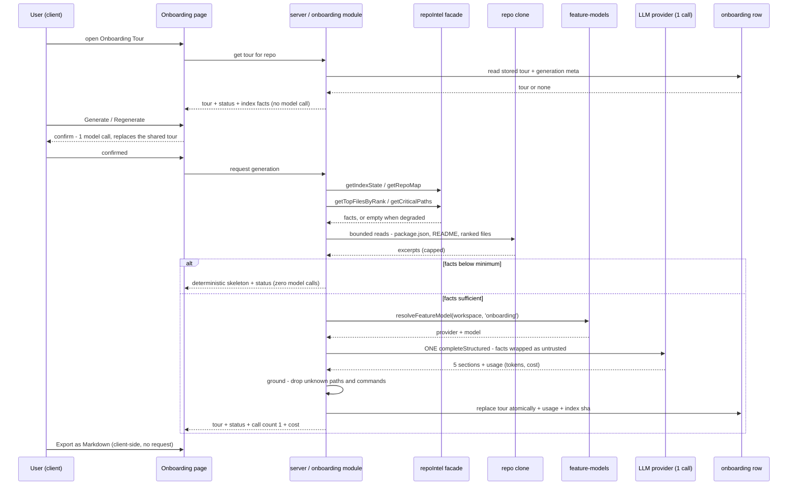
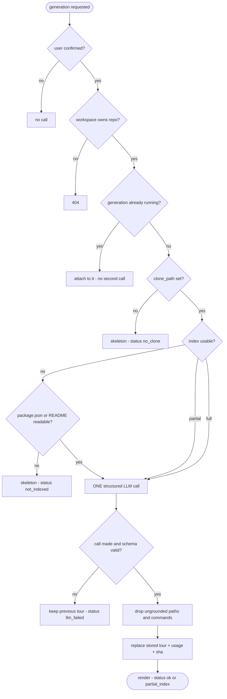

# Spec: Onboarding Generator
Spec ID: SPEC-02
Status: draft
Supersedes: —
Modules: server, client

## Problem & User

A developer opening an unfamiliar repository has no first-day path through it.
DevDigest already knows the answer: `repo-intel` indexes every clone on import
(symbols, import graph, PageRank file importance, a compact repo map) and its
own README names **"Onboarding reading-path (L05)"** as a lesson feature to be
built *on top of* the `repoIntel.*` facade, "not by re-indexing"
(`server/src/modules/repo-intel/README.md:9-12`). None of that reaches a human
reader today: there is no page, no module, no endpoint.

The gap is unusually narrow, because the starter already ships the scaffolding
and wires none of it:

1. **Storage exists, unwritten.** `onboarding` (`server/src/db/schema/context.ts:120-126`)
   — `repo_id` as the primary key, a `json` jsonb column, `generated_at`. One
   row per repo, by construction.
2. **Contracts exist, unused.** `Onboarding` / `OnboardingSection` /
   `OnboardingLink` (`server/src/vendor/shared/contracts/knowledge.ts:28-47`):
   a section is `{kind, title, body (markdown), diagram (mermaid, nullish),
   links[{label, path}]}`.
3. **A model slot exists, unresolved.** `FEATURE_MODELS[0]` is
   `id: 'onboarding'`, label "Onboarding Tour", "Writes the per-repo onboarding
   tour", default `openrouter/deepseek-v4-flash`
   (`server/src/vendor/shared/contracts/platform.ts:44-50`), resolvable through
   `resolveFeatureModel` (`server/src/modules/settings/feature-models.ts:51-57`).
4. **A system prompt exists, never loaded.** `server/src/prompts/onboarding.system.md`
   — structured JSON output, `{{sections}}` / `{{language}}` placeholders,
   mermaid rules, an untrusted-data security paragraph. `loadPromptTemplate`
   names it only as a docblock example (`server/src/platform/prompts.ts:23`);
   no call site loads it.
5. **Facade methods exist, uncalled.** `getTopFilesByRank` and
   `getCriticalPaths` (`server/src/modules/repo-intel/service.ts:678-741`), the
   latter documented verbatim as "Dependency chains from the highest-ranked
   files (onboarding reading-path)".
6. **Client copy exists, unrendered.** `client/messages/en/onboarding.json`.

So the work is *wiring and product decisions*, not new machinery — which is
exactly why the decisions have to be written down.

Two secondary problems, both stated by the product owner:

- **Cost must be countable.** Only review runs record spend today
  (`agent_runs.cost_usd`, `server/src/modules/reviews/run-executor.ts:334`).
  The closest sibling system-LLM feature — conventions extraction — throws its
  own `tokensIn/tokensOut/costUsd` away (`server/src/modules/conventions/service.ts:120-131`
  keeps only `result.data`), so a system feature's cost is currently invisible.
  A tour that silently costs N calls is a demo failure.
- **Degradation must be honest.** Every `repoIntel.*` read degrades rather than
  throws (`repo-intel/types.ts:14-22`): array methods return `[]`, object
  methods carry `degraded`/`reason`. A tour rendered over an empty index would
  look identical to a tour rendered over a real one — confident prose about a
  codebase nobody read.

## Goals / Non-goals

### Goals

- One repo-scoped page presenting **exactly five sections in a fixed order**:
  architecture overview, critical paths, how to run locally, guided reading
  path, first tasks.
- Facts are collected **deterministically** — `repoIntel.*` reads plus bounded
  reads of real files in the clone — and never by indexing anything.
- **Exactly one structured LLM call per generation**, producing all five
  sections at once (D-3).
- The reading path and critical paths are derived from the **existing** rank
  and import graph (`getTopFilesByRank`, `getCriticalPaths`), not from a second
  ranking algorithm invented here (D-1).
- **Every path and every command shown is verified in code against the
  collected facts** before it is persisted — the model may phrase, never
  invent (precedent: `conventions/service.ts:141-166`).
- A **deterministic skeleton with an honest, enumerated status** whenever the
  clone is missing, the index is degraded/partial, or the single call fails.
- **Regenerate on demand**, behind an explicit confirmation (D-14); one current
  tour per repo, shared, replaced atomically on success only.
- The generation's **call count (always 1), model, tokens and cost** are
  recorded and surfaced.
- The tour can be **exported as Markdown**, client-side, from what the page
  already holds (D-10).

### Non-goals (this iteration)

- **Re-indexing, or any new pipeline stage.** The feature is a *consumer* of
  the facade, in its own module, the shape `repo-intel/README.md:55-58`
  prescribes and `modules/blast/` demonstrates (`blast/routes.ts:8-25`: read
  the facade, own module folder, never inside `repo-intel/`).
- **A chunking / embedding / retrieval pipeline.** Same reasoning
  `specs/SPEC-01-project-context.md` Non-goals used for `code_chunks`: nothing
  writes that table, embeddings are off by default (`EMBEDDINGS_ENABLED=false`
  makes `Container.embedder()` throw, `server/AGENTS.md`), and whole-fact
  prompting needs neither.
- **More than one LLM call per generation.** No per-section call, no
  map-reduce, no refinement pass, no automatic retry-on-quality. Cost
  containment is a named product requirement, and the whole five-section
  contract is one JSON object (`knowledge.ts:44-47`).
- **Per-user tours or per-user state.** The schema has a `repo_id` primary key
  and no user column (`context.ts:120-123`) — one shared tour per repo (D-4).
- **Editing the tour in-app**, or persisting a user-corrected version.
- **Feeding the tour into review prompts.** No `PromptParts` change, no
  `run-executor` change; this is a reading surface, not review context (D-7).
- **A shared, access-controlled URL for a tour.** Sharing is a client-side
  Markdown export (D-10): no new endpoint, no token model, no unauthenticated
  access path. A real public link would need an identity model the product
  does not have — `LocalNoAuthProvider` returns the same seeded user and
  workspace for every request (`server/src/adapters/auth/local.ts:14-38`).
- **Deepening the clone to enable churn/hotness ranking** (D-1).
- **Auto-generation.** No generation on import, on resync, or on page load —
  a generation happens only on an explicit, confirmed user action, because it
  costs money.
- **Pre-push CLI / MCP parity**, mirroring SPEC-01's same deferral.
- **An in-app source viewer.** Paths link out to the repository host (D-12).

## User stories

- As a developer new to a repo, I open **Onboarding Tour** and get five
  sections that tell me what this system is, which files carry it, how to run
  it, what to read in what order, and what to pick up first.
- As that same developer, I click a file in the reading path and land on that
  file on GitHub, because every path in the tour was checked against the index
  before it was shown.
- As a repo owner, I see in the header which index the tour was generated
  from and how old it is, so I can tell a fresh tour from one written against
  last month's code.
- As a cost-conscious user, I am told before I confirm Regenerate that it is
  **one** model call that replaces the tour everyone in my workspace sees, and
  afterwards I see what that call cost.
- As a user of a repo that was never indexed, I still get a usable
  deterministic skeleton and a status line telling me why it is thin —
  instead of confident prose about a codebase nothing read.
- As a workspace admin, I point the Onboarding Tour at a cheaper model in
  Settings → Feature Models and the next generation uses it.
- As a developer onboarding a teammate, I export the tour as Markdown and
  paste it where my team already reads things.

## Acceptance criteria (EARS)

### Generation and the one-call rule

- **AC-1** WHEN a user opens the Onboarding Tour page for a repo that already
  has a stored tour, the system shall render the stored tour and shall make no
  model call. (verify: integration test — page load against a persisted
  `onboarding` row, asserting zero calls on the mock LLM provider,
  `server/src/adapters/mocks.ts`)
- **AC-2** WHEN a user explicitly requests a generation (first generation or
  Regenerate), the system shall issue **exactly one** structured LLM call
  producing all five sections in a single response, and no other model call for
  that generation. (verify: integration test asserting `completeStructured` is
  called once and `complete` zero times)
- **AC-3** The system shall assemble that call's facts from `repoIntel.*` reads
  and bounded clone reads only, and shall not run or enqueue an index,
  refresh or resync job (`repo-intel/constants.ts:7-10`). (verify: integration
  test asserting no job of those kinds was enqueued)
- **AC-4** A generated tour shall contain exactly five sections with the fixed
  `kind` values `architecture`, `critical_paths`, `run_locally`,
  `reading_path`, `first_tasks`, in that order; a model response that omits,
  reorders, duplicates or adds a section shall be rejected by schema
  validation before persistence. (verify: unit test on the response schema with
  a four-section and a reordered stub)
- **AC-5** The model shall be resolved through
  `resolveFeatureModel(container, workspaceId, 'onboarding')`
  (`feature-models.ts:51-57`), honouring a workspace override and otherwise
  the registry default (`platform.ts:44-50`). (verify: integration test with and
  without an override row)
- **AC-6** WHEN a user activates Regenerate on a repo that already has a stored
  tour, the system shall require an explicit confirmation before issuing the
  call, and that confirmation shall state both consequences: one model call is
  spent, and the tour every member of the workspace sees is replaced (D-14,
  E-13). (verify: component test — the call is not requested until the
  confirmation is accepted)

### Grounding — the model phrases, never invents

- **AC-7** IF a section body, link, table row or task names a file path that is
  not present in the collected facts, THEN the system shall drop that item
  before persisting the tour, and shall do so in code rather than by trusting
  the model's compliance. (verify: unit test — a stub response citing
  `src/does-not-exist.ts` yields a tour without that item; same discard
  contract as `conventions/service.ts:141-166`)
- **AC-8** Every shell command rendered in **How to run locally** shall be
  reproduced verbatim from a real file read from the clone (`package.json`
  scripts, a README, a compose file, `.env.example`), and any command the
  system cannot match to that source shall be dropped. (verify: unit test —
  a stub response containing a script absent from the fixture's `package.json`
  is dropped). This is required because the repo map does **not** carry
  scripts: `renderRepoMap` emits only the header plus `path:` + signature lines
  (`repo-intel/pipeline/repo-map.ts:73-88`), so the product owner's framing
  ("`repoIntel.*` collects stack, structure, routes and scripts") is not
  satisfiable from `getRepoMap` alone (D-2).
- **AC-9** The **Guided reading path** shall be ordered by the existing
  persisted rank, read via `repoIntel.getTopFilesByRank`
  (`repo-intel/service.ts:678-695`), including that method's junk filtering of
  tests/configs/migrations (`service.ts:752-772`); the system shall not compute
  a second ranking. (verify: integration test asserting the reading-path order
  equals the facade's returned order for a fixture index)
- **AC-10** The **Critical paths** section shall be built from
  `repoIntel.getCriticalPaths(repoId)` chains — at most `CRITICAL_PATH_ROOTS`
  (5) roots, each at most `BFS_DEPTH` (2) hops (`service.ts:702-741`,
  `constants.ts:50`) — and each row shall name a file from those chains.
  (verify: integration test against a fixture import graph)
- **AC-11** The system shall not state or imply that file importance reflects
  code churn, recency or "hotness", in the UI, in the prompt facts, or in the
  section copy. `rank = pagerank` with `hotness = 0`
  (`repo-intel/pipeline/rank.ts:4-7,51`), the pipeline reports
  `hotnessAvailable: false` (`pipeline/full.ts:262`), and the schema comment
  records that `rank` would only become `pagerank * (1 + hotness)` later
  (`db/schema/repo-intel.ts:96-98`). (verify: unit test on the assembled facts
  block asserting the rank-basis label; manual — copy review) (D-1)
- **AC-12** WHERE the tour shows a per-item complexity or difficulty badge
  (design: **First tasks**, Low/Medium), the system shall present it as a model
  estimate, not as a measured property, unless it is derived from a
  deterministic signal already in the index. (verify: component test on the
  badge's label/tooltip)

### Bounds for a very large repository

- **AC-13** The facts block sent to the single call shall be bounded before the
  call, by: a maximum number of ranked files sampled, a per-file excerpt cap, a
  repo-map token budget, and a total facts token budget. Content over budget
  shall be dropped whole-item in ascending rank order — never truncated
  mid-file, and never silently. (verify: unit test with an oversized fixture
  asserting the dropped set and the retained order). Values, anchored to
  existing precedent and recorded as proposals in D-9: 12 ranked files
  (= conventions' `SAMPLE_SIZE`, `conventions/constants.ts:1`), 4 000 chars per
  excerpt (= `MAX_FILE_CHARS`, same file), the repo map at
  `DEFAULT_REPO_MAP_TOKEN_BUDGET` 1 500 (`repo-intel/constants.ts:52`), total
  facts ≤ 8 000 tokens (= `PROJECT_CONTEXT_TOKEN_BUDGET`,
  `project-context/constants.ts:35`).
- **AC-14** The rendered tour shall be bounded independently of the model's
  output: at most 12 reading-path entries, at most 10 critical-path rows, at
  most 10 run-locally steps, at most 6 first-task cards, and at most 4 links
  per section (the last already stated by `prompts/onboarding.system.md:8-9`).
  Excess items shall be dropped deterministically, not scrolled. (verify: unit
  test with an over-long stub response) (D-9)
- **AC-15** WHERE the repo's index is `partial`, or the walk was bounded at
  `MAX_INDEXED_FILES` 5 000 (`repo-intel/pipeline/walk.ts:8-12,65-68`), the
  header shall state that the tour was generated from a **partial** index and
  shall show the indexed file count from `IndexState.filesIndexed`
  (`repo-intel/types.ts:34-49`) — never a claim about the repository's true
  file count. (verify: integration test with a `partial` index state)
- **AC-16** IF `getIndexState` reports `degradedReason: 'repo_too_large'`
  (`repo-intel/types.ts:26-32`), THEN the page shall surface that reason
  distinctly from "not indexed yet". (verify: integration test per reason)

### Degradation and honest status

- **AC-17** The system shall expose one enumerated, machine-readable status per
  tour, distinguishing at minimum: generated normally · generated from a
  partial index · no clone · not indexed · model call failed · never generated.
  A status shall never be inferred client-side from an empty body. (verify:
  integration test, one case per status)
- **AC-18** IF the repo has no local clone (`repos.clone_path` null,
  `server/src/db/schema/repos.ts:16`), THEN the page shall render an
  explanatory state, shall not error, and the generate action shall make no
  model call. (verify: integration test with `clone_path` null — the same
  degradation SPEC-01 AC-3/E-1 defines and `conventions/service.ts:112` already
  applies by returning `[]`)
- **AC-19** IF the collected facts fall below the minimum needed to write a
  grounded tour — no clone, or no ranked files **and** no readable
  `package.json`/README — THEN the system shall render the deterministic
  skeleton with its status and shall **skip the LLM call entirely**, so a
  degraded repo costs nothing. (verify: integration test asserting zero model
  calls and a non-empty skeleton)
- **AC-20** IF the single LLM call cannot be made or cannot be used — no
  provider key configured, call failure, timeout, or a response still failing
  schema validation after the provider adapter's configured retries
  (`StructuredRequest.maxRetries`, `vendor/shared/adapters.ts:55-63`) — THEN
  the system shall render the deterministic skeleton with a status
  distinguishable from every other status of AC-17, shall persist no partial
  tour, and shall not retry automatically. A missing provider key degrades on
  this path rather than through a separate up-front disabled state (D-13).
  (verify: integration test with a throwing provider, a schema-violating
  provider, and an unconfigured key, one case each)
- **AC-21** WHILE a tour exists and a regeneration fails, the previously stored
  tour shall survive unchanged and shall keep being served. (verify:
  integration test — generate, then fail a regeneration, then assert the
  original row's `json` and `generated_at` are untouched)
- **AC-22** The deterministic skeleton shall contain only facts that need no
  model: the repo's indexed file count and index status, the run-locally
  commands of AC-8, and the ranked file list of AC-9 where available. It shall
  not present empty section bodies as if generation had succeeded. (verify:
  component test on each degraded status)

### Regeneration, freshness and sharing state

- **AC-23** The system shall store at most one current tour per repo and shall
  replace it on a successful regeneration — the schema's `repo_id` primary key
  (`db/schema/context.ts:120-123`) is the contract, not an incidental detail.
  (verify: integration test — a second successful generation replaces rather
  than appends, and both users of the workspace see the new one) (D-4)
- **AC-24** WHEN Regenerate is invoked, the system shall recompute the facts
  from the **current** index and shall not fetch from origin nor re-index.
  Advancing the clone stays the separate resync action
  (`repo-intel/service.ts:145-176`, `POST /repos/:id/resync`). (verify:
  integration test asserting `git.sync` is not called during a generation)
  (D-5)
- **AC-25** The header shall show the tour's age from `onboarding.generated_at`
  (`context.ts:125`) and the indexed file count it was generated from
  (AC-15). (verify: component test with a stubbed response)
- **AC-26** WHERE the index's `lastIndexedSha` (`repo-intel/types.ts:42-46`)
  differs from the sha the tour was generated against, the page shall mark the
  tour stale and offer regeneration; it shall not regenerate automatically.
  (verify: integration test — index moves, page reports stale, no model call
  occurs) — this requires the generation sha to be persisted with the tour.
- **AC-27** IF a generation is already in flight for a repo, THEN a concurrent
  generation request shall not start a second model call. (verify: integration
  test issuing two concurrent requests and asserting one `completeStructured`
  call)

### Cost and observability

- **AC-28** The system shall persist, per generation: provider, model id,
  `tokensIn`, `tokensOut`, `costUsd` and the model-call count (always 1), taken
  from `StructuredResult` (`vendor/shared/adapters.ts:72-80`). (verify:
  integration test asserting the persisted values match the mock provider's
  returned usage)
- **AC-29** The page shall surface that generation cost — at minimum the call
  count and the token/cost figures where the provider returned them
  (`costUsd` is nullable). (verify: component test, including the
  `costUsd: null` case rendering no fabricated number)
- **AC-30** The system shall log the generation's outcome with repo id, status,
  fact counts and sizes, model, tokens and cost — and shall never log file
  contents, the assembled facts text, or the raw model response body. (verify:
  manual — code review, on the rule already stated at
  `run-executor.ts:271-275` "section name/source/char count … NEVER content")

### Access, safety and rendering

- **AC-31** Every onboarding route shall resolve tenancy via
  `getContext(app.container, req)` before any work and shall respond 404 for a
  repo outside the caller's workspace — the rule every existing repo-scoped
  route follows (`blast/routes.ts:22-23`, `project-context/routes.ts:19-21`).
  (verify: integration test — repo of workspace A addressed from workspace B)
- **AC-32** All repo-derived text placed into the model call — repo map,
  file excerpts, paths, README text, scripts — shall be wrapped with
  `wrapUntrusted` (`reviewer-core/src/prompt.ts:30-34`, re-exported at
  `server/src/platform/prompt.ts:6-11`), and the system message shall carry the
  untrusted-data instruction the template already states
  (`prompts/onboarding.system.md:11-12`). No repo text shall be concatenated
  into the instruction message unwrapped. (verify: unit test on the assembled
  messages asserting every fact block is delimiter-wrapped)
- **AC-33** Tour text shall be rendered through the centralized
  `react-markdown` instance (`client/src/vendor/ui/primitives/Markdown.tsx`,
  per `client/AGENTS.md`) with no `dangerouslySetInnerHTML` and no second
  renderer; a `diagram` shall be rendered only through `MermaidDiagram`, which
  validates with `mermaid.parse(src, {suppressErrors: true})` and renders
  nothing on invalid input (`client/src/components/mermaid-diagram/MermaidDiagram.tsx:20-60`).
  (verify: component test with a malformed diagram string — the card still
  renders its prose)
- **AC-34** Commands in **How to run locally** shall be displayed and copied as
  text only. The system shall never execute them, and the UI shall make clear
  they originate from the repository. (verify: manual — code review; the
  copy-button affordance in the design makes an attacker-authored
  `package.json` script a one-click hazard, E-11)
- **AC-35** WHEN a user activates an **Open** action on a path in the tour, the
  system shall navigate to that path's blob URL on the repository host, at the
  repo's default branch (`repos.default_branch`), and shall construct that URL
  only from a path that survived the AC-7 grounding check. WHERE any path from
  a stored tour is instead resolved against the filesystem, it shall clear the
  existing containment guard first (`isInsideClone`,
  `server/src/modules/reviews/intent-inputs.ts:138`) — model output is
  attacker-influenceable through repo content. (verify: integration test with a
  `../../etc/passwd`-shaped path in a stub tour; component test on the
  generated URL) (D-12)
- **AC-36** The tour's request body and route params shall be zod-validated
  route schemas per `server/AGENTS.md`, and the persisted `json` shall be
  parsed against the `Onboarding` contract (`knowledge.ts:44-47`) on read as
  well as on write, so a malformed stored row degrades instead of crashing the
  page. (verify: integration test with a hand-corrupted `onboarding.json` row)

### Page, navigation and export

- **AC-37** The tour shall live on a repo-scoped route and its nav entry shall
  be a `:repoId`-templated href in the sidebar registry
  (`client/src/vendor/ui/nav.ts:21-49`), added through the manual-mirror
  do-not-touch convention (`client/AGENTS.md`) exactly as SPEC-01 E-13 required
  for Project Context (`nav.ts:26-32`). It shall not collide with the existing
  top-level `/onboarding` route, which is the add-repo screen
  (`client/src/app/onboarding/page.tsx:1-2`). (verify: component test on the
  nav registry; manual — route map review)
- **AC-38** The five sections shall render as collapsible cards in the AC-4
  order, each card showing its own deterministic fallback when its body is
  empty rather than an empty card. (verify: component test per section with an
  empty body)
- **AC-39** WHEN a user invokes the share action, the system shall produce the
  current tour as a Markdown document from the data the page already holds,
  adding no endpoint, no share token and no unauthenticated access path
  (D-10). (verify: component test asserting the produced Markdown contains all
  five sections and that no network request is issued)

## Edge cases

- **E-1 No clone.** `repos.clone_path` is nullable (`db/schema/repos.ts:16`);
  AC-18 defines the outcome. Same case SPEC-01 E-1 records.
- **E-2 Repo cloned but never indexed.** `getIndexState` synthesises a degraded
  row with `reason: 'no_data'` rather than throwing
  (`repo-intel/service.ts:203-219`), and `getRepoMap` returns
  `{text: '', degraded: true, reason: 'no_data'}` (`service.ts:437-454`).
  Distinct from E-1 and must read differently (AC-17).
- **E-3 `REPO_INTEL_ENABLED` off.** `getRepoMap` returns `reason: 'flag_off'`
  (`service.ts:445-447`) and `getFileRank`/`getTopFilesByRank`/
  `getCriticalPaths` all return `[]` (`service.ts:458,683,703`). Every
  index-derived section is empty at once — the skeleton path (AC-19), not an
  error.
- **E-4 Index exists but the import graph is empty.** `getCriticalPaths`
  returns `[]` when there are no edges (`service.ts:704-705`), and
  `computeFileRank` degrades a degenerate graph to a uniform flat ranking
  (`pipeline/rank.ts:39-47`). A flat ranking makes "top-ranked" meaningless —
  the reading path must not present an arbitrary order as importance.
- **E-5 Repo bounded at 5 000 files.** The walk keeps the first N by
  alphabetical path, not by importance (`pipeline/walk.ts:8-12,61-68`), so on a
  very large repo the tour may be built over an alphabetically truncated slice.
  AC-15 requires saying so.
- **E-6 Non-JS/TS repository.** `SUPPORTED_EXT` is JS/TS only
  (`repo-intel/constants.ts:14`), so a Python or Go repo indexes to almost
  nothing while still having a clone, a README and scripts. The tour must
  degrade to what is real rather than claim an architecture it never parsed.
- **E-7 Monorepo with several `package.json` files.** "How to run locally" has
  more than one candidate source; the choice must be deterministic and
  attributed (this repo is itself the case — five packages, no workspace, per
  root `AGENTS.md`).
- **E-8 Section-name conflict across three pre-authored sources.** The product
  owner's five sections are architecture / critical paths / run locally /
  reading path / first tasks; the pre-authored client copy promises "overview,
  architecture, key modules, getting started, and conventions & gotchas"
  (`client/messages/en/onboarding.json:10`); and the prompt template writes
  formatting rules for a `routes_and_apis` section that is in neither list
  (`prompts/onboarding.system.md:22-26`). Three different section sets ship in
  the starter. The brief's five are canonical (D-6); both files are expected to
  be edited to match, not left contradicting.
- **E-9 Model emits a section body that is fine but a diagram that is not.**
  `MermaidDiagram` renders nothing for unparseable input
  (`MermaidDiagram.tsx:26-60`) — so a card whose value was carried entirely by
  its diagram silently becomes an empty card. The template already anticipates
  this ("invalid diagrams are dropped", line 29), which is why prose is
  required alongside (AC-33, AC-38).
- **E-10 Model invents a plausible path.** The reason AC-7 exists. The
  conventions extractor hit exactly this and answered it with a verbatim
  evidence check plus a code-side discard (`conventions/service.ts:141-166`,
  and its `LlmCandidate` comment on cheap models miscounting lines).
- **E-11 Repo-authored shell command with a copy button.** "How to run locally"
  presents commands taken from repository files, next to a one-click copy
  affordance, to a user who just cloned an unfamiliar repo. A malicious
  `package.json` script is therefore a social-engineering vector that the
  product surfaces on the user's behalf (AC-34) — sharper here than in
  SPEC-01, whose untrusted content was only ever prompt text.
- **E-12 Prompt injection from repo content.** Repo files, README text and the
  repo map all flow into a model call. Unlike the review path, this call does
  **not** go through `assemblePrompt`, so it inherits neither `wrapUntrusted`
  nor `INJECTION_GUARD` automatically (`reviewer-core/src/prompt.ts:16-34`) —
  and the sibling system feature does concatenate its sample unwrapped
  (`conventions/service.ts:168-183`). AC-32 is a requirement, not a
  copy of the existing pattern.
- **E-13 Two users regenerate at once.** One shared row (E-14/AC-23) means the
  second write wins and the first user paid for a discarded tour (AC-27), and
  it is why the confirmation of AC-6 names the shared-overwrite consequence.
- **E-14 A tour outlives the code it describes.** The tour is a snapshot; the
  index moves on every resync. Without AC-26's staleness marker the page
  presents month-old prose with the same confidence as fresh prose.
- **E-15 Corrupted or schema-drifted stored `json`.** The column is untyped
  `jsonb` (`context.ts:124`); a row written by an earlier section contract must
  degrade, not crash the page (AC-36).
- **E-16 Provider returns no cost.** `costUsd` is `number | null`
  (`adapters.ts:77`); the cost display must handle null without inventing a
  figure (AC-29).
- **E-17 Nav/route name collision.** `/onboarding` already means "add a
  repository" (`client/src/app/onboarding/page.tsx`, linked from
  `client/src/app/page.tsx:36`). Two different "onboardings" in one product is
  a genuine comprehension hazard (AC-37, UX-9).
- **E-18 Language.** The prompt template ends with "Write all titles and
  body/markdown text in {{language}}" (`onboarding.system.md:42`) and the
  client ships only `messages/en` (`client/messages/`). The placeholder is
  filled with English (D-11).
- **E-19 Export of a degraded tour.** The share action (AC-39) is available
  while the page is showing a skeleton; the exported Markdown must carry the
  same status line as the page, or a thin export reads as a complete tour.

## Non-functional requirements

Checked against the `security` skill (OWASP Top 10:2025); non-security
categories are covered where this feature actually implicates them.

**Security**

- **A01 Broken access control / tenant isolation.** Every read, generation and
  regeneration is workspace-scoped through `getContext` before any repo work
  (AC-31), the barrier pattern every existing repo-scoped route already uses
  (`blast/routes.ts:22-23`, `project-context/routes.ts:19-21`). Sharing is
  deliberately a client-side export (AC-39, D-10) precisely so this feature
  adds no surface that grants access outside that barrier — the product has no
  identity model to scope one with (`adapters/auth/local.ts:14-38`).
- **A05 Prompt injection.** Repo content is untrusted data reaching a model
  (E-12). Defence is structural: `wrapUntrusted` delimiting plus the
  template's security paragraph, with no unwrapped concatenation (AC-32). The
  model's *output* is then treated as untrusted in turn — every path and
  command is re-verified in code (AC-7, AC-8), which is the only defence that
  survives a successful injection.
- **A05 XSS.** Model-authored markdown is rendered through the single
  centralized `react-markdown` instance, never raw HTML, and diagrams only
  through the parse-validated `MermaidDiagram` (AC-33). Mermaid is initialised
  `securityLevel: 'strict'` there (`MermaidDiagram.tsx:38`) — that setting must
  not be relaxed to satisfy the design's per-component border colouring; node
  styling belongs in the diagram source.
- **A05 Command injection / user-executed commands.** The feature never
  executes a repo command, and the run-locally card is display-and-copy only,
  attributed to its source file (AC-34, E-11).
- **A05/A08 Path handling.** Paths in a stored tour are model output. They are
  used to build an outbound repository URL only after clearing the AC-7
  grounding check, and any resolution against the filesystem clears the same
  containment guard as any client-supplied path (`isInsideClone`,
  `intent-inputs.ts:138`), per AC-35 — the identical rule SPEC-01 AC-16/E-10
  states, applied to a new source of paths.
- **A08 Integrity.** The model response is schema-validated before persistence
  (AC-4), the stored row is re-validated on read (AC-36), and route bodies are
  zod-validated per `server/AGENTS.md` (422 before the handler runs). Nothing
  from the model is spread into a database write or a filesystem call.
- **A04 Outbound data exposure.** Generating a tour ships repo excerpts —
  including whatever secrets a repo has accidentally committed — to a
  third-party model provider. Root `AGENTS.md` states secrets never live in
  git, but the tour makes any lapse an outbound transfer, exactly as SPEC-01's
  A04 notes for attached documents. The generate confirmation (AC-6) is the
  natural place to say what is sent.
- **A06 Insecure design / DoS and cost abuse.** Generation is the expensive,
  user-triggerable path: bounded facts (AC-13), bounded output (AC-14), one
  in-flight generation per repo (AC-27), an explicit confirmation (AC-6), and
  no automatic or on-load generation (Non-goals). Note rate limiting is fully
  disabled under `NODE_ENV=test` (`server/AGENTS.md`), so the concurrency guard
  must be enforced in the feature, not assumed from the platform.
- **A09 Logging.** Paths, counts, sizes, model, tokens, cost — never contents,
  never the assembled facts, never the raw response (AC-30), on the rule
  `run-executor.ts:271-275` already states.
- **A10 Exceptional conditions / fail-closed.** A failed or unmakeable call
  degrades to the skeleton and leaves the previous tour intact (AC-20, AC-21);
  a failure never writes a partial tour and never silently produces an empty
  one.

**Cost.** One structured call per generation, one generation per explicit,
confirmed user action, zero calls on read (AC-1, AC-2, AC-6), zero calls when
the facts are too thin to ground a tour (AC-19). The per-generation usage record
(AC-28) is what makes the claim auditable rather than asserted — and it is a
genuine addition, since the sibling conventions feature discards its own usage
numbers (`conventions/service.ts:120-131`). The feature-model default is already
the cheap tier (`deepseek-v4-flash`, `platform.ts:48-49`).

**Performance.** Reads are served from one stored row (AC-1). A generation
performs a bounded set of facade reads and bounded file reads (AC-13) plus one
model call, so its latency is dominated by the provider. No concrete latency or
timeout target has been agreed (Q9). The generation must not block the page:
whether it runs inline on the request or through the existing `JobRunner`
(whose handlers carry a 120 s hard budget, `repo-intel/constants.ts:47`) is an
implementation choice for the Development Plan, but the *observable* requirement
is that the UI shows progress and the AC-27 guard holds either way.

**Availability / degradation.** Every degraded path renders content instead of
an error (AC-17 to AC-22), matching the facade's own stated degraded contract
(`repo-intel/types.ts:14-22`). The page is never a hard dependency of a review
run, and no review path depends on the tour.

**Observability.** The status enumeration (AC-17) is the feature's primary
observable: a thin tour must be distinguishable from a failed one, a stale one
and an unindexed one — the same reason SPEC-01 AC-51 refused to fold a
dirty-clone refusal into a generic `sync_failed:`. Generation usage (AC-28) and
outcome logging (AC-30) complete it.

**Maintainability / configuration.** A new server module under
`server/src/modules/` following routes → service → port ← adapter, checked by
`pnpm arch:check`, and placed *outside* `repo-intel/` because it consumes the
facade — the shape `repo-intel/README.md:55-58` prescribes and `modules/blast/`
demonstrates. Engineering caps (AC-13, AC-14) belong in the module's own
`constants.ts`, following the split `project-context/constants.ts:1-7` states.
The prompt instruction text stays in `server/src/prompts/onboarding.system.md`
and is loaded via `loadPromptTemplate`/`renderPrompt`
(`platform/prompts.ts:23-42`) rather than hardcoded in the service — the
opposite of what conventions does (`conventions/service.ts:168-183`), and the
reason that template file exists. Contracts already exist in
`@devdigest/shared` and any change must be hand-mirrored into both
`server/src/vendor/shared` and `client/src/vendor/shared` (root `AGENTS.md`).

## Module interaction / API contracts

Two modules are touched. **server**: a new consumer module that reads the
`repoIntel` facade plus the clone, makes one structured call, grounds and
persists the result. **client**: one repo-scoped page, one nav entry, rendering
through the existing Markdown and Mermaid components. **reviewer-core is not
touched** — this call does not go through `assemblePrompt`, which is precisely
why AC-32 restates the untrusted-wrapping requirement locally.

**Contracts this Spec requires** (shapes, not implementations):

- A **tour read** contract per repo: the five `OnboardingSection` entries
  (`knowledge.ts:35-47` — reused as-is, `kind` carrying the AC-4 values), the
  status of AC-17, the generation timestamp, the indexed file count and index
  status it was generated from, the staleness flag of AC-26, and the generation
  usage of AC-28.
- A **generation** contract: repo-scoped, no body beyond the repo reference,
  returning the same shape as the read plus the usage figures.
- **No contract for sharing.** The export of AC-39 is a client-side rendering
  of the tour the page already holds (D-10).
- **Storage**: the existing `onboarding` table (`context.ts:120-126`) — one row
  per repo. The generation metadata (model, provider, tokens, cost, index sha)
  needs somewhere to live; whether inside the `json` payload or as added
  columns is a Development Plan choice, but it must be persisted, since AC-26
  and AC-29 both read it back. Any column addition goes through
  `pnpm db:generate`, never a hand-edited migration (root `AGENTS.md`).
- **Unchanged**: `PromptParts`, `PromptAssembly`, the run trace, and every
  `repoIntel` signature. This feature adds no facade method — `getRepoMap`,
  `getTopFilesByRank`, `getCriticalPaths` and `getIndexState` already exist
  (`repo-intel/service.ts:437,678,702,203`).

## UX improvements

From the four-step read of the four reference screens:

1. **"Share link" becomes "Export as Markdown".** Every request resolves to the
   same seeded user and workspace (`adapters/auth/local.ts:14-38`), so a link
   cannot express a permission decision. Export gives the user the same
   outcome — the tour somewhere else — without implying an access control the
   product cannot enforce (AC-39, D-10). The exported document must carry the
   page's status line, or a skeleton exports as if it were complete (E-19).
2. **Split "Regenerate" from "Re-analyze".** The design shows one button.
   There are two very different actions: regenerating the tour (one model call,
   costs money, uses the current index) and resyncing the index (no model call,
   fetches from origin, `POST /repos/:id/resync`). A user who wants a tour of
   *current* code needs the second, then the first — collapsing them into one
   button hides both the cost and the ordering (AC-24, D-5).
3. **Say the price before the click, and confirm it.** Regenerate is guarded by
   an explicit confirmation naming both consequences — one model call, and a
   replaced tour for everyone in the workspace (AC-6, E-13) — and the last
   generation's cost is shown afterwards (AC-29). The product owner's demo
   concern — count the calls and the cost — is a UI requirement, not only a
   logging one.
4. **The header must attribute, not just count.** "Generated from index of N
   files" is only true when the index is full; when it is partial or bounded,
   the same sentence becomes a false claim about the repository (AC-15).
   "Generated from a partial index of N files" costs four words.
5. **The complexity badge is an opinion wearing a metric's clothes.** Low/Medium
   on a First-task card reads as measured. Either label it as an estimate or
   derive it from something real, e.g. the file's rank percentile (AC-12).
6. **Every card needs prose, not only a diagram.** An invalid mermaid string
   renders nothing at all (`MermaidDiagram.tsx:59-60`), so a diagram-only
   architecture card can silently become an empty box (E-9, AC-38).
7. **Colour the diagram from the diagram source.** The design's per-role
   coloured borders must come from the mermaid text, not from relaxing
   `securityLevel: 'strict'` in the shared component.
8. **Attribute each run-locally command to its source file**, and make clear
   the commands come from the repository, not from DevDigest (AC-34, E-11).
   Attribution is also what makes the copy button defensible.
9. **Two "onboardings" is one too many.** `/onboarding` is already the add-repo
   screen (`client/src/app/onboarding/page.tsx`), reached from the empty state
   (`client/src/app/page.tsx:36`). The repo-scoped tour needs a route and a nav
   label that cannot be confused with it (AC-37, E-17).
10. **Empty and degraded states are absent from the design.** No screen shows
    no-clone, not-indexed, flag-off, failed-generation or never-generated —
    and on a fresh install, never-generated is the *first* state every user
    sees. The pre-authored generate-CTA copy (`onboarding.json:8-13`) covers
    one of the five.
11. **Fix the section copy to match the sections.** The shipped copy string
    promises a different five sections than the tour renders (E-8) — a user
    reading the CTA and then the page sees two different products.
12. **An "Open" button leaves the app, so it should look like it.** There is no
    in-app source viewer (Project Context previews `.md` only); Open navigates
    to the file on the repository host at the default branch (AC-35, D-12).
13. **The reading path's one-line reasons are the whole value.** "1.
    `src/server.ts` — see the whole request lifecycle in one file" is what
    makes it a tour rather than a ranked list; the reason must be grounded in
    the file's real role (AC-7), and a fallback reason must exist for the
    skeleton path.

## Inputs and provenance

| Section | Grounded in |
|---|---|
| Problem & User | `server/src/db/schema/context.ts:120-126`; `server/src/vendor/shared/contracts/knowledge.ts:28-47`; `server/src/vendor/shared/contracts/platform.ts:15,44-50`; `server/src/modules/settings/feature-models.ts:14-19,51-57`; `server/src/prompts/onboarding.system.md`; `server/src/platform/prompts.ts:23-42`; `server/src/modules/repo-intel/README.md:9-12,55-58`; `server/src/modules/repo-intel/service.ts:678-741`; `client/messages/en/onboarding.json`; `server/src/modules/reviews/run-executor.ts:334`; `server/src/modules/conventions/service.ts:120-131`; `server/src/modules/repo-intel/types.ts:14-22`; grep of `server/src/modules` showing no onboarding module and no `loadPromptTemplate('onboarding.system.md')` call site |
| Goals / Non-goals | Product-owner brief and answers (2026-08-13); `repo-intel/README.md:9-12,55-58`; `modules/blast/routes.ts:8-25`; `specs/SPEC-01-project-context.md` Non-goals (chunking/embeddings, CLI parity); `server/AGENTS.md` (`EMBEDDINGS_ENABLED=false`); `db/schema/context.ts:120-123`; `adapters/auth/local.ts:14-38` |
| User stories | Product-owner brief and answers (2026-08-13) + the four described reference screens; `client/messages/en/onboarding.json`; `feature-models.ts:51-57` |
| Acceptance criteria | `repo-intel/service.ts:203-219,437-461,678-741`; `repo-intel/constants.ts:7-10,45-52`; `repo-intel/pipeline/rank.ts:4-7,39-51`; `repo-intel/pipeline/walk.ts:8-12,61-68`; `repo-intel/pipeline/repo-map.ts:73-88`; `repo-intel/pipeline/full.ts:262`; `repo-intel/types.ts:26-49`; `db/schema/repo-intel.ts:96-98`; `db/schema/context.ts:120-126`; `db/schema/repos.ts:16`; `conventions/service.ts:112,120-131,141-166`; `conventions/constants.ts:1-2`; `project-context/constants.ts:35`; `feature-models.ts:51-57`; `platform.ts:44-50`; `vendor/shared/adapters.ts:55-63,72-80`; `reviewer-core/src/prompt.ts:30-34`; `platform/prompt.ts:6-11`; `prompts/onboarding.system.md:8-9,11-12,22-26,42`; `reviews/intent-inputs.ts:138`; `blast/routes.ts:22-23`; `project-context/routes.ts:19-21`; `run-executor.ts:271-275`; `client/src/vendor/ui/nav.ts:21-49`; `client/src/app/onboarding/page.tsx:1-2`; `client/src/components/mermaid-diagram/MermaidDiagram.tsx:20-60`; `client/AGENTS.md`; `server/AGENTS.md`; the four described reference screens; product-owner answers on the confirm step, the export, the Open target and the missing-key path (2026-08-13) |
| Edge cases | `db/schema/repos.ts:16`; `repo-intel/service.ts:203-219,437-447,458,683,703-705`; `repo-intel/pipeline/rank.ts:39-47`; `repo-intel/pipeline/walk.ts:8-12,61-68`; `repo-intel/constants.ts:14`; `repo-intel/types.ts:26-32`; `client/messages/en/onboarding.json:10`; `prompts/onboarding.system.md:22-26,29,42`; `MermaidDiagram.tsx:26-60`; `conventions/service.ts:141-183`; `reviewer-core/src/prompt.ts:16-34`; `db/schema/context.ts:120-125`; `vendor/shared/adapters.ts:77`; `client/src/app/page.tsx:36`; `client/messages/`; root `AGENTS.md` (five packages, no workspace) |
| Non-functional requirements | `security` skill (OWASP Top 10:2025) — A01/A04/A05/A06/A08/A09/A10; `adapters/auth/local.ts:14-38`; `blast/routes.ts:22-23`; `project-context/routes.ts:19-21`; `reviewer-core/src/prompt.ts:16-34`; `platform/prompt.ts:6-11`; `conventions/service.ts:168-183`; `MermaidDiagram.tsx:38,59-60`; `client/AGENTS.md`; `server/AGENTS.md` (zod routes, rate limiting disabled in test, bodyLimit); `run-executor.ts:271-275`; `repo-intel/types.ts:14-22`; `repo-intel/constants.ts:47`; `repo-intel/README.md:55-58`; `project-context/constants.ts:1-7`; `platform/prompts.ts:23-42`; root `AGENTS.md` |
| Module interaction / API contracts | `repo-intel/service.ts:203,437,678,702`; `knowledge.ts:35-47`; `db/schema/context.ts:120-126`; `feature-models.ts:51-57`; `vendor/shared/adapters.ts:72-86`; `blast/routes.ts:8-25`; `mermaid-diagram` skill for both diagrams; root `AGENTS.md` (drizzle-kit migrations, vendored-contract mirroring) |
| UX improvements | The four described reference screens; `adapters/auth/local.ts:14-38`; `repo-intel/service.ts:145-176`; `MermaidDiagram.tsx:38,59-60`; `client/messages/en/onboarding.json:8-13`; `client/src/app/onboarding/page.tsx`; `client/src/app/page.tsx:36`; `client/src/vendor/ui/nav.ts:21-49`; product-owner answers (2026-08-13) |
| Decisions recorded (below) | D-1, D-2, D-6, D-7, D-8 decided by the requesting agent on cited code, D-1 confirmed by the product owner (Q6) and its deferral logged in `BACKLOG.md`; D-3, D-4, D-5, D-9 decided on the product-owner brief plus cited code; D-10 to D-14 are direct product-owner answers relayed 2026-08-13 (Q1, Q3, Q4, Q5, Q8) |

## Untrusted inputs

| Input | Source | Trust boundary |
|---|---|---|
| Repo file excerpts (ranked files, README, `package.json`, compose, `.env.example`) | Repo contents — author-controllable | Untrusted. Enter the model call only inside `wrapUntrusted` blocks (AC-32), size-capped (AC-13). Never executed, never used to build a path or a command. |
| Repo map text | `repoIntel.getRepoMap` over repo content | Untrusted, same treatment — it is repo-derived symbol text, not system text. |
| Model response — section bodies (markdown) | LLM output over untrusted input | Untrusted. Schema-validated (AC-4), rendered only through the centralized `react-markdown` (AC-33); no raw HTML. |
| Model response — `links[].path`, critical-path rows, task file paths | LLM output | Untrusted. Dropped unless present in the collected facts (AC-7); used to build an outbound repo URL only after that check, and any filesystem resolution clears `isInsideClone` first (AC-35). |
| Model response — shell commands | LLM output over repo scripts | Untrusted **and** user-executed. Verbatim-match to a real source file or dropped (AC-8); display + copy only, attributed, never executed (AC-34, E-11). |
| Model response — `diagram` (mermaid) | LLM output | Untrusted. Parse-validated with `suppressErrors` and rendered nothing-on-invalid, `securityLevel: 'strict'` (AC-33). |
| Stored `onboarding.json` row | Own database, possibly written by an older contract | Untrusted for shape. Re-validated against the `Onboarding` contract on read; a malformed row degrades (AC-36). |
| Exported Markdown | Already-untrusted tour content | Untrusted, and now outside the app's rendering guarantees — the export is plain text produced client-side (AC-39); it is never re-imported, parsed or executed by the product. |
| `repoId` route param | Client | Untrusted. Zod-validated route schema; workspace-scoped via `getContext` before any work (AC-31). |

## Decisions recorded

- **D-1 Ranking basis — use today's flat PageRank percentile as-is; do not
  revisit hotness in this feature.** The product owner's framing named
  "PageRank × (1 + hotness)", which is the formula the schema comment reserves
  for later (`db/schema/repo-intel.ts:96-98`) — but `computeFileRank` currently
  sets `hotness: 0, rank: pagerank` by an explicit v1 decision, because the
  clone is shallow (`CLONE_DEPTH = 1`) and there is no churn window
  (`repo-intel/pipeline/rank.ts:4-7,51`), and the pipeline reports
  `hotnessAvailable: false` (`pipeline/full.ts:262`). Confirmed for v1 by the
  product owner (Q6); the deferral itself is logged in `BACKLOG.md` §SPEC-02
  and is not restated here. Consequence recorded rather than hidden: the
  reading path is an import-graph ("what does everything depend on") ordering,
  not a "what changes most" ordering, and the UI must not claim otherwise
  (AC-11).
- **D-2 "Stack / routes / scripts" are not in the repo map.** `renderRepoMap`
  emits a header plus `path:` + signature lines only
  (`repo-intel/pipeline/repo-map.ts:73-88`, header at line 15 "top-ranked by
  import graph only, partial view"). So **How to run locally** is built from
  bounded deterministic reads of real files in the clone — the same technique
  conventions uses for its config sample (`conventions/service.ts:113-118`,
  `constants.ts:3-11`) — and every command is verbatim-matched to that source
  (AC-8). Routes, if used, come from the endpoint facts the index already
  holds, not from the repo map.
- **D-3 One structured LLM call per generation**, all five sections in one
  response — the product owner's own framing, and the reason the shipped
  contract is a single `Onboarding` object (`knowledge.ts:44-47`). Cost is a
  named product concern, so this is an acceptance criterion (AC-2), not an
  implementation preference.
- **D-4 Per-repo shared state, one current tour.** Forced by the schema:
  `onboarding.repo_id` is the primary key with no user column
  (`context.ts:120-123`). Not per-user, no history, no versions (AC-23).
- **D-5 Regenerate ≠ Re-analyze.** Regenerating uses the current index and
  never fetches or re-indexes; advancing the clone stays the existing resync
  action (`repo-intel/service.ts:145-176`). Two buttons with two costs (AC-24,
  UX-2).
- **D-6 The brief's five sections are canonical** — `architecture`,
  `critical_paths`, `run_locally`, `reading_path`, `first_tasks` (AC-4). The
  pre-authored client copy (`client/messages/en/onboarding.json:10`) and the
  `routes_and_apis` block in `server/src/prompts/onboarding.system.md:22-26`
  each name a different set (E-8) and are **expected to be edited by the
  implementer** to match these five — permission granted by the product owner
  (Q7).
- **D-7 No coupling to Skills, Agents, Conventions or the review prompt in
  this iteration.** The tour is a reading surface; it does not become review
  context, is not attachable to an agent, and does not read convention
  candidates. It shares exactly one thing with those features: the
  `FEATURE_MODELS` registry entry that already exists for it
  (`platform.ts:44-50`). Answers the "does it interact with the existing
  surfaces" clarification — deliberately, no.
- **D-8 Model output is untrusted output, not just untrusted input.** Grounding
  is enforced in code after the call (AC-7, AC-8), following the precedent the
  conventions extractor set when cheap models miscounted evidence lines
  (`conventions/service.ts:20-24,141-166`). A tour that cites a file which does
  not exist is worse than a thin tour.
- **D-9 Bounds are anchored to existing caps, not invented — and remain
  proposals.** Every number in AC-13/AC-14 cites an in-repo precedent
  (`SAMPLE_SIZE` 12, `MAX_FILE_CHARS` 4 000, `DEFAULT_REPO_MAP_TOKEN_BUDGET`
  1 500, `PROJECT_CONTEXT_TOKEN_BUDGET` 8 000; render caps 12/10/10/6). The
  product owner approved proceeding with them, explicitly as anchored
  proposals rather than settled certainty — the same discipline SPEC-01
  applied when it refused to guess a threshold and recorded Q7 instead.
- **D-10 Sharing is a client-side Markdown export, not a link** (product-owner
  answer, Q1). No endpoint, no share token, no unauthenticated access path
  (AC-39, UX-1). A real public URL would require an identity model the product
  does not have (`adapters/auth/local.ts:14-38`).
- **D-11 Output language is English** (product-owner answer, Q3). The
  template's `{{language}}` placeholder (`onboarding.system.md:42`) is filled
  with a single configured value matching the only shipped message bundle,
  `client/messages/en` (E-18).
- **D-12 "Open" navigates to the file's blob URL on the repository host, at the
  repo's default branch** (product-owner answer, Q4). No in-app source viewer
  is built (AC-35, UX-12).
- **D-13 A missing provider key degrades into the AC-20 skeleton path**, not a
  separate up-front disabled state (product-owner answer, Q5) — consistent
  with this repo's graceful-degradation convention, where secrets resolve
  lazily and surface at call time (`server/AGENTS.md`).
- **D-14 Regenerate requires an explicit confirmation** naming both
  consequences — one model call spent, and the shared tour replaced for every
  workspace member (product-owner answer, Q8; AC-6, E-13, UX-3).

## Open questions

- **Q9 — latency and timeout targets.** No page-load target, no generation
  latency target, and no value for `StructuredRequest.timeoutMs`
  (`vendor/shared/adapters.ts:62`) has been agreed. The `JobRunner`'s 120 s
  hard budget (`repo-intel/constants.ts:47`) is the only bound in play if the
  generation runs as a job. Recorded as an explicit gap rather than a guessed
  threshold, exactly as SPEC-01 Q7 did.

**Resolved before the first write** (2026-08-13): Q1 (share link → Markdown
export) → D-10, AC-39, UX-1 · Q2 (bounds) → D-9, AC-13, AC-14 · Q3 (language)
→ D-11, E-18 · Q4 (Open target) → D-12, AC-35, UX-12 · Q5 (no provider key) →
D-13, AC-20 · Q6 (flat PageRank) → D-1, AC-11, and `BACKLOG.md` §SPEC-02 ·
Q7 (reconcile the three section lists) → D-6, E-8 · Q8 (Regenerate
confirmation) → D-14, AC-6, UX-3.
