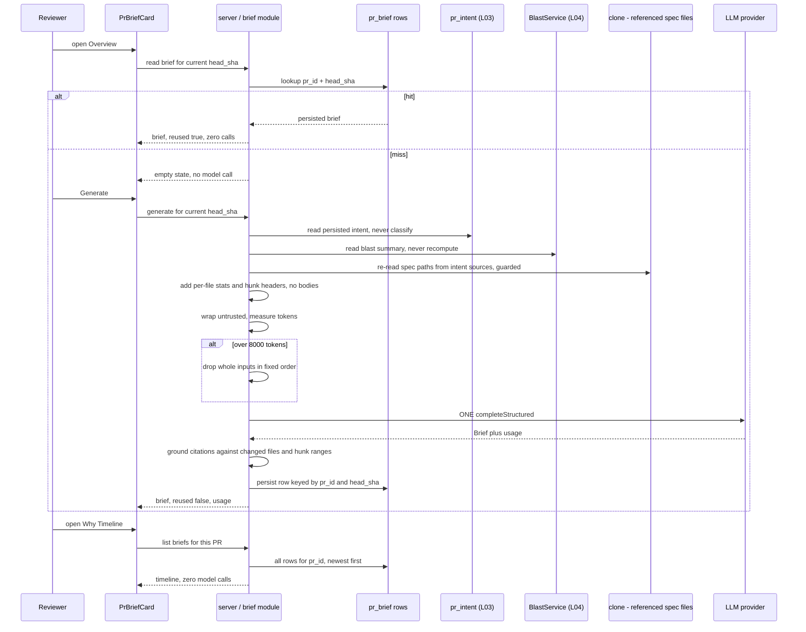
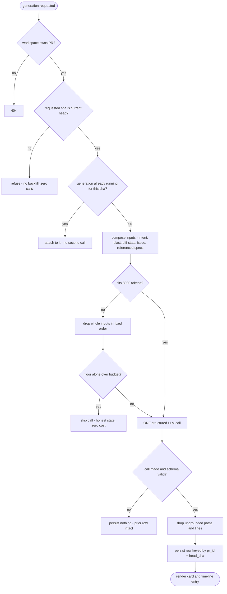

# Spec: PR Brief & Why Timeline
Spec ID: SPEC-03
Status: draft
Supersedes: —
Modules: server, client

## Problem & User

A reviewer opening a PR in DevDigest today gets four disconnected panels and no
answer to the first question they actually have: *what is this PR doing, why,
and where should I look first?*

- `PrBriefBanner` is called "PR Brief" but composes nothing
  (`client/.../OverviewTab/_components/PrBriefBanner/PrBriefBanner.tsx:24-62`):
  it re-renders `VerdictBanner` from the latest completed review. No LLM-authored
  what/why prose, no risk level. Before a review exists it renders
  `brief.unavailable` — "Brief not available yet."
- `IntentCard` (L03) has the PR's stated intent, and `BlastRadiusCard` (L04) has
  the impact map, but nothing joins them into one judgement. The reviewer does
  the joining in their head, per PR.
- Nothing anywhere tells a reviewer **where to start reading**. The Files-changed
  tab can order files by smart-diff role (`SmartDiffViewer.tsx:104-124`), but
  role is not urgency: a `core` file with a leaked key sorts identically to a
  `core` file with a rename.

The second problem is temporal. A PR is not one artifact — it is a sequence of
head SHAs. A reviewer who reviewed at commit A and returns after the author
pushed C has no way to see what changed about the PR's *intent or risk*, only
that the diff moved. `pr_intent` cannot answer this: it is one row per PR
(`server/src/db/schema/reviews.ts:49-52`, `pr_id` primary key) and each
re-classification overwrites the previous one. The history is destroyed by
design.

As with SPEC-02, the starter ships scaffolding for this and wires none of it —
but here the scaffolding is actively **misleading**, which is why the decisions
have to be written down:

1. **A table exists, never written.** `pr_brief`
   (`db/schema/reviews.ts:74-79`) — `pr_id` **primary key**, one untyped `json`
   column. No repository, no service, no route references it anywhere in
   `server/src` (verified by grep: the only hits are `db/schema.ts:33,64`
   re-exports). Its single-row-per-PR shape is precisely what Why Timeline
   cannot use.
2. **A contract exists, and it is the wrong shape.** `PrBrief`
   (`vendor/shared/contracts/brief.ts:157-164`) is
   `{intent, blast, risks, history}` — a container that re-embeds whole copies
   of Intent and BlastRadius, both of which are already independently persisted
   and independently served. The product needs a *composed judgement*, not a
   fourth copy of its inputs.
3. **A model slot exists, unused.** `risk_brief` in `FEATURE_MODELS`
   (`vendor/shared/contracts/platform.ts:59-64`), default `openai` /
   `gpt-4.1` — resolvable via `resolveFeatureModel`
   (`modules/settings/feature-models.ts:51-55`). Note the default is a
   premium model, unlike `review_intent`'s `deepseek-v4-flash`.
4. **Two names are already taken by different features.** `WhyTimeline`
   (`vendor/shared/contracts/why.ts:30-39`) already means *git-blame for one
   file/line* — "why does this line exist" — and `brief.why.*` in
   `client/messages/en/brief.json` already holds its copy (`blame`,
   `noCommits`). Neither is built, but both are reserved, and the requested
   "Why Timeline" is an unrelated concept.
5. **The "history" the contract offers is a different history — and it already
   shipped.** `PrHistory`/`PrHistoryItem` (`brief.ts:106-120`) means *prior PRs
   touching these files*. That feature exists today as `prior_prs` on
   `BlastRadiusResponse` (`review-api.ts:83-105`), served by
   `BlastService.getBlastRadius` (`modules/blast/service.ts:44-57`). It is not
   Why Timeline and must not be conflated with it.

So the work is composition, one new persistence decision, and a set of naming
disambiguations — over inputs that, unusually, all already exist and are all
already persisted.

## Goals / Non-goals

### Goals

- One server-composed **`Brief { what, why, risk_level, risks[], review_focus[] }`**
  per PR *state*, produced by **exactly one structured LLM call**.
- The call **reads** persisted L03 intent and L04 blast output as inputs — never
  reclassifies intent, never recomputes blast.
- Diff information reaches the model as **stats and hunk headers only**, never
  hunk bodies — the same signature-level guarantee the intent classifier has
  (`modules/reviews/intent-inputs.ts:11-17`).
- **Cached by exact PR state** (`head_sha`). Re-opening a PR state costs zero
  model calls; only an explicit regenerate spends one.
- Every `risks[].file_refs` entry and every `review_focus[]` entry **cites a file
  that is really in this PR's changed set**, and every `review_focus[].line`
  falls inside a real changed hunk range — enforced in code, by dropping, after
  the call.
- A hard, measured **8 000-token input budget** with a fixed, documented
  overflow-trim order.
- **Why Timeline**: the per-`head_sha` briefs a PR has accumulated, listed
  newest-first, readable with zero model calls.
- A `PrBriefCard` showing risk level, what/why prose, and a **clickable
  review-focus list that navigates to `path:line` in the Files-changed tab**.

### Non-goals (this iteration)

- **Re-implementing intent classification or blast-radius computation.** Brief
  reads `pr_intent` and `BlastService`'s output. It never calls
  `IntentService.classify`, and never touches `repoIntel`.
- **Changing the `repo-intel` pipeline** — Brief makes no facade call at all;
  it consumes blast's already-composed response.
- **Prior-PRs ("which other PRs touched these files")**. Already shipped as
  `prior_prs` (`blast/service.ts:44-57`, `review-api.ts:83-105`) and rendered by
  `BlastRadiusCard`. Brief neither duplicates nor re-renders it. The
  `PrHistory` contract in `brief.ts:106-120` is therefore **dead scaffolding
  superseded by `PriorPr`** — recorded as a deferred non-goal (D-2), not a
  by-product of this work.
- **Any new document-attachment mechanism, and any dependency on Project
  Context's attachment sets.** The specs/docs input is exactly the set of
  `.md` files the PR description already references, as resolved by the intent
  path (D-10). Project Context's `resolveEffectiveSet` is agent-scoped and is
  deliberately not consumed here (E-13).
- **Backfilling briefs for head SHAs that have already gone by** (E-1/D-6): the
  inputs no longer exist. Why Timeline shows what was generated, with honest
  gaps.
- **git-why / blame** (`contracts/why.ts`) — a different feature that happens to
  own the word "why" (D-3).
- **workflow-retro and cost reporting** — named as optional extras in the source
  assignment, explicitly excluded.
- **Feeding the Brief back into the reviewer prompt.** No `PromptParts` change,
  no `run-executor` change. Brief consumes review-adjacent data; it does not
  become review context.
- **Auto-generation on PR open, import, or poll.** A generation is always an
  explicit user action, following `IntentCard`'s empty→derive precedent (D-8).
- **Per-user briefs.** One brief per (PR, head_sha), shared across the
  workspace.
- **MCP / pre-push CLI parity**, mirroring SPEC-01's and SPEC-02's deferral.

## User stories

- As a reviewer opening a PR cold, I read one card that tells me what this PR
  changes, why, and how risky it is — composed from the intent and blast data
  the product already derived, not re-derived.
- As that reviewer, I read a short **Review focus** list and click
  `src/config.ts:12 — live Stripe key committed in plaintext`, landing on that
  line in the Files-changed tab instead of hunting for it.
- As a reviewer returning to a PR after the author pushed two more commits, I
  open the Why Timeline and see that the brief at commit A said "low risk,
  config only" and the brief at commit C says "high risk, auth surface touched"
  — so I know to re-review rather than rubber-stamp.
- As a reviewer who reopens the same PR five times a day, I never spend a model
  call doing it, and I can tell from the card that what I'm reading is cached
  and which commit it describes.
- As a reviewer whose PR just got a new commit, I see the brief marked stale
  against the current head SHA and choose whether to spend a call.
- As a cost-conscious workspace admin, I point Brief at a cheaper model in
  Settings → Feature Models and the next generation uses it.
- As a reviewer of a PR whose brief cited a file that isn't in the diff, I never
  see that citation — it was dropped server-side before it was ever stored.

## Acceptance criteria (EARS)

### Composition and the one-call rule

- **AC-1** WHEN a user opens the Overview tab of a PR that already has a
  persisted brief for the PR's **current** `head_sha`, the system shall render
  that brief and shall make no model call. (verify: integration test asserting
  zero `completeStructured` calls on the mock provider, `adapters/mocks.ts`)
- **AC-2** WHERE no brief exists for the current `head_sha`, the card shall
  render an honest empty state offering an explicit **Generate** action, and
  shall not issue a model call on mount — the same empty→derive shape
  `IntentCard` already uses. (verify: component test asserting no request is
  issued on render; integration test asserting zero model calls on a bare PR)
- **AC-3** WHEN a user explicitly requests a generation or a regeneration, the
  system shall issue **exactly one** structured LLM call returning
  `Brief { what, why, risk_level, risks[], review_focus[] }`, and no other model
  call for that generation. (verify: integration test asserting
  `completeStructured` called once, `complete` zero times)
- **AC-4** The system shall assemble that call's input from, and only from: the
  persisted intent record for the PR, the blast summary the blast module
  already computes, per-file diff stats with synthesized hunk headers, the
  linked issue resolved through the existing intent resolution path, and the
  PR-referenced spec/plan files of AC-5. (verify: unit test on the assembled
  messages)
- **AC-5** The specs/docs input shall be the `.md` files the PR description
  itself references, taken from the persisted intent record's resolved
  `sources[]` entries of kind `spec_file` — the set `specPathsFrom`
  (`modules/reviews/intent-inputs.ts:194-198`) already extracts — and each file
  shall be re-read from the clone at generation time through the existing
  containment guard (`isInsideClone`, `intent-inputs.ts:138-142`), never read
  from a cached body and never resolved outside the clone. The system shall not
  read Project Context attachment sets and shall introduce no second
  document-attachment mechanism (D-10, E-13). (verify: unit test asserting the
  path set equals the record's resolved `spec_file` refs; integration test with
  a `../../etc/passwd`-shaped stored ref asserting no read occurs)
- **AC-6** The system shall read the persisted intent record and shall never
  invoke intent classification itself. IF no intent record exists, or its
  `head_sha` differs from the PR's current `head_sha`, THEN the system shall
  compose the brief without it and shall record that input as unresolved rather
  than classifying. (verify: integration test with an absent and with a stale
  `pr_intent` row, asserting `IntentService.classify` is never called)
- **AC-7** The system shall obtain blast information from the existing blast
  service output (`BlastService.getBlastRadius`, `modules/blast/service.ts:14`)
  and shall make no `repoIntel` call and no model call for it. (verify:
  integration test asserting no `repoIntel.getBlastRadius` call from the brief
  path)
- **AC-8** The model call's input shall never contain diff or hunk **body**
  text. Diff content shall reach it only as per-file `path (+a/-d)` lines and
  synthesized `@@ -a,b +c,d @@` headers, via the narrowed summary type that has
  no body field (`intent-inputs.ts:21-83`). (verify: unit test asserting no
  patch text appears in the assembled messages, using a fixture whose patch
  contains a unique sentinel string)
- **AC-9** The model shall be resolved through
  `resolveFeatureModel(container, workspaceId, 'risk_brief')`
  (`feature-models.ts:51-55`), honouring a workspace override and otherwise the
  registry default (`platform.ts:59-64`). (verify: integration test with and
  without an override row)
- **AC-10** The system shall persist, per generated brief: the `head_sha` it
  describes, provider, model, the measured input token count, `tokensIn` /
  `tokensOut` / `costUsd` from `StructuredResult`, and a generation timestamp.
  (verify: integration test asserting persisted values match the mock
  provider's returned usage)

### Caching by PR state — the zero-call contract

- **AC-11** The system shall key a brief by the pair (`pr_id`, `head_sha`) and
  shall return, alongside the brief, an explicit indicator of whether this
  invocation reused a persisted record or made a fresh call — the same
  `{ record, reused }` shape `IntentService.getOrClassify` returns
  (`intent-service.ts:114-128`, ADR 0003). (verify: integration test asserting
  `reused: true` on the second read and `false` on the first generation)
- **AC-12** WHEN a brief already exists for the requested (`pr_id`,
  `head_sha`) and no explicit regeneration was requested, the system shall
  return the persisted brief and shall make zero model calls. (verify:
  integration test)
- **AC-13** WHEN a user requests an explicit regeneration for the current
  `head_sha`, the system shall make one fresh model call and shall **replace**
  the brief stored for that `head_sha` rather than appending a second row for
  the same SHA. (verify: integration test — two regenerations leave exactly one
  row for that SHA)
- **AC-14** WHEN a user lists the Why Timeline, the system shall serve every
  persisted brief for the PR from storage with **zero** model calls, regardless
  of how many SHAs it covers. (verify: integration test with three persisted
  briefs asserting zero calls)
- **AC-15** WHEN a user opens a specific older brief from the timeline, the
  system shall serve it from storage with zero model calls. (verify: integration
  test)
- **AC-16** The system shall not offer, and shall not perform, generation for
  any `head_sha` other than the PR's current one — a brief for a superseded
  commit can only exist if it was generated while that commit was current
  (E-1). (verify: integration test asserting a generation request naming a
  non-current SHA is refused without a model call)
- **AC-17** WHERE the PR's current `head_sha` has no brief but earlier SHAs do,
  the card shall present the state as **stale** — naming the commit the newest
  brief describes — rather than presenting an older brief as current. (verify:
  component test; integration test after a head-SHA change)

### Grounding — the model phrases, never invents

- **AC-18** IF a `risks[].file_refs` entry names a path that is not in the PR's
  changed-file set, THEN the system shall drop that path before persisting the
  brief. (verify: unit test — a stub response citing `src/does-not-exist.ts`
  persists without it)
- **AC-19** IF a `review_focus[]` entry names a path not in the changed-file
  set, or a line that falls outside every changed hunk range for that file,
  THEN the system shall drop that entry before persisting. (verify: unit test
  with an out-of-range line and an unknown path, one case each)
- **AC-20** The system shall enforce AC-18 and AC-19 **in code after the call**,
  never by trusting the model's compliance with its prompt, and shall drop the
  offending item rather than repair it — the discard contract
  `groundFindings` (`reviewer-core/src/grounding.ts:52-84`) and
  `ConventionsService.groundCandidates`
  (`modules/conventions/service.ts:139-166`) both already apply. (verify: unit
  test asserting a dropped item is absent, not rewritten)
- **AC-21** IF grounding removes every entry from `risks[]` or
  `review_focus[]`, THEN the system shall persist the brief with that list empty
  and shall surface the emptiness honestly, rather than fabricating an entry or
  failing the generation. (verify: integration test with a fully-ungrounded stub
  response)
- **AC-22** The system shall record, per generation, how many risk and
  review-focus items were dropped by grounding. (verify: integration test
  asserting the counts persist)

### Input budget — 8 000 tokens, hard

- **AC-23** The system shall enforce a hard input budget of **8 000 tokens** on
  the assembled input to the structured call. The unit is tokens of the fully
  assembled call input — every message the call carries, system and user — and
  the count shall be produced by the DI-provided tokenizer
  (`container.tokenizer.count`, js-tiktoken `cl100k_base`,
  `adapters/tokenizer/index.ts:22-46`), measured **before** the call is issued.
  (verify: unit test asserting the assembled input measures ≤ 8 000 for an
  oversized fixture)
- **AC-24** WHEN the assembled input exceeds the budget, the system shall drop
  whole inputs in this fixed order until it fits, and shall never truncate an
  item mid-content: (1) PR-referenced spec/plan file excerpts, dropped
  whole-document from the lowest-priority end; (2) the linked issue body;
  (3) per-file hunk headers, collapsed to `path (+a/-d)` lines only; (4) the
  changed-file list, truncated to the largest-by-line-count files with an
  explicit "+N more files not shown" marker. (verify: unit test per stage
  asserting the drop order and that no partial item survives)
- **AC-25** The system shall never drop the PR title, the persisted intent
  block, or the blast summary line to satisfy the budget — those are the
  composition's floor. IF that floor alone exceeds 8 000 tokens, THEN the system
  shall skip the model call entirely, make zero calls, and surface an honest
  budget-exceeded state. (verify: integration test with an oversized intent
  fixture asserting zero model calls)
- **AC-26** The system shall record, per generation, the measured input token
  count and which inputs the budget dropped. (verify: integration test
  asserting the dropped-input record persists)
- **AC-27** The system shall apply its own sub-cap to the spec-file input,
  strictly below the 8 000 total, so that document text alone cannot consume the
  whole budget. The intent path's own per-file caps are the anchor and the
  warning: it admits up to 3 files at 20 000 chars each
  (`intent-service.ts:49-50`), and a single such file is roughly 5 000 tokens by
  the `chars / 4` heuristic — over half this budget. (verify: unit test with an
  oversized spec-file fixture asserting the sub-cap holds and the total stays
  within AC-23)

### Client — PR Brief card and Why Timeline

- **AC-28** The PR Brief card shall show the brief's `risk_level` and its
  `what` / `why` prose, and shall identify which commit the brief describes.
  (verify: component test)
- **AC-29** The card shall render `review_focus[]` as an ordered list where each
  entry shows `path:line` and its one-line reason, and each entry shall be
  activatable. (verify: component test)
- **AC-30** WHEN a user activates a `review_focus[]` entry, the system shall
  navigate to the Files-changed tab, expand that file, and scroll to that line.
  The Files-changed view already resolves a line to a DOM anchor
  (`data-diff-line="${path}:${line}"`, `CodeLine.tsx:83`) and already
  implements expand-then-scroll (`SmartDiffViewer.tsx:91-100`), but that path
  is reachable only from **inside** the mounted viewer via a callback prop —
  there is no URL parameter for a file/line today (`page.tsx:72-97` supports
  only `tab`, `trace`, `run`, `severity`, `finding`). A cross-tab entry point
  is therefore required. (verify: component test on the navigation target;
  integration/component test asserting the deep-link survives a reload)
- **AC-31** IF a `review_focus[]` entry's file is not present in the currently
  loaded Files-changed data — because the PR advanced past the brief's
  `head_sha` — THEN activating it shall degrade to an explanatory state and
  shall not navigate to an arbitrary file. (verify: component test with a stale
  brief)
- **AC-32** WHERE the card shows a numeric score gauge, that number shall be the
  persisted review score already served for the PR
  (`reviews.score`, `db/schema/reviews.ts:24`, as `PrBriefBanner`/`VerdictBanner`
  already render it), never a model-authored figure, and the gauge shall be
  omitted when no completed review exists rather than showing a placeholder
  number. (verify: component test with and without a review)
- **AC-33** The Why Timeline shall list one entry per persisted brief, newest
  first, each showing its `head_sha`, generation time, and `risk_level`, and
  shall visually mark an entry whose `risk_level` differs from the entry before
  it. (verify: component test with three briefs of differing risk levels)
- **AC-34** The Why Timeline shall state honestly that it lists only commits for
  which a brief was generated, and shall not imply it covers every commit of the
  PR (E-1). (verify: component test asserting the disclosure renders)
- **AC-35** New client copy shall extend the existing `brief` i18n namespace
  (`client/messages/en/brief.json`) without redefining any key already in use.
  `brief.title`, `brief.unavailable`, `brief.unavailableHint`,
  `brief.block.*`, `brief.noRisks`, `brief.noHistory` and the whole
  `brief.why.*` subtree are already present — `brief.why.*` belongs to git-why
  and shall not be reused for the Why Timeline (D-3). (verify: unit test
  asserting no key collision; manual — copy review)

### Access, safety and integrity

- **AC-36** Every brief route shall resolve tenancy via
  `getContext(app.container, req)` before any work and shall respond 404 for a
  PR outside the caller's workspace — the barrier every existing PR-scoped
  route uses (`blast/routes.ts:22-23`). (verify: integration test — PR of
  workspace A addressed from workspace B)
- **AC-37** All PR- and repo-derived text placed into the model call — title,
  description, linked issue, intent text, blast summary, file paths, spec-file
  excerpts — shall be wrapped with `wrapUntrusted`
  (`reviewer-core/src/prompt.ts`, as `intent-service.ts:262-278` already does),
  and the system message shall carry an injection guard equivalent to
  `CLASSIFIER_INJECTION_GUARD` (`intent-service.ts:75-80`). No such text shall
  be concatenated into the instruction message unwrapped. A spec file's own
  path shall live inside the untrusted block, never in a trusted heading
  position (the pattern `intent-service.ts:269-277` states). (verify: unit test
  on the assembled messages asserting every input block is delimiter-wrapped)
- **AC-38** The generation route shall be rate-limited at the same rate as the
  other model-spending PR routes — 10 requests per minute
  (`modules/reviews/routes.ts:43,65`). (verify: integration test; note rate
  limiting is disabled under `NODE_ENV=test`, per `server/AGENTS.md`, so this
  requires explicit enablement in the test)
- **AC-39** The system shall never use a model-authored path to read, write or
  resolve a filesystem location. Paths from the model shall be used only to
  match against the changed-file set (AC-18/AC-19) and to build an in-app
  navigation target after that match succeeds. (verify: unit test with a
  `../../etc/passwd`-shaped path in a stub response)
- **AC-40** Route params and bodies shall be zod-validated route schemas per
  `server/AGENTS.md`, and the persisted brief JSON shall be parsed against its
  contract on read as well as on write, so a malformed stored row degrades
  instead of crashing the page. (verify: integration test with a hand-corrupted
  row)
- **AC-41** The system shall log a generation's outcome with PR id, head SHA,
  input token count, dropped-input and dropped-citation counts, model, tokens
  and cost — and shall never log diff bodies, spec-file contents, the assembled
  input text, or the raw model response body (`run-executor.ts` states this
  rule; `intent-service.ts:36-39` restates it). (verify: manual — code review)
- **AC-42** IF the model call fails, times out, or returns a response that fails
  schema validation after the adapter's configured retries, THEN the system
  shall persist no brief for that attempt, shall leave any previously stored
  brief for that `head_sha` unchanged, and shall not retry automatically.
  (verify: integration test with a throwing provider and with a
  schema-violating provider)

### Process / Definition of Done

- **AC-43** This Spec and its Development Plan shall be **committed to git
  before any feature code for SPEC-03 is committed**. The commit containing the
  first line of implementation shall not be the commit that introduces either
  document. (verify: manual — `git log` review by the human coordinator)
- **AC-44** The Development Plan produced from this Spec shall end with a
  short, clearly-marked section addressed to the human coordinator, naming what
  an independent reviewer *of that specific plan* should scrutinise — at
  minimum: whether the (`pr_id`, `head_sha`) cache key design is race-safe
  under concurrent generation, whether the AC-24 trim order is the right
  priority ordering, and whether the AC-16 "current SHA only" rule leaves the
  timeline usefully complete. The cross-model review itself happens **outside**
  this pipeline and is not orchestrated by this Spec. (verify: manual — plan
  review)

## Edge cases

- **E-1 The timeline is inherently gappy, and cannot be backfilled.** A brief
  exists for a `head_sha` only if someone generated one while that SHA was
  current. Worse, the inputs to a retroactive generation are gone:
  `GET /pulls/:id` **deletes and reinserts** `pr_files` and `pr_commits` on
  every successful refresh (`modules/pulls/routes.ts:232-255`), so an older
  commit's per-file diff stats no longer exist locally. AC-16 and AC-34 are the
  consequence: honest gaps, no backfill.
- **E-2 `pr_files` is empty.** It is populated only once `GET /pulls/:id` has
  run — `BlastService` already treats an empty list as "not synced yet", never
  as "no impact", and says so in a `degraded` response
  (`blast/service.ts:20-34`). Brief inherits the same state: with no changed
  files there is nothing to ground citations against, so AC-18/AC-19 would drop
  everything (AC-21). Generation on this state costs a call for a brief that
  cannot cite anything.
- **E-3 No persisted intent, or intent stale against the current SHA.** Both are
  normal: `GET /pulls/:id/intent` returns `null` as a valid empty state
  (intent-layer doc), and head-SHA change triggers **no** automatic
  re-classification. Brief must degrade per AC-6, not classify. This also
  empties the spec-file input, since those paths come from the intent record's
  `sources[]` (AC-5, D-10) — a brief with no intent is thin on two axes at once,
  and must say so rather than reading as merely terse.
- **E-4 Blast degraded.** `BlastRadiusResponse.status` is
  `full | partial | degraded` with a human `reason`
  (`review-api.ts:101-105`); `deriveStatus` sets it from the index state. A
  brief composed over a degraded blast is thinner and must say so, not present
  the same confidence as one composed over a full index.
- **E-5 Two reviewers hit Generate at once for the same SHA.** Without a guard
  both pay for a call and one result is discarded. Rate limiting cannot be
  relied on for this: it is fully disabled under `NODE_ENV=test`
  (`server/AGENTS.md`), so the concurrency guard belongs in the feature.
- **E-6 The head SHA advances between assembling inputs and persisting.** The
  brief must be stored against the SHA whose inputs were actually read, or the
  timeline silently attributes a brief to the wrong commit.
- **E-7 The model returns a plausible file that is not in the diff.** The reason
  AC-18 exists; the conventions extractor already hit exactly this and answered
  it with a verbatim evidence check plus a code-side discard
  (`conventions/service.ts:139-166`).
- **E-8 The model returns a real file with a line outside the diff.** Distinct
  from E-7 and more insidious: the path check passes, the link works, and the
  reviewer lands on an unchanged line believing it is the risk. This is exactly
  the case `groundFindings`' range-intersection test was written for
  (`grounding.ts:41-46,72-80`), and the reason AC-19 checks the line, not just
  the path.
- **E-9 `groundFindings` cannot be reused as-is.** Its signature is
  `(Finding[], UnifiedDiff)` (`grounding.ts:52`), and `buildLineIndex` is not
  re-exported by the package barrel — `platform/grounding.ts:6` re-exports only
  `groundFindings`, `groundingSummary`, `GroundingResult`. Brief's items are
  not `Finding`s. Whether to shape them into that signature or implement the
  same rule locally is a Development Plan choice; the *behaviour* (AC-19/AC-20)
  is not.
- **E-10 The full diff is available server-side even though the model never
  sees it.** `loadDiff` returns a complete `UnifiedDiff`
  (`reviews/diff-loader.ts:12-30`); `toIntentDiffSummary` narrows it for the
  prompt (`intent-inputs.ts:51-65`). AC-8 constrains only what enters the call —
  grounding may and should use the full diff's real hunk ranges.
- **E-11 Tokenizer accuracy is not guaranteed.** `TiktokenTokenizer` silently
  falls back to `ceil(chars / 4)` and sets `broken = true` if the BPE ranks
  fail to load (`adapters/tokenizer/index.ts:33-45`). The 8 000 cap is
  therefore enforced against a count that may be an approximation, and the
  provider's own tokenizer differs from `cl100k_base` for non-OpenAI models
  anyway. The cap is a budget guard, not a provider-exact guarantee — AC-23
  fixes the measurement so it is at least reproducible.
- **E-12 One referenced spec file can nearly exhaust the budget.** The intent
  path admits up to 3 spec files at 20 000 chars each
  (`intent-service.ts:49-50`) — roughly 5 000 tokens for a single file by the
  `chars / 4` heuristic, against a total budget of 8 000. Reusing those caps
  unchanged would let one linked design doc starve intent, blast and the file
  list. AC-27.
- **E-13 Project Context attachments are agent-scoped, which is why Brief does
  not read them.** Every row in `project_context_attachments` binds a path to a
  `surface`/`surfaceId` that is a skill or an agent
  (`db/schema/project-context.ts:20-46`), and the resolve API is
  `resolveEffectiveSet(workspaceId, agentId, repoId)`
  (`project-context/service.ts:334-338`). Brief has no agent, so there is no
  repo-level "documents relevant to this PR" set to read there. Resolved by
  D-10: the specs input comes from the PR's own references instead.
- **E-14 A stored spec-file path escapes the clone.** `sources[].ref` is a path
  extracted from an author-written PR description and persisted; the intent path
  already guards each read with `isInsideClone`
  (`intent-service.ts:221-227`, `intent-inputs.ts:138-142`). Brief re-reads
  those files itself and must clear the same guard — a persisted path is not a
  trusted path merely because it survived a previous write (AC-5).
- **E-15 A referenced spec file was deleted, renamed, or the repo has no
  clone.** All three are already normal in the intent path, which records the
  source as unresolved rather than failing (`intent-service.ts:214-234`). Brief
  must degrade identically: the file is skipped, never fabricated, and its
  absence is recorded.
- **E-16 Prompt injection from PR and repo content.** PR title, description,
  linked issue body, spec-file excerpts and file paths all flow into a model
  call. This call does not go through `assemblePrompt`, so it inherits neither
  `wrapUntrusted` nor `INJECTION_GUARD` automatically — the identical gap
  `IntentService` had to close with its own `CLASSIFIER_INJECTION_GUARD`
  (`intent-service.ts:70-94`). Sharper here than for intent, because a PR author
  can point the description at any `.md` file in the clone and that file's text
  reaches this prompt too. AC-37.
- **E-17 A crafted PR turns Review focus into a lure.** Review focus is a list
  of clickable, model-authored file references presented to a reviewer as
  "read these first". A PR author controls the description and the file paths
  that shape it. Grounding (AC-18/AC-19) bounds this to files really in the
  diff — which is what makes the list safe to click at all.
- **E-18 Two features named "why", plus two features named "history".**
  `WhyTimeline` already means git-blame (`contracts/why.ts:30-39`) and
  `brief.why.*` already holds its copy; `PrHistory` already means prior PRs and
  shipped as `prior_prs`. Shipping a third and fourth meaning under the same
  identifiers would make both unreadable. D-2, D-3.
- **E-19 Corrupted or schema-drifted stored brief JSON.** The column is untyped
  `jsonb` (`db/schema/reviews.ts:78`); a row written by an earlier shape must
  degrade, not crash the Overview tab (AC-40). The same case SPEC-02 E-15
  records for `onboarding.json`.
- **E-20 Provider returns no cost.** `costUsd` is nullable; the cost display
  must handle null without inventing a figure (SPEC-02 E-16, same contract).
- **E-21 A PR with no completed review.** `PrBriefBanner` currently *is* the
  review verdict, so today the panel is empty until a review runs. After this
  change the Brief card can be populated with no review at all — meaning the
  score gauge has no number (AC-32) while the risk level does. The two must not
  look like the same measurement.
- **E-22 The Files-changed tab's smart order may be unavailable.** The
  expand-and-scroll implementation lives in `SmartDiffViewer`
  (`SmartDiffViewer.tsx:91-100`); when smart-diff fails or the user selects
  "original" order, `DiffTab` renders the plain `DiffViewer` instead
  (`DiffTab.tsx:119-130`), which takes no jump callback. A review-focus link
  must behave predictably in both order modes.

## Non-functional requirements

Checked against the `security` skill (OWASP Top 10:2025); non-security
categories are covered where this feature actually implicates them.

**Security**

- **A01 Broken access control / tenant isolation.** Every read and generation is
  workspace-scoped through `getContext` before any PR work (AC-36), the barrier
  pattern every existing PR-scoped route already applies
  (`blast/routes.ts:22-23`). The Why Timeline is a new enumeration surface over
  PR-scoped rows and needs the same barrier on the list endpoint as on the read
  endpoint — an authorization check on "the PR" that the list route skips would
  be a textbook IDOR.
- **A05 Prompt injection.** PR-author-controlled text reaches a model call with
  no shared guard to inherit (E-16). Defence is structural: `wrapUntrusted`
  delimiting plus an explicit injection-guard system paragraph (AC-37). The
  model's *output* is then treated as untrusted in turn — every cited path and
  line is re-verified in code (AC-18–AC-20), which is the only defence that
  survives a successful injection.
- **A05 XSS.** `what`, `why`, risk explanations and review-focus reasons are
  model-authored strings rendered in the client. They must go through the
  centralized `react-markdown` instance
  (`client/src/vendor/ui/primitives/Markdown.tsx`, per `client/AGENTS.md`) or be
  rendered as plain text — never `dangerouslySetInnerHTML`, and never a second
  renderer.
- **A05/A08 Path handling.** Two distinct path flows, guarded differently.
  *Inbound*: persisted `spec_file` refs are re-read from the clone and must
  clear `isInsideClone` on every read, since a stored path is still an
  author-authored path (AC-5, E-14). *Outbound*: model-authored paths are never
  resolved against the filesystem at all (AC-39) — they are matched against an
  allowlist, the PR's actual changed-file set, and used only to build an in-app
  navigation target after that match. The outbound rule is stricter than
  SPEC-02 AC-35's containment guard because Brief has no legitimate reason to
  touch the filesystem with a model path.
- **A04 Outbound data exposure.** Generating a brief ships PR metadata, intent
  text, file paths and spec-file excerpts to a third-party model provider. The
  8 000-token cap bounds the volume; the no-hunk-bodies rule (AC-8) bounds the
  *sensitivity*, since diff bodies are where an accidentally-committed secret
  would actually live. That makes AC-8 a data-exposure control, not only a cost
  control.
- **A06 Insecure design / cost abuse.** Generation is the expensive
  user-triggerable path: no auto-generation (AC-2), explicit action only, a
  rate limit matching the other model-spending routes (AC-38), a bounded input
  (AC-23–AC-27), and a single in-flight generation per (PR, SHA) (E-5). The
  `risk_brief` default is a premium model (`gpt-4.1`, `platform.ts:62-63`) —
  materially more expensive per call than `review_intent`'s flash default, which
  is what makes the cache contract (AC-12) a cost control rather than a nicety.
- **A08 Integrity.** The model response is schema-validated before persistence,
  the stored row is re-validated on read (AC-40), and route bodies are
  zod-validated per `server/AGENTS.md`. Nothing from the model is spread into a
  database write; grounding output is constructed field by field.
- **A09 Logging.** Ids, SHAs, counts, token totals, model, cost — never diff
  bodies, spec-file contents, the assembled input, or the raw response (AC-41).
- **A10 Exceptional conditions / fail-closed.** A failed or unusable call
  persists nothing and leaves prior state intact (AC-42); a degraded input set
  produces an honest thin brief (AC-21), never a fabricated one.

**Cost.** One structured call per explicit generation; zero calls on every
read, every timeline listing, and every historical open (AC-1, AC-12, AC-14,
AC-15); zero calls when the budget floor cannot fit (AC-25). Per-generation
usage is persisted (AC-10) so the claim is auditable rather than asserted — the
same gap SPEC-02 AC-28 closed after finding that the conventions feature
discards its own usage numbers.

**Performance.** Reads are a single indexed row lookup (current brief) or a
per-PR row scan (timeline), so the (`pr_id`, `head_sha`) key needs an index
that serves both. A generation performs bounded reads plus one model call and
is dominated by provider latency. No concrete latency or timeout target has
been agreed (Q-2).

**Availability / degradation.** Every degraded input path renders content rather
than an error: no intent (AC-6), degraded blast (E-4), unsynced files (E-2),
missing spec file (E-15), fully-ungrounded response (AC-21), failed call
(AC-42). The Overview tab must never fail to render because a brief is missing
or malformed (AC-40).

**Observability.** The feature's primary observable is the distinction between
*no brief yet*, *stale brief*, *brief generated over degraded inputs*, and
*generation failed* — four states a reviewer would otherwise read identically as
"thin brief". Generation usage (AC-10), dropped-citation counts (AC-22) and
dropped-input counts (AC-26) complete it: a brief that lost half its citations
to grounding is a signal about the model, not just a quieter card.

**Maintainability / configuration.** A new server module under
`server/src/modules/` following routes → service → port ← adapter, checked by
`pnpm arch:check`, placed outside `modules/reviews/` because — unlike
`IntentService`, which colocated for stated reasons
(`intent-service.ts:23-34`) — Brief owns a new aggregate and reads three
modules' output; `modules/blast/` is the precedent for a consumer module. Note
Brief does need two pure helpers that live in `modules/reviews`
(`specPathsFrom`, `isInsideClone`, `intent-inputs.ts:138-142,194-198`); reusing
them rather than copying them is the intent, and whether that import is
acceptable to the dependency-cruiser boundary check is a Development Plan
concern. Engineering caps (the 8 000 budget, the spec-file sub-cap, list caps)
belong in the module's own `constants.ts`, per `project-context/constants.ts`'s
pattern. Any contract change must be hand-mirrored into **both**
`server/src/vendor/shared` and `client/src/vendor/shared` (root `AGENTS.md` —
no sync script), and any schema change goes through `pnpm db:generate`, never a
hand-edited migration.

## Module interaction / API contracts

Two modules are touched. **server**: a new consumer module composing persisted
intent, blast output and diff stats into one structured call, grounding the
result, and persisting it per (PR, SHA). **client**: the Overview tab's Brief
card and a Why Timeline panel, plus a cross-tab navigation entry point into
Files-changed. **reviewer-core is not touched** — this call does not go through
`assemblePrompt`, which is exactly why AC-37 restates the untrusted-wrapping
requirement locally.

**Contracts this Spec requires** (shapes, not implementations):

- A **`Brief`** shape: `what`, `why`, `risk_level`, `risks[]`,
  `review_focus[]`. `risks[]` reuses the existing `Risk`
  (`brief.ts:92-99` — `kind`/`title`/`explanation`/`severity`/`file_refs`)
  **as-is**: its fields are exactly what the product needs and its
  `RiskSeverity` enum (`brief.ts:89`) is the natural type for `risk_level`
  too. `review_focus[]` needs a shape `Risk` cannot express, because
  `file_refs` is `string[]` with no line numbers and no per-item reason — a
  new entry shape carrying `path`, `line` and a one-line reason is required
  (D-1).
- A **brief record** shape: the `Brief` plus the `head_sha` it describes, the
  provider/model, the measured input tokens, the usage figures, the
  dropped-citation and dropped-input counts, and a generation timestamp.
- A **read** contract for the current PR state, carrying the brief or an
  explicit empty state, plus the reused-vs-fresh indicator (AC-11) and the
  staleness relationship to the PR's current `head_sha` (AC-17).
- A **generation** contract, PR-scoped, rate-limited, that refuses any SHA other
  than the current head (AC-16).
- A **timeline** contract: the PR's persisted briefs, newest first, each with
  `head_sha`, timestamp and `risk_level` at minimum — named to avoid the
  `WhyTimeline` and `PrHistory` collisions (D-3).
- **Storage**: repurpose the existing, never-written `pr_brief` table
  (`db/schema/reviews.ts:74-79`) from one-row-per-PR to one-row-per-(PR, SHA),
  per D-4.
- **Unchanged**: `PromptParts`, `assemblePrompt`, the run trace, `pr_intent`,
  every `repoIntel` signature, `BlastRadiusResponse`, and the Project Context
  module in its entirety. This feature adds no method to L03, L04 or SPEC-01 —
  it reads what they already return.
- **Superseded scaffolding, left in place**: `PrBrief`
  (`brief.ts:157-164`) and `PrHistory` (`brief.ts:106-120`) are not used by this
  feature (D-1, D-2). Whether to delete them is a separate cleanup, and any edit
  to `brief.ts` must be hand-mirrored into both vendored copies.

## UX improvements

1. **The card must distinguish "no brief" from "no review".** Today the panel's
   empty state (`brief.unavailable`, "Run a review or open the PR to compute
   it") means *no review has run*. After this change a PR can have a brief and
   no review, or a review and no brief. Two different absences behind one string
   is a comprehension failure (E-21, AC-2, AC-32).
2. **The risk level and the score gauge are different measurements and must not
   read as one.** The score is deterministic, recomputed from surviving findings
   by the review engine; the risk level is a model's judgement about the change.
   Putting a model's opinion inside a gauge that has meant "measured score"
   everywhere else in the product would launder the opinion into a metric
   (AC-32).
3. **Say which commit the brief describes, always.** A brief is a snapshot of one
   `head_sha`. Without that label on the card, a reviewer reading a stale brief
   has no way to know (AC-17, AC-28) — the same staleness discipline
   `IntentCard` already applies.
4. **Review focus is the feature's whole value, and its reason text carries it.**
   `src/config.ts:12` alone is a link; `src/config.ts:12 — live Stripe key
   committed in plaintext` is a reason to click. The reason must be grounded in
   the same input data as the citation (AC-19).
5. **A review-focus click must land somewhere real, in both diff order modes.**
   The scroll target exists (`data-diff-line`, `CodeLine.tsx:83`) but the
   expand-and-scroll implementation lives only in the smart-order viewer
   (`SmartDiffViewer.tsx:91-100`); "original" order renders a plain `DiffViewer`
   with no jump callback (`DiffTab.tsx:119-130`). Landing on the file but not the
   line, or silently doing nothing in original order, is worse than not offering
   the link (AC-30, E-22).
6. **Make the deep-link shareable.** The PR page already drives every other
   focus state from the URL — `run`, `severity`, `finding`, `trace`
   (`page.tsx:72-97`) — precisely so it survives reload and can be pasted to a
   colleague. A file/line focus should follow that established pattern rather
   than living in component state (AC-30).
7. **Say the cost before the click.** Generate and Regenerate each spend one
   call on a premium-default model (`platform.ts:62-63`). The action should say
   so, and the card should show what the last generation actually cost (AC-10) —
   the same "count the calls" discipline SPEC-02 UX-3 established.
8. **The timeline must disclose its own gaps.** A list of three entries for a
   twelve-commit PR looks like a complete history unless it says otherwise. "3
   briefs generated across 12 commits" is honest; three undated rows are not
   (AC-34, E-1).
9. **The timeline's value is the delta, not the list.** A reviewer scanning
   entries wants "risk went low → high at commit c3f9a1", not three cards to
   compare by eye. Mark the entries where `risk_level` changed (AC-33).
10. **Do not call it "Why" in the code.** The product name can stay "Why
    Timeline", but `WhyTimeline` and `brief.why.*` already belong to git-why
    (`contracts/why.ts:30-39`, `brief.json`). Reusing them guarantees a future
    reader conflates blame with brief history (D-3, AC-35).
11. **Grounding drops should be visible somewhere, not silent.** If the model
    cited six files and four were dropped, the card shows two — indistinguishable
    from a model that found two. The counts are persisted (AC-22); surfacing them
    at least in the trace/detail view is what makes a thin brief interpretable.
12. **Say which inputs the brief was actually composed from.** With the specs
    input tied to the PR's own references (D-10), a PR that links a design doc
    gets a materially better brief than one that links nothing — and the author
    can act on that, but only if the card says so. `IntentCard` already set this
    precedent with its collapsed "Sources" toggle and its deliberate
    `Fetched`/`Unavailable` labelling.
13. **Four panels is already a lot.** Overview currently stacks
    `PrBriefBanner`, then `IntentCard | BlastRadiusCard`
    (`OverviewTab.tsx:33-47`). Brief and Why Timeline add a fifth and sixth
    surface, and Brief's inputs are literally the two cards beside it. The
    layout decision — whether Brief subsumes, summarises or merely sits above
    Intent and Blast — is a product call worth making deliberately rather than
    by append (Q-3).

## Inputs and provenance

| Section | Grounded in |
|---|---|
| Problem & User | `client/.../PrBriefBanner/PrBriefBanner.tsx:24-62`; `client/messages/en/brief.json`; `server/src/db/schema/reviews.ts:49-52,74-79`; `server/src/vendor/shared/contracts/brief.ts:106-120,157-164`; `vendor/shared/contracts/platform.ts:59-64`; `vendor/shared/contracts/why.ts:30-39`; `vendor/shared/contracts/review-api.ts:83-105`; `modules/blast/service.ts:44-57`; `modules/settings/feature-models.ts:51-55`; `client/.../SmartDiffViewer/SmartDiffViewer.tsx:104-124`; grep of `server/src` showing no `pr_brief` reader/writer and no brief module in `modules/index.ts` |
| Goals / Non-goals | User's brief and scope decisions (2026-08-14); `modules/reviews/intent-inputs.ts:11-17`; `modules/blast/service.ts:14-57`; `review-api.ts:83-105`; `contracts/why.ts:30-39`; `intent-service.ts:114-128`; `project-context/service.ts:334-338`; `specs/SPEC-02-onboarding-generator.md` Non-goals (no auto-generation, CLI/MCP deferral) |
| User stories | User's brief and the described mock screenshots (2026-08-14); `docs/features/intent-layer.md` (UI surface); `PrBriefBanner.tsx:24-62` |
| Acceptance criteria | `modules/reviews/intent-service.ts:36-39,49-50,70-94,114-128,211-239,262-296`; `modules/reviews/intent-inputs.ts:21-83,138-142,194-198`; `modules/reviews/diff-loader.ts:12-30`; `modules/reviews/routes.ts:43,65`; `modules/blast/service.ts:14-58`; `modules/blast/routes.ts:18-25`; `reviewer-core/src/grounding.ts:41-46,52-84`; `server/src/platform/grounding.ts:6`; `modules/conventions/service.ts:139-166`; `modules/settings/feature-models.ts:51-55`; `vendor/shared/contracts/platform.ts:59-64`; `vendor/shared/contracts/review-api.ts:65-72,101-105`; `db/schema/reviews.ts:24,49-79`; `db/schema/pulls.ts:20,36-44`; `modules/pulls/routes.ts:232-255`; `adapters/tokenizer/index.ts:22-46`; `client/.../page.tsx:72-97`; `client/.../DiffTab/DiffTab.tsx:119-130`; `client/.../SmartDiffViewer/SmartDiffViewer.tsx:91-100`; `client/src/components/diff-viewer/CodeLine/CodeLine.tsx:83`; `client/messages/en/brief.json`; `server/AGENTS.md`; `client/AGENTS.md`; user's hard acceptance criteria (8 000 tokens, cache contract, DoD ordering, plan-review section) and the Q-1 answer selecting PR-referenced specs (2026-08-14) |
| Edge cases | `modules/pulls/routes.ts:232-255`; `modules/blast/service.ts:20-34`; `review-api.ts:101-105`; `docs/features/intent-layer.md` (null intent, no auto re-run on SHA change); `reviewer-core/src/grounding.ts:41-46,52-84`; `platform/grounding.ts:6`; `conventions/service.ts:139-166`; `intent-inputs.ts:51-65,138-142`; `intent-service.ts:49-50,70-94,214-234`; `diff-loader.ts:12-30`; `adapters/tokenizer/index.ts:33-45`; `project-context/service.ts:334-338`; `db/schema/project-context.ts:20-46`; `contracts/why.ts:30-39`; `brief.ts:106-120`; `db/schema/reviews.ts:78`; `client/.../DiffTab.tsx:119-130`; `client/.../SmartDiffViewer.tsx:91-100`; `server/AGENTS.md` (rate limiting disabled in test) |
| Non-functional requirements | `security` skill (OWASP Top 10:2025) — A01/A04/A05/A06/A08/A09/A10; `modules/blast/routes.ts:22-23`; `intent-service.ts:36-39,70-94,221-227,262-278`; `intent-inputs.ts:138-142,194-198`; `reviewer-core/src/prompt.ts` (`wrapUntrusted`); `modules/reviews/routes.ts:43,65`; `vendor/shared/contracts/platform.ts:59-64`; `client/AGENTS.md` (centralized `react-markdown`); `server/AGENTS.md` (zod routes, rate limiting in test, `pnpm db:generate`); root `AGENTS.md` (vendored-contract manual mirroring); `intent-service.ts:23-34` (why Intent colocated in `modules/reviews`); `modules/blast/` as consumer-module precedent; `project-context/constants.ts` |
| Module interaction / API contracts | `brief.ts:89-104,106-120,157-164`; `review-api.ts:65-72,83-105`; `db/schema/reviews.ts:74-79`; `modules/blast/service.ts:14-58`; `intent-service.ts:114-128,211-239`; `intent-inputs.ts:51-83,194-198`; `diff-loader.ts:12-30`; `feature-models.ts:51-55`; `modules/index.ts:12-13,41-42`; root `AGENTS.md`; `mermaid-diagram` skill for both diagrams |
| UX improvements | The described mock screenshots (2026-08-14); `PrBriefBanner.tsx:24-62`; `client/messages/en/brief.json`; `client/.../OverviewTab/OverviewTab.tsx:33-47`; `client/.../page.tsx:72-97`; `client/.../DiffTab.tsx:119-130`; `client/.../SmartDiffViewer.tsx:91-100`; `CodeLine.tsx:83`; `db/schema/reviews.ts:24`; `platform.ts:62-63`; `contracts/why.ts:30-39`; `docs/features/intent-layer.md` (IntentCard sources toggle, `Fetched`/`Unavailable` labelling) |
| Decisions recorded | D-1, D-2, D-3, D-4, D-5, D-6, D-8, D-9 decided by this agent on the cited code; D-7 (8 000 tokens) and D-10 (PR-referenced specs as the docs input) are direct user decisions relayed 2026-08-14, as are the two-features-one-spec framing and the DoD/process items |

## Untrusted inputs

| Input | Source | Trust boundary |
|---|---|---|
| PR title / description | PR author — attacker-controllable on a public repo | Untrusted. Enters the call only inside `wrapUntrusted` blocks (AC-37), length-capped, and is a live injection vector (E-16). |
| Linked issue title/body | GitHub issue, any author | Untrusted, same treatment. Resolved through the existing intent path, never a second fetch mechanism. |
| Persisted intent text (`intent`, `in_scope`, `out_of_scope`, `risk_areas`) | An earlier LLM's output over untrusted input | Untrusted **twice over** — model output being fed into another model call. Wrapped, never used as instructions. |
| Persisted `sources[].ref` spec paths | Extracted from an author-written PR description, then persisted | Untrusted **as paths**, not merely as text: each is re-resolved through `isInsideClone` on every read (AC-5, E-14). Persistence does not launder them into trusted paths. |
| Spec/plan file contents read from the clone | Repo contents — author-controllable, and the PR description chooses *which* file | Untrusted. Wrapped with the path inside the untrusted block (AC-37), per-file char-capped, sub-budget-capped (AC-27), whole-document dropped on overflow (AC-24). |
| Blast summary and symbol/file names | `repo-intel` index over repo content | Untrusted — repo-derived text, not system text. Wrapped. |
| Changed file paths and hunk headers | Repo/PR content | Untrusted for content, **authoritative for grounding**: the changed-file set and hunk ranges are the allowlist AC-18/AC-19 check model output against. |
| Model response — `what`, `why`, risk `explanation`, focus reasons | LLM output over untrusted input | Untrusted. Schema-validated, rendered through the centralized markdown instance or as plain text; no raw HTML. |
| Model response — `risks[].file_refs` | LLM output | Untrusted. Dropped unless present in the changed-file set (AC-18). Never used to touch the filesystem (AC-39). |
| Model response — `review_focus[].path` / `.line` | LLM output | Untrusted, and rendered as a **clickable navigation target** — the sharpest case here (E-17). Path must be in the changed-file set and line inside a real hunk range, or the entry is dropped (AC-19). |
| Model response — `risk_level` | LLM output | Untrusted. Enum-validated; never rendered as, or merged into, the deterministic review score (AC-32). |
| Stored `pr_brief.json` row | Own database, possibly written by an earlier shape | Untrusted for shape. Re-validated on read; a malformed row degrades (AC-40, E-19). |
| `prId` route param, requested `head_sha` | Client | Untrusted. Zod-validated; workspace-scoped via `getContext` before any work (AC-36); a non-current SHA is refused (AC-16). |

## Decisions recorded

- **D-1 Add the new `Brief` shape alongside the existing scaffolding; reuse
  `Risk`, do not reuse `PrBrief`.** The shipped `PrBrief`
  (`brief.ts:157-164`) is `{intent, blast, risks, history}` — a container that
  re-embeds full copies of two aggregates that are already separately persisted
  (`pr_intent`) and separately served (`GET /pulls/:id/blast`). Persisting it
  would mean storing a third copy of intent that can silently disagree with
  `pr_intent`, and a copy of blast that goes stale the moment the index moves.
  The product needs a *composed judgement over* those inputs, not a snapshot
  *of* them. `Risk` and `RiskSeverity` (`brief.ts:89-99`) are reused unchanged —
  `kind`/`title`/`explanation`/`severity`/`file_refs` is exactly the risk shape
  the mock shows, and reusing the enum for `risk_level` keeps one severity
  vocabulary. `review_focus[]` cannot reuse anything: `file_refs` is
  `string[]` with no line and no per-item reason, and the line is what makes the
  entry clickable (AC-19, AC-30). `PrBrief` itself is left in place, unused —
  deleting a vendored contract is a separate cleanup requiring a hand-mirrored
  edit in both copies.
- **D-2 Prior-PRs is done, and `PrHistory` is dead scaffolding.** The
  "history" in `brief.ts:106-120` means *other PRs touching these files*, and
  that feature already shipped as `prior_prs` on `BlastRadiusResponse`
  (`review-api.ts:83-105`, `blast/service.ts:44-57`), rendered by
  `BlastRadiusCard`. It is not a by-product of this Spec and it is not Why
  Timeline. Recorded as a deferred non-goal, exactly as the scope note asked.
- **D-3 "Why Timeline" is the product name; the code must not use `Why`.**
  `WhyTimeline` (`contracts/why.ts:30-39`) already means git-blame for a
  file/line, and `brief.why.*` in `client/messages/en/brief.json` already holds
  that feature's copy. Both are unbuilt, but both are reserved and describe a
  genuinely different thing. This Spec's timeline therefore takes distinct
  contract, type and i18n identifiers (e.g. a `BriefTimeline` shape under
  `brief.timeline.*`), while the UI label the user asked for stays "Why
  Timeline" (AC-35, UX-10). Decided on the collision itself, which is a hard
  fact, not a preference.
- **D-4 Repurpose `pr_brief` from one-row-per-PR to one-row-per-(PR, SHA);
  do not add a second table, and do not change `pr_intent`.** The table
  already exists with a `pr_id` primary key and an untyped `json` column
  (`db/schema/reviews.ts:74-79`) and **has never been written** — no
  repository, service or route references it anywhere in `server/src`. So
  changing its key costs nothing: there are no rows to migrate and no reader to
  break. A separate `pr_brief_history` table alongside a single-row `pr_brief`
  was rejected because it would require writing every brief twice and keeping
  the two in sync, for the sole benefit of a marginally simpler "current"
  lookup that a (`pr_id`, `head_sha`) index already serves. `pr_intent` is
  **deliberately left alone**: making intent multi-row is a change to a shipped,
  populated table with live readers (`getIntentRecord`,
  `run-executor`), it is not needed for this feature, and Brief persists the
  intent context it actually used at generation time anyway. Any schema change
  goes through `pnpm db:generate` (root `AGENTS.md`), never a hand-edited
  migration.
- **D-5 Brief reads intent and blast, and degrades rather than triggering
  them.** Calling `IntentService.classify` from the brief path would turn "one
  structured call" into two model calls and make Brief a cause of intent
  churn. Calling blast is a facade read, not a model call, but recomputing it
  would duplicate `BlastService`'s degradation logic
  (`blast/service.ts:20-34`). Brief consumes both as inputs and records their
  absence honestly (AC-6, AC-7, E-3, E-4).
- **D-6 The timeline is append-only history of what was actually generated; no
  backfill.** `GET /pulls/:id` deletes and reinserts `pr_files`/`pr_commits`
  on every refresh (`pulls/routes.ts:232-255`), so a superseded commit's diff
  stats no longer exist locally — a retroactive brief would be composed over
  the *current* diff and mislabelled with an old SHA. Refusing generation for
  non-current SHAs (AC-16) and disclosing the gaps (AC-34) is the honest
  alternative.
- **D-7 The input budget is 8 000 tokens, measured on the assembled call input
  with `container.tokenizer`.** Value and unit fixed by the user, not open to
  this Spec. The measurement instrument, the "before the call" timing, the
  whole-item drop rule and the trim order are this Spec's decisions
  (AC-23–AC-27), anchored on `resolveEffectiveSet`'s existing budget behaviour
  — accumulate in priority order, cut at the first item that would exceed,
  never truncate mid-item (`project-context/service.ts:385-403`). The
  tokenizer's silent `chars/4` fallback (E-11) is recorded as a known accuracy
  limit rather than hidden.
- **D-8 No automatic generation.** A brief is produced only by an explicit user
  action, following `IntentCard`'s shipped empty→derive pattern and SPEC-02's
  same refusal. Auto-generating on Overview mount would spend a premium-model
  call (`platform.ts:62-63`) every time anyone glanced at a PR — and would
  directly contradict the user's own zero-calls-on-reopen requirement the first
  time a PR is opened after a push.
- **D-9 The score gauge keeps its existing deterministic source.** The mock's
  numeric "PR SCORE" is the review score the product already computes and
  already renders here through `VerdictBanner` (`db/schema/reviews.ts:24`,
  `PrBriefBanner.tsx:49-61`); the model contributes `risk_level`, not a number.
  Letting the model author the gauge figure would convert an opinion into
  something the whole UI has trained the reader to treat as measured (AC-32,
  UX-2).
- **D-10 The specs input is the PR's own referenced `.md` files, resolved
  through the intent path — not Project Context.** User decision, 2026-08-14,
  answering the one question that blocked this draft. The intent classifier
  already extracts `.md` references from the PR description, resolves them
  against the clone under a traversal guard, and persists the outcome as
  `sources[]` entries of kind `spec_file`
  (`intent-service.ts:211-239`); `specPathsFrom`
  (`intent-inputs.ts:194-198`) already exists to read that set back out. So
  Brief adds **no new mechanism**: it takes those paths and re-reads the files
  fresh at generation time (content is never persisted, so there is nothing
  cached to reuse). The two alternatives were rejected for concrete reasons:
  Project Context's `resolveEffectiveSet` is agent-scoped
  (`project-context/service.ts:334-338`, `db/schema/project-context.ts:20-46`)
  and Brief has no agent (E-13); a repo-wide union of attached documents is
  repo-relevant but not *PR*-relevant and would dominate an 8 000-token budget.
  Consequences recorded rather than hidden: the input is empty when the PR
  description links nothing and when no intent record exists (E-3), which makes
  brief quality partly a function of PR hygiene — hence UX-12, which requires
  the card to say which inputs it actually had.

## Open questions

- **Q-2 — latency and timeout targets.** No page-load target, no generation
  latency target, and no `timeoutMs` value has been agreed for the structured
  call. Recorded as an explicit gap rather than a guessed threshold, exactly as
  SPEC-01 Q7 and SPEC-02 Q9 did.
- **Q-3 — Overview layout after four panels become six.** Brief's inputs are
  the two cards sitting next to it (`OverviewTab.tsx:33-47`). Whether Brief
  subsumes, summarises, or merely sits above `IntentCard` and
  `BlastRadiusCard`, and where the Why Timeline sits relative to them, is a
  product/layout call this Spec does not settle (UX-13). It does not block
  implementation of the server contract or the card's content.
- **Q-4 — whether grounding-drop counts surface in the UI or only in logs.**
  AC-22 requires the counts be recorded; UX-11 argues for surfacing them.
  Whether that lands on the card, in a detail view, or in the run trace is
  unresolved.
- **Q-5 — the spec-file sub-cap's exact value.** AC-27 fixes that a sub-cap
  must exist and must sit strictly below 8 000; it does not fix the number,
  because no in-repo precedent applies cleanly — the two candidate anchors
  (`MAX_SPEC_FILE_CHARS` 20 000 chars, `PROJECT_CONTEXT_TOKEN_BUDGET` 8 000
  tokens) are both too large to sit *inside* this budget. Left as an explicit
  gap for the Development Plan to propose with a stated rationale, rather than
  guessed here.

**Resolved before the first write** (2026-08-14): Q-1 (which documents feed the
specs input) → D-10, AC-5, AC-24, AC-27, E-13, UX-12.
