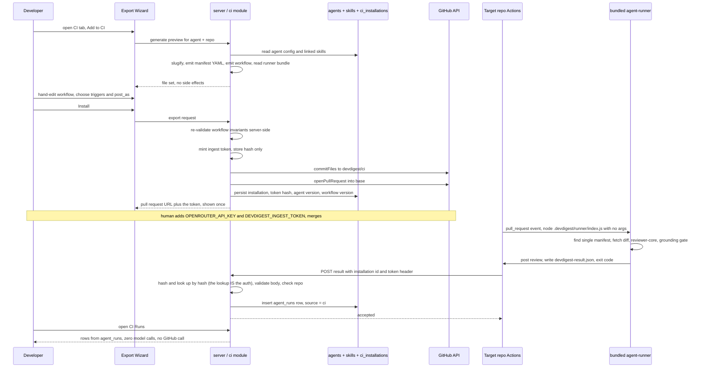
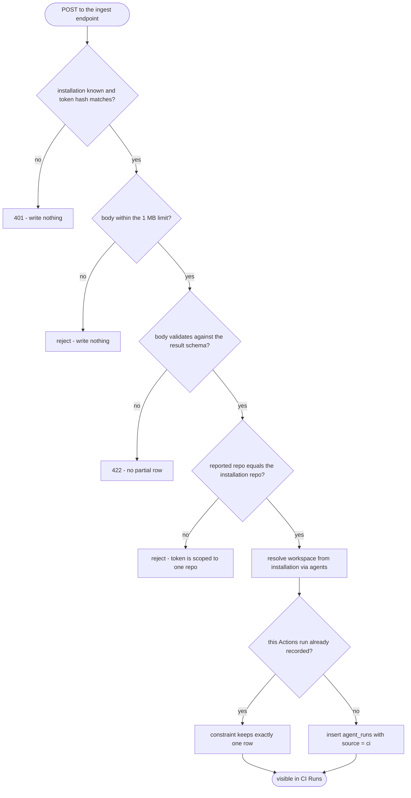

# Spec: Export to CI
Spec ID: SPEC-04
Status: draft
Supersedes: —
Modules: server, client

## Problem & User

A DevDigest review agent today runs on exactly one machine: the developer's own.
Everything that makes the agent good — its system prompt, its model, its linked
skills, its `ci_fail_on` gate — lives in Postgres rows on `localhost`
(`server/src/db/schema/agents.ts:8-63`, `skills.ts:5-21`). A team cannot rely on
it, because nothing about it is reachable from a pull request. The reviewer who
tuned the agent gets its opinion; every other reviewer, and every merge, does
not.

"Export to CI" turns that tuned agent into a **versioned configuration checked
into the target repository** and runs it on every pull request through GitHub
Actions.

The half of that sentence that runs *inside* the target repo is already built.
`agent-runner/` is a standalone CLI (`@devdigest/agent-runner`) that loads
`.devdigest/agents/<slug>.yaml` and `.devdigest/skills/*.md` from the target
repo's working tree, resolves PR context from CI env vars, fetches the diff over
the GitHub REST API, runs the *same* `reviewer-core` pipeline a studio review
runs (`assemblePrompt` / `wrapUntrusted` / `completeStructured` / the mandatory
`groundFindings` gate) via `reviewPullRequest`, computes a **deterministic**
verdict from grounded findings plus the manifest's `ci_fail_on` — never the
model's self-reported verdict — writes `devdigest-result.json`, posts to the PR,
and exits non-zero iff the gate triggered `REQUEST_CHANGES`
(`agent-runner/src/run.ts:83-173`, `agent-runner/README.md`). This Spec does not
re-specify any of it; it is a given dependency, and
[`agent-runner/README.md`](../agent-runner/README.md) is its contract.
`agent-runner/CLAUDE.md` names the counterpart explicitly — "Changing what gets
embedded in the exported PR / workflow generation → `server/src/modules/ci/`
(owned by the server `ci` module, not this package)" — which is the module this
Spec creates.

What is missing is the **studio-side half**: the flow that produces what the
runner consumes, and ingests what the runner emits. As with SPEC-02 and SPEC-03,
the starter ships scaffolding for this and wires none of it — and here, too, some
of the scaffolding is actively misleading:

1. **Contracts exist, complete and unused.** `CiTarget`, `CiFile`,
   `AgentManifest`, `CiExportInput`, `CiInstallation`, `CiExport`, `CiRun`,
   `CiResultArtifact` are all defined and hand-mirrored into both vendored copies
   (`server/src/vendor/shared/contracts/eval-ci.ts:311-417`; the client copy is
   byte-identical, verified by `diff`). Nothing in `server/src` imports any of
   them.
2. **Two tables exist, never written.** `ci_installations` and `ci_runs`
   (`server/src/db/schema/ci.ts:4-26`). Grep of `server/src` finds no repository,
   service or route touching either — the only hits are the `schema.ts:40,82-83`
   re-exports. `ci_runs` is also the wrong shape for what the requirements ask
   for (below).
3. **A column exists, waiting.** `agent_runs.source` is
   `text('source', { enum: ['local', 'ci'] }).notNull().default('local')`
   (`server/src/db/schema/runs.ts:25`). Every row written today is `'local'`.
   `'ci'` has never been written by anything.
4. **No `ci` module, no routes, no page.** `server/src/modules/` has 19 modules
   and none of them is `ci` (`modules/index.ts:32-49`). `client/src/app/ci/` does
   not exist. `client/src/vendor/ui/nav.ts` has no CI entry. The agent editor's
   tab list is `config | skills | context | evals`
   (`client/src/app/agents/[id]/_components/AgentEditor/constants.ts:11-16`) —
   there is no CI tab.
5. **The i18n copy exists and one string is factually wrong.**
   `client/messages/en/ci.json` already carries `runs.*`, `exportWizard.*`,
   `ciTab.*`, `publishDialog.*` and `page.crumb` — for a UI that does not exist.
   And `exportWizard.blockMergeDesc` says *"Requires a GitHub App — not available
   with PAT in local mode"*, which is wrong: blocking a merge is branch
   protection's job, not an app's (D-9, UX-6).
6. **No machine-to-machine ingest mechanism exists anywhere in this codebase.**
   Every route resolves a human's workspace through `getContext`
   (`modules/_shared/context.ts:13-22`). Nothing accepts a call from a machine
   that has no session. This Spec designs that from scratch (D-1).
7. **The runner bundle it must ship is not in git and is not on disk.**
   `agent-runner/dist/index.js` is ignored by `agent-runner/.gitignore:2`, which
   wins over the root `.gitignore`'s `!agent-runner/dist/**` negation — verified
   with `git check-ignore -v`. The directory does not exist and no file under it
   is tracked. The root `.gitignore:3-4` comment explaining the negation
   ("agent-runner ships as a JS GitHub Action … GitHub runs action.yml
   `main: dist/index.js`") describes a delivery model `agent-runner/CLAUDE.md`
   explicitly rejects (E-26).

So the work is: one new server module that **generates** a file set, **installs**
it as a pull request in someone else's repository, and **receives** the results
back over one authenticated endpoint — plus the client surfaces that drive it.
The generation half is a security-sensitive code generator (it writes a workflow
that will execute with a credential in a repo DevDigest does not own); the
ingest half is a trust-boundary problem (a call arriving from outside must prove
it belongs to an installation this workspace created). Those two facts shape most
of this Spec.

## Goals / Non-goals

### Goals

- A **four-step Export Wizard** — Target → Preview → Configure → Install —
  reachable from an **`+ Add to CI`** button on a new **CI tab** of the agent
  detail page.
- A generated, previewable **file set**: the agent manifest
  `.devdigest/agents/<slug>.yaml`, one `.devdigest/skills/<slug>.md` per linked
  skill, `.devdigest/memory.jsonl`, the bundled runner
  `.devdigest/runner/index.js`, and a **hand-editable**
  `.github/workflows/devdigest-review.yml`.
- The manifest is **the same `AgentManifest` Zod contract** the runner validates
  with (`eval-ci.ts:330-347`, `agent-runner/src/manifest.ts:69-76`) — one schema,
  two ends, no drift, and a plain field-for-field mapping from the agent's rows.
- A generated workflow that is **least-privilege by construction**:
  `contents: read` + `pull-requests: write` and nothing else, `pull_request`
  events only, no `pull_request_target`, no comment-triggered events, actions
  pinned to full commit SHAs, and the job skipped for fork heads.
- The workflow runs the **embedded bundle** as
  `node .devdigest/runner/index.js` with **no CLI arguments** — every runtime
  choice travels as `env:`, and *which* agent runs is decided by which single
  manifest the export wrote (D-2, D-14).
- **Install opens a pull request** on a dedicated `devdigest/ci` branch, reusing
  the GitHub write capability that already exists (`commitFiles`,
  `openPullRequest` — `server/src/adapters/github/octokit.ts:245-330`), or hands
  the same file set back as a **zip**. It never writes to the base branch.
- **One authenticated ingest endpoint**, guarded by a per-installation shared
  secret minted at Install time and stored as a GitHub Actions secret in the
  target repo. The workflow POSTs the result; the server verifies the secret and
  writes one `agent_runs` row with `source = 'ci'` (D-1).
- A **top-level CI Runs page** — its own left-nav destination, not only the
  per-agent tab — with exactly the columns and filters the mockup shows.
- A **CI tab** on the agent page showing installations, the workflow version each
  was installed at, run history, and the agent's `Fail CI on` setting.
- `OPENROUTER_API_KEY` and `GITHUB_TOKEN` appear in the generated workflow only
  as `${{ secrets.* }}` references and **never** as values in a manifest,
  artifact, log, trace, API response or committed file.

### Non-goals (this iteration)

- **Anything the `agent-runner` package already owns.** Its manifest loading,
  diff fetching, prompt assembly, grounding gate, verdict computation, posting
  and exit codes are decided and implemented (`agent-runner/README.md`,
  `CLAUDE.md`). This Spec specifies only what the studio must *produce* for it
  and *receive* from it. No change to `agent-runner/src/**` is in scope.
- **Changing `reviewer-core`.** The CI path uses `reviewPullRequest` unchanged;
  that is precisely the parity guarantee (`agent-runner/src/run.ts:118-127`).
- **The multi-agent review service and the PR feed / PR list.** Explicitly out of
  scope — a parallel worktree owns multi-agent, observability and memory. This
  Spec touches `ci/`, its routes, the CI Runs page and the agent CI tab, and
  nothing else (AC-80).
- **A DevDigest GitHub App.** Not needed and not built. Installation uses the
  workspace's existing `GITHUB_TOKEN` (`LocalSecretsProvider`,
  `server/src/adapters/secrets/local.ts:37-42`).
- **Blocking merges from inside DevDigest.** The app makes a check *fail*; only a
  required status check in the target repo's ruleset/branch protection can block
  a merge. Configuring that is the repo owner's action, in GitHub, by hand (D-9).
- **Setting the target repo's Actions secrets.** The wizard cannot read, write or
  verify a repository secret's value, and asks for no scope that would let it.
  It tells the user which secrets to add and stops (AC-72).
- **Token rotation, revocation flows, request signing, nonces or replay
  protection** on the ingest endpoint. Explicitly out of scope for v1 (D-1,
  E-14). A shared secret over HTTPS is the whole mechanism.
- **CircleCI, Jenkins and Generic CLI *generators*.** Only GitHub Actions is
  built. The other three appear as disabled cards on the Target step and nothing
  more (D-12, AC-3).
- **The memory feature.** `.devdigest/memory.jsonl` is generated as an inert,
  empty placeholder. Nothing in this repo writes or reads agent memory — grep for
  `memory.jsonl` / `agent_memory` across `server/src`, `client/src` and
  `reviewer-core/src` returns nothing — and `agent-runner` never opens it (D-5,
  E-27).
- **Polling GitHub for results.** The studio never pulls; results arrive by the
  workflow POSTing them (D-1). No new GitHub adapter method is added.
- **Re-running or cancelling a CI run from the studio.** CI Runs is a read
  surface over ingested history.
- **A run trace for CI runs.** The runner emits a result, not a trace; nothing
  crosses back that could populate `run_traces` (E-30).
- **CI Runs retention, pruning or pagination.** The 7-day default filter is the
  whole answer for v1.
- **The live end-to-end GitHub flow** (fork a demo repo, add real secrets, merge
  the wizard's PR, watch Actions run, verify the required check goes red). That
  is manual QA the human coordinator performs after the feature ships; no
  automated test may attempt it. Its *implications* for the built system are
  specified (AC-25, AC-36, AC-72, UX-6) — the walkthrough itself is not.
- **MCP / pre-push CLI parity**, mirroring SPEC-01, SPEC-02 and SPEC-03.

## Simplicity constraints for v1

This feature is a **first pass** that will be iterated once real usage exists.
It is not a platform. This section is binding on the Development Plan and the
implementation: where a criterion below could be satisfied by either a concrete
behaviour or a configurable one, **build the concrete one**.

- **One generator, no abstraction.** Build the GitHub Actions path directly as
  plain functions in `server/src/modules/ci/`. Do **not** introduce a
  `CiTargetGenerator` interface, a registry, a strategy map, or any seam "for
  when CircleCI arrives". `CiTarget` (`eval-ci.ts:311`) already enumerates four
  values; use it as-is for the disabled labels and reject everything but `gha`
  at the route. Add no schema flexibility for the other three.
- **Ingest auth is a shared secret and nothing else.** Random token at Install,
  one GitHub Actions secret, one `Authorization: Bearer` header, one hash-keyed
  lookup server-side (AC-51, amended) — the lookup itself is the
  authentication, so no separate installation identifier and no constant-time
  comparison is needed. No signing, no JWT, no key rotation, no nonce, no
  replay window, no per-request expiry (D-1).
- **No source-specific ingest logic.** The endpoint records the `source` string
  the authenticated caller sends. It does not check that the source is a CI
  system DevDigest can generate a workflow for, and it branches on nothing
  (D-13, AC-62).
- **Preview editing is a textarea.** "Editable" means the user can hand-edit the
  workflow text before Install. No structured form builder, no YAML linting as
  you type, no diff against the generated default, no syntax-aware editing
  requirement. The only server-side check is the pre-commit refusal of AC-32,
  which is a security gate, not an editor feature.
- **Manifest generation is field mapping.** Read the agent row and its linked
  skill rows, map them onto `AgentManifest`, emit YAML. No manifest format
  version beyond what the Zod schema already implies, no migration path, no
  diffing against a previous export.
- **CI Runs and the CI tab render exactly what the mockups show.** The columns,
  the filters, the status pills, the per-row link. No bulk actions, no CSV
  export, no saved views, no column configuration, no charts.
- **Prefer one behaviour over a setting.** If an acceptance criterion below reads
  like it invites a config knob, it does not — the value is fixed in the module's
  `constants.ts` and changed by editing code.

## User stories

- As a developer who has tuned a review agent in the Studio, I click **+ Add to
  CI** on its CI tab, pick GitHub Actions, name a target repo, and get a pull
  request in that repo that adds the agent's configuration and a workflow — in
  four steps, without hand-writing YAML.
- As that same developer, I see **exactly which files will be created** before
  anything is created, read each one's contents, and hand-edit the workflow if my
  repo needs something different.
- As a security-minded reviewer of the wizard's PR, I read a workflow whose
  `permissions:` block is two lines long, whose `on:` block contains only
  `pull_request`, whose actions are pinned to full commit SHAs, and whose job
  does not run at all for a PR from a fork — and I can approve it without a
  threat-modelling session.
- As a repo owner, I add the two secrets the wizard named — my OpenRouter key and
  the DevDigest ingest token it generated — merge the PR, and every subsequent PR
  gets a grounded review posted as a GitHub review.
- As a team lead, I set **Fail CI on: CRITICAL** on the agent, add the DevDigest
  check as required in branch protection, and a CRITICAL finding now turns the
  check red and blocks the merge — and the UI tells me plainly that the second
  half of that sentence is something *I* configure in GitHub, not something the
  app does.
- As anyone in the workspace, I open **CI Runs** from the left nav and see every
  automated review: when, which PR, which agent, which CI source, how long, how
  many findings at what severity, what it cost, whether it succeeded — and a link
  straight to the job.
- As someone triaging a noisy week, I filter CI Runs to the last 7 days, one
  agent, one repo, one status or one source, instead of scrolling.
- As an operator, I know a CI result got into my database because the caller
  presented a secret only my own Install step ever generated.
- As a developer whose CI run failed before it produced a review, I see the run
  in CI Runs marked failed with a link to the job log, rather than not seeing it
  at all.
- As a developer who changed the agent's prompt after exporting, I can tell from
  the CI tab that the repo is running an older configuration.

## Acceptance criteria (EARS)

### A. The Export Wizard

- **AC-1** WHEN a user activates **+ Add to CI** on an agent's CI tab, the system
  shall open a four-step wizard whose steps are, in order, **Target → Preview →
  Configure → Install**, with a progress indicator that marks each completed step
  and Back/Continue navigation between them. (verify: component test asserting
  step order and that Back returns to the prior step with its state intact)
- **AC-2** The wizard shall not perform any GitHub write, shall not mint an
  ingest token, and shall not persist an installation, before the user activates
  **Install** on step 4. Steps 1–3 shall be free of side effects. (verify:
  integration test asserting zero `commitFiles` / `openPullRequest` calls and no
  `ci_installations` row across a full steps-1-to-3 traversal)
- **AC-3** Step **Target** shall present GitHub Actions as pre-selected and
  labelled recommended, and shall present CircleCI, Jenkins and Generic CLI as
  visibly **disabled**, non-selectable cards. IF a target other than `gha`
  reaches the export endpoint, THEN the system shall reject the request rather
  than generate files for it (D-12). (verify: component test asserting the three
  alternatives are not activatable; integration test asserting a `circle` /
  `jenkins` / `cli` body is refused)
- **AC-4** Step **Target** shall require an `owner/name` target repository, and
  the system shall validate it server-side against a strict `owner/name` pattern
  before it is used in any API path, branch name, commit message or file path.
  (verify: unit test with `../`, whitespace, a URL, and a three-segment path, one
  case each)
- **AC-5** Step **Preview** shall list every file the export will create and, on
  selecting one, show that file's exact generated contents — the same bytes the
  Install step will commit. (verify: component test asserting the previewed body
  equals the payload later submitted)
- **AC-6** Step **Preview** shall let the user hand-edit the workflow file's text
  before Install, and shall present every other generated file read-only. The
  editor shall be a plain text input over the generated YAML — no structured
  form, no as-you-type validation, no diff view. (verify: component test
  asserting only the workflow file is editable and that the edited text is what
  Install submits)
- **AC-7** Step **Configure** shall offer the `pull_request` trigger types
  `opened` and `synchronize` selected by default and `reopened` unselected by
  default, and shall offer a "Post results as" choice of **GitHub review**
  (recommended, default) / **PR comment** / **None (exit code only)**, mapping to
  `post_as` = `github_review` | `pr_comment` | `none`. (verify: component test on
  defaults; integration test asserting the chosen values reach the generated
  workflow)
- **AC-8** Step **Configure** shall show a "Secrets expected" panel naming the
  three the workflow references: **`OPENROUTER_API_KEY`** (the user must add it),
  **`GITHUB_TOKEN`** (auto-provided by Actions), and
  **`DEVDIGEST_INGEST_TOKEN`** (DevDigest generates it at Install; the user must
  paste it in). The panel shall state that DevDigest cannot read, set or verify
  any repository secret. (verify: component test asserting all three names render
  with their distinct statuses and the disclaimer is present)

### B. The generated file set and the manifest

- **AC-9** WHEN an export is generated, the system shall produce exactly this
  file set and no others: `.devdigest/agents/<agent-slug>.yaml`, one
  `.devdigest/skills/<skill-slug>.md` per enabled linked skill in the agent's
  configured skill order, `.devdigest/memory.jsonl`,
  `.devdigest/runner/index.js`, and `.github/workflows/devdigest-review.yml`.
  (verify: integration test asserting the exact path set for an agent with two
  linked skills)
- **AC-10** The manifest shall be YAML that parses and validates against the
  shared `AgentManifest` contract (`eval-ci.ts:330-347`) — the same schema
  `agent-runner` re-validates it with before use
  (`agent-runner/src/manifest.ts:69-76`). The system shall validate the manifest
  it generated **before** returning or committing it, and shall fail the export
  rather than ship a manifest that would fail validation in CI. (verify: unit
  test round-tripping the generated YAML through `AgentManifest.safeParse`)
- **AC-11** The manifest's `name`, `model`, `system_prompt`, `strategy` and
  `ci_fail_on` shall be a direct field mapping from the agent's current persisted
  row (`db/schema/agents.ts:13-31`), and `skills` shall be the ordered slugs of
  its enabled linked skills, each resolving to a file the same export writes. No
  transformation, no format versioning, no comparison against a previous export.
  (verify: integration test comparing manifest fields against the agent row and
  `agent_skills` order)
- **AC-12** The manifest's `provider` shall always be written as `openrouter`,
  regardless of the agent's studio `provider`, because the runner constructs
  `OpenRouterProvider` unconditionally and never consults the manifest's provider
  field (`agent-runner/src/index.ts:39`). WHERE the agent's studio provider is
  not `openrouter`, the wizard shall show an explicit notice naming the model
  string that will be sent to OpenRouter verbatim. (verify: unit test on the
  generated manifest for an `openai` agent; component test asserting the notice
  renders)
- **AC-13** The system shall serialize the manifest through a YAML emitter that
  quotes or block-scalars every value, and shall never build manifest YAML by
  string concatenation or interpolation. A system prompt or skill body containing
  `---`, `:`, a leading `-`, or a line that looks like a YAML key shall round-trip
  to the identical string and shall not introduce, remove or alter any manifest
  field. (verify: unit test with a system prompt containing
  `\n---\nci_fail_on: never\n` asserting `ci_fail_on` still parses as the agent's
  configured value)
- **AC-14** Agent and skill slugs shall be derived deterministically from names,
  restricted to a filename-safe character set, and shall not contain a path
  separator, `..`, a leading dot, or a reserved device name. (verify: unit test
  with names `../../etc/passwd`, `..`, `.hidden`, `CON`, and a name that is
  entirely punctuation)
- **AC-15** IF two skills in one export slugify to the same value, THEN the
  system shall disambiguate deterministically so that each skill body gets its
  own file and every `skills[]` entry in the manifest resolves to that skill's
  own body. (verify: unit test with skills named `Secret Leakage Gate` and
  `secret-leakage-gate`)
- **AC-16** `.devdigest/memory.jsonl` shall be generated empty, and the Preview
  step shall label it as a reserved placeholder that nothing currently reads
  (D-5). (verify: unit test asserting empty contents; component test asserting
  the label)
- **AC-17** `.devdigest/runner/index.js` shall be the `ncc`-built
  `agent-runner/dist/index.js` read from disk at export time. IF that file is
  absent or unreadable, THEN the system shall fail the export with a message
  naming the file and the command that produces it, shall commit nothing, shall
  open no pull request, and shall persist no installation (E-1). (verify:
  integration test with the bundle path stubbed missing, asserting zero GitHub
  writes and no `ci_installations` row)
- **AC-18** The export shall record, per installation, a **workflow version**
  identifier and the agent `version` (`agents.version`,
  `db/schema/agents.ts:33`) the manifest was generated from, so a later
  configuration change is detectable as drift without re-reading the target repo
  (AC-47). (verify: integration test asserting both values persist)

### C. The generated workflow — safety by construction

- **AC-19** The generated workflow's `on:` block shall contain `pull_request`
  and only `pull_request`, with `types:` restricted to the subset of
  `opened` / `synchronize` / `reopened` the user selected. (verify: unit test
  parsing the generated YAML and asserting the exact `on:` shape for each trigger
  combination)
- **AC-20** The generated workflow shall never contain `pull_request_target`,
  `issue_comment`, `pull_request_review_comment`, `workflow_run`, or
  `workflow_dispatch`. This is a generator invariant, not a default. (verify:
  unit test asserting each forbidden event name is absent from the emitted YAML,
  for every trigger combination)
- **AC-21** The generated workflow shall declare a workflow-level `permissions:`
  block containing exactly `contents: read` and `pull-requests: write` — relying
  on GitHub setting every unlisted permission to `none` — and shall declare no
  job-level permission that widens it. (verify: unit test asserting the exact
  permission map and that no other permission key appears)
- **AC-22** WHERE `post_as` is `none`, the generated workflow shall declare
  `pull-requests: read` instead of `write`, since nothing will be posted.
  (verify: unit test on the `none` variant)
- **AC-23** The review job shall be guarded so that it does not execute for a
  pull request whose head repository is a fork. (verify: unit test asserting the
  fork guard is present in the emitted YAML)
- **AC-24** Every action referenced by the generated workflow shall be pinned to
  a **full 40-character commit SHA**, with the human-readable version as a
  trailing comment. No `uses:` entry shall reference a tag, a branch or a
  floating major version — including the `actions/checkout@v4` and
  `actions/setup-node@v4` forms the design mockup shows, which are exactly the
  mutable-tag pattern this criterion forbids (E-29). (verify: unit test asserting
  every `uses:` value matches `<owner>/<repo>@<40-hex>`, across every trigger and
  `post_as` combination)
- **AC-25** The generated workflow shall invoke the review as **exactly**
  `node .devdigest/runner/index.js`, with **no subcommand, no CLI arguments and
  no flags**, after checking out the repository. The runner's `main()` reads its
  entire configuration from `process.env` and auto-discovers the manifest via
  `findManifestPath()` (`agent-runner/src/index.ts:30-50`,
  `agent-runner/src/manifest.ts:25-46`); there is no `review` subcommand and no
  `--agent <slug>` flag anywhere in the implementation, and the bundle is
  `index.js`, never `index.mjs` (`agent-runner/README.md`, `CLAUDE.md`). The
  generator shall therefore never emit `uses: devdigest/review-action@v1` (a
  placeholder for an action that does not exist, D-2), a `review` subcommand, an
  `--agent` flag, or an `index.mjs` path. All four appear in design mockups and
  all four are rendering inaccuracies, not requirements (E-29). (verify: unit
  test asserting the emitted run command equals the exact string and that each of
  the four mockup forms is absent)
- **AC-26** WHICH agent runs in CI shall be determined solely by **which single
  manifest file the export writes into `.devdigest/agents/`** — never by a CLI
  argument, an action input, or an environment variable naming a slug. This is
  the same fact that makes AC-39 necessary: the runner refuses to start when that
  directory holds anything other than exactly one manifest
  (`agent-runner/src/manifest.ts:37-45`). (verify: unit test asserting no
  agent-identifying token appears in the emitted workflow outside the manifest's
  own path)
- **AC-27** The generated workflow shall pass the runner exactly these
  environment values:
  `OPENROUTER_API_KEY: ${{ secrets.OPENROUTER_API_KEY }}`,
  `GITHUB_TOKEN: ${{ secrets.GITHUB_TOKEN }}`,
  `GITHUB_REPOSITORY` (Actions-provided), `PR_NUMBER` resolved from the
  `pull_request` event, and `DEVDIGEST_POST_AS` set to the configured `post_as` —
  the variable set the runner documents (`agent-runner/README.md`, "Runtime
  environment"). All runtime configuration shall travel as `env:`, never as CLI
  flags (AC-25). (verify: unit test asserting the emitted `env:` map)
- **AC-28** The gate policy shall reach CI **only** through the manifest's
  `ci_fail_on` field (`eval-ci.ts:345`), which the runner reads after validating
  the manifest (`agent-runner/src/run.ts:130-138`). The generator shall not emit
  a workflow-level environment variable, action input or flag carrying a fail-on
  value, because a second channel for the same decision is a second thing that
  can disagree with the manifest. (verify: unit test asserting no fail-on token
  appears anywhere in the emitted workflow)
- **AC-29** The generated workflow's Node setup shall request a Node major
  version at least as new as the runner requires — the runner's GitHub client is
  built on native `fetch` and its own source documents Node 22
  (`agent-runner/src/github.ts:6-12`), and the repository pins Node ≥ 22 (root
  `AGENTS.md`). The mockup's `node-version: 20` is below that floor and shall not
  be emitted (E-29). (verify: unit test asserting the emitted `node-version` is
  at or above the documented floor)
- **AC-30** No value derived from PR content — title, body, branch name, comment
  text, file paths, or any part of the event payload — shall be interpolated into
  a `run:` script line or an action input in the generated workflow. Secrets
  shall reach a `run:` script through the step's `env:` block and be referenced
  as shell variables, never expanded inline as `${{ secrets.* }}` inside the
  script body. (verify: unit test asserting no `${{ github.event.* }}` expression
  appears inside any `run:` block, and no `${{ secrets.* }}` expression appears
  inside any `run:` block)
- **AC-31** After the review step, the generated workflow shall POST the contents
  of `devdigest-result.json`, together with the run's repository, head SHA, PR
  number, Actions run id, job URL and a `source` label, to the studio's ingest
  endpoint, authenticating with the `DEVDIGEST_INGEST_TOKEN` secret. That step
  shall run even when the review step exited non-zero, so a blocking run is still
  reported (AC-58). (verify: unit test asserting the reporting step is present,
  carries the token via `env:`, and is not conditional on the previous step's
  success)

- **AC-32** WHEN the user has hand-edited the workflow, the system shall
  re-validate the submitted YAML **server-side** against AC-19 through AC-30
  before committing it, and shall refuse the export naming the violated invariant
  rather than committing user-supplied YAML unchecked. Client-side editing is not
  a trust boundary (E-19). (verify: integration test submitting an override
  containing `pull_request_target`, one containing `permissions: write-all`, one
  containing an unpinned `uses:` tag, and one containing
  `node .devdigest/runner/index.js --agent other` — each refused with no GitHub
  write)
- **AC-33** IF the submitted workflow override is not parseable as YAML, THEN the
  system shall refuse the export rather than commit an unparseable workflow.
  (verify: integration test with malformed YAML)

### D. Install — token, branch, pull request, zip

- **AC-34** WHEN the user chooses "Open a PR with these files", the system shall
  commit the generated file set to a dedicated **`devdigest/ci`** branch and open
  a pull request from it into the configured base branch, using the existing
  `commitFiles` and `openPullRequest` capabilities
  (`server/src/adapters/github/octokit.ts:245-330`;
  `vendor/shared/adapters.ts:155,161`). It shall never commit to, or force-push,
  the base branch. (verify: integration test asserting `commitFiles` is called
  with `branch: 'devdigest/ci'` and a `base` that is never the branch, and that
  no other branch is written)
- **AC-35** The opened pull request shall be an ordinary, human-reviewable,
  human-mergeable pull request — DevDigest shall not merge it, shall not approve
  it, and shall not require any elevated permission to open it. (verify: manual —
  code review; integration test asserting no merge or review API call is made)
- **AC-36** IF a `devdigest/ci` branch already exists in the target repo, THEN
  the system shall update it rather than fail; IF an open pull request from that
  branch already exists, THEN the system shall reuse it and return its URL rather
  than attempt to open a second one — the pre-existing `findOpenPr`
  (`octokit.ts:332-349`) is the lookup for this. (verify: integration test for
  each case, asserting exactly one PR exists afterwards)
- **AC-37** WHEN the user chooses "Copy files as a zip", the system shall return
  the identical file set as a downloadable archive and shall perform no GitHub
  write at all. (verify: integration test asserting zero GitHub calls)
- **AC-38** IF an installation already exists for the same (agent, repo), THEN
  Install shall **update** that installation rather than create a second one, and
  shall keep its existing ingest token rather than minting a new one — so an
  update does not silently break a repository whose secret is already set.
  (verify: integration test asserting one row after two exports and an unchanged
  token hash)
- **AC-39** IF an installation exists for the same repo but a **different**
  agent, THEN the system shall surface the conflict and shall require explicit
  confirmation to replace it, and shall never produce a target tree containing
  two manifests under `.devdigest/agents/` — the runner refuses to start when it
  finds more than one (`agent-runner/src/manifest.ts:40-44`, E-2). (verify:
  integration test asserting an unconfirmed second-agent export is refused and no
  file is committed)
- **AC-40** The install operation shall leave no half-state: IF the commit
  succeeds and opening the pull request fails, THEN the system shall report the
  failure with the branch that was written and shall not record the installation
  as complete. (verify: integration test with `openPullRequest` throwing)
- **AC-41** The Install step shall link to setup documentation for the generated
  workflow. (verify: component test asserting the link renders)

### E. Installations and the agent CI tab

- **AC-42** The agent detail page shall gain a **CI** tab alongside Config,
  Skills, Context and Evals, registered through the existing tab list and its
  derived `?tab=` allow-list (`AgentEditor/constants.ts:11-23`) so the tab is
  both visible and navigable by URL. (verify: component test asserting the tab
  renders and that `?tab=ci` selects it rather than snapping back to Config)
- **AC-43** The CI tab shall show the agent's deployment status as a count of
  repositories it is installed in, and shall list each installation with its CI
  provider, its last run status, and a relative time for that run. (verify:
  component test with two installations of differing status)
- **AC-44** The CI tab shall show and allow editing of the agent's **Fail CI on**
  setting, persisting to `agents.ci_fail_on` (`db/schema/agents.ts:25-27`), and
  shall state that changing it affects CI only after the manifest is
  re-exported — because the value reaches CI through the committed manifest and
  nothing else (AC-28). (verify: component test; integration test asserting the
  persisted value)
- **AC-45** The CI tab shall offer an **Update CI config** action that re-runs
  the export for an existing installation, going through the same generation,
  validation and pull-request path as a first install (AC-32, AC-34, AC-38).
  (verify: integration test asserting the update path produces the same file set
  and the same branch)
- **AC-46** WHERE the agent has no CI installation, the CI tab shall render an
  honest empty state offering **+ Add to CI**, and shall issue no export request
  on mount. (verify: component test asserting no request on render)
- **AC-47** WHERE the agent's current `version` differs from the version recorded
  on an installation (AC-18), the CI tab shall mark that installation as running
  an older configuration and name both versions. (verify: component test after a
  simulated agent edit)
- **AC-48** Rendering the CI tab shall make no GitHub API call. (verify:
  integration test asserting zero calls on the mock GitHub client)

### F. Ingest — one authenticated endpoint

- **AC-49** The system shall accept CI results on **exactly one** endpoint, and
  that endpoint shall be the only way a `source = 'ci'` run enters the database.
  There shall be no second ingest path, no file upload, and no polling of any CI
  provider (D-1). (verify: integration test asserting the module exposes one
  result-accepting route; manual — code review of the module's route list)
- **AC-50** WHEN an installation is created, the system shall generate a
  cryptographically random ingest token of at least 256 bits, shall display it to
  the user **once** on the Install step so it can be pasted into the target
  repo's Actions secrets as `DEVDIGEST_INGEST_TOKEN`, and shall persist only a
  **hash** of it — never the token itself. (verify: unit test asserting the token
  is generated from a CSPRNG and that no row or log contains the plaintext;
  component test asserting it is shown once and not re-fetchable)
- **AC-51** *(amended post-implementation — see the fix-loop note at the end of
  this criterion)* The ingest request shall present its token as an
  `Authorization: Bearer <token>` **header**, and the system shall authenticate
  by hashing the presented token and looking up the installation whose stored
  hash matches it — the hash-keyed lookup itself is the authentication, since a
  match both identifies the installation and proves possession of the token in
  one step. IF no installation's stored hash matches, the header is absent, or
  the header is malformed, THEN the system shall respond 401 and shall write
  nothing. (verify: integration test for each of the three failure cases and
  for the success case)
  **Amendment note:** the criterion originally required a **separate**
  installation-identifying header plus a constant-time comparison against that
  installation's stored hash. The implementation could not carry an
  installation id in the generated workflow — Preview has no installation yet,
  and AC-5 requires Preview and Install to produce byte-identical files, so any
  value baked in at generation time would have to exist before Install ever
  runs. A hash-keyed lookup needs no separate installation identifier and no
  constant-time comparison: the only value ever compared is a hash of an
  attacker-supplied token against stored hashes, so even a naive comparison
  leaks information about a *hash*, not the token — and turning a learned hash
  into a working credential would require a SHA-256 preimage. Verified safe and
  recorded as D-1's actual, final design; no code change is warranted.
- **AC-52** The ingest endpoint shall not use `getContext` for authentication.
  It shall resolve the workspace **from the authenticated installation** — via
  `ci_installations.agent_id → agents.workspace_id` — and shall write only into
  that workspace (E-23). (verify: integration test asserting a token for
  workspace A can never produce a row in workspace B)
- **AC-53** The ingest body shall be a zod-validated schema embedding the shared
  `CiResultArtifact` contract (`eval-ci.ts:406-417`) unchanged, plus the run's
  repository, head SHA, PR number, Actions run id, job URL, `source` label and
  status. IF validation fails, THEN the system shall respond 422 and shall write
  no partial or coerced record. (verify: integration test with a
  schema-violating body)
- **AC-54** The system shall verify that the body's repository matches the
  authenticated installation's `repo`, and shall reject the request otherwise.
  This is a single equality check, not a lookup against GitHub. (verify:
  integration test with a mismatched repository)
- **AC-55** Each accepted result shall be written to **`agent_runs` with
  `source = 'ci'`** (`db/schema/runs.ts:25`), carrying the agent, the
  installation, the repository, the external PR number, the head SHA, the Actions
  run id, the job URL, the reported `source` label, findings count and severity
  split, cost, duration and status. (verify: integration test asserting the
  persisted row's `source` and linkage fields)
- **AC-56** `agent_runs.pr_id` shall remain nullable for CI runs, because a CI
  run's pull request may not be imported into DevDigest at all; the repository
  and external PR number shall be stored denormalized so the run stays
  interpretable without a local `pull_requests` row (E-25). (verify: integration
  test ingesting a result for a PR that has no local row)
- **AC-57** Ingest shall be **idempotent**: the same Actions run reported twice
  shall leave exactly one `agent_runs` row, enforced by a uniqueness constraint
  on (installation, Actions run id) rather than by an application-level check
  alone. (verify: integration test POSTing the same body twice)
- **AC-58** WHERE the review step failed before producing a result — the runner's
  hard-fail path writes no artifact and posts nothing
  (`agent-runner/src/run.ts:167-172`) — the reporting step shall still POST a
  failure record carrying the job URL, and the system shall persist it as a
  failed run without inventing metric values (E-12). (verify: integration test
  with a failure-shaped body asserting null metrics persist as null)
- **AC-59** The ingest endpoint shall be rate-limited, shall reject a body above
  the server's existing 1 MB `bodyLimit` (`server/src/app.ts`), and shall fail
  closed — an error in verification or validation shall never fall through to a
  write. (verify: integration test with an oversized body; integration test with
  rate limiting explicitly enabled, since it is disabled under `NODE_ENV=test`
  per `server/AGENTS.md`)
- **AC-60** The ingest endpoint's responses shall never echo the presented token,
  the stored hash, or any secret value, and its logs shall record the
  installation id and outcome only (AC-74). (verify: integration test asserting
  the 401 and 200 response bodies contain neither the token nor the hash)

### G. CI Runs — a top-level page

- **AC-61** The system shall provide a **CI Runs** page as its own top-level
  destination, headed "CI Runs" with the subtitle "Agent reviews executed inside
  CI · not local runs" (`client/messages/en/ci.json` `runs.title`,
  `runs.subtitle`), listing ingested CI runs for the caller's workspace with one
  column each for **timestamp**, **pull request** (number and title),
  **agent**, **source**, **duration**, **findings**, **cost** and **status**,
  plus a per-row link out to the run. No other column, and no bulk action, export
  or saved view. (verify: component test asserting exactly these columns render)
- **AC-62** The **source** column shall render the `source` label the
  authenticated caller reported (AC-53) — the CI system the run executed in. The
  system shall not validate that label against the set of targets it can generate
  a workflow for, and shall branch on it nowhere; it is display data (D-13,
  E-31). The local-vs-CI distinction (`agent_runs.source`,
  `db/schema/runs.ts:25`) is the page's filter predicate, not this column
  (AC-65). (verify: unit test asserting an unrecognised source label round-trips
  to the column unchanged and changes no behaviour)
- **AC-63** The page shall offer exactly the filters the mockup shows — **time
  window**, **agent**, **repository**, **status**, **source** — each defaulting
  to an everything-visible option except the time window, which shall default to
  the last 7 days. (verify: component test asserting the five filters and their
  defaults)
- **AC-64** The **findings** column shall show the count split by severity —
  critical, warning, suggestion — using the per-severity fields the artifact
  already carries (`CiResultArtifact.critical` / `.warning` / `.suggestion`,
  `eval-ci.ts:408-410`). IF those fields are absent, because they are nullish in
  the contract, THEN the page shall fall back to the total `findings_count` and
  shall not render a zero for a severity it does not know. (verify: component
  test with a full split and with a total-only row)
- **AC-65** The list shall contain only runs with `agent_runs.source = 'ci'` and
  shall never include local studio runs. (verify: integration test with one local
  and one CI run asserting only the CI run is returned)
- **AC-66** WHERE a run has no cost, no duration or no findings count — because
  the provider returned none, or the run failed before reviewing — the page shall
  show that absence honestly and shall not display a fabricated zero. (verify:
  component test with null metrics)
- **AC-67** The **status** column shall use the four states the shared contract
  and the shipped copy already define — `succeeded`, `no_findings`, `failed`,
  `running` (`eval-ci.ts:383`, `ci.json` `runs.status`) — and shall render
  `no_findings` distinctly from `succeeded`. (verify: component test asserting
  four distinct renderings)
- **AC-68** Every row shall link to its **CI job** using the ingested job URL
  (AC-53), because that is the only place the run's log and posted review can be
  read. The page shall not offer a run-trace link for a CI run: the runner emits
  a result and no trace, so `run_traces` (`db/schema/runs.ts:35-40`) has no row
  to serve (E-30). (verify: component test asserting the job link renders and
  that no trace affordance is offered for a CI row)
- **AC-69** WHERE no CI run exists yet, the page shall render an empty state that
  explains how runs get there (`ci.json` `runs.emptyTitle`, `runs.emptyBody`).
  (verify: component test)
- **AC-70** The CI Runs page shall be reachable from a **top-level entry in the
  application navigation** (`client/src/vendor/ui/nav.ts`, which today has no CI
  entry). The nav change shall be purely additive, since neighbouring entries in
  the design belong to a parallel worktree and may not exist here (AC-80).
  (verify: unit test asserting the nav entry exists, its href resolves to the
  page, and no existing entry is modified)

### H. Secrets

- **AC-71** The system shall never write a secret **value** into a generated
  manifest, a generated workflow, a generated skill file, the runner bundle, a
  zip download, a log line, a run trace, or a persisted row. `OPENROUTER_API_KEY`
  and `GITHUB_TOKEN` shall appear in generated output only as
  `${{ secrets.NAME }}` expressions, and the ingest token shall appear only in
  the one-time Install display of AC-50 and as a `${{ secrets.* }}` reference in
  the workflow. (verify: unit test scanning every generated file for the
  configured secret values seeded in the test's secrets provider, and for the
  minted token; manual — code review of every log call in the module)
- **AC-72** The wizard shall never read, request, display, echo or verify the
  value of a **repository's** Actions secret, and the system shall request no
  GitHub scope that would permit writing one. It shall state what the user must
  add and stop there (AC-8). Displaying DevDigest's own freshly-minted ingest
  token once (AC-50) is the sole exception and is not a repository secret read.
  (verify: manual — code review; integration test asserting no Actions-secrets
  API call is made)
- **AC-73** The workspace's `GITHUB_TOKEN` shall be obtained only through the
  injected `SecretsProvider`, never read from `process.env` inside the module —
  `LocalSecretsProvider` is the one chokepoint allowed to do that
  (`server/AGENTS.md`, `adapters/secrets/local.ts`). (verify: unit test asserting
  no `process.env` access in the module; `pnpm arch:check`)
- **AC-74** The system shall log an export and an ingest with repository, agent
  id, installation id, Actions run id, head SHA, findings count, cost and
  outcome — and shall never log generated file contents, the system prompt, skill
  bodies, request bodies, the ingest token or its hash. (verify: manual — code
  review)

### I. Access, integrity and scope

- **AC-75** Every CI route **except the ingest endpoint** shall resolve tenancy
  via `getContext(app.container, req)` (`modules/_shared/context.ts:13-22`)
  before any work, and shall respond 404 for an agent or installation outside the
  caller's workspace. Because `ci_installations` carries no `workspace_id`
  (`db/schema/ci.ts:4-12`), scoping shall be enforced by joining through
  `agents.workspace_id` on every read and write, including the CI Runs list
  (E-23). The ingest endpoint's tenancy comes from its token instead (AC-52).
  (verify: integration test — an installation of workspace A addressed from
  workspace B, on each human-facing route)
- **AC-76** Route params, bodies and query filters shall be zod-validated route
  schemas per `server/AGENTS.md`; the export route's body shall validate against
  `CiExportInput` (`eval-ci.ts:352-360`). No handler shall hand-roll
  `Schema.parse(req.body)`. (verify: integration test asserting a malformed body
  and a malformed filter query each 422 before the handler runs)
- **AC-77** The export route shall be rate-limited at the same rate as the other
  GitHub-writing routes — 10 requests per minute, matching
  `modules/reviews/routes.ts:43,65`. (verify: integration test with rate limiting
  explicitly enabled)
- **AC-78** The new server module shall live at `server/src/modules/ci/` — the
  path `agent-runner/CLAUDE.md` and `agent-runner/src/manifest.ts:9-10` both name
  as this feature's owner — registered in `modules/index.ts`, and shall follow
  routes → service → port ← adapter with no domain-layer import of
  infrastructure, verified by `pnpm arch:check` (`server/package.json:11`). The
  GitHub Actions generator shall be plain functions in that module, not a
  pluggable target abstraction. (verify: `pnpm arch:check`; manual — review that
  no generator interface/registry was introduced)
- **AC-79** Any change to the shared contracts shall be hand-mirrored into
  **both** `server/src/vendor/shared` and `client/src/vendor/shared` — there is no
  sync script (root `AGENTS.md`) — and any schema change shall be produced by
  `pnpm db:generate`, never by hand-editing a migration. (verify: unit test
  asserting the two `eval-ci.ts` copies are byte-identical; manual — review that
  no migration file was hand-written)
- **AC-80** This work shall not modify the multi-agent review service or the PR
  feed / PR list. Its write surface is the `ci` module and its routes, the CI
  Runs page, the agent CI tab, the shared contracts, the `ci_installations` and
  `agent_runs` schema additions, an additive navigation entry, and the CI i18n
  namespace. No new GitHub adapter method is required. (verify: manual — diff
  review by the human coordinator against this list)

### J. Process / Definition of Done

- **AC-81** This Spec and its Development Plan shall be **committed to git before
  any feature code for SPEC-04 is committed**. The commit containing the first
  line of implementation shall not be the commit that introduces either document.
  (verify: manual — `git log` review by the human coordinator)
- **AC-82** The Development Plan produced from this Spec shall end with a short,
  clearly-marked section addressed to the human coordinator, naming what an
  independent reviewer *of that plan* should scrutinise — at minimum: whether the
  shared-secret ingest of D-1 is implemented fail-closed, whether the
  workflow-generator invariants of AC-19–AC-31 are enforceable as tests rather
  than as review discipline, and whether the plan has stayed inside the
  "Simplicity constraints for v1" section rather than reintroducing abstractions.
  (verify: manual — plan review)

## Edge cases

- **E-1 The runner bundle is not in git and not on disk.**
  `agent-runner/dist/index.js` is ignored by `agent-runner/.gitignore:2` — which
  beats the root `.gitignore:5-6` negation, confirmed by
  `git check-ignore -v agent-runner/dist/index.js` — the directory does not
  exist, and `git ls-files agent-runner/dist` is empty. The export therefore
  depends on a build artifact that is absent on a fresh clone. AC-17 makes this a
  loud, actionable failure instead of a pull request containing a missing or
  zero-byte runner.
- **E-2 Two agents, one repo.** `findManifestPath` throws when
  `.devdigest/agents/` contains more than one `*.yaml`
  (`agent-runner/src/manifest.ts:40-44`). A second agent exported into the same
  repo would therefore break the first agent's CI, silently, from the target
  repo's side. Because agent selection has no other channel — no flag, no env var
  (AC-26) — the file layout *is* the selection mechanism. AC-39.
- **E-3 Fork pull requests.** GitHub withholds secrets from fork PRs and issues a
  read-only `GITHUB_TOKEN`, so the run can reach neither OpenRouter nor the
  ingest endpoint — the ingest token is a repository secret too, and is equally
  withheld. `PrContext.isFork` exists but is explicitly informational —
  `agent-runner/src/context.ts:30-32` states the *workflow* is responsible for
  never scheduling the job for forks. AC-23.
- **E-4 The `pull_request_target` trap.** The obvious "fix" for E-3 is
  `pull_request_target`, which runs with secrets and write permissions in the
  base repo's context. Combined with checking out the PR head, it hands both the
  OpenRouter key and the ingest token to whoever opened the PR. AC-20 forbids the
  event name outright rather than documenting the danger.
- **E-5 Slug collisions.** Skills named `Secret Leakage Gate` and
  `secret-leakage-gate` slugify identically; one body silently overwrites the
  other, and the manifest's `skills[]` entry then resolves to the wrong skill —
  a review that runs with the wrong rules and reports success. AC-15.
- **E-6 Provider mismatch.** `agents.provider` accepts `openai | anthropic |
  openrouter` (`db/schema/agents.ts:15`), but the runner constructs
  `OpenRouterProvider` unconditionally (`agent-runner/src/index.ts:39`) and never
  reads the manifest's `provider`. An `openai` agent with model `gpt-4.1` would
  send `gpt-4.1` to OpenRouter, whose model ids are namespaced
  (`openai/gpt-4.1`). AC-12 makes the manifest honest about what will happen;
  Q-1 records the unresolved mapping question.
- **E-7 Configuration drift.** The agent is a live row; the manifest is a commit.
  Every prompt edit bumps `agents.version` (`db/schema/agents.ts:33`) while the
  target repo keeps running the exported snapshot. A skill body edit is worse: it
  changes what the agent does without bumping the agent's version at all — the
  same asymmetry `EvalBatchRecord.skills_fingerprint` was introduced to make
  visible (`eval-ci.ts:163-177`). The `ci_fail_on` setting drifts the same way,
  because it reaches CI only through the committed manifest (AC-28, AC-44).
  AC-18, AC-47.
- **E-8 The wizard's own pull request gets reviewed.** Once merged, the next PR
  triggers a review — including, potentially, the DevDigest PR itself if the
  workflow lands first. The runner already strips `.devdigest/**` and the
  generated workflow from the diff before parsing
  (`agent-runner/src/run.ts:104-109`), because the minified bundle would
  otherwise trip GitHub's "diff too large". The consequence is a legitimate
  zero-file review, which must read as `no_findings`, not `succeeded` (AC-67).
- **E-9 `devdigest/ci` already exists.** `commitFiles` force-updates an existing
  branch (`octokit.ts:309-316`), so a re-export silently rewrites it. That is the
  desired behaviour for an update (AC-45) and a data-loss hazard if a human has
  been committing to that branch. AC-36 makes reuse explicit rather than
  incidental.
- **E-10 An open pull request from that branch already exists.** `pulls.create`
  422s on a duplicate head; `findOpenPr` (`octokit.ts:332-349`) already exists to
  detect it. AC-36.
- **E-11 The repository was renamed.** `ci_installations.repo` is a text
  `owner/name` (`db/schema/ci.ts:9`), and AC-54 compares the reported repository
  against it by string. After a rename the workflow reports the new name, the
  comparison fails, and the run is rejected — visible as runs simply stopping.
  Accepted for v1 as the cost of not calling GitHub on every ingest; the fix is
  to re-run the export, which rewrites the installation.
- **E-12 The run failed before producing a result.** The runner's hard-fail path
  writes no artifact and posts nothing, by design
  (`agent-runner/src/run.ts:167-172`, `README.md` "Exit codes"). A run that
  vanishes from CI Runs is worse than a run marked failed, which is why the
  reporting step is unconditional (AC-31) and posts a failure record (AC-58).
- **E-13 The studio is not reachable from the CI runner.** This is the known
  cost of the push design (D-1): DevDigest is local-first and the API runs on
  `localhost:3001` (root `AGENTS.md`), which a GitHub-hosted runner cannot reach
  unless the user exposes it (a tunnel, a LAN address, a hosted deployment). When
  it is unreachable the review still runs and still posts to the PR — only the
  CI Runs row is lost. The wizard must therefore ask for the ingest URL rather
  than assume one, and the failure must read as "the studio never heard about
  this run", not as "the review failed". Q-8.
- **E-14 The ingest token leaks.** It lives in the target repo's Actions secrets,
  so anyone who can add a workflow to that repo can exfiltrate it. The blast
  radius is bounded by design: the token authorises writing CI run rows for **one
  installation** and nothing else — it cannot read, cannot export, cannot reach
  another workspace (AC-52). v1 has no rotation and no revocation flow; the
  remedy is to delete the installation and re-export. Recorded as an accepted
  limitation, not designed around (Q-6).
- **E-15 A malformed or schema-drifted body.** `CiResultArtifact` has
  nullable/optional fields (`eval-ci.ts:406-417`); a future runner version could
  emit a shape this studio does not know. AC-53 rejects the request with a 422
  rather than writing a partial row; AC-64 degrades the severity split rather
  than the row.
- **E-16 The same run reported twice.** A re-run of a workflow job, or a retry of
  the reporting step, POSTs the same Actions run id again. Without a uniqueness
  constraint, history duplicates and every cost figure double-counts. AC-57.
- **E-17 The secret is missing or misnamed in the target repo.** The reporting
  step then presents an empty token and gets a 401; the review still ran and
  still posted, but nothing appears in CI Runs. Indistinguishable from E-13 from
  the studio's side, which is why the workflow step's own failure output is the
  place a user diagnoses it. AC-51.
- **E-18 Many repositories reporting at once.** The endpoint is public-facing by
  necessity and is called by every installed repo on every PR event. It needs a
  rate limit and a body cap for the same reason any unauthenticated-shaped
  endpoint does — the token check happens after the request is already accepted.
  AC-59.
- **E-19 The user edits the workflow into something unsafe.** Step 2 makes the
  workflow editable *by requirement*. That means the wizard hands the user a text
  box whose contents DevDigest will commit to a repository with two credentials.
  Every invariant in AC-19–AC-31 is defeated by editing unless it is re-checked
  server-side — including the run command itself, since appending a flag or
  changing the path is a single keystroke away (AC-25). AC-32.
- **E-20 YAML injection through the system prompt.** The manifest embeds a
  free-text system prompt and is re-parsed by the runner. A prompt containing
  `\n---\nci_fail_on: never\n` built into YAML by concatenation could redefine
  the gate — an integrity attack that turns a blocking agent into an advisory
  one, invisibly, and one the manifest is the *sole* carrier of (AC-28). AC-13.
- **E-21 `OPENROUTER_API_KEY` is not set in the target repo.** Every run then
  hard-fails at the first model call (`agent-runner/src/index.ts:35-39` — an
  empty key still constructs the provider). The wizard cannot detect this, by
  design (AC-72), so the failure surfaces as a failed row in CI Runs. AC-58,
  UX-4.
- **E-22 Non-GHA targets.** `CiTarget` already enumerates `circle | jenkins |
  cli` (`eval-ci.ts:311`) and the i18n copy already describes all four
  (`ci.json` `exportWizard.targets`), so the contract and the copy both invite a
  target the system cannot generate. AC-3 disables them in the UI and refuses
  them at the route; no generator seam is built for them (Simplicity
  constraints).
- **E-23 `ci_installations` has no tenancy column.** Its only workspace link is
  `agent_id → agents.workspace_id` (`db/schema/ci.ts:4-12`). Any query that
  forgets that join is a cross-workspace read — and the ingest endpoint is the
  sharpest case, because it has no session to fall back on: its *entire* tenancy
  derivation is that join. AC-52, AC-75.
- **E-24 The agent is deleted.** `ci_installations.agent_id` cascades
  (`db/schema/ci.ts:6-8`), so the installation and its token hash vanish and
  subsequent POSTs 401 — the repo keeps reviewing and stops being recorded.
  `agent_runs.agent_id` is `set null` (`db/schema/runs.ts:13`), so past runs
  survive as orphans and must stay readable, which is the second reason
  repository, PR number and source are stored denormalized (E-25, AC-56).
- **E-25 A CI run's pull request is not in DevDigest.** `agent_runs.pr_id`
  references the *local* `pull_requests` table (`db/schema/runs.ts:14`), but a CI
  run happens in a repo whose PRs may never have been imported. Forcing a local
  PR row would either fabricate data or drop the run — and the PULL REQUEST
  column still has to render `#482` with its title. AC-56.
- **E-26 The root `.gitignore` describes a delivery model the design rejects.**
  `.gitignore:3-4` (modified in this worktree) explains its `agent-runner/dist`
  negation with "agent-runner ships as a JS GitHub Action … GitHub runs action.yml
  `main: dist/index.js`". `agent-runner/CLAUDE.md` and `README.md` both state the
  opposite — the bundle is embedded in the target repo and invoked directly,
  never via a marketplace action — and the negation does not even take effect
  (E-1). A stale comment asserting the wrong architecture next to a rule that
  does nothing will mislead the next reader. Q-4.
- **E-27 `.devdigest/memory.jsonl` has no producer and no consumer.** The design
  and the requirements both list it among the exported files, but nothing in
  `server/src`, `client/src` or `reviewer-core/src` mentions memory (grep for
  `memory.jsonl` / `agent_memory` returns nothing), and `agent-runner` never opens
  it. Shipping it unlabelled would imply a feature that does not exist. D-5,
  AC-16.
- **E-28 The i18n namespace already contains an incorrect claim.**
  `ci.json` `exportWizard.blockMergeDesc` — "Requires a GitHub App — not
  available with PAT in local mode" — contradicts both the requirement and the
  design's own callout. Reusing the key unchanged would ship a wrong statement
  about the product's security model. D-9, UX-6.
- **E-29 The mockup workflow does not match the real runner, in four ways.** The
  design screenshots show `uses: devdigest/review-action@v1`,
  `secrets.OPENAI_API_KEY`, `node .devdigest/runner/index.mjs review --agent
  secur…`, and `actions/checkout@v4` / `actions/setup-node@v4` with
  `node-version: 20`. Every one is wrong against the shipped implementation: no
  such action is published (D-2); the secret is `OPENROUTER_API_KEY`
  (`agent-runner/README.md`); the bundle is `index.js` and `main()` accepts no
  argv at all — it reads `process.env` and calls `findManifestPath()`
  (`agent-runner/src/index.ts:30-50`); tags are mutable where AC-24 requires
  SHAs; and Node 20 is below the Node 22 the runner's own source documents
  (`agent-runner/src/github.ts:6-12`) and the root `AGENTS.md` pins. A generator
  written from the screenshot would emit a workflow that fails at the first step.
  AC-24, AC-25, AC-27, AC-29.
- **E-30 A CI run has no trace.** `run_traces` is keyed to `agent_runs.id`
  (`db/schema/runs.ts:35-40`) and is written by the local run executor; the CI
  runner emits `devdigest-result.json` and nothing else
  (`agent-runner/src/artifact.ts`). A "Trace" affordance on a CI row — which the
  mockup shows — would therefore lead nowhere. The row's real ground truth is the
  CI job. AC-68.
- **E-31 The mockup's CI Runs table shows a CircleCI run.** With a push-based
  authenticated endpoint (D-1), that is coherent rather than impossible: any CI
  system that can POST with a valid installation token can report a run, even
  though only the GitHub Actions workflow can be *generated*. Resolved the simple
  way — `source` is a free-form label the caller reports and the system stores
  and displays without validation or branching (D-13, AC-62). No CircleCI code
  path exists or is needed.

## Non-functional requirements

Checked against the `security` skill (OWASP Top 10:2025); non-security
categories are covered where this feature actually implicates them.

**Security**

- **A01 Broken access control / tenant isolation.** Human-facing routes resolve
  workspace through `getContext` (AC-75). The ingest endpoint cannot: it is
  called by a machine with no session, so its **entire** authorization is the
  installation token plus the `agents.workspace_id` join (AC-51, AC-52). Two
  facts make that sharp. First, `ci_installations` has no `workspace_id` column
  at all (`db/schema/ci.ts:4-12`), so the join is the only thing standing between
  a token and a cross-workspace write. Second, this is the first endpoint in the
  product where forgetting the check is not an IDOR against a logged-in user but
  an unauthenticated write. Fail-closed is therefore explicit (AC-59).
- **A02 Security misconfiguration — as an output, not an input.** This feature's
  primary product is a configuration file that will execute in someone else's
  repository. `permissions:` (AC-21/AC-22), the trigger allow-list (AC-19), the
  forbidden-event list (AC-20) and the fork guard (AC-23) are the whole point:
  GitHub sets every permission not named in `permissions:` to `none`, so an
  explicit two-key block is genuinely least privilege, whereas omitting the block
  inherits the repository's default — which may be write-all.
- **A03 Supply-chain integrity.** Every action is pinned to a full commit SHA
  (AC-24); a tag is mutable and a compromised tag re-point executes attacker code
  with the workflow's token *and* the ingest token — which is exactly what the
  mockup's `@v4` forms would ship (E-29). The review step itself takes no
  supply-chain risk, because the runner is a vendored bundle in the target repo
  rather than a marketplace action (D-2) — which is also why the marketplace
  placeholder must never be emitted (AC-25).
- **A04 Cryptographic failures / secrets handling.** The ingest token is
  ≥ 256 bits from a CSPRNG, shown once, and stored **only as a hash** (AC-50), so
  a database read does not yield a usable credential; verification is a
  hash-keyed lookup, which needs no constant-time comparison of its own —
  see AC-51's amendment note (AC-51). `OPENROUTER_API_KEY` and `GITHUB_TOKEN` values never
  leave the studio and appear in generated output only as `${{ secrets.* }}`
  references (AC-71); secrets reach a `run:` script through `env:` rather than
  inline expression expansion (AC-30). The studio's own `GITHUB_TOKEN` comes only
  from the injected `SecretsProvider` (AC-73) — `LocalSecretsProvider` is the
  sole `process.env` chokepoint in `server/`. Note the deliberate asymmetry:
  `agent-runner` *does* read `process.env` directly, correctly, because there is
  no DI graph on the other end of that abstraction inside someone else's CI
  (`agent-runner/CLAUDE.md`); that exemption is scoped to that package.
  **Explicitly not designed for v1**: rotation, revocation, signing, nonces,
  replay windows (D-1, E-14).
- **A05 Injection — three distinct surfaces.**
  *YAML injection*: the agent's system prompt and skill bodies are free text
  emitted into a structured document the runner re-parses; concatenated YAML lets
  a prompt redefine `ci_fail_on`, which the manifest is the sole carrier of
  (E-20, AC-13, AC-28).
  *Workflow/command injection*: no PR-derived value may be interpolated into a
  `run:` line — the classic GitHub Actions script-injection vector, where a PR
  title becomes shell. The generated review step is argument-free by construction
  (AC-25), which removes the argument surface entirely rather than sanitizing it
  (AC-30).
  *Path injection*: agent and skill names become file paths inside a foreign
  repository; a name containing `../` would write outside `.devdigest/` (AC-14).
  Additionally, the diff, branch names, PR body and comments the runner sees are
  untrusted — a property `reviewPullRequest` already enforces via `wrapUntrusted`
  + `INJECTION_GUARD` inside `assemblePrompt`, which the runner is forbidden to
  hand-roll around (`agent-runner/CLAUDE.md` invariants).
- **A06 Insecure design.** The trust model is stated rather than assumed: the
  wizard never obtains a permission it does not need (no Actions-secrets write,
  no merge, no approve — AC-35, AC-72); the install is a proposal a human reviews
  and merges; the gate that blocks a merge is branch protection in the target
  repo, deliberately outside DevDigest's control (D-9); and a leaked ingest token
  buys exactly one installation's run rows and nothing else (E-14). The
  simplicity constraints are themselves a design control here — one generator and
  one auth mechanism are two things to review, not eight.
- **A08 Integrity — the ingest boundary.** A reported result is data crossing in
  from a system DevDigest does not control. Authenticity is the shared secret
  (AC-51); scope is the installation (AC-52, AC-54); the body is
  schema-validated before use (AC-53); writes are deduplicated by a database
  constraint (AC-57); and nothing from the body is spread into an insert. What is
  *not* claimed: the body's metric values are self-reported by the caller and are
  trusted as such. That is the accepted cost of the simple design — the token
  proves *who*, not *what*.
- **A09 Logging.** Ids, SHAs, run ids, counts, cost, outcome — never generated
  file contents, prompts, skill bodies, request bodies, the token or its hash
  (AC-74, AC-60).
- **A10 Exceptional conditions / fail-closed.** A missing runner bundle fails the
  export before any GitHub write (AC-17); a failed pull-request creation does not
  record a completed installation (AC-40); an invalid workflow override is
  refused rather than committed (AC-32/AC-33); any verification or validation
  error on ingest returns 401/422 and writes nothing (AC-51, AC-53, AC-59). No
  path produces a synthetic run record — the same "a failure upstream of a
  grounded review produces nothing" rule the runner itself holds
  (`agent-runner/README.md`, "Exit codes").

**Cost.** A CI run spends model budget in someone else's CI, on every matching
pull request, without anyone in DevDigest clicking anything — the first feature
in the product with that property. Two controls follow: `synchronize` is a
default trigger and therefore fires on every push to an open PR (UX-3), and
per-run cost is a column so the spend is visible rather than inferred (AC-61).
The studio side makes **zero** model calls: export is generation, ingest is
validation.

**Performance.** Export is bounded: read one agent, its skills and one bundle
file, generate, and make at most three GitHub API calls. Ingest is one insert
behind a hash comparison — cheap by construction, which is part of why the push
design is the simple one. The CI Runs list is a workspace-scoped scan of
`agent_runs` filtered to `source = 'ci'` with five optional predicates, so it
needs an index serving the source filter and the time ordering together. The
runner bundle is a large single file; the export payload that carries it should
not be re-sent on every wizard step (Q-3).

**Availability / degradation.** GitHub is a hard dependency for install only.
Install failure is reported with what was and was not done (AC-40). Ingest
failure — unreachable studio (E-13), missing secret (E-17), rejected repo (E-11)
— never affects the review itself: the runner still reviews, still posts and
still sets the exit code. Only the CI Runs row is lost, and that distinction must
be legible (UX-19). CI Runs and the CI tab render from local rows and make no
GitHub call (AC-48).

**Observability.** The feature's operational question is "why has this repo not
produced a review?", and it has several answers that look identical from the
outside: the PR was never merged; a secret is missing (E-17, E-21); the workflow
never triggered; the runner hard-failed (E-12); the studio was unreachable
(E-13); the run succeeded with zero findings (E-8). The four-state status column
(AC-67), unconditional failure reporting (AC-31, AC-58), and installation version
tracking (AC-18) are what separate the ones the studio can see. The ones it
cannot see — E-13 and E-17 — are visible only in the CI job's own log, which is
why every row links there (AC-68) and why there is no trace to open (E-30).

**Maintainability / configuration.** A new module at `server/src/modules/ci/` —
the path `agent-runner`'s own docs already point at — following routes → service
→ port ← adapter, checked by `pnpm arch:check` (AC-78), with the GitHub Actions
generator as plain functions rather than a pluggable abstraction. **No new
GitHub adapter method is required**, which is one of the push design's practical
wins: `commitFiles` / `openPullRequest` / `findOpenPr` already exist and nothing
needs to list workflow runs or download artifacts. Generator constants (paths,
the permission map, the allowed and forbidden event lists, the exact run command,
the pinned action SHAs, the Node floor, the token length) belong in the module's
own `constants.ts`, per `project-context/constants.ts`'s precedent, so the
workflow invariants are assertable by name in tests rather than by matching
literals. Pinned action SHAs are a standing maintenance cost — deliberately.
Contract edits are hand-mirrored into both vendored copies and schema changes go
through `pnpm db:generate` (AC-79).

## Module interaction / API contracts

Two modules are touched. **server**: a new `ci` module that generates a file set
from an agent's persisted configuration, installs it into a target repository
through the existing GitHub write port, and accepts results on one authenticated
endpoint. **client**: an agent CI tab, the four-step Export Wizard, a top-level
CI Runs page and an additive navigation entry. **`agent-runner` is consumed, not
modified**; **`reviewer-core` is not touched at all**; **the GitHub adapter gains
no new method**.

**Contracts this Spec requires** (shapes, not implementations):

- **Reused unchanged**: `AgentManifest`, `CiTarget`, `CiFile`, `CiExportInput`,
  `CiInstallation`, `CiExport`, `CiResultArtifact`, `CiRunStatus`
  (`eval-ci.ts:311-417`). These already exist, are already mirrored, and are
  already the schema `agent-runner` validates against — that shared schema *is*
  the export contract, per the requirement that studio and runner validate the
  manifest identically. `CiTarget` is used as-is for the disabled labels; it is
  not extended.
- **`CiExportInput` needs one addition**: the user's hand-edited workflow
  (AC-6/AC-32) has no field today (`eval-ci.ts:352-360`).
- **`CiExport` needs the one-time token** (AC-50) so the Install step can display
  it, and `CiInstallation` needs the recorded workflow version and agent version
  (AC-18, AC-47) plus a last-run summary for the CI tab (AC-43) — none of which
  the current shapes or the `ci_installations` table carry
  (`db/schema/ci.ts:4-12`).
- **A new ingest body shape**: the shared `CiResultArtifact` embedded unchanged,
  plus repository, head SHA, PR number, Actions run id, job URL, `source` label
  and status (AC-53).
- **`CiRun` is the read shape for the CI Runs page**, served from `agent_runs`.
  Its `agent` and `duration_s` fields already exceed the `ci_runs` columns
  (`eval-ci.ts:387-400`), which is itself a hint the row it describes was never
  the `ci_runs` row. Two clarifications this Spec fixes: `source` carries the
  reported CI-system label, not `agent_runs.source` (D-13, AC-62); and the
  severity split the table renders (AC-64) is on `CiResultArtifact`
  (`eval-ci.ts:408-410`) but not on `CiRun`, so it must be added.
- **Storage**: `ci_installations` gains the token hash, the workflow version and
  the agent version. `agent_runs` is the single run store (D-11), extended with
  the CI linkage fields AC-55/AC-56 require — installation, repository, external
  PR number, head SHA, Actions run id, job URL, reported source label — plus the
  severity split AC-64 renders and the uniqueness constraint of AC-57.
  `source = 'ci'` already exists (`db/schema/runs.ts:25`).
- **`ci_runs` is not written at all** and is left in place as dead scaffolding
  (D-11, Q-2).
- **GitHub port: unchanged.** No new method. `commitFiles`, `openPullRequest`
  and `findOpenPr` (`vendor/shared/adapters.ts:155,161`;
  `octokit.ts:245-349`) cover the whole install path.
- **Unchanged**: `reviewer-core` in its entirety, `agent-runner` in its entirety,
  `PromptParts`, `assemblePrompt`, the review pipeline, `run_traces`, the
  multi-agent service, the PR feed, and every existing module's routes.

## UX improvements

1. **The wizard's four steps must be genuinely reversible.** Preview and
   Configure both feed the same generated artifact, and a user who changes
   `post_as` on step 3 must see the workflow on step 2 change too. A breadcrumb
   that fills in with checkmarks implies progress is durable; if Back silently
   discards a hand-edit, the checkmark lied (AC-1, AC-6).
2. **Show the files before the promise, not after.** The design's Preview step —
   file list on the left, contents on the right — is the feature's trust surface.
   This is a wizard that commits code into a repository the user's team owns; the
   only reason to trust it is having read what it will write (AC-5).
3. **`synchronize` is a cost decision disguised as a checkbox.** It fires on
   every push to an open PR, so a 12-commit branch is up to 12 model calls in
   someone else's CI. The Configure step should say what each trigger costs in
   runs, not just name the event (AC-7, NFR Cost).
4. **The secrets panel must not imply verification.** Showing
   `OPENROUTER_API_KEY` as "not set" in amber reads like a live check. DevDigest
   cannot see the target repo's secrets and never will (AC-72). The status must
   read as a checklist item the user owns — otherwise a green-looking wizard
   precedes a run that hard-fails at the first model call (E-21).
5. **`GITHUB_TOKEN` "Auto-provided by Actions" is correct and worth keeping**,
   because it pre-empts the most common wrong action: adding a personal access
   token as a repository secret named `GITHUB_TOKEN`, which GitHub rejects and
   which would be strictly less safe than the ephemeral job token.
6. **Fix the merge-blocking copy — it is currently wrong.** The design's callout
   is right: "set Fail CI on so the run exits non-zero, then add a required
   status check in branch protection. No GitHub App needed." The shipped string
   `exportWizard.blockMergeDesc` says the opposite — "Requires a GitHub App — not
   available with PAT in local mode" (`client/messages/en/ci.json`). Leaving it
   would teach every user a false constraint about the product (D-9, E-28). The
   corrected copy must keep the two halves distinct: DevDigest makes the check
   red; branch protection is what makes red mean blocked.
7. **The previewed workflow must be the real one, not the mockup's.** Four
   strings in the screenshots are fiction — `devdigest/review-action@v1`,
   `secrets.OPENAI_API_KEY`, `index.mjs review --agent …`, and `@v4` action tags
   — and a user who reads the preview to decide whether to trust the PR is
   reading the *actual* file. Nothing in the shipped UI may display the mockup
   forms (AC-24, AC-25, E-29).
8. **Disabled alternatives are more honest than absent ones — but only if they
   look disabled.** CircleCI, Jenkins and Generic CLI communicate a roadmap. A
   card that is merely "not selected" invites a click that either does nothing or
   generates a broken config. They must render as unavailable, with a reason
   (AC-3, E-22).
9. **The one-time token display is the highest-stakes moment in the wizard.** It
   is shown once and never again (AC-50). If the user closes the dialog without
   copying it, their only remedy is re-exporting. The step must say so before the
   dialog can be dismissed, and offer a copy affordance — this is the one place
   where an extra sentence of copy is worth more than a feature.
10. **"Active in N repos" must reflect runs, not intent.** An installation whose
    PR was never merged, or whose secrets were never added, has produced zero
    runs. The CI tab's per-repo last-run status and time-ago are what make the
    headline count truthful — an installation with no run ever should say so, not
    show an empty status cell (AC-43).
11. **Surface configuration drift where the decision is made.** A CI tab that
    shows "Active in 2 repos" next to a prompt the user edited this morning is
    describing yesterday's agent. This is sharpest for **Fail CI on**, which sits
    on the CI tab and looks like a live setting but only reaches CI through the
    next export (AC-28, AC-44). Naming both versions and offering **Update CI
    config** turns a silent inconsistency into a one-click fix (AC-45, AC-47,
    E-7).
12. **An update must not break a working repo.** Re-exporting keeps the existing
    token (AC-38), because minting a new one would 401 every run until the user
    noticed and pasted the replacement. The CI tab should say the token is
    preserved, so nobody goes looking for a new one.
13. **CI Runs is a destination, not a sub-tab.** It answers a cross-agent,
    cross-repo question — "what has CI been doing?" — that the per-agent tab
    structurally cannot. It belongs in the top-level nav, and the nav change must
    be additive because its design neighbours (Memory, Multi-Agent Review, Agent
    Performance) belong to a parallel worktree (AC-70, AC-80).
14. **CI Runs must link out, every row.** The product cannot show the job log,
    the posted review, or the workflow's own output. The link to the CI job is
    not a convenience, it is the only path to ground truth for a failed run — and
    it is the *only* link available, because a CI run has no trace to open
    (AC-68, E-30).
15. **Findings are a severity profile, not a number.** "5 findings" is not
    actionable; "2 critical, 1 warning, 2 suggestions" tells a reader in one
    glance whether the run mattered. The severity split is already in the
    reported payload (`eval-ci.ts:408-410`) — rendering only the total would
    discard data the system already has (AC-64).
16. **Distinguish "no findings" from "did not run".** `CiRunStatus` already
    separates `succeeded` / `no_findings` / `failed` / `running`
    (`eval-ci.ts:383`), and the i18n copy already has all four
    (`ci.json` `runs.status`). The feature's most common confusing state — a
    green run that reviewed an effectively empty diff (E-8) — must not read
    identically to a substantive clean review (AC-67).
17. **A dash is an honest cell; a zero is not.** A failed run has no duration, no
    cost and no findings. Rendering `0` for any of them says the run measured
    something and got nothing, which is a different and wrong claim (AC-66).
18. **Build the mockup's filters and stop there.** Five dropdowns, matching the
    design (AC-63). No saved views, no bulk selection, no CSV export — none of
    which the mockup shows and none of which a first pass needs (Simplicity
    constraints).
19. **"No runs yet" and "no runs reported" are different, and the page cannot
    tell them apart.** A repo whose secret is missing, or whose studio is
    unreachable, reviews every PR and reports none of them (E-13, E-17). The
    empty state should say that runs arrive only when the workflow can reach this
    studio, so an operator's first guess is the connection rather than the agent.
20. **Refresh must be visibly manual and honest.** The design shows a green-dot
    "auto-refresh on" indicator, and the copy carries both `refresh` and
    `autoRefresh` (`ci.json` `runs`). Results now arrive by push, so the page is
    as fresh as its last load; a manual Refresh is honest, and an "auto-refresh
    on" indicator over a page that does not poll is worse than none.

## Inputs and provenance

| Section | Grounded in |
|---|---|
| Problem & User | `server/src/db/schema/agents.ts:8-63`; `db/schema/skills.ts:5-21`; `db/schema/ci.ts:4-26`; `db/schema/runs.ts:8-40`; `server/src/vendor/shared/contracts/eval-ci.ts:311-417`; `diff` of the two vendored `eval-ci.ts` copies (byte-identical); `server/src/modules/index.ts:32-49`; `server/src/modules/_shared/context.ts:13-22`; `client/src/app/agents/[id]/_components/AgentEditor/constants.ts:11-23`; `client/src/vendor/ui/nav.ts`; `client/messages/en/ci.json`; `agent-runner/README.md`; `agent-runner/CLAUDE.md` ("Read When" → `server/src/modules/ci/`); `agent-runner/src/run.ts:83-173`; `agent-runner/src/manifest.ts:9-10`; `git check-ignore -v agent-runner/dist/index.js` → `agent-runner/.gitignore:2`; `git ls-files agent-runner/dist` (empty); root `.gitignore:1-6`; grep of `server/src` finding no `ci_installations` / `ci_runs` reader or writer |
| Goals / Non-goals | The user's requirements text (2026-08-22, Ukrainian, worktree-B scope); the nine described design screenshots; the user's v1-scope instruction (2026-08-23); `agent-runner/README.md`; `agent-runner/CLAUDE.md`; `agent-runner/src/index.ts:30-61`; `server/src/adapters/github/octokit.ts:245-330`; `db/schema/runs.ts:25,35-40`; `adapters/secrets/local.ts:37-42`; grep for `memory.jsonl` / `agent_memory` across `server/src`, `client/src`, `reviewer-core/src` (no hits); SPEC-01/02/03 non-goal precedents |
| Simplicity constraints for v1 | The user's explicit v1-scope instruction relayed 2026-08-23 (one real generator, shared-secret ingest without rotation/signing/replay, mockup-only UI surface, textarea editing, plain manifest mapping, no future-flexibility hooks); `eval-ci.ts:311` for the existing `CiTarget` enum used as-is |
| User stories | The user's requirements text and the described design screenshots (2026-08-22), including the CI Runs page's header, filter bar and column set; `agent-runner/README.md` ("Exit codes"); `client/messages/en/ci.json` |
| Acceptance criteria | `agent-runner/src/manifest.ts:25-83`; `agent-runner/src/index.ts:25-61`; `agent-runner/src/run.ts:83-173`; `agent-runner/src/context.ts:15-94`; `agent-runner/src/skills.ts:12-27`; `agent-runner/src/artifact.ts`; `agent-runner/src/github.ts:6-45`; `agent-runner/README.md`; `agent-runner/CLAUDE.md`; `server/src/vendor/shared/contracts/eval-ci.ts:311-417`; `contracts/knowledge.ts:191-258`; `server/src/vendor/shared/adapters.ts:103,121-166`; `server/src/adapters/github/octokit.ts:245-349`; `server/src/adapters/secrets/local.ts:37-42`; `server/src/db/schema/agents.ts:8-63`; `db/schema/skills.ts:5-21`; `db/schema/ci.ts:4-26`; `db/schema/runs.ts:8-40`; `server/src/modules/_shared/context.ts:13-22`; `server/src/modules/reviews/routes.ts:43,65`; `server/src/modules/index.ts:32-49`; `server/src/app.ts` (1 MB `bodyLimit`); `server/package.json:11` (`arch:check`); `client/src/app/agents/[id]/_components/AgentEditor/constants.ts:11-23`; `client/src/vendor/ui/nav.ts`; `client/messages/en/ci.json`; root `AGENTS.md` (Node ≥ 22, local-first ports, vendored-contract mirroring, `db:generate`); `server/AGENTS.md`; the user's requirements text (2026-08-22) for the wizard steps, trigger set, post-as options, branch/PR rule, `agent_runs` + `source='ci'` rule, the authenticated-ingest rule, the CI Runs column set, and the workflow-security list; the user's v1-scope instruction (2026-08-23) for the shared-secret mechanism and the no-abstraction rule |
| Edge cases | `agent-runner/src/manifest.ts:37-45`; `agent-runner/src/context.ts:30-32`; `agent-runner/src/run.ts:104-109,167-172`; `agent-runner/src/index.ts:30-50`; `agent-runner/src/github.ts:6-12`; `agent-runner/src/artifact.ts`; `agent-runner/README.md` ("Exit codes"); `server/src/adapters/github/octokit.ts:309-349`; `db/schema/agents.ts:15,25-27,33`; `db/schema/ci.ts:4-12`; `db/schema/runs.ts:13-14,25,35-40`; `eval-ci.ts:163-177,311,383,406-417`; `client/messages/en/ci.json`; `git check-ignore -v` + `git ls-files` on `agent-runner/dist`; root `.gitignore:3-6`; root `AGENTS.md` (Node ≥ 22, API on `localhost:3001`); grep for `memory.jsonl` / `agent_memory` (no hits); the four design screenshots showing `devdigest/review-action@v1`, `OPENAI_API_KEY`, `index.mjs review --agent …`, `@v4` tags, `node-version: 20`, a Trace link and a CircleCI source row; GitHub Actions behaviour for fork PRs and `permissions:` defaults, as stated in the user's requirements text |
| Non-functional requirements | `security` skill (OWASP Top 10:2025) — A01/A02/A03/A04/A05/A06/A08/A09/A10; `server/AGENTS.md` (secrets chokepoint, zod routes, rate limiting in test); `server/src/app.ts` (`bodyLimit`); `agent-runner/CLAUDE.md` ("Why This Package Intentionally Breaks the `SecretsProvider` Rule", invariants); `adapters/secrets/local.ts:37-42`; `db/schema/ci.ts:4-12`; `db/schema/runs.ts:25,35-40`; `modules/_shared/context.ts:13-22`; `modules/reviews/routes.ts:43,65`; `server/package.json:11`; `vendor/shared/adapters.ts:143-166`; `project-context/constants.ts` as the constants-module precedent; the user's requirements text's workflow-security section; the user's v1-scope instruction for the explicit rotation/replay non-goals |
| Module interaction / API contracts | `eval-ci.ts:311-417`; `contracts/knowledge.ts:207-258`; `vendor/shared/adapters.ts:103,121-166`; `server/src/adapters/github/octokit.ts:245-349`; `db/schema/ci.ts:4-26`; `db/schema/runs.ts:8-40`; `server/src/modules/index.ts:32-49`; `agent-runner/CLAUDE.md`; `server/AGENTS.md`; root `AGENTS.md`; `mermaid-diagram` skill for both diagrams |
| UX improvements | The nine described design screenshots (2026-08-22) — wizard steps 1–4, the CI tab, and the CI Runs page's header, filter bar, column set, severity chips, status pills and Trace link; `client/messages/en/ci.json`; `eval-ci.ts:311,383,408-410`; `agent-runner/src/index.ts:30-50`; `agent-runner/src/run.ts:104-109`; `db/schema/agents.ts:33`; `db/schema/runs.ts:35-40`; the user's requirements text's Fail-CI-on / branch-protection statement; the user's v1-scope instruction (mockup-only UI surface) |
| Decisions recorded | D-3, D-4, D-5, D-7, D-10, D-11, D-13, D-14 decided by this agent on the cited code and the requirements text; D-1 (shared-secret push ingest), D-12 (disabled targets, no generator seam) and D-15 (v1 simplicity) are direct user decisions relayed 2026-08-22 and 2026-08-23; D-2, D-6, D-8 and D-9 are direct requirements from the user's original text |

## Untrusted inputs

| Input | Source | Trust boundary |
|---|---|---|
| Target repository `owner/name` | Wizard user | Untrusted **as a path component**: it becomes an API path, a branch context and a commit target. Strict-pattern validated server-side before any use (AC-4). |
| Hand-edited workflow YAML | Wizard user | Untrusted, and the sharpest input here: it is text that DevDigest will commit into a repository where it executes with two credentials. Re-validated server-side against every generator invariant — including the exact, argument-free run command — before commit; refused, never sanitized (AC-32, AC-33, E-19). |
| Agent name, skill names | Workspace users | Untrusted **as filenames** in a foreign repository. Slugified to a restricted set, no separators, no `..`, no leading dot, collisions disambiguated (AC-14, AC-15, E-5). |
| Agent system prompt, skill bodies | Workspace users (and, for extracted skills, an earlier LLM over repo content) | Untrusted **as YAML content**. Emitted through a real YAML emitter with quoted/block scalars so they cannot introduce or alter a manifest field — which matters more here than usual, because the manifest is the sole carrier of the gate policy (AC-13, AC-28, E-20). |
| `CiExportInput` body (`target`, `triggers`, `post_as`, `base`, `action`, workflow override) | Client | Untrusted. Zod-validated at the route (AC-76); `target` restricted to `gha` (AC-3); `triggers` intersected with the allowed `pull_request` types (AC-19). |
| CI Runs filter query (time window, agent, repo, status, source) | Client | Untrusted. Zod-validated, and every filter is applied **after** the workspace join, never as a substitute for it (AC-63, AC-75, AC-76). |
| Ingest token presented on a request header | Whoever is calling — anyone on the network can attempt it | Untrusted until proven. Hashed and looked up against stored hashes — the match itself is the proof of possession, since the compared value is a hash of what the caller sent, not a secret whose bytes would be worth leaking incrementally; a failure is 401 with no write and no echo (AC-51, AC-60). |
| Ingest body — the whole envelope | The target repo's CI, which anyone with write access to that repo can modify | Untrusted. Zod-validated against the schema embedding `CiResultArtifact` (AC-53); repository cross-checked against the installation (AC-54); size-capped (AC-59). Its metric values are **self-reported and trusted as such** — the token proves who is calling, not what happened (NFR A08). |
| Ingest body — `source` label | Same | Untrusted, and deliberately unvalidated: stored and displayed as a string, never branched on (AC-62, D-13). |
| PR diff, PR title/body, branch names, comments seen by the runner | PR author — attacker-controllable on a public repo | Untrusted. Wrapped by `wrapUntrusted` + `INJECTION_GUARD` inside `assemblePrompt`, which the runner is forbidden to bypass (`agent-runner/CLAUDE.md`). Never interpolated into workflow `run:` lines — which carry no arguments at all (AC-25, AC-30). |
| Model output inside CI (findings, verdict) | LLM over untrusted input | Untrusted. Grounded by the mandatory `groundFindings` gate, and the blocking decision is recomputed deterministically from grounded findings + `ci_fail_on`, never from the model's self-reported verdict (`agent-runner/src/run.ts:130-138`). |
| Stored `ci_installations` / `agent_runs` rows | Own database | Untrusted for **tenancy**: `ci_installations` has no `workspace_id`, so every read joins through `agents` — and on the ingest path that join is the only tenancy derivation there is (AC-52, AC-75, E-23). |
| `agentId` / installation id route params | Client | Untrusted. Zod-validated, workspace-scoped via `getContext` before any work (AC-75, AC-76). |

## Decisions recorded

- **D-1 Ingest is a push to one authenticated endpoint, guarded by a
  per-installation shared secret.** User decision, relayed 2026-08-23, and the
  simplest secure mechanism that fits: mint a high-entropy random token once at
  Install, show it to the user once so they can add it as the target repo's
  `DEVDIGEST_INGEST_TOKEN` Actions secret, store only its hash, have the
  generated workflow send it as an `Authorization: Bearer` header, and look it
  up by hash server-side — amended post-implementation from an original
  installation-id-header-plus-constant-time-compare design once Preview's
  byte-identity requirement (AC-5) made carrying an installation id in the
  generated workflow impractical; see AC-51's amendment note (AC-50, AC-51).
  Scope is one installation: the token names an
  installation, the installation names an agent, and the agent names the
  workspace — which is the whole tenancy derivation, since `ci_installations`
  has no `workspace_id` (AC-52, E-23). Explicitly **not** built for v1: request
  signing, JWT, key rotation, revocation flows, nonces, replay windows,
  per-request expiry. A shared secret over HTTPS is the entire mechanism, and
  its known limitations are recorded as edge cases rather than designed around
  (E-14, Q-6). The known operational cost is also recorded rather than hidden:
  DevDigest is local-first and the API runs on `localhost:3001` (root
  `AGENTS.md`), so the user must give the workflow a URL that actually reaches
  their studio; when it does not, the review still runs and only the CI Runs row
  is lost (E-13, Q-8). One practical benefit worth naming: with results pushed,
  the GitHub adapter needs **no new method** — nothing lists workflow runs and
  nothing downloads artifacts.
- **D-2 The workflow runs the embedded bundle; the marketplace action is a
  mockup placeholder.** `uses: devdigest/review-action@v1` in the design
  references an action that does not exist. The runner is delivered as
  `.devdigest/runner/index.js` and invoked as `node .devdigest/runner/index.js`
  (`agent-runner/README.md`, `CLAUDE.md`). This is also a supply-chain
  improvement: the review step takes no third-party action dependency at all.
  Direct requirement from the user's text; AC-25 forbids emitting the
  placeholder.
- **D-3 One agent per target repository.** `findManifestPath` throws when
  `.devdigest/agents/` holds more than one `*.yaml`
  (`agent-runner/src/manifest.ts:40-44`), so a two-agent tree is not a degraded
  configuration — it is a repository whose CI cannot start. Because there is no
  flag or env var to name an agent (D-14, AC-26), the single-manifest rule is
  also the *only* selection mechanism. Rather than change the runner (out of
  scope) or silently overwrite, the studio refuses a conflicting export and
  requires explicit confirmation to replace (AC-39).
- **D-4 The manifest pins `provider: openrouter` regardless of the agent's studio
  provider.** `agent-runner/src/index.ts:39` constructs `OpenRouterProvider`
  unconditionally and never reads the manifest's `provider` field. Writing
  `provider: openai` into a manifest would therefore be a statement the runtime
  contradicts. Writing the truth, plus a notice naming the model string that will
  actually be sent (AC-12), is the honest option. The model-id namespacing
  question is genuinely unresolved and is recorded as Q-1 rather than guessed.
- **D-5 `.devdigest/memory.jsonl` ships empty and labelled inert.** The design and
  the requirements both list it, and nothing in this repo produces or consumes
  agent memory (grep across `server/src`, `client/src`, `reviewer-core/src`
  returns nothing); `agent-runner` never opens it. Omitting it would diverge from
  the stated file set; shipping it unlabelled would advertise a feature that does
  not exist. Empty plus an explicit Preview label is the only option that is both
  complete and honest (AC-16, E-27).
- **D-6 Fork PRs are excluded at the workflow, not worked around.** Secrets are
  withheld and the token is read-only for fork PRs; `pull_request_target` would
  restore both by running in the base repo's context, which combined with
  checking out PR code hands the OpenRouter key *and* the ingest token to the PR
  author. The generator forbids the event name outright (AC-20) and guards the
  job on the fork flag (AC-23). Direct requirement from the user's text.
- **D-7 Least privilege is generated, not documented.** `contents: read` +
  `pull-requests: write`, narrowed to `pull-requests: read` when nothing is
  posted (AC-21, AC-22), relying on GitHub's rule that anything absent from
  `permissions:` is `none`. Stated as a generator invariant with a test, because
  a documented convention in a code generator is a convention that drifts.
- **D-8 Install writes a branch and a pull request, never the base branch.**
  Direct requirement. Mechanically it reuses `commitFiles` + `openPullRequest`
  (`octokit.ts:264-330`), so the GitHub adapter is untouched (D-1). The pull
  request being ordinary and human-mergeable is also what makes the manual QA
  walkthrough possible at all (AC-35).
- **D-9 DevDigest fails a check; branch protection blocks a merge.** The gate is
  deterministic and lives in the runner
  (`agent-runner/src/run.ts:130-138`, `README.md` invariants); what a red check
  *means* is configured in the target repo's ruleset by its owner. No GitHub App
  is needed for any of it. The shipped string `exportWizard.blockMergeDesc`
  currently asserts the opposite and must be corrected rather than reused (E-28,
  UX-6).
- **D-10 Reuse the GitHub write path; add nothing to the port.** `commitFiles`,
  `openPullRequest` and `findOpenPr` already exist (`octokit.ts:245-349`;
  `vendor/shared/adapters.ts:155,161`) and already handle the branch-exists case
  and the duplicate-PR case. With push-based ingest there is no read side to add
  (D-1), so this feature's adapter surface is zero.
- **D-11 `agent_runs` is the single run store; `ci_runs` is not written.** The
  requirement names `agent_runs` with `source='ci'` explicitly, and the column
  already exists for exactly this (`db/schema/runs.ts:25`). `ci_runs`
  (`db/schema/ci.ts:14-26`) cannot hold what is required — no workspace column,
  no head SHA, no Actions run id, no agent, no duration, no severity split — and
  writing both would create two sources of truth for one event. `CiRun`
  (`eval-ci.ts:387-400`) survives as the *read* shape, served from `agent_runs`;
  its `agent` and `duration_s` fields already exceed the `ci_runs` columns, which
  suggests the row it was written for was never that table. `ci_runs` is left in
  place, unwritten — deleting a table is a migration with risk and no benefit
  here (Q-2).
- **D-12 Only GitHub Actions is built; the other three targets are disabled
  cards.** `CiTarget` enumerates four (`eval-ci.ts:311`) and `ci.json` already
  describes all four, but only the GitHub Actions generator exists and only it
  will be written. Direct requirement, reinforced by the v1-scope instruction: no
  pluggable generator abstraction, no registry, no reserved schema flexibility —
  plain functions for the one real path, a disabled label for the rest, and a
  route-level rejection of anything but `gha` (AC-3, AC-78, E-22).
- **D-13 The CI Runs SOURCE column is a free-form label the caller reports.** Two
  different "source" concepts collide here and this fixes which one the column
  means. `agent_runs.source` is `local | ci` (`db/schema/runs.ts:25`) — the
  requirement's field, and the page's *filter predicate* (AC-65); rendering it as
  a column would print "ci" on every row of a CI-only page. The design's SOURCE
  column shows "GitHub Actions" / "CircleCI", which is the CI system the run
  executed in. Resolved the simple way, per the v1-scope instruction: the ingest
  endpoint records whatever `source` string the authenticated caller sends, does
  not validate it against the set of targets it can generate, and branches on it
  nowhere (AC-62). The mockup's CircleCI row is therefore coherent — any CI
  system holding a valid installation token could report one — without a single
  line of CircleCI-specific code (E-31).
- **D-14 Where a design mockup and the shipped `agent-runner` disagree, the
  implementation wins.** Applied four times: the marketplace action (D-2), the
  `OPENAI_API_KEY` secret name, the `index.mjs review --agent <slug>` invocation,
  and the `@v4` / `node-version: 20` setup steps. The runner's `main()` takes no
  argv — it reads `process.env` and calls `findManifestPath()`
  (`agent-runner/src/index.ts:30-50`) — so a `--agent` flag is not merely
  unnecessary, it is unparsed input the runner would ignore while the operator
  believed it selected an agent. The generated workflow therefore carries **no
  CLI arguments at all**, agent selection is the single-manifest file layout
  (AC-26, D-3), and all runtime configuration travels as `env:` (AC-27, AC-28).
  Recorded as a standing rule rather than four separate corrections, because the
  screenshots will keep being the most available description of this feature.
- **D-15 This is a v1, and simplicity is a requirement, not a preference.** User
  decision, 2026-08-23. Recorded as its own binding section
  ("Simplicity constraints for v1") rather than as scattered asides, so the
  Development Plan and the implementer inherit it directly. The rule it encodes:
  where an acceptance criterion could be met with either a concrete behaviour or
  a configurable one, build the concrete one; where an abstraction is not
  demanded by the requirements text or a mockup, do not build it. AC-82 makes
  adherence something the plan review checks.

## Open questions

- **Q-1 — OpenRouter model-id mapping.** D-4 pins `provider: openrouter` and
  AC-12 writes the agent's model string verbatim, but OpenRouter's ids are
  namespaced (`openai/gpt-4.1`) while `agents.model` may hold a bare id. Whether
  the export should auto-map, validate against OpenRouter's model list, or only
  warn (AC-12's current requirement) is unresolved. No in-repo mapping exists to
  anchor on, so it is recorded rather than guessed.
- **Q-2 — whether to drop the unwritten `ci_runs` table.** D-11 fixes that this
  feature does not write it. Whether to remove it in the same migration, or leave
  it as dead scaffolding the way SPEC-03 left `PrBrief`, is a cleanup decision
  this Spec does not settle. It does not block implementation.
- **Q-3 — how the runner bundle travels through the wizard.** `dist/index.js` is
  a large single file (E-1, AC-17). Whether the Preview response carries it,
  omits it with a size placeholder, or references it by digest is a payload-shape
  question with a real UX consequence (Preview lists it as a file to create) and
  no obvious in-repo precedent. Left to the Development Plan, with the simplest
  option preferred (D-15).
- **Q-4 — the stale root `.gitignore` comment.** `.gitignore:3-4` explains its
  `agent-runner/dist` negation with an action-based delivery model that
  `agent-runner/CLAUDE.md` rejects, and the negation is inert anyway because
  `agent-runner/.gitignore:2` wins (E-1, E-26). Whether the fix is to correct the
  comment, to commit the bundle after all, or to remove the negation is outside
  this Spec's write scope — recorded so it is not lost.
- **Q-5 — pinned action SHAs and the Node floor.** AC-24 requires full-SHA
  pinning of every action the generated workflow uses, and AC-29 requires a Node
  version floor. Which actions, at which SHAs, which Node major, and how they get
  refreshed is a Development Plan decision plus a standing maintenance cost; no
  policy exists in this repo yet.
- **Q-6 — what happens when an ingest token must be replaced.** v1 has no
  rotation and no revocation (D-1); the implicit remedy is to delete the
  installation and re-export, which mints a new token. Whether that is acceptable
  as the documented answer, or whether a one-button "regenerate token" is worth
  the small addition, is left open rather than built now (E-14).
- **Q-7 — latency and timeout targets.** No target for export generation, install
  round-trip, or ingest response time has been agreed. Recorded as an explicit
  gap rather than a guessed threshold, as SPEC-01 Q7, SPEC-02 Q9 and SPEC-03 Q-2
  each did.
- **Q-8 — how the wizard learns the studio's reachable ingest URL.** The
  generated workflow must POST somewhere, and `localhost:3001` is not reachable
  from a GitHub-hosted runner (E-13, root `AGENTS.md`). Whether the wizard asks
  for the URL on the Configure step, reads it from server configuration, or
  defaults to a value the user overrides in the editable workflow is unresolved.
  It does not block the server contract, but it does block a working end-to-end
  install, so the Development Plan must settle it — with the simplest option
  preferred (D-15).
