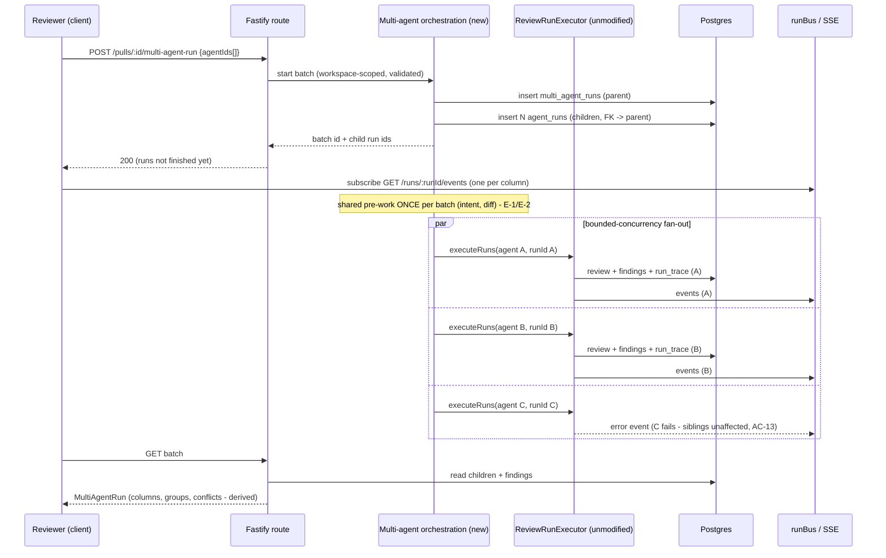

# Spec: Multi-Agent Review with live statuses
Spec ID: SPEC-04
Status: draft
Supersedes: —
Modules: server, client

## Problem & User

A reviewer opening a PR in DevDigest today runs **one agent at a time**. The
control is `RunReviewDropdown` (`client/.../_components/RunReviewDropdown/RunReviewDropdown.tsx:52-77`):
pick one agent, or "Run all enabled agents". There is no way to say "run these
three, not those two", and no way to read the result as three opinions rather
than three unrelated review rows.

That matters because a single PR is rarely one kind of problem. The same diff
can carry a security risk, an N+1 query, and a violation of a domain rule the
team wrote down last quarter. One generalist agent trades depth for breadth on
every one of them. Several specialised agents give real coverage — but only if
the product does three things the current UI does not:

1. **De-duplicate the overlap.** Security Reviewer and General Reviewer will
   both flag the same unvalidated input on the same line. Today those arrive as
   two independent `findings` rows in two independent reviews
   (`server/src/db/schema/reviews.ts:29-46`), with nothing linking them. The
   reviewer de-duplicates in their head, per finding, every time.
2. **Surface the disagreement instead of hiding it.** When Performance Reviewer
   calls a line CRITICAL and Security Reviewer looked at the same line and said
   nothing, that silence is information. Nothing in the product can express
   "agent B reviewed this location and did not flag it" — an agent that didn't
   flag is simply absent from the list.
3. **Never hide what N agents cost.** Running six agents is roughly six LLM
   calls. `agent_runs` already records `durationMs`, `tokensIn`, `tokensOut`,
   `costUsd` per run (`server/src/db/schema/runs.ts:8-32`), and `run_traces`
   holds the per-run detail behind those numbers (`runs.ts:35-40`) — but a user
   choosing agents on the PR page sees none of it *before* they commit to the
   run, and no total for the batch afterwards.

Today's fan-out also isn't what the product claims. `POST /pulls/:id/review`
with `{all: true}` resolves every enabled agent (`modules/reviews/service.ts:56`)
and hands them to `ReviewRunExecutor.executeRuns()`, which walks them in a
**sequential `for...await` loop** (`run-executor.ts:130-168`). The pre-authored
UI copy already promises the opposite — "runs the PR through every enabled agent
**in parallel**" (`client/messages/en/runs.json:126`) — so the parallelism is
copy, not behaviour.

**User:** the reviewer on the PR detail page (repo owner / senior reviewer)
deciding how much review to buy for this particular PR, and reading the result.

## Goals / Non-goals

### Goals

- G-1 — Let a user select an explicit **subset** of agents (checkboxes, not
  "one" or "all") and run them against one PR as a single, named batch.
- G-2 — Execute those agents **concurrently**, so wall-clock time for N agents
  is materially below N × single-agent time.
- G-3 — Group the resulting `agent_runs` under one `multi_agent_runs` parent so
  the batch is addressable, re-openable, and costable as a unit.
- G-4 — Show **per-agent live status** during the run (one indicator and one
  progress stream per agent), not one merged log for the whole batch.
- G-5 — Group near-duplicate findings across sibling runs **without destroying**
  the originals or their per-agent attribution.
- G-6 — Show, per contended code location, every participating agent's verdict —
  including an explicit **"did not flag"** for agents that ran and stayed silent.
- G-7 — Show real, measured time and cost per agent and for the batch, plus
  historical estimates *before* the run so the choice is informed.
- G-8 — Survive a partial failure: one agent crashing must not cancel, block, or
  hide the other agents' runs or results.

### Non-goals / Boundaries (worktree A)

- **In scope**: the PR detail page, the new Multi-Agent Review feature area
  (configure-run screen + results page), and a new multi-agent-run orchestration
  service with its own new files under `server/src/modules/reviews/`.
- **Out of scope, do not modify**: `ci/`, and any `agent-runner/` package.
  `agent-runner/` does not exist in this repo — the single-agent execution path
  lives in `server/src/modules/reviews/run-executor.ts`. Treat the boundary as
  its intent: **`run-executor.ts` is not modified by this feature.** The new
  orchestration calls into the existing per-agent path unchanged.
- **No Eval Dashboard page.** "Turn into eval case" ships as schema + route +
  confirmation only. The `eval` sidebar item (`client/messages/en/shell.json:22`)
  belongs to a different, unwritten feature.
- **No Memory page and no retrieval wiring.** The Learn action *writes* a
  `memory` row (D-10) and nothing else: no Memory browsing screen, no semantic
  search UI, and no injection of memory into any agent's prompt. Those belong to
  the separate Memory feature the nav item already anticipates
  (`shell.json:23`).
- **No cross-agent consensus/arbitration model.** The product surfaces
  disagreement; it does not resolve it, vote on it, or ask a referee agent.
- **No change to the grounding gate, prompt assembly, or findings schema
  semantics.** Grouping is derived, never a new persisted finding.
- **Not a replacement for `RunReviewDropdown`.** Single-agent and "run all" stay
  exactly as they are.

## User stories

- **US-1** — As a reviewer, I open a PR, pick Security + Performance +
  Architecture, see "≈ 8.2s · $0.20" before I commit, and press
  "Run multi-agent review (3)".
- **US-2** — While it runs, I watch three columns fill in independently; the one
  that finishes first is readable while the others are still working.
- **US-3** — One agent fails on a provider error. The other two still complete
  and their findings are still there; the failed column says why.
- **US-4** — Three agents flagged `payments/charge.ts:88`. I see one group, not
  three cards, and I can expand it to read all three takes verbatim.
- **US-5** — I flip on "Show only conflicts" and get just the locations where
  the agents actually disagreed, including where one flagged CRITICAL and
  another reviewed the same line and said nothing.
- **US-6** — I switch to Tabs view, open Security Reviewer's tab, accept one
  finding, dismiss another, turn a third into an eval case, and press Learn on a
  fourth so the team's memory keeps it.
- **US-7** — After the batch, I compare it against a single-agent run of the same
  PR and can read the *actual* measured time and cost of both, not an estimate.

## Acceptance criteria (EARS)

### Configure run

- **AC-1** — The system shall provide a Multi-Agent Review configure-run screen
  reachable from the repo-scoped route matching `/multi-agent`
  (`client/src/components/app-shell/helpers.ts:28` already maps that path to the
  `multi-agent` nav key, and `shell.json:26` already names it).
  *(verify: component test asserting `activeKeyFor('/repos/r1/multi-agent') === 'multi-agent'` plus a route render test.)*
- **AC-2** — WHEN the configure-run screen loads without a PR in context, the
  system shall present a PR selector (`runs.json:115-116` — `"selectPr"`,
  `"prItem"`).
- **AC-3** — The system shall list every agent in the workspace as an
  independently checkable item, showing name, model, and enabled state.
- **AC-4** — WHERE an agent has at least one completed historical `agent_runs`
  row, the system shall show that agent's average duration and average cost next
  to its checkbox (e.g. "8.2s · $0.06").
- **AC-5** — IF an agent has no completed historical run, THEN the system shall
  render an explicit "no estimate yet" state for that agent and shall not
  display a fabricated number.
- **AC-6** — WHILE at least one agent is selected, the system shall display a
  rolled-up estimate for the selection (summed cost; duration presented as the
  parallel fan-out estimate, i.e. the maximum per-agent average, not the sum).
  *(verify: unit test on the aggregation helper.)*
- **AC-7** — The run button shall display the live count of selected agents
  ("Run multi-agent review (3)") and shall be disabled while zero are selected.
- **AC-8** — The PR detail page shall offer an entry point into this screen with
  the current PR pre-selected, alongside — not replacing — the existing
  `RunReviewDropdown`.

### Batch execution

- **AC-9** — WHEN a multi-agent run is requested with a non-empty set of agent
  IDs, the system shall create exactly one `multi_agent_runs` row
  (`server/src/db/schema/runs.ts:42-51`) and shall link every child `agent_runs`
  row of that batch to it via a new FK column on `agent_runs`.
  *(verify: integration test — one parent row, N children, all linked.)*
- **AC-10** — The system shall start the selected agents' runs **concurrently**,
  subject to a bounded concurrency limit, and shall not modify
  `server/src/modules/reviews/run-executor.ts`.
  *(verify: integration test with a fake LLM adapter asserting overlapping start/end windows; plus a git-diff check that `run-executor.ts` is untouched.)*
- **AC-11** — Each agent in a batch shall produce its own `agent_runs` row, its
  own `run_traces` row, its own `reviews` + `findings` rows, and its own SSE
  stream at `GET /runs/:id/events` (`server/src/modules/reviews/routes.ts:81`),
  identical in shape to a single-agent run.
- **AC-12** — The request shall return the batch id and the child run ids
  immediately, before any agent completes, mirroring `service.ts:120-143`.
- **AC-13** — IF one agent's run fails or is cancelled, THEN the system shall
  leave every sibling run's execution and persisted result unaffected, and shall
  record that agent's `status` and `error` on its own `agent_runs` row.
  *(verify: integration test injecting a failure into exactly one of three runs.)*
- **AC-14** — The system shall expose a batch read endpoint returning the
  pre-authored `MultiAgentRun` shape
  (`server/src/vendor/shared/contracts/observability.ts:74-86`): `id`, `pr_id`,
  `ran_at`, `agent_count`, `total_duration_ms`, `total_cost_usd`, `columns`,
  `conflicts`.
- **AC-15** — `total_duration_ms` shall be the batch's **wall-clock** span (first
  start → last finish), and `total_cost_usd` the **sum** of participating runs'
  `cost_usd`; WHERE any participating run has a null `cost_usd`, the total shall
  be reported as partial rather than silently under-counted.
  [NEEDS CLARIFICATION: is "partial" surfaced as a badge on the total, or is the
  total suppressed entirely? — recorded in Open questions, default = badge.]

### Live status (Columns view)

- **AC-16** — The results page shall offer two view modes, Columns and Tabs
  (`runs.json:117-120` already defines both labels).
- **AC-17** — WHILE a batch is running, the Columns view shall render one column
  per participating agent, each with its own status indicator driven by that
  agent's own run stream — never a single merged stream for the batch.
- **AC-18** — Each column shall reuse `LiveLogStream`
  (`client/src/vendor/ui/LiveLogStream.tsx`) as-is for its own log; the component's
  internals shall not be modified.
- **AC-19** — Each column shall offer a "View trace" affordance that opens
  `RunTraceDrawer` (`client/.../RunTraceDrawer/RunTraceDrawer.tsx:19-28`) for
  that column's `runId`. Per D-13, the results page keeps this to the simplest
  shape the component already supports: **one shared "which runId is open"
  state for the whole page**, not one drawer instance per column. Clicking
  "View trace" anywhere sets that state to the clicked run's id; a single
  `RunTraceDrawer` mount reads it and renders (or stays unmounted when null).
  The drawer's own internals — its tabs (Configuration / Stats / Prompt
  assembly / Tool calls / Raw output, plus Live log) and its "Copy raw output"
  footer button — are unmodified and already exactly match what this feature
  needs; nothing inside `RunTraceDrawer.tsx` changes.
- **AC-20** — WHEN an individual agent's run completes, that column shall settle
  to its terminal state — verdict, 0-100 score badge, findings count, duration,
  cost, per the Columns design screenshot — while other columns are still
  running.
- **AC-21** — IF an agent's run fails, THEN its column shall render a failed
  state carrying the persisted `error` text, and the batch shall not be reported
  as failed as a whole.

### Finding groups

- **AC-22** — The system shall group findings produced by different runs of the
  same batch when all of the following hold: identical `file` (after path
  normalization, E-12); the same `category` (`FindingCategory` —
  `contracts/findings.ts:14`); and line ranges `[start_line, end_line]` that
  overlap after expanding each by **±3 lines**, where the ±3 expansion applies
  only to findings whose own range spans ≤ 20 lines — a wider finding groups
  only on exact range overlap (E-10 guard).
  *(verify: unit tests over the grouping function with fixture findings, including a >20-line finding.)*
- **AC-23** — Grouping shall be **derived**, computed from persisted findings at
  read time; the system shall not mutate, merge, or delete any `findings` row,
  and each finding shall retain its own `id`, `reviewId`, and full text.
  *(verify: integration test asserting `findings` row count is unchanged by any read.)*
- **AC-24** — WHEN a group contains findings from more than one agent, the UI
  shall render it as one entry that names every contributing agent and can be
  expanded to show each agent's own title, rationale, suggestion, and
  confidence verbatim.
- **AC-25** — A finding flagged by exactly one agent shall still be shown, as a
  group of one — grouping shall never suppress a finding.
- **AC-26** — Accept/Dismiss shall continue to act on an **individual** finding
  id via the existing `POST /findings/:id/accept|dismiss`
  (`routes.ts:32,176-177`); acting on one member of a group shall not
  implicitly act on its siblings.
  [NEEDS CLARIFICATION: should the group offer an explicit "dismiss all in
  group" bulk action? — Open questions; default = no bulk action in this spec.]

### Where agents disagree

- **AC-27** — For each contended code location, the system shall emit a
  `Conflict` in the pre-authored shape (`observability.ts:66-72`): `file`,
  `line`, `title`, and one `ConflictTake` per **participating** agent.
- **AC-28** — WHERE an agent's run completed successfully but produced no
  finding at that location, the system shall include that agent as a take with
  verdict `'ignored'` (`observability.ts:52-58` already reserves this literal for
  "the agent did not flag it"), and shall render it as a visible "did not flag"
  cell carrying that take's `note` as the short reason — "did not flag" is a
  first-class state, not an omission (confirmed by the Columns design screenshot).
- **AC-29** — IF an agent's run failed or was cancelled, THEN that agent shall be
  excluded from every take list rather than reported as `'ignored'`, because it
  did not actually review the location.
  *(verify: unit test — a failed run never contributes an `'ignored'` take.)*
- **AC-30** — A location shall be classified as a **conflict** when at least one
  participating agent flagged it and at least one other participating agent did
  not, OR when two agents flagged it with different `severity` values.
- **AC-31** — The disagreement block shall provide a "Show only conflicts"
  toggle; when off, it shall show every shared location (locations two or more
  participating agents both reached), and when on, only those meeting AC-30.
- **AC-32** — Conflicts shall be computed from persisted findings and not stored
  (as the contract's own comment already states, `observability.ts:61-64`).

### Tabs + detail view

- **AC-33** — The Tabs view shall render one tab per participating agent,
  showing that agent's own findings only, with per-finding confidence, suggested
  fix, Accept, Dismiss, Learn, and Turn-into-eval-case.
- **AC-34** — Accept and Dismiss shall reuse the existing finding-action path
  unchanged, and their persisted state (`accepted_at` / `dismissed_at`,
  `schema/reviews.ts:44-45`) shall render identically to the single-run findings
  UI (`FindingCard.tsx:60-120`).
- **AC-34a** — The active tab's header shall offer the same "View trace"
  affordance as a Columns card (per the Tabs design screenshot), opening the
  same shared `RunTraceDrawer` instance described in AC-19 for that tab's
  `runId`. Columns and Tabs are two read layouts over the same batch data —
  they share one trace-drawer mechanism, not two.

### Learn → memory

- **AC-35** — The system shall register a `POST /findings/:id/learn` route. The
  action name already exists in the contract
  (`contracts/findings.ts:82` — `FindingActionKind` includes `'learn'`) but no
  route registers it today (`routes.ts:32` registers accept/dismiss only) and
  the service rejects it as "not available in the starter"
  (`modules/reviews/findings.ts:22-32`); both shall be extended to serve it.
- **AC-36** — WHEN a finding is learned, the system shall create one `memory`
  row (`server/src/db/schema/knowledge.ts:9-30`) with `kind: 'learning'`,
  `scope: 'repo'`, `repoId` = the finding's PR's repo, `content` derived from
  the finding's title, rationale and suggestion, `confidence` = the finding's own
  confidence, and `sources` = one `MemorySource`
  (`contracts/knowledge.ts` — `{pr, context}`) naming the PR number and the
  originating `file:line` + agent.
- **AC-37** — The response shall include the created row's id as `memoryId`,
  matching what the client mutation already expects
  (`client/src/lib/hooks/reviews.ts:181-186`).
- **AC-38** — The system shall insert the `memory` row with `embedding: null`
  and shall **not** call the embedder as part of this feature. Confirmed by
  reading the code: `memory.embedding` (`schema/knowledge.ts:22`) has zero
  readers anywhere in the codebase today — no retrieval, no vector search, no
  other reference beyond the schema file and its barrel re-export — and
  `container.embedder()` (`platform/container.ts:266`) has zero callers. Wiring
  Learn to the embedder now would add a network call, a config gate, and a
  failure-handling branch that produce a column nothing reads. Populating
  `embedding` is the future Memory/retrieval feature's job, not this one's.
  *(verify: integration test asserting a learned row's `embedding` is null and
  no embedder call was made.)*
- **AC-39** — IF the same finding is learned twice, THEN the system shall not
  create a second `memory` row and shall return the existing `memoryId`.
- **AC-40** — Learn shall be **additive**, not terminal: it shall not set
  `accepted_at` or `dismissed_at`, and a finding may be learned and then still
  accepted or dismissed.

### Turn into eval case

- **AC-41** — The system shall extend `eval_cases.owner_kind`
  (`server/src/db/schema/eval.ts:12`, currently `['skill','agent']`) with a
  `'finding'` member, via a migration generated by `drizzle-kit`.
- **AC-42** — WHEN a user turns a finding into an eval case, the system shall
  create one `eval_cases` row with `ownerKind: 'finding'`, `ownerId` = the
  finding's id, a name derived from the finding's title, `inputDiff` /
  `inputFiles` sourced from the finding's PR, `inputMeta` recording the
  originating agent, run, and PR head SHA, and `expectedOutput` seeded from that
  finding's own severity/category/file/line/suggestion as a **draft pending human
  edit**.
- **AC-43** — The system shall confirm success with a lightweight notification
  and shall not navigate to, or require, any eval management page.
- **AC-44** — IF the same finding is turned into an eval case twice, THEN the
  system shall not create a duplicate row and shall report the existing case.
  *(verify: integration test calling the route twice.)*

### Agent roster

- **AC-45** — The system shall seed three additional review personas — **Junior
  Mentor**, **Customer-Facing**, and **Architecture** — alongside the existing
  General / Security / Performance Reviewer (`server/src/db/seed.ts:180-214`),
  each with a prompt body in `server/src/db/seed-prompts.ts` mirrored into a new
  `docs/agent-prompts/<name>.md` (the mirror convention the existing three
  follow, `seed.ts:180-181`).
- **AC-46** — Seeding shall be idempotent: re-running the seed shall not create
  duplicate personas.
- **AC-47** — The picker shall list **every agent in the workspace** — all six
  seeded personas including General Reviewer, plus any agent the user created —
  with no hardcoded allow-list or exclusion (D-12).

### Measured verification (the demo story)

- **AC-48** — The system shall expose, per completed run, the real measured
  `duration_ms`, `cost_usd`, `tokens_in`, `tokens_out` from `agent_runs`, and
  the grounding-gate and prompt-assembly detail behind them from that run's
  `run_traces` document (`RunTrace.stats`, `contracts/trace.ts:65-83`).
- **AC-49** — The system shall expose batch-level measured totals (AC-15), so a
  one-agent run and a three-agent run of the same PR can be compared on actual
  numbers rather than estimates.
- **AC-50** — Estimates (AC-4/AC-6) and measured values (AC-48/AC-49) shall be
  visually distinguishable; the product shall never present an estimate as a
  measurement.

**Manual verification scenario (must be executed and its result recorded, not
assumed):**

1. Run three real agents on a demo PR via the configure-run screen.
2. Confirm the Columns view fills in per agent, the finding groups form, and the
   disagreement block renders takes including at least one `'ignored'`.
3. Run the **same PR** with a single agent.
4. Record the **actual measured** wall-clock and cost of both runs and their real
   ratio. The ratio is an observation, not a target — head-SHA-keyed intent
   reuse (`intent-service.ts:120-126`), shared diff work, and differing response
   lengths can all move it away from 3×. A result of "3 agents cost 2.4× and took
   1.3× the single run" is a **passing** result; fabricating 3× is a failure.

## Edge cases

Every case below is grounded in a file that was actually read.

- **E-1 — Concurrent cold-start intent classification.** `getOrClassify` reads
  `pr_intent` first and only classifies+upserts on a head-SHA miss
  (`intent-service.ts:114-128`), so it is naturally cache-friendly — a second
  call for the same head SHA just reads, it doesn't reclassify — **provided the
  two calls aren't truly concurrent** (there's no lock around read-then-upsert,
  so two calls racing before either has written could both classify). The fix
  is ordering, not locking: the orchestrator `await`s one `getOrClassify` call
  **before** starting the fan-out, so the row already exists by the time any of
  the N per-agent `executeRuns()` calls reaches its own `buildOrLoadIntent`.
  Zero new synchronization code — just one await ahead of `Promise.all`.
- **E-2 — N× diff loads.** `loadDiff` calls `container.git.diff(...)` and falls
  back to reconstructing from `pr_files` (`diff-loader.ts:12-30`), with **no
  caching today** — confirmed by reading the file. `executeRuns` loads it once
  per invocation (`run-executor.ts:107`, before its per-agent loop), so calling
  it N times (once per agent, to get concurrency without touching
  `run-executor.ts`) means N diff loads. The fix is a small, self-contained
  addition to `diff-loader.ts` itself (not `run-executor.ts`, so it stays in
  bounds): an in-memory `Map` memoizing `loadDiff`'s result keyed by
  `` `${pull.id}:${pull.headSha}` `` — both already available at every call
  site. A handful of lines, no shared-context plumbing through modified
  function signatures.
- **E-3 — Shared-logger fan-out is wrong for columns.** `RunLogger` is
  constructed over *every* runId in the batch (`run-executor.ts:74-79`), so
  pre-work events are duplicated into every run's buffer. With one agent per
  invocation, each run's log stays its own — which is what AC-17 needs, and
  worth stating so nobody "fixes" it back to a shared logger.
- **E-4 — Batch with one agent selected.** Must behave exactly like a normal
  run, still producing a `multi_agent_runs` parent (AC-9) — no special case.
- **E-5 — Zero agents selected.** Run button disabled (AC-7); the endpoint must
  also reject an empty set rather than creating an empty batch.
- **E-6 — Every agent in the batch fails.** The batch is still readable: parent
  row exists, every column shows its own error, no results section is fabricated.
- **E-7 — Cancelling one run.** `POST /runs/:id/cancel` (`routes.ts:147`) marks
  one run cancelled and completes its bus. Cancelling one member of a batch must
  not cancel siblings.
  [NEEDS CLARIFICATION: is there a "cancel the whole batch" affordance? — Open
  questions; default = per-run cancel only, matching the existing endpoint.]
- **E-8 — Orphaned runs after a server restart.** `reapStaleRuns()` marks runs
  left `running` by a dead process (`service.ts:99-101`) and assumes a single API
  process (`server/AGENTS.md`). A reaped child leaves its parent batch with a
  mixed terminal state; the batch read must tolerate that, not hang on "running".
- **E-9 — Duplicate/overlapping batches on the same PR.** Nothing prevents a
  second batch while the first runs. `multi_agent_runs` has no uniqueness on
  `prId`, so the results page must address a **specific** batch id, not "the
  latest batch for this PR", or two in-flight batches will interleave on screen.
- **E-10 — A finding whose line range is huge.** `start_line`/`end_line` are
  free integers (`schema/reviews.ts:34-35`). A file-level finding spanning
  hundreds of lines would, under ±3 expansion, swallow unrelated findings into
  one group. Guarded by AC-22: findings spanning more than 20 lines group only on
  exact range overlap, with no ±3 expansion.
- **E-11 — Same file, same line, different category.** AC-22 requires equal
  `category`, so a `security` and a `perf` finding on the same line are *not*
  grouped — but they *are* a shared location for the disagreement block (AC-30
  keys on location, not category). The two features intentionally disagree about
  what "same" means; that is by design and must be stated in the UI copy.
- **E-12 — File-path spelling.** Grouping is exact-match on `file`. Agents can
  emit `./src/x.ts` vs `src/x.ts`. The grounding gate constrains findings to real
  diff hunks (`contracts/findings.ts:42-44`), which limits but does not eliminate
  this; normalization is required before comparison.
- **E-13 — A run with zero findings.** It still participates: it contributes
  `'ignored'` takes at every shared location (AC-28) and an empty column.
- **E-14 — `AgentColumn.status` has no `'cancelled'`.** The pre-authored enum is
  `['done','failed','running']` (`observability.ts:41`), but `agent_runs.status`
  can be `cancelled` (`service.ts:94`). The contract must be extended, in **both**
  hand-mirrored copies (`server/src/vendor/shared/contracts/observability.ts`
  and `client/src/vendor/shared/contracts/observability.ts` — no sync script,
  root `AGENTS.md`).
- **E-15 — `MultiAgentRun` carries no finding groups.** The pre-authored contract
  has `columns` and `conflicts` but no group structure (`observability.ts:75-85`).
  AC-22..AC-25 need one; the contract must be extended (again, in both copies).
- **E-16 — Pre-authored copy contradicts the picker.** `runs.json:113-135` says
  "Run all agents" / "every enabled agent in parallel" / "fan-out via p-queue".
  This spec's subset picker supersedes that copy; the i18n file must be extended
  rather than the requirement bent to fit existing strings.
- **E-17 — Estimates from a changed model.** Averages come from historical
  `agent_runs`, but an agent's `model` can be edited (`schema/agents.ts:17`).
  An average spanning a model switch is misleading; scoping the average to the
  agent's *current* model is the safer read.
- **E-18 — "Reply to author".** Copy exists (`client/messages/en/prReview.json:9-11`),
  `FindingCard` already accepts an optional `reply` argument
  (`FindingCard.tsx:45`), `useFindingAction` already forwards it
  (`hooks/reviews.ts:181-190`), and `FindingActionKind` includes `'reply'`
  (`contracts/findings.ts:82`) — but no route registers it (`routes.ts:32`) and
  no component renders it. It is **unimplemented, not reusable**. Out of this
  spec's critical path; noted so nobody assumes it works.
- **E-19 — LLM rate limits under fan-out.** Six concurrent runs against one
  provider key can trip provider-side 429s that a sequential loop never hit.
  Bounded concurrency (NFR-2) is the mitigation.
- **E-20 — Learn writes into a table nothing reads yet.** `memory` has zero code
  references outside the schema (no module under `server/src/modules/`), and the
  Memory page's own empty-state copy already says memory "is created by the
  'Learn' action on findings" (`client/messages/en/memory.json:10`). Learned rows
  are therefore write-only until the Memory feature ships — acceptable and
  intended, but it must not be described in the UI as something the agents will
  immediately start using.

## Non-functional requirements

Checked against the `security` skill (OWASP Top 10:2025) plus the non-security
categories.

### Security

- **NFR-1 — Tenant isolation (A01).** Every read and write introduced here —
  batch create, batch read, estimate aggregation, eval-case create, memory
  create — must be `workspaceId`-scoped at the repository layer, as an explicit
  parameter, never inferred inside a query. This matches the existing pattern
  (`getContext` → `workspaceId` on every route, `routes.ts:44-46`) and the
  onion-architecture rule in `server/AGENTS.md`. A batch id from another
  workspace must 404, not leak columns.
- **NFR-2 — Cost/DoS (A06).** `POST /pulls/:id/review` is rate-limited precisely
  because "each call can fan out to expensive LLM runs" (`routes.ts:39-45`). The
  batch endpoint multiplies that by N and must carry at least as strict a limit,
  plus a **bounded concurrency cap** on the fan-out (`p-queue@8` is already a
  server dependency and already used for exactly this, `platform/jobs.ts:1,40`)
  and a server-side cap on how many agents one batch may contain. Unbounded
  `Promise.all` over an arbitrary client-supplied agent list is a
  self-inflicted-cost vector.
- **NFR-3 — Mass assignment / input validation (A08, A05).** The batch request
  body must be a zod schema declared on the route (`server/AGENTS.md`: routes
  declare zod schemas; invalid input 422s before the handler). Agent IDs must be
  validated as UUIDs **and** verified to belong to the caller's workspace before
  any run is created — an unvalidated id list is an IDOR into another
  workspace's agents.
- **NFR-4 — Untrusted model output (A05 / ASI09).** Finding titles, rationales
  and suggestions are LLM-authored and now render in more places (groups, takes,
  eval-case names). They stay untrusted text: rendered through the existing
  centralized Markdown component (`client/AGENTS.md` — `Markdown.tsx` is the one
  instance), never `dangerouslySetInnerHTML`, and never used to build a path,
  query, or command server-side.
- **NFR-5 — Learn is a stored-prompt-injection surface (ASI01/ASI09).** Learn
  persists **LLM-authored text** into `memory`, and memory exists to be retrieved
  into future prompts. A finding whose rationale was itself influenced by a
  malicious diff would, once learned, become durable prompt content. Mitigations
  for this spec: Learn is always an explicit human action (never automatic),
  `content` is stored as plain data and never executed or rendered as HTML, the
  row records its provenance in `sources` so it is auditable and revocable, and
  this spec ships **no retrieval path** (Non-goals) — the injection risk lands
  with whoever wires memory into prompts, and must be flagged to them.
- **NFR-6 — Secrets (A04/A09).** No provider key, prompt secret, or token may
  appear in a batch response, a column, a conflict take, an eval case's
  `inputMeta`, or a memory row's `content`. Secrets live only in
  `~/.devdigest/secrets.json` / `LocalSecretsProvider` (root `AGENTS.md`,
  `server/AGENTS.md`); nothing here reads them directly.
- **NFR-7 — Persistence actions verify ownership (A01/A08).** Both `learn` and
  the eval-case create must verify the finding's PR belongs to the caller's
  workspace before writing — exactly the check `actOnFinding` already performs
  (`modules/reviews/findings.ts:17-20`) — and must whitelist the fields they
  copy rather than spreading a client-supplied object.

### Non-security

- **NFR-8 — Performance / the whole point.** Wall-clock for N concurrently
  executed agents must be materially below the sequential sum, and the batch must
  report its real wall-clock (AC-15). No numeric SLA is set — see Open questions.
- **NFR-9 — Shared pre-work.** Intent classification and diff loading must be
  done once per batch, not once per agent (E-1, E-2) — this is both a cost and a
  correctness requirement.
- **NFR-10 — Availability / partial failure.** One failing run must not fail the
  batch (AC-13/AC-21). The existing per-agent isolation contract
  (`run-executor.ts:44,159-167`) is preserved, not weakened. (Learn has no
  embedder call to fail in the first place — AC-38.)
- **NFR-11 — Observability.** Every child run keeps its own full `run_traces`
  document, so a reviewer can always answer "what did *this* agent see and what
  did it cost" (`runs.ts:35-40`, `RunTrace.stats`). The batch adds a grouping
  layer above traces; it must not replace or summarize away per-run traces.
- **NFR-12 — Scalability limits, stated honestly.** `runBus` is in-memory and
  `reapStaleRuns()` assumes a single API process (`server/AGENTS.md`). A batch is
  therefore bound to one process; multi-replica correctness is out of scope and
  must not be claimed.
- **NFR-13 — Maintainability.** New server code goes in new files under
  `server/src/modules/reviews/` following routes → service → repository with no
  infrastructure imports in domain code (`onion-architecture`, enforced by
  `pnpm arch:check`). New client code goes in colocated `_components/<Name>/`
  folders with their own tests, data access only via `src/lib/hooks/*`
  (`client/AGENTS.md`).
- **NFR-14 — Migrations.** The `agent_runs` FK column and the `owner_kind` enum
  change must be generated via `pnpm db:generate`, never hand-edited, and applied
  manually with `pnpm db:migrate` (root `AGENTS.md` — migrations do not run on
  boot).

## Module interaction / API contracts

### Contracts that already exist (extend, don't re-invent)

`observability.ts` is pre-authored for exactly this feature, in both mirrored
copies, and already exported from both barrels
(`server/src/vendor/shared/index.ts:25`, `client/src/vendor/shared/index.ts:25`):

| Contract | Line | Use here |
|---|---|---|
| `MultiAgentRun` | `observability.ts:75-86` | batch response (needs a groups field — E-15) |
| `AgentColumn` | `:35-49` | one column (needs `'cancelled'` — E-14) |
| `AgentColumnFinding` | `:23-32` | column finding subset |
| `Conflict` | `:66-72` | one contended location; "computed, not stored" |
| `ConflictTake` | `:52-59` | one agent's stance, incl. `'ignored'` |
| `AgentStats` | `:96-119` | shape available for the estimate aggregation |
| `MemoryItem` / `MemorySource` / `MemoryKind` | `contracts/knowledge.ts` | the Learn write's payload shape |

The file header even names the endpoint: "the response of
`POST /pulls/:id/multi-agent-run`" (`observability.ts:9`). This spec adopts that
naming. Any contract edit must be hand-mirrored into both copies (root
`AGENTS.md`).

### Endpoints

| Endpoint | Status | Note |
|---|---|---|
| `POST /pulls/:id/multi-agent-run` | **new** | body = agent id subset; returns batch id + child run ids immediately |
| `GET /multi-agent-runs/:id` | **new** | `MultiAgentRun` incl. columns, conflicts, groups. Addresses one specific batch by id, never "the latest batch for this PR" (E-9) — the only shape that satisfies that requirement, so no alternative is offered. |
| `GET /agents/stats` | **new** | Returns the aggregate (avg duration, avg cost) for every workspace agent in one call — the configure-run screen needs all of them at once for the checkbox list (AC-3/AC-4), so one batched endpoint is simpler than either an N-call loop or a parametrized single-id variant. No stats route exists today (`modules/agents/routes.ts:74-174`). |
| `POST /findings/:id/learn` | **new** | writes one `memory` row, returns `memoryId` (AC-35..AC-40) |
| `POST /findings/:id/eval-case` | **new** | AC-42 |
| `POST /pulls/:id/review` | reuse, unchanged | `routes.ts:41-57` |
| `GET /runs/:id/events` (SSE) | reuse, unchanged | `routes.ts:81` |
| `GET /runs/:id/trace` | reuse, unchanged | `routes.ts:154` |
| `POST /findings/:id/accept\|dismiss` | reuse, unchanged | `routes.ts:176-177` |
| `POST /runs/:id/cancel` | reuse, per-run only | `routes.ts:147` (E-7) |

### Flow

### Schema changes

- `agent_runs` + `multi_agent_run_id uuid NULL REFERENCES multi_agent_runs(id)`.
  Nullable, because every single-agent run ever recorded has no parent — this is
  additive and breaks nothing (`schema/runs.ts:8-32`).
- `eval_cases.owner_kind` enum + `'finding'` (`schema/eval.ts:12`). Safe: the
  table has **zero** code references outside the schema file today.
- `multi_agent_runs` itself needs no new columns for this spec — its existing
  four (`runs.ts:42-51`) suffice, since totals are derived from children.
- `memory` needs **no** schema change: `scope`, `kind: 'learning'`, `content`,
  `confidence`, `sources`, nullable `embedding` are all already declared
  (`schema/knowledge.ts:9-30`).

### Client surfaces

- New route under `/repos/[repoId]/multi-agent` — configure-run + results.
  `activeKeyFor` already highlights any path containing `/multi-agent`
  (`helpers.ts:28`), the same `.includes` style used for `/context` and
  `/conventions` (`helpers.ts:34-35`), so the repo-scoped path works with no
  change to the shell.
- New composition around `useRunEvents` (`hooks/reviews.ts:203-250`) for
  per-column status. `RunStatus` (`_components/RunStatus/RunStatus.tsx`) merges
  N runIds into **one** `LiveLogStream` and is therefore the wrong shape for
  Columns — it is wrapped/replaced by a per-agent composition, while
  `LiveLogStream` and `RunTraceDrawer` themselves stay untouched.
- `useFindingAction` (`hooks/reviews.ts:176-192`) already posts to
  `/findings/:id/:action` and already types a `memoryId` in its response — Learn
  needs no new client hook shape, only the action to become reachable.
- Trace access (D-13): the results page holds one `openRunId` state value;
  Columns and Tabs both wire their "View trace" trigger to it, and one
  `RunTraceDrawer` renders conditionally. No new drawer component, no per-agent
  drawer state.
- New i18n keys extending `client/messages/en/runs.json` (page block at
  `:112-135`) rather than repurposing "Run all agents" (E-16).

### Terminology guard

"Agent" in this spec always means a **review persona row in the `agents` table**
(`schema/agents.ts:8-35`), seeded at `seed.ts:180-214`. The `agents/*.md` files
at the repo root are SDD workflow personas (spec-creator, implementer, …) and are
unrelated to this feature.

## UX improvements

Grounded in two design screenshots supplied by the user (configure-run screen
and Columns results screen) plus the pre-authored i18n copy and the existing
components. The screenshots and `runs.json:112-135` agree with each other; where
this section states a layout fact, both sources back it.

**Confirmed by the design — configure run:**

- Two numbered steps: "1 Pull request", "2 Agents to run".
- One checkbox card per agent per row: emblem icon, agent name, a short summary
  line of that agent's verdict focus, and its historical estimate right-aligned
  as "8.2s · $0.06" (AC-4).
- Bottom action: "Run multi-agent review (N)" with the rolled-up caption
  "= 8.2s · $0.20 · parallel fan-out" — max-duration, summed-cost, exactly as
  AC-6 requires.

**Confirmed by the design — Columns results:**

- Header reads "N selected agents · parallel".
- One card-column per agent: colour-coded border by agent type, a circular
  0-100 score badge in the card's top corner, the top 2-3 findings as short
  `file:line` lines, and a footer with "View trace" (AC-19) and "N findings".
- Below the columns, a "Where agents disagree" block: one row per contended
  location titled `file:line — title`, with one cell per agent showing either a
  severity chip (SUGGESTION / WARNING / …) or a muted "did not flag" cell
  carrying a short reason — i.e. `ConflictTake.verdict` plus
  `ConflictTake.note` (`observability.ts:52-58`) rendered exactly as AC-28
  specifies.

- **Estimate honesty.** AC-50 exists because the two numbers look identical
  otherwise. An estimate should read as a range or carry a "≈" and a "from N past
  runs" affordance; a measured value should not.
- **Duration is not additive.** Summing per-agent averages for a parallel run
  overstates it. AC-6 uses max-not-sum, and the label should say so
  ("≈ 8.2s in parallel · $0.20 total").
- **"Did not flag" needs to look deliberate.** An `'ignored'` take rendered as an
  empty cell reads as a bug. It needs its own visual treatment and a tooltip
  saying the agent reviewed this location and raised nothing.
- **Failure must be legible per column, not global.** Today a runtime agent error
  surfaces as a global toast (`hooks/reviews.ts:223-225`). With six agents that
  is six toasts and no attribution. The failed column owns the message; a toast
  storm is a regression.
- **The group is the unit, the take is the detail.** Collapsed by default, one
  line per group with contributing agent names; expanding shows each agent's
  verbatim take. Never a merged, paraphrased rationale — paraphrasing LLM output
  destroys the attribution the whole feature exists to preserve.
- **"Show only conflicts" default.** Default **off** (show all shared locations),
  so the block is never mysteriously empty on a PR where all agents agreed.
- **Learn must not masquerade as a verdict.** It sits visually apart from
  Accept/Dismiss, because those are terminal state changes on the finding and
  Learn is not (AC-40). Its confirmation should say where the knowledge went
  ("Saved to memory"), and should not promise that agents will use it yet (E-20).
- **Two entry points, one mental model.** The PR page entry and the standalone
  configure-run screen must land on the same screen with the same state, not two
  divergent flows.
- **Accessibility.** Column status must not be conveyed by colour alone — a
  running/done/failed column needs a text or icon state too, and the live regions
  streaming per-column log lines need to not spam a screen reader with six
  simultaneous polite updates.
- **Empty states already written.** `runs.json:124-134` provides the "no agents
  enabled" and "no multi-agent run yet" states; use them rather than inventing new
  ones.

## Inputs and provenance

| Section | Grounded in |
|---|---|
| Problem & User | `RunReviewDropdown.tsx:52-77`; `run-executor.ts:130-168` (sequential loop); `schema/runs.ts:8-40`; `schema/reviews.ts:29-46`; `client/messages/en/runs.json:126` |
| Goals / Non-goals | User's confirmed scope decisions 1-4 (parallelism, personas, heuristic, eval scope) + the follow-up decisions on Learn, ±3, and the picker roster + the worktree A boundary as stated in the request |
| Design layout (configure-run + Columns) | Two design screenshots supplied by the user, corroborated by `client/messages/en/runs.json:112-135` |
| User stories | Same as above; UI vocabulary from `runs.json:112-135` |
| Acceptance criteria | `routes.ts:32,41,81,128,147,154,176`; `service.ts:56,94,99,120-143`; `run-executor.ts:74-79,107,130-168`; `schema/runs.ts:8-51`; `schema/eval.ts:7-20`; `schema/reviews.ts:29-46`; `schema/knowledge.ts:9-30`; `platform/container.ts:266-278`; `contracts/observability.ts:23-86`; `contracts/findings.ts:11-15,82`; `contracts/knowledge.ts` (MemoryKind/MemorySource); `contracts/trace.ts:65-83`; `hooks/reviews.ts:176-192`; `helpers.ts:28`; `shell.json:26`; `runs.json:112-135`; `RunTraceDrawer.tsx:19-28`; `RunStatus.tsx`; `LiveLogStream.tsx`; `seed.ts:180-214` |
| Edge cases | `intent-service.ts:103-127,312`; `diff-loader.ts:12-30`; `run-executor.ts:74-79`; `service.ts:91-101`; `schema/runs.ts:42-51`; `contracts/observability.ts:41,52-58,75-85`; `contracts/findings.ts:42-44,82`; `FindingCard.tsx:45`; `hooks/reviews.ts:181-190`; `routes.ts:32,147`; `prReview.json:9-11`; `memory.json:10`; `runs.json:113-135`; `schema/agents.ts:17` |
| Non-functional requirements | `security` skill (OWASP Top 10:2025 — A01, A04, A05, A06, A08, A09, ASI01/ASI09) + `routes.ts:39-45`; `platform/jobs.ts:1,40`; `server/package.json:36` (`p-queue@^8.0.1`); `platform/container.ts:266-278`; `modules/reviews/findings.ts:17-20`; root/`server`/`client` `AGENTS.md` (secrets, migrations, onion, vendor mirror, single-process runBus) |
| Module interaction / API contracts | `contracts/observability.ts:5-119`; `contracts/knowledge.ts`; both `vendor/shared/index.ts:25`; `routes.ts:41-177`; `modules/agents/routes.ts:74-174`; `schema/runs.ts:8-51`; `schema/eval.ts:7-20`; `schema/knowledge.ts:9-30`; `helpers.ts:28,34-35`; `hooks/reviews.ts:176-250` |
| UX improvements | User-supplied configure-run and Columns design screenshots; `runs.json:112-135`; `memory.json:10`; `observability.ts:52-58`; `hooks/reviews.ts:223-225`; `FindingCard.tsx:60-120` |

## Untrusted inputs

| Input | Source | Handling |
|---|---|---|
| `agentIds[]` in the batch request | client (attacker-controllable) | zod-validated UUIDs, count-capped, each verified to belong to the caller's workspace before any run is created (NFR-2, NFR-3) |
| `prId` path param | client | existing `IdParams` zod schema + workspace-scoped lookup, as `routes.ts` already does throughout |
| `findingId` for learn / eval-case | client | ownership verified via the finding → review → PR → workspace chain, exactly as `findings.ts:17-20` (NFR-7) |
| Finding title / rationale / suggestion | **LLM output** | untrusted text: rendered via the single centralized Markdown component, never `dangerouslySetInnerHTML`, never interpolated into a path/query/command; copied into `eval_cases` and `memory` as data only (NFR-4) |
| Learned `memory.content` | **LLM output, now persisted** | durable, retrievable text — a stored-prompt-injection surface once memory is wired into prompts. Human-initiated only, provenance recorded in `sources`, no retrieval path in this spec (NFR-5) |
| PR diff and file paths | GitHub / clone | already treated as untrusted data by the prompt layer (`wrapUntrusted`, see SPEC-01); grouping normalizes paths for comparison only, never for filesystem access (E-12) |
| Batch id in a URL | client | workspace-scoped read; a foreign batch id 404s (NFR-1) |
| Historical aggregates | own DB | trusted, but scoped per workspace and per agent's current model (E-17) |

## Decisions recorded

- **D-1 — New orchestration service, `run-executor.ts` untouched.** The batch
  layer creates the parent row and kicks off each agent's existing single-agent
  execution path concurrently. Confirmed by the user; also the smallest diff
  against the worktree-A boundary.
- **D-2 — Shared pre-work, via two small local fixes, not a shared-context
  refactor.** Because D-1 invokes the per-agent path N times, intent
  classification and diff loading must not repeat N times (E-1, E-2). The
  simplest fix for each, confirmed against the actual code: (a) the
  orchestrator awaits one `getOrClassify` call before starting the fan-out —
  ordering, exploiting the service's existing read-before-write cache, zero new
  locking code; (b) `diff-loader.ts` gets a small in-memory memoization keyed by
  `pullId:headSha` — a few lines in one file that is not `run-executor.ts`.
  Neither requires passing a shared context object through any modified
  function signature.
- **D-3 — Grouping is derived and non-destructive.** Computed at read time from
  persisted findings; originals keep id, `reviewId`, and full text. Matches how
  `Conflict` is already specified ("computed from persisted findings; not
  stored", `observability.ts:63-64`).
- **D-4 — Grouping key = file + same category + ±3-line overlap.** Concrete
  heuristic decided now, not deferred (user decision 3). **±3 confirmed** by the
  user; findings spanning more than 20 lines group only on exact overlap (E-10).
- **D-5 — Six personas.** Three new (Junior Mentor, Customer-Facing,
  Architecture) alongside the existing three (user decision 2).
- **D-6 — Eval scope is the action only.** Schema + route + toast. No dashboard
  (user decision 4).
- **D-7 — Repo-scoped route under `/multi-agent`.** The shell already routes it
  (`helpers.ts:28`) and the copy already assumes a PR selector
  (`runs.json:115`).
- **D-8 — The pre-authored contracts are the API shape.** `MultiAgentRun` /
  `AgentColumn` / `Conflict` / `ConflictTake` are adopted as written, with two
  additive extensions (E-14 `'cancelled'`, E-15 finding groups), hand-mirrored
  into both vendored copies.
- **D-9 — The subset picker supersedes the "run all in parallel" copy.**
  `runs.json` is extended, not treated as the requirement (E-16).
- **D-10 — Learn writes a `memory` row.** Confirmed by the user over the lighter
  "expand the rationale" alternative: new `POST /findings/:id/learn`, new service
  logic, one `memory` row with `kind: 'learning'` and `sources` = PR + finding,
  response carries `memoryId`. This is the design the repo already anticipated
  (`modules/reviews/findings.ts:6-9` "the `learn → memory` action";
  `hooks/reviews.ts:181-186`; `memory.json:10`). Scope stops at the write — no
  Memory page, no retrieval (Non-goals, E-20).
- **D-11 — Learn is additive, idempotent, and never touches the embedder.** It
  does not set accept/dismiss state (AC-40), it will not create a second row for
  the same finding (AC-39), and it always writes `embedding: null` without
  calling the embedder at all (AC-38) — simplest possible correct behavior,
  since nothing reads that column yet (confirmed by codebase audit) and this
  spec ships no retrieval path regardless.
- **D-12 — The picker lists every workspace agent, General Reviewer included.**
  Confirmed by the user. No hardcoded allow-list, no filtering of "superseded"
  personas — the picker reflects the `agents` table, so user-created agents
  appear automatically (AC-47).
- **D-13 — One shared trace-drawer instance for the whole results page, not
  one per column/tab.** The user asked explicitly for the simplest workable
  reuse of `RunTraceDrawer`. Its own props (`RunTraceDrawer.tsx:19-28`) already
  take exactly one `runId` and render Configuration / Stats / Prompt assembly /
  Tool calls / Raw output plus Live log for it, with a "Copy raw output" footer
  button — everything the requirement asked for already exists, unmodified, per
  run. Mounting N drawer instances (one per column) would be more state than
  the UI needs, since only one drawer is ever open at a time in the existing
  single-run page. The results page instead keeps one `openRunId: string | null`
  piece of state; every "View trace" trigger (Columns card footer, AC-19; Tabs
  header, AC-34a) sets it, and a single conditionally-rendered `RunTraceDrawer`
  reads it. This is the whole implementation — no new drawer variant, no
  per-agent drawer state, no change inside `RunTraceDrawer.tsx`.
- **D-14 — Groups and conflicts are two views over one per-location index, not
  two matching engines.** AC-22 (grouping, same-category) and AC-27/AC-30
  (conflicts, category-agnostic per E-11) look like separate algorithms but
  both start from the same fact: for every location any agent flagged, which
  participating agents flagged it and which stayed silent. Build **one**
  function that produces that per-location, per-agent index (agent → finding
  or `'ignored'`) once per batch read; derive finding-groups from it by also
  requiring same-category, and derive conflicts from it by checking for a
  severity difference or a silent agent. One data structure, two filters over
  it — not two independent scans of `findings`.

## Open questions

None of these blocks implementation planning; each has a proposed default.

- **OQ-1 (AC-15)** — Partial batch cost when a child run has null `cost_usd`:
  badge the total as partial (proposed default) or suppress it?
- **OQ-2 (AC-26)** — Should a group offer "dismiss all in group"? Proposed: no,
  in this spec.
- **OQ-3 (E-7)** — Cancel-whole-batch affordance? Proposed: per-run cancel only,
  reusing the existing endpoint.
- **OQ-4 (NFR-2)** — Concrete concurrency cap and max agents per batch. Proposed:
  concurrency 3 (matching `JobRunner`'s default, `platform/jobs.ts:40`), max
  agents = the workspace's agent count.
- **OQ-5 (NFR-8)** — No latency SLA is set; none has been discussed. Recorded as
  a deliberate gap, not a guessed threshold.
- **OQ-6 (E-17)** — Scope historical estimates to the agent's current model, or
  average across model changes? Proposed: current model only.
- **OQ-7 (E-18)** — "Reply to author" is unimplemented end-to-end. Out of scope
  here; needs its own decision (it posts to GitHub, unlike accept/dismiss).
