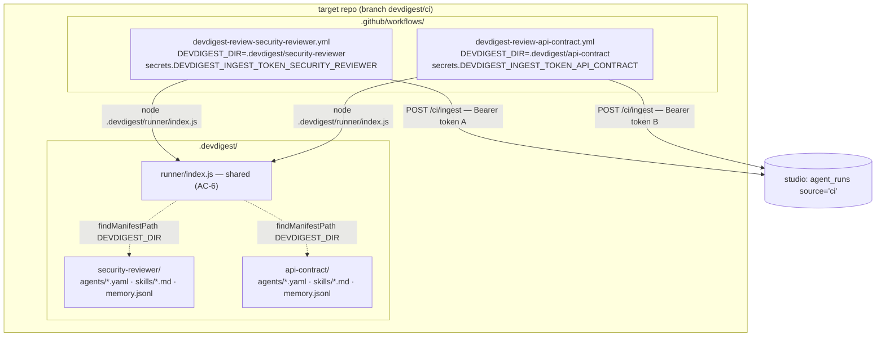

# Spec: Multiple review agents on one repository in CI
Spec ID: SPEC-05
Status: draft
Supersedes: —
Modules: server, client

## Problem & User

SPEC-04 shipped Export to CI: a tuned studio agent becomes a manifest, its
skill files, a runner bundle and a GitHub Actions workflow, committed into a
target repository as a pull request, reporting results back over one
authenticated ingest endpoint. That feature is live
(`server/src/modules/ci/`, `docs/features/export-to-ci.md`).

It ships with a hard structural limit: **one repository can host exactly one
DevDigest agent.**

The limit is not a policy choice, it is a consequence of three fixed paths in
`server/src/modules/ci/constants.ts:15-20`:

- `AGENTS_SUBDIR = '.devdigest/agents'` — every export writes its manifest
  here, and `agent-runner`'s `findManifestPath` **refuses to start** when that
  directory holds more than one `*.yaml`
  (`agent-runner/src/manifest.ts:37-45`). Two agents exported to one repo
  would produce a repository whose CI cannot run at all.
- `SKILLS_SUBDIR = '.devdigest/skills'` — a second agent's skill files land in
  the same directory as the first's, silently overwriting on any slug
  collision.
- `WORKFLOW_PATH = '.github/workflows/devdigest-review.yml'` — a single
  filename, so a second export overwrites the first agent's workflow outright.

The server enforces the limit rather than letting a user discover it as a
broken CI job: `install()` looks for any installation on the same repo
belonging to a different agent and throws `ConflictError` unless the caller
sets `replace_existing` (`service.ts:284-294`), and the wizard surfaces that
as *"A different agent is already installed here" / "Replace existing
installation"* (`client/messages/en/ci.json:122-123`,
`ExportWizard.tsx:113-114`). Replacing is destructive by design: the
replacement inherits the removed installation's `manifestPath` so the tree
still ends up with exactly one manifest (`service.ts:296-311`), and the old
installation row is deleted (`service.ts:335-337`).

The user hurt by this is anyone who tuned **more than one** agent — the
studio's entire premise. A security reviewer and an API-contract reviewer are
different system prompts, different skill sets, different `ci_fail_on` gates.
On a local review both can run against the same PR. In CI, exporting the
second one deletes the first.

Nothing about the persistence layer requires this. `ci_installations`'
uniqueness is `(agent_id, repo)` (`server/src/db/schema/ci.ts:57`), so N
agents on one repo is *already* representable; `agent_runs` already carries
`agent_id` per CI run and the CI Runs page already renders an **agent** column
(`repository.ts`'s `CiRunListRow.agentName`, SPEC-04 AC-61). The block is
entirely in the generated file layout and the conflict check that guards it.

This Spec removes the limit by giving every installation its **own namespace**
in the target repository, its **own workflow file**, and its **own ingest
secret** — and by turning "a different agent is already installed here" from
an error into a non-event.

## Goals / Non-goals

### Goals

- **N agents, one repository, no conflict.** Exporting a second agent to a
  repository that already hosts one shall succeed without replacing, deleting
  or rewriting the first agent's installation, files or ingest token.
- **A per-agent namespace** under `.devdigest/`, holding that agent's
  manifest, its skill files and its memory placeholder — so
  `agent-runner`'s "exactly one manifest" rule is satisfied *per agent*
  rather than *per repository*.
- **A per-agent workflow file**, so each agent is its own GitHub Actions
  workflow, its own check run, and its own independently-readable log.
- **Zero changes to `agent-runner/`.** The runner already accepts
  `DEVDIGEST_DIR` and defaults it to `<cwd>/.devdigest`
  (`agent-runner/src/index.ts:31`); pointing it at a namespace is an `env:`
  value in the generated workflow, not a code change. SPEC-04's non-goal
  "anything the `agent-runner` package already owns" carries over verbatim.
- **A per-agent ingest secret name**, uniformly, for every new installation —
  so each agent's token is independently pasteable, rotatable and revocable
  without disturbing the others.
- **Existing installations stay exactly where they are, forever.** An
  installation created before this Spec keeps its unnamespaced paths, its
  workflow filename and its bare `DEVDIGEST_INGEST_TOKEN` secret on every
  future re-export. No migration, no re-paste, no broken required check.
- **Every generator invariant SPEC-04 established survives unchanged** —
  least-privilege `permissions:`, `pull_request`-only triggers, SHA-pinned
  actions, the fork guard, no PR content in `run:` bodies, server-side
  re-validation of a hand-edited workflow.

### Non-goals (this iteration)

- **Changing `agent-runner/`.** Decision D-1. Not one line.
- ~~**A shared branch or PR per agent.** All agents on a repo continue to
  share the single `devdigest/ci` branch and the single reused pull
  request — decision D-2, with its known cosmetic cost accepted (E-3).~~
  **Superseded, post-ship.** Real-world use showed a second agent's own
  export landing inside a pull request titled after a different, unrelated
  agent was confusing enough to be reported and treated as a bug, not an
  accepted cosmetic cost. Each installation now commits to and opens **its
  own** branch/PR (`constants.ts`'s `ciBranchFor`, `service.ts`'s `install`)
  — a legacy (`namespace === null`) installation keeps sharing the bare
  `devdigest/ci` branch, since AC-14 still allows only one legacy
  installation per repository. E-3 below is superseded along with D-2.
- **Migrating existing installations onto namespaces.** Decision D-3. Frozen
  means frozen: not on re-export, not on "Update CI config", not by a
  background job, not ever.
- **A repository-wide ingest token shared by several agents.** Decision D-4 —
  per-agent, uniformly, including for the first agent on a repository.
- **An "uninstall" that removes files from the target repo.** Deleting an
  installation still only deletes the row (`service.ts:600-602`); the
  namespace directory and workflow file stay in the repository until a human
  removes them (OQ-5).
- **Running several agents inside one workflow run**, matrixed or sequential.
  One agent, one workflow file, one job — the fan-out is GitHub's problem,
  not a scheduler this Spec builds.
- **Cross-agent result aggregation** — a combined verdict, a single summary
  comment, or de-duplication of findings two agents both reported. Each agent
  posts and gates independently, exactly as it does today.
- **CircleCI, Jenkins, Generic CLI.** Still `gha` only (SPEC-04 AC-3), still
  rejected at the route (`routes.ts`'s `assertGhaTarget`).
- **The zip export path minting an installation or a token.** Unchanged
  SPEC-04 behaviour and unchanged known limitation.
- **Retention, pagination or grouping on the CI Runs page.** More agents means
  more rows; the 7-day default filter and the existing agent filter are the
  whole answer for this iteration.
- **MCP / pre-push CLI parity**, per SPEC-01 through SPEC-04.

## Simplicity constraints for this iteration

Binding on the Development Plan, in the same spirit as SPEC-04's own section:

- **The namespace is a string on the installation, not a new concept.** It is
  derived once, persisted once, and read back — modelled on the existing
  `ci_installations.manifest_path` precedent (`db/schema/ci.ts:41-52`), which
  already solved "a path must be stable across re-exports even when the agent
  is renamed". Do not introduce a namespace registry, a reservation flow, or
  user-editable namespaces.
- **No layout abstraction.** `constants.ts` stays the single source of truth
  both the generator and the re-validator read (SPEC-04's Recommendation 2).
  Namespaced paths are derived from those same constants; do not introduce a
  `LayoutStrategy` seam for "namespaced vs legacy".
- **Legacy is one boolean-shaped branch**, resolved once per export from the
  installation record, threaded down — not a per-file conditional scattered
  through the generator.
- **No new route, no new client page.** Everything lands on the existing
  export/preview/install routes and the existing wizard and CI tab.
- **Prefer one behaviour over a setting** — no "namespace this export?"
  toggle, no per-workspace default.

## User stories

- As a developer with a security reviewer already running in CI on my repo, I
  export my API-contract reviewer to the **same** repo and get both — the
  wizard does not warn me, does not ask me to replace anything, and my first
  agent keeps working.
- As that developer, I open a PR and see **two** DevDigest checks, each named
  for its agent, each with its own log, its own findings and its own red/green
  outcome.
- As a repo owner, I paste a **separate** Actions secret per agent, named
  after that agent, so revoking one agent's ingest token does not silence the
  others.
- As a reviewer of the wizard's pull request, I can see at a glance which
  files belong to which agent, because each agent's configuration lives in its
  own directory.
- As someone who installed DevDigest CI **before** this change, nothing
  happens to me: my paths, my workflow filename and my `DEVDIGEST_INGEST_TOKEN`
  secret keep working, including the next time I hit "Update CI config".
- As a team lead, I set the DevDigest check as required in branch protection
  per agent, and I can require the security reviewer while leaving the
  style reviewer advisory.
- As anyone triaging CI Runs, I filter by agent and see one repository's runs
  split cleanly per agent, because every ingested run already carries its
  agent.

## Acceptance criteria (EARS)

### A. The per-agent namespace

- **AC-1** WHEN a new installation is created, the system shall derive a
  **namespace** for it deterministically from the agent's name using the
  existing slug rules (`helpers.ts`'s `slugify` — lowercase `[a-z0-9-]`, no
  path separator, no `..`, no leading dot, no Windows reserved device name, a
  non-empty `untitled` fallback, length-capped). (verify: unit test reusing
  `slugify`'s own hostile-input cases and asserting the namespace inherits
  every guarantee)
- **AC-2** The namespace shall be **unique among the installations of one
  repository**. IF a second agent's name slugifies to a namespace already
  taken on that repository, THEN the system shall disambiguate
  deterministically (the `disambiguate` suffixing already used for colliding
  skill slugs, `helpers.ts`) rather than reuse or overwrite. (verify:
  integration test exporting agents named `Security Reviewer` and
  `security-reviewer` to one repo, asserting two distinct namespaces)
- **AC-3** The namespace shall be **server-derived and persisted on the
  installation record**, never accepted from the request body, a query
  parameter or a header. No client-supplied value shall ever reach a
  repository file path. (verify: unit test asserting the export input contract
  carries no namespace field; integration test asserting an extra body field
  named like a namespace changes nothing)
- **AC-4** WHEN an installation is re-exported — including via "Update CI
  config" (SPEC-04 AC-45) — the system shall reuse **that installation's own
  persisted namespace verbatim**, however many times the agent has since been
  renamed, exactly as `manifest_path` is reused today
  (`service.ts:296-311`, `db/schema/ci.ts:41-52`). (verify: integration test
  renaming an agent between two exports and asserting an unchanged namespace
  and no second manifest anywhere in the committed tree)
- **AC-5** WHEN a namespaced export is generated, the system shall produce
  exactly this file set and no others: `.devdigest/<ns>/agents/<slug>.yaml`,
  one `.devdigest/<ns>/skills/<slug>.md` per enabled linked skill in the
  agent's configured order, `.devdigest/<ns>/memory.jsonl`, the shared runner
  bundle at `.devdigest/runner/index.js`, and
  `.github/workflows/devdigest-review-<ns>.yml`. (verify: integration test
  asserting the exact path set for an agent with two linked skills)
- **AC-6** The runner bundle shall remain a **single shared file** at
  `.devdigest/runner/index.js` for every installation on a repository, not one
  copy per namespace, so the run command stays byte-identical to SPEC-04's
  `RUN_COMMAND` (`constants.ts:27`) and the re-validator's exact-equality
  check (`workflow-validate.ts:115-119`) needs no change.
  [NEEDS CLARIFICATION: nothing marks which runner version the shared bundle
  is, so a later export silently upgrades every other agent's runner on that
  repo — see OQ-1] (verify: integration test asserting two installations on
  one repo produce exactly one `.devdigest/runner/index.js` entry)
- **AC-7** `.devdigest/<ns>/agents/` shall contain **exactly one** manifest
  file after any export, because `agent-runner` refuses to start otherwise
  (`agent-runner/src/manifest.ts:37-45`). The system shall assert this on the
  file set it is about to commit and shall fail the export rather than commit
  a tree that cannot run. (verify: unit test over the generated file set
  asserting one `*.yaml` per namespace directory)
- **AC-8** An export shall **never write, move or delete a path belonging to
  another installation** of the same repository. Its committed file set shall
  intersect another installation's file set only at the shared runner bundle
  (AC-6). (verify: integration test asserting agent B's commit payload
  contains no path under agent A's namespace and not agent A's workflow file)

### B. Install-time conflict semantics

- **AC-9** WHEN an export targets a repository on which the **same** agent is
  already installed, the system shall update that installation, keep its
  namespace (AC-4) and keep its existing ingest token untouched — SPEC-04
  AC-38's behaviour, unchanged. (verify: integration test asserting one row
  and an unchanged token hash after two exports)
- **AC-10** The **shared branch and reused pull request** shall be unchanged:
  every installation on a repository commits to the single `devdigest/ci`
  branch (`constants.ts:99`) and reuses the single open pull request from it
  when one exists (`service.ts:367-380`, `findOpenPr`). (verify: integration
  test asserting two agents' exports produce one branch and one PR)
- **AC-11** IF an installation exists for the same repository but a
  **different** agent, THEN the system shall proceed with the export as an
  ordinary install — it shall not raise a conflict, shall not require
  confirmation, shall not delete the other installation's row, and shall not
  inherit or reuse the other installation's namespace, manifest path or ingest
  token. The `ConflictError` path of `service.ts:284-294` shall no longer be
  reachable on the `gha` target. (verify: integration test exporting two
  different agents to one repo with no confirmation flag, asserting two
  installation rows, two namespaces, two token hashes and no deletion)
- **AC-12** WHERE `CiExportInput.replace_existing`
  (`vendor/shared/contracts/eval-ci.ts:379`) is present on a `gha` export, the
  system shall ignore it — AC-11 leaves nothing for it to confirm. The field
  shall remain in the shared contract for compatibility with an in-flight
  client, and the client shall stop sending it and shall drop the
  "A different agent is already installed here" / "Replace existing
  installation" dialog and its copy (`ci.json:122-123`,
  `ExportWizard.tsx:113-114`, `InstallStep.tsx:45`). (verify: integration test
  asserting `replace_existing: true` and `false` produce identical outcomes;
  component test asserting the conflict dialog no longer renders)
- **AC-13** The install operation shall keep SPEC-04 AC-40's no-half-state
  guarantee per installation: IF the commit succeeds and opening or reusing
  the pull request fails, THEN the system shall report the branch that was
  written and shall persist no installation — and shall leave every other
  installation on that repository untouched. (verify: integration test with
  `openPullRequest` throwing on agent B's export, asserting agent A's row is
  intact)

### C. Legacy installations — frozen

- **AC-14** An installation created **before** this change shall be treated as
  **legacy** and shall keep, on every subsequent export for the rest of its
  life: its unnamespaced `.devdigest/agents/` and `.devdigest/skills/` paths,
  its `.devdigest/memory.jsonl`, its
  `.github/workflows/devdigest-review.yml` filename, and its bare
  `DEVDIGEST_INGEST_TOKEN` secret name. The system shall never migrate,
  re-namespace or re-key a legacy installation — not on re-export, not on
  "Update CI config", not by any background process. (verify: integration test
  re-exporting a legacy installation twice and asserting a byte-identical path
  set and secret name each time)
- **AC-15** WHERE a repository holds a legacy installation and a **new**
  agent is exported to it, the new agent shall be namespaced (AC-5) and the
  legacy agent shall keep running unchanged — the legacy runner reads
  `.devdigest/agents/`, which the namespaced export does not touch, and the
  namespaced runner reads `.devdigest/<ns>/agents/`, which the legacy export
  does not touch. (verify: integration test asserting both manifest
  directories hold exactly one manifest after both exports)
- **AC-16** A legacy installation's generated workflow shall remain
  byte-identical in its check-run-visible identity — no top-level `name:` key
  shall be added to it (AC-21), because a changed workflow name changes the
  check name and silently invalidates a required status check configured in
  the target repo's branch protection. (verify: unit test asserting the legacy
  variant emits no `name:` key)
- **AC-17** Every installation created **after** this change shall be
  namespaced, uniformly — including the **first** agent on a fresh
  repository. There shall be no "first agent gets the short paths" special
  case. (verify: integration test asserting a first-ever install on an empty
  repo is namespaced)

### D. The generated workflow

- **AC-18** A namespaced installation's workflow shall be written to
  `.github/workflows/devdigest-review-<ns>.yml`, and a legacy installation's
  to `.github/workflows/devdigest-review.yml` (AC-14). (verify: unit test on
  both variants)
- **AC-19** The namespaced workflow shall pass the runner
  `DEVDIGEST_DIR: .devdigest/<ns>` as an `env:` value on the review step,
  which is the whole mechanism by which the runner finds that agent's manifest
  (`agent-runner/src/index.ts:31`, `manifest.ts:25-46`). The legacy workflow
  shall pass no `DEVDIGEST_DIR`, leaving the runner's `<cwd>/.devdigest`
  default in force. (verify: unit test on both variants asserting the emitted
  `env:` map)
- **AC-20** The review step's `run:` shall remain **exactly**
  `node .devdigest/runner/index.js` for both variants — no subcommand, no
  flags, no namespace argument (SPEC-04 AC-25, `constants.ts:27`). Which agent
  runs shall continue to be decided by configuration the export wrote, never
  by a CLI argument (SPEC-04 AC-26); the deciding configuration is now
  `DEVDIGEST_DIR` plus the single manifest in that directory. (verify: unit
  test asserting the emitted run command equals `RUN_COMMAND` for both
  variants)
- **AC-21** The namespaced workflow shall declare a top-level `name:` derived
  from the **namespace** — not from the agent's raw name — so that each
  agent's check run is distinguishable in the pull request's checks list and
  the name is drawn from the same filename-safe character set as the paths.
  (verify: unit test asserting two agents on one repo emit two distinct
  workflow names, and that the name contains no character outside the slug
  charset)
- **AC-22** The namespaced workflow's reporting step shall reference that
  installation's **own** secret as
  `INGEST_TOKEN: ${{ secrets.DEVDIGEST_INGEST_TOKEN_<NAMESPACE> }}` (AC-25),
  and the legacy workflow shall keep `${{ secrets.DEVDIGEST_INGEST_TOKEN }}`.
  (verify: unit test on both variants)
- **AC-23** Every SPEC-04 generator invariant shall hold unchanged for both
  variants and for every trigger / `post_as` combination: `pull_request` only
  and no forbidden event (AC-19/AC-20), the exact two-key `permissions:` map
  (AC-21/AC-22), full-40-hex SHA-pinned actions (AC-24), the fork guard
  (AC-23), no `${{ github.event.* }}` or `${{ secrets.* }}` expression inside
  any `run:` body (AC-30), the Node floor (AC-29), and no fail-on channel
  outside the manifest (AC-28). (verify: unit tests re-run over both layout
  variants)
- **AC-24** WHEN a hand-edited workflow override is submitted, the server-side
  re-validator (`workflow-validate.ts`) shall additionally refuse the override
  IF its review step's `DEVDIGEST_DIR` is anything other than the value this
  installation's own namespace requires, or IF its reporting step references
  an ingest secret other than this installation's own (AC-22) — an override
  must not be able to aim one agent's workflow at another agent's namespace or
  another agent's token. It shall refuse, naming the violated invariant, and
  shall commit nothing (SPEC-04 AC-32's fail-closed shape). (verify:
  integration test submitting an override with a foreign `DEVDIGEST_DIR`, one
  with `DEVDIGEST_DIR: ..`, and one with a foreign secret reference — each
  refused with no GitHub write)

### E. Secrets

- **AC-25** WHEN a namespaced installation is created, its ingest secret name
  shall be `DEVDIGEST_INGEST_TOKEN_<NAMESPACE>`, where `<NAMESPACE>` is the
  namespace uppercased with `-` replaced by `_`. Because `slugify` emits only
  `[a-z0-9-]`, no `_` can survive into a namespace, so this mapping cannot
  collide two distinct namespaces onto one secret name. The resulting name
  shall satisfy GitHub's Actions-secret naming rules — alphanumerics and
  underscores only, not starting with a digit, not starting with `GITHUB_` —
  which the fixed `DEVDIGEST_INGEST_TOKEN_` prefix guarantees regardless of
  the namespace. (verify: unit test over namespaces `security-reviewer`,
  `2fa-checker`, `untitled` and a length-capped slug, asserting the name shape
  and pairwise distinctness)
- **AC-26** The secret name shall be **stable for the life of the
  installation**, derived from the same persisted namespace (AC-4), so a
  re-export never asks the user to paste the token under a new name. (verify:
  integration test asserting an unchanged secret name across a rename and
  re-export)
- **AC-27** Each installation's ingest token shall stay **independent**:
  minting, storing (hash only) and one-time display are per installation
  exactly as SPEC-04 AC-50 requires, and exporting or deleting one
  installation shall not change, invalidate or re-display another's token.
  (verify: integration test asserting agent A's token hash is untouched by
  agent B's export and by agent B's deletion)
- **AC-28** The wizard's "Secrets expected" panel (SPEC-04 AC-8,
  `ci.json:100-114`) shall name **this installation's** ingest secret rather
  than the literal `DEVDIGEST_INGEST_TOKEN`, and the one-time token dialog
  (`ci.json:130`) shall tell the user the exact secret name to paste it under.
  Both shall keep stating that DevDigest cannot read, set or verify a
  repository secret. (verify: component test asserting the rendered secret
  name matches the installation's and the disclaimer is still present)
- **AC-29** No secret **value** shall appear in any generated file, log line,
  API response or persisted row — SPEC-04 AC-71/AC-74, unchanged. A secret
  **name** is not a secret value and may be displayed and logged. (verify:
  unit test scanning every generated file of a two-agent repo for both minted
  tokens)

### F. Client surfaces

- **AC-30** The agent CI tab shall be unchanged in shape: it lists that
  agent's own installations only (`GET /agents/:id/ci-installations`), and
  shall not list, count or link another agent's installation on the same
  repository. (verify: component test with two agents installed on one repo,
  asserting each tab shows one row)
- **AC-31** The CI tab shall display each installation's ingest secret name
  (AC-25), because it is the value the user needs when re-pasting or rotating
  a token and it is not re-derivable by hand once the agent has been renamed.
  [NEEDS CLARIFICATION: whether the tab should also name the resulting GitHub
  check name for branch protection — see OQ-3] (verify: component test
  asserting the secret name renders)
- **AC-32** The Export Wizard shall no longer present a replace-existing
  confirmation on the `gha` path (AC-12), and its Preview step shall show the
  namespaced paths the export will actually create — the same bytes and the
  same paths Install commits (SPEC-04 AC-5). (verify: component test asserting
  the previewed path set equals the payload Install submits)
- **AC-33** The CI Runs page shall need no new column or filter: every
  ingested run already carries its agent (`CiRunListRow.agentId`/`agentName`)
  and the page already renders an **agent** column and an **agent** filter
  (SPEC-04 AC-61, AC-63). Two agents' runs on one repository shall appear as
  distinct rows distinguishable by that column. (verify: component test with
  two agents' runs on one repo)

### G. Ingest, access and scope

- **AC-34** Ingest shall be unchanged in mechanism: one endpoint, an
  `Authorization: Bearer <token>` header, a hash-keyed lookup that is itself
  the authentication, tenancy resolved only from the authenticated
  installation (SPEC-04 AC-49–AC-52, `service.ts:487-521`,
  `docs/adr/0007-ci-ingest-bearer-token-hash-lookup.md`). A token shall
  resolve to exactly one installation, and therefore to exactly one agent,
  even when several installations share a repository. (verify: integration
  test asserting agent A's token can never write a run attributed to agent B)
- **AC-35** The body's repository-equality check (SPEC-04 AC-54) shall remain
  a repository check and shall **not** be tightened into an agent check —
  several installations legitimately report the same `repo`. Attribution shall
  come from the authenticated installation, never from the body. (verify:
  integration test asserting two installations on one repo both ingest
  successfully and are attributed to their own agents)
- **AC-36** Idempotency shall remain keyed on `(installation, actions_run_id)`
  (SPEC-04 AC-57, `repository.ts`'s `insertCiRun`). Because each agent is its
  own workflow, two agents reviewing one pull request produce two distinct
  Actions run ids under two distinct installations and shall both persist.
  (verify: integration test asserting two rows, not one deduplicated row)
- **AC-37** Every human-facing route shall keep resolving tenancy via
  `getContext` and scoping through `agents.workspace_id`, including any new
  lookup this Spec introduces over installations of a repository (SPEC-04
  AC-75, `repository.ts`'s module docblock). No namespace lookup shall be
  workspace-agnostic. (verify: integration test asserting workspace B cannot
  observe or collide with workspace A's namespaces on a same-named repo)
- **AC-38** The write surface shall stay inside the `ci` module, its client
  surfaces, the shared contracts and the `ci_installations` schema addition.
  Any contract change shall be hand-mirrored into **both** vendored copies and
  any schema change shall be produced by `pnpm db:generate`, never hand-edited
  (root `AGENTS.md`, `server/AGENTS.md` do-not-touch). (verify: unit test
  asserting the two `eval-ci.ts` copies are byte-identical; manual — review
  that no migration file was hand-written)

## Edge cases

- **E-1 A legacy installation and a namespaced one on the same repository.**
  Grounded in `agent-runner/src/manifest.ts:25-46` (the runner lists only
  `<devdigestDir>/agents`) and `constants.ts:15-20`. The legacy runner reads
  `.devdigest/agents/`, the namespaced runner reads `.devdigest/<ns>/agents/`;
  neither directory gains a second manifest, so both keep starting. The
  `.devdigest/<ns>/` subdirectory is invisible to the legacy runner because it
  never lists `.devdigest/` itself. Covered by AC-15.
- **E-2 Two agents whose names slugify identically on one repository.**
  Grounded in `helpers.ts`'s `slugify`/`disambiguate` and its existing
  `Secret Leakage Gate` / `secret-leakage-gate` case. Deterministic `-2`
  suffixing, per repository, persisted at first install so it never drifts.
  Covered by AC-2, AC-4.
- ~~**E-3 The shared pull request's title names only the first agent.**~~
  **Superseded, post-ship** — see D-2's revision above. Each installation now
  opens its own PR on its own branch (`ciBranchFor`), titled from ITS OWN
  `agent.name` — there is no longer a "first agent" whose title a later
  agent's export could land underneath.
- **E-4 The agent is renamed after installation.** Grounded in
  `db/schema/ci.ts:41-52` and `service.ts:296-311` — the same bug class
  `manifest_path` was introduced to close. The namespace is frozen at first
  install, so the directory keeps the old name while the studio shows the new
  one. Cosmetic and deliberate: re-deriving would strand the old namespace's
  files in the repository and break the pasted secret's name. Covered by AC-4,
  AC-26.
- **E-5 Two exports racing onto the same branch.** Grounded in `octokit.ts`'s
  `commitFiles`, which parents off the existing branch ref when present and
  `force`-updates it. Narrowed, post-ship: since each installation now has
  its OWN branch (`ciBranchFor`), this can only happen between two
  concurrent exports of the SAME agent (a double-submitted Install click,
  guarded client-side but not server-side) — never between two different
  agents any more. Sequential exports layer correctly (a new tree over the
  parent's tree keeps unrelated files); two genuinely concurrent exports of
  the same agent can have the later force-update drop the earlier commit's
  files. No server-side lock exists today and none is added.
  [NEEDS CLARIFICATION: whether a same-installation export lock is worth
  adding, or whether "re-run the export" is the accepted remedy — see OQ-4]
- **E-6 A namespace that is a Windows reserved device name or empty.**
  Grounded in `helpers.ts`'s `RESERVED_DEVICE_NAMES` / `SLUG_FALLBACK`. `CON`
  becomes `con-file`, an all-punctuation name becomes `untitled`; both are
  valid namespaces and both produce valid secret names under AC-25.
- **E-7 An installation is deleted from the studio.** Grounded in
  `service.ts:600-602` and `db/schema/ci.ts` — `deleteInstallation` removes
  the row only. The namespace directory and the workflow file remain in the
  target repository and the workflow keeps running until a human removes them;
  its ingest POSTs then fail 401 because the token hash no longer resolves
  (AC-34's fail-closed lookup), so the check still runs and still gates, but
  reports nothing. Covered as a known limitation, tracked in OQ-5.
- **E-8 The shared branch has drifted far behind the base.** Grounded in
  `commitFiles`' parent selection: the branch is never rebased. A repository
  whose `devdigest/ci` PR sits open for months accumulates every agent's
  exports on a stale base. Pre-existing SPEC-04 behaviour, unchanged here and
  made slightly more likely by more agents sharing the branch.
- **E-9 A later export overwrites the shared runner bundle.** Grounded in
  AC-6 and `bundle.ts`'s read-from-disk: the bundle is one path for the whole
  repository, so exporting agent B ships whatever bundle version the studio
  has on disk *now* to agent A as well. Both agents then run the same runner
  version, which is the intended behaviour of a shared bundle; nothing records
  or surfaces that A's runner changed. See OQ-1.
- **E-10 The shared pull request was merged, the branch was not deleted.**
  Grounded in `findOpenPr` (open PRs only): the next export commits onto the
  surviving branch and, finding no open PR, opens a fresh one containing only
  the new commit. Correct, and unchanged from SPEC-04.
- **E-11 Several agents review one pull request simultaneously.** Each is its
  own workflow run on its own runner, so `devdigest-result.json` at the
  runner's cwd (`agent-runner/src/index.ts:32`) cannot collide across agents.
  This holds only while one workflow runs exactly one agent — a non-goal of
  this Spec that a future matrixed layout would break.
- **E-12 A repository accumulates many agents.** N agents means N workflow
  runs, N LLM reviews and N ingest POSTs per pull request event — cost and
  fan-in scale linearly with no cap anywhere in the system. See the
  non-functional requirements below and OQ-4.

## Non-functional requirements

Checked against the `security` skill (OWASP Top 10:2025); the categories it
raises that this change actually implicates:

- **A01 Broken access control.** Any new lookup over "the installations of
  this repository" must carry the workspace predicate, because
  `ci_installations` has no `workspace_id` of its own and is scoped only by
  joining `agents.workspace_id` (`repository.ts` module docblock). Two
  workspaces may legitimately hold same-named repositories; namespace
  uniqueness is per (workspace, repo), never global (AC-2, AC-37).
- **A05 Injection — path injection is the primary risk of this change.** The
  namespace becomes a directory name and a workflow filename **inside a
  repository DevDigest does not own**. It must be server-derived from
  `slugify`'s already-hardened output and never client-supplied (AC-1, AC-3),
  and the hand-edited-workflow re-validator must refuse a `DEVDIGEST_DIR` that
  is not this installation's own — including traversal shapes like `..`
  (AC-24).
- **A08 Integrity.** A second agent's export must not silently rewrite a first
  agent's committed configuration (AC-8), and the ingest path must keep
  assigning every column explicitly from the authenticated installation rather
  than trusting the body's own attribution (AC-35, `service.ts:536-554`).
- **A04 Cryptographic.** Per-agent tokens keep SPEC-04's properties
  unchanged — 256-bit CSPRNG, hash-at-rest, one-time display (AC-27). Blast
  radius shrinks: one compromised token now grants write of *one* agent's run
  records on *one* repository.
- **A06 Insecure design / rate limiting.** Export stays at 10/min and ingest
  at 60/min (`constants.ts:110-114`). Ingest fan-in now scales with agent
  count per repository (E-12); the current limit is not obviously wrong but
  was sized for one agent per repo.
  [NEEDS CLARIFICATION: whether the ingest limit needs re-sizing for N agents
  — see OQ-4]
- **A09 Logging.** Export and ingest logs should carry the namespace and
  installation id so a multi-agent repository's runs are attributable, and
  must keep excluding tokens, hashes, file contents, system prompts and skill
  bodies (SPEC-04 AC-74, `service.ts:421-431`, `558-568`). A secret *name* is
  loggable; a secret *value* is not (AC-29).
- **A10 Fail-closed.** Every new refusal path — a namespace that cannot be
  resolved, an override aimed at a foreign namespace, a file set with two
  manifests in one namespace — must refuse and commit nothing rather than
  fall through to a write (AC-7, AC-24, AC-13).
- **Performance.** One additional workspace-scoped lookup per export (the
  repository's existing installations) on a path that already performs several
  GitHub round-trips; no measurable cost. No new work on any read path.
- **Cost / scalability (non-security).** Linear fan-out of LLM spend per pull
  request with agent count (E-12). No target number exists — nobody has
  specified an acceptable per-PR CI cost — so this is recorded, not
  thresholded.
- **Maintainability.** `constants.ts` must remain the one place the generator
  and the re-validator both read (SPEC-04's Recommendation 2); namespaced
  paths derive from those constants rather than duplicating literals.
- **Observability.** No new metric is required; the CI Runs page's existing
  agent column is the operator-facing view of multi-agent activity (AC-33).

## Module interaction / API contracts

No new route, no new endpoint, no new GitHub adapter method. The changed
surfaces are the file layout the `ci` module emits and the conflict branch of
`install()`.

| Surface | Change | Grounded in |
|---|---|---|
| `POST /agents/:id/export-ci/preview` | Emits namespaced paths for a namespaced installation | `routes.ts` preview handler, `service.ts:172-234` |
| `POST /agents/:id/export-ci` | Different-agent conflict removed (AC-11); namespace resolved and persisted | `service.ts:271-441` |
| `POST /agents/:id/export-ci/zip` | Same namespaced file set; still no installation, still no token | `service.ts:455-470` |
| `POST /ci/ingest` | Unchanged; one token resolves one installation resolves one agent | `service.ts:487-569` |
| `GET /ci/runs`, `GET /agents/:id/ci-installations`, `DELETE /ci/installations/:id` | Unchanged in shape | `routes.ts`, `service.ts:574-602` |
| `CiInstallation` contract | Gains the installation's ingest secret name for AC-28/AC-31 display | `vendor/shared/contracts/eval-ci.ts` (both copies) |
| `ci_installations` | Gains a persisted namespace, same pattern as `manifest_path` | `db/schema/ci.ts:41-57` |
| `agent-runner/` | **No change** — `DEVDIGEST_DIR` already exists | `agent-runner/src/index.ts:31` |

What the target repository looks like once two agents are installed, and which
workflow drives which runner root:

The two dotted edges are the same bundle executed in two different workflow
runs, each with its own `DEVDIGEST_DIR`; the runner never sees the other
namespace.

## UX improvements

- **UX-1 The conflict dialog disappears rather than being reworded.** The
  wizard's "A different agent is already installed here" step
  (`ci.json:122-123`) exists only to gate a destructive replace that no longer
  happens. Removing it — rather than softening its wording — is the honest
  representation of AC-11.
- **UX-2 The Preview step should make the namespace visible**, because it is
  the thing the user will see in their repository's directory listing and
  cannot rename afterwards (AC-4). Preview already shows exact paths (SPEC-04
  AC-5); with namespacing those paths carry information worth reading.
- **UX-3 The secret name must be shown wherever the token is.** A user
  pasting a token into GitHub needs the exact name; deriving
  `DEVDIGEST_INGEST_TOKEN_SECURITY_REVIEWER` from an agent called "Security
  Reviewer" by hand is guesswork the UI should not require (AC-28, AC-31).
- **UX-4 Per-agent secrets are more pasting, and the UI should not pretend
  otherwise.** Two agents means two secrets. The secrets panel's existing
  honest-checklist framing (`ci.json:102`) already fits; it should not gain a
  "DevDigest will handle this" implication it cannot honour.
- **UX-5 The stale shared-PR title (E-3) needs no UI apology**, but the
  Install step's existing PR link should stay prominent enough that a user who
  lands on a PR titled after another agent can see their own files in the
  diff.
- **UX-6 Nothing on the CI tab should imply an agent "owns" a repository.**
  With N agents per repo, phrasing like "installed in 3 repositories" stays
  correct per agent, but any copy suggesting exclusivity would now be wrong.

## Inputs and provenance

| Section | Grounded in |
|---|---|
| Problem & User | `server/src/modules/ci/constants.ts:15-20`, `service.ts:284-311`, `agent-runner/src/manifest.ts:37-45`, `db/schema/ci.ts:57`, `client/messages/en/ci.json:122-123` |
| Goals / Non-goals | User decisions D-1–D-4 (this session); SPEC-04 "Non-goals" |
| Acceptance criteria A–B | `service.ts:172-441`, `helpers.ts` (`slugify`/`disambiguate`), `octokit.ts`'s `commitFiles`/`findOpenPr`, `db/schema/ci.ts:41-57` |
| Acceptance criteria C (legacy) | User decision D-3; `constants.ts:15-20`; GitHub required-status-check naming (check name derives from workflow name) |
| Acceptance criteria D (workflow) | `workflow.ts:54-192`, `workflow-validate.ts:50-129`, `constants.ts:27-103`, `agent-runner/src/index.ts:30-50` |
| Acceptance criteria E (secrets) | User decision D-4; `helpers.ts`'s slug charset; `ci.json:100-130`; SPEC-04 AC-50/AC-71 |
| Acceptance criteria F (client) | `ExportWizard.tsx:70,113-114`, `helpers.ts:39,54`, `InstallStep.tsx:45`, `repository.ts`'s `CiRunListRow`, SPEC-04 AC-61/AC-63 |
| Acceptance criteria G (ingest/scope) | `service.ts:487-569`, `repository.ts` module docblock, `docs/adr/0007-ci-ingest-bearer-token-hash-lookup.md` |
| Edge cases | `agent-runner/src/manifest.ts:25-46`, `octokit.ts`'s `commitFiles`, `service.ts:296-311,367-380,600-602`, `helpers.ts`'s reserved-name/fallback branches, `bundle.ts` |
| Non-functional requirements | `security` skill (OWASP A01/A04/A05/A06/A08/A09/A10) + `constants.ts:110-118`, `repository.ts` tenancy docblock, `service.ts:421-431,536-568` |
| Module interaction / API contracts | `routes.ts`, `service.ts`, `db/schema/ci.ts`, `vendor/shared/contracts/eval-ci.ts:311-417`, `agent-runner/src/index.ts:31` |
| UX improvements | `ci.json:100-130,122-123`, `ExportWizard.tsx`, SPEC-04 AC-5/AC-8 |

## Untrusted inputs

- **The namespace's source string — the agent's name.** Workspace-authored,
  and it becomes a directory name, a workflow filename, a workflow display
  name and part of a secret name in a repository DevDigest does not own.
  Hardened by `slugify`'s existing charset restriction, `..`/leading-dot/
  path-separator rejection, reserved-device-name escape and non-empty fallback
  (AC-1), and never taken from the request body (AC-3).
- **`workflow_override` — the hand-edited workflow.** Already the module's
  main trust boundary (SPEC-04 AC-32, E-19). This Spec widens what it can
  attack: an override could aim `DEVDIGEST_DIR` at another agent's namespace,
  at a traversal path, or at another agent's ingest secret. Refused
  server-side, fail-closed, naming the invariant (AC-24).
- **`CiExportInput.replace_existing`.** Ignored on the `gha` path (AC-12) —
  a field a client can set that must no longer be able to trigger a
  destructive delete.
- **The ingest request body.** Unchanged: schema-validated, repo-equality
  checked, every column assigned explicitly from the authenticated
  installation rather than spread from the body (AC-35, `service.ts:536-554`).
  Attribution to an agent comes from the token's installation, never from the
  body.
- **The target repository's existing tree.** Not read, not parsed, not trusted
  — `commitFiles` layers a new tree over the parent's without inspecting it.
  A repository that already contains a hand-written `.devdigest/<ns>/`
  directory will have its contents overwritten at the paths this export
  writes, and only those.

## Open questions

- **OQ-1 — the shared runner bundle carries no version marker.** AC-6 ships
  one `.devdigest/runner/index.js` for the whole repository, so exporting
  agent B silently replaces the bundle agent A has been running (E-9).
  `ci_installations.workflow_version` records the *generator* version per
  installation, not the bundle's. Should the bundle be fingerprinted (and
  drift surfaced on the CI tab), or is "all agents on a repo run the newest
  runner" simply the intended semantics? Marked inline at AC-6.
- **OQ-2 — the fate of `CiExportInput.replace_existing`. RESOLVED by AC-11 /
  AC-12.** With a different agent on the same repository no longer a conflict,
  nothing on the `gha` path can raise the confirmation the field exists to
  answer. Resolution: the field **stays in the shared contract** (it is
  hand-mirrored into two vendored copies and its removal would be churn with
  no benefit) and is **ignored server-side**; the client stops sending it and
  the conflict dialog and its copy are deleted. No longer open.
- **OQ-3 — branch protection with N agents.** Each agent is now its own check
  run (AC-21), so a repo owner configuring required checks must add one per
  agent and must know each check's name. Should the CI tab surface the
  resulting check name per installation, alongside the secret name? Marked
  inline at AC-31.
- **OQ-4 — no cap on per-repository fan-out.** N agents means N workflow runs,
  N LLM reviews, N ingest POSTs per pull request event (E-12), against an
  ingest rate limit sized when one agent per repo was the only possibility
  (`constants.ts:114`). Does this need a cap, a re-sized limit, or an explicit
  per-repo export lock (E-5)? Marked inline in the NFR section and at E-5.
- **OQ-5 — there is no uninstall.** Deleting an installation removes the row
  but leaves the namespace directory and the workflow file in the target
  repository, where the workflow keeps running and keeps failing to report
  (E-7). Should "Remove from CI" open a removal pull request, and if so does
  it share the same `devdigest/ci` branch? Out of scope here; recorded so the
  gap is not discovered by a user whose deleted agent keeps posting reviews.
