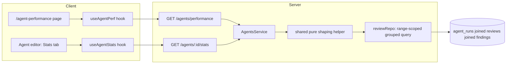

# Spec: Agent Performance dashboard (+ the per-agent Stats tab it aggregates)
Spec ID: SPEC-06
Status: draft
Supersedes: —
Modules: server, client

## Problem & User

DevDigest can already tell you what one review run cost. It cannot tell you
whether an agent is *worth* running.

`agent_runs` has recorded `durationMs`, `tokensIn`, `tokensOut`, `costUsd`,
`provider`, `model` and `status` per run since L07 (`server/src/db/schema/runs.ts:19-83`),
and `findings.acceptedAt` / `findings.dismissedAt` (`schema/reviews.ts:45-46`)
have recorded every human verdict on every finding. The raw material for
"which agent earns its cost" is fully persisted. Nothing reads it that way.

What exists today is one narrow, purpose-built read: `GET /agents/stats`
(`modules/agents/routes.ts:91-94`) returning `AgentCostEstimate`
(`modules/agents/helpers.ts:53-59` — `agent_id`, `agent_name`,
`avg_duration_ms`, `avg_cost_usd`, `sample_size`). Its own docblock says what
it is and is not: a *pre-run cost/duration estimate* for the multi-agent
picker, "deliberately NOT the shared `AgentStats` contract … a richer,
separate per-agent-detail feature this work item doesn't build"
(`helpers.ts:44-52`).

That richer feature was never built, and the gap is wider than it looks:

1. **The per-agent Stats tab does not exist.** `AgentStats`
   (`contracts/observability.ts:150-173`) is fully specified — `runs`,
   `findings_total`, `accepted`, `dismissed`, `pending`, `accept_rate`,
   `dismiss_rate`, `avg_findings_per_run`, `total_cost_usd`, `avg_cost_usd`,
   `avg_latency_ms`, `findings_by_severity`, `trend` — and its header names the
   endpoint that would serve it: `GET /agents/:id/stats`
   (`observability.ts:14`). **That route is not registered**
   (`modules/agents/routes.ts:19-32` lists the module's whole surface; there is
   no `:id/stats`). On the client, `AgentEditor` wires Config/Context/Skills/
   Evals/CI and its own line 2 admits the rest is unbuilt — "lessons add
   Skills/Evals/Stats/CI tabs; the Part-0 starter ships Config only". `TABS`
   (`AgentEditor/constants.ts:11-17`) has no `stats` entry even though the
   label `editor.tabs.stats` is already translated (`messages/en/agents.json:51`).
2. **The global dashboard is equally pre-authored and equally unbuilt.** The
   response contract already exists, in both mirrored copies:
   `AgentPerf` / `AgentPerfRow` / `PerfCostSegment`
   (`contracts/productionize.ts:134-186`), whose header names
   `GET /agents/performance`. A whole i18n file exists
   (`messages/en/agentPerformance.json`). `activeKeyFor` already routes it —
   `if (pathname.startsWith("/agent-performance")) return "agent-performance"`
   (`components/app-shell/helpers.ts:47`) — and the sidebar label is written
   (`messages/en/shell.json:27`). There is no route, no service, no page, and
   no `NAV` entry.
3. **The two must not be allowed to disagree.** `README.md:92-93` splits them
   across lessons — L07 "per-agent stats", L08 "Agent performance dashboard" —
   which is exactly how two independent aggregation formulas get written. A
   dashboard whose numbers don't reconcile against the per-agent screen it
   links to is worse than no dashboard.

This spec therefore closes the leftover **L07 per-agent Stats gap as an explicit
prerequisite**, then builds the **L08 Agent Performance dashboard on top of it**,
with **one shared aggregation implementation serving both**.

**User:** the workspace owner deciding which agents to keep running, at what
cost — and, on the Stats tab, the same person drilling into one agent.

## Goals / Non-goals

### Goals

- **G-1** — Build the missing per-agent Stats surface: `GET /agents/:id/stats`
  returning the already-specified `AgentStats`, plus a `Stats` tab in
  `AgentEditor`.
- **G-2** — Build a workspace-wide Agent Performance dashboard at
  `/agent-performance`, serving the already-specified `AgentPerf`.
- **G-3** — Compute both from **one shared, range-parameterized aggregation**,
  so a per-agent number on the dashboard is the *same code path* as that
  agent's Stats tab, not a re-derivation.
- **G-4** — Support 1 day / 30 days / custom date range, on both surfaces.
- **G-5** — Show cost as a breakdown (by agent, by model) that reconciles to the
  headline total, and label it honestly as a DevDigest **estimate**.
- **G-6** — Never trigger a model call. The dashboard is a pure read over
  persisted rows.
- **G-7** — Make statistical weakness visible: show the accept-rate denominator,
  and refuse to rank agents on a sample too small to rank.
- **G-8** — Distinct loading / empty / error states that never render
  fabricated zeros.

### Non-goals

- **No reconciled billing.** No provider billing API is integrated in this
  codebase, and this spec does not add one. Cost stays a DevDigest-computed
  estimate from `agent_runs.costUsd`, labeled as such (G-5), with the
  estimate-vs-actual distinction left as a documented seam for a future
  reconciled-billing source. Inventing an "actual" column now would be faking a
  data source.
- **No re-running, re-scoring, or re-grading of any review.** No write path of
  any kind on these surfaces (G-6).
- **No weekly digest / plugin export** — the other two L08 items
  (`README.md:93`) are separate features.
- **No new persisted aggregate table.** Everything is derived at read time from
  `agent_runs` + `findings`, matching how SPEC-04 derives groups/conflicts
  (`observability.ts:107-111`).
- **No changes to `run-executor.ts`, the review path, or finding
  accept/dismiss semantics.**
- **Not a replacement for `GET /agents/stats`.** The existing
  `AgentCostEstimate` endpoint keeps serving the multi-agent picker unchanged
  (`modules/agents/routes.ts:91-94`) — see E-2 for why it is deliberately not
  merged into this work.

## User stories

- **US-1** — As a workspace owner I open Agent Performance, see four tiles for
  the last 30 days, and know immediately what agents cost me and which one ran
  most.
- **US-2** — I switch the range to 1 day and every number on the page —
  tiles, table, both donuts — moves together to that window.
- **US-3** — I sort the table by accept rate and the agents with only two
  decided findings are visibly excluded from the ranking rather than topping it
  at a meaningless 100%.
- **US-4** — I click "View" on Security Reviewer, land on its Stats tab for the
  *same* period, and the runs / cost / duration / accept-rate match what the
  dashboard just showed me, exactly.
- **US-5** — I read "Avg accept-rate 68%" and can see it means 34 of 50 decided
  findings, not an unqualified percentage.
- **US-6** — A new workspace with no runs shows a clear "no agent runs yet"
  screen; an agent that simply didn't run this week shows as a zero row inside
  an otherwise populated table. I can tell those two situations apart.
- **US-7** — The API is down. I see an error state, not a dashboard of zeros
  that reads like "everything is free and nothing ran".

## Acceptance criteria (EARS)

### Date range

- **AC-1** — The system shall offer three range modes on both the dashboard and
  the Stats tab: `1d`, `30d`, and a custom `[start, end]`.
- **AC-2** — The system shall filter runs on `agent_runs.ran_at`
  (`schema/runs.ts:32`) — the run's start timestamp, and the only time column
  the table has. *(verify: integration test with runs straddling a boundary.)*
- **AC-3** — Range bounds shall be interpreted as a half-open interval
  `[start, end)` in UTC, so adjacent ranges never double-count a run.
- **AC-4** — WHEN a custom range is submitted, the system shall validate at the
  route via a zod schema that `start <= end` and that the span does not exceed
  **366 days**, and shall reject with 422 otherwise.
  (D-11 — 366 days is a confirmed DoS bound, not a product limit.)
- **AC-5** — WHERE no range is supplied, the system shall default to `30d`.
- **AC-6** — The selected range shall be reflected in the URL on both surfaces
  so a view is shareable and a reload is stable.

### The shared aggregation (the core reuse requirement)

- **AC-7** — The system shall compute every per-agent metric on both surfaces
  from **one** aggregation implementation, parameterized by
  `(workspaceId, agentIds[], range)`, invoked with a single agent id by
  `GET /agents/:id/stats` and with the workspace's agents by
  `GET /agents/performance`.
  *(verify: unit test feeding one fixture run-set through both call shapes and
  asserting identical per-agent numbers; plus a grep-level check that no second
  accept-rate/cost formula exists.)*
- **AC-8** — The system shall define the **counted run set** once, and every
  number on both surfaces shall be derived from exactly that set:
  `agent_runs` rows WHERE `workspace_id` = caller's workspace AND `ran_at`
  within range AND `status = 'done'` AND `agent_id IS NOT NULL`.
  *(verify: unit test asserting tiles, table rows, and both donuts sum from the
  same fixture set.)*
- **AC-9** — The system shall exclude runs whose `agent_id` is NULL. `agent_runs.agentId`
  is `onDelete: 'set null'` (`schema/runs.ts:26`), so deleting an agent orphans
  its runs; counting them would put spend in the total that no table row or
  donut segment can account for, breaking AC-19.
  (D-12 — "Total cost" therefore means *total attributable spend*, not total
  spend ever; the tile is labeled accordingly.)
- **AC-10** — The system shall derive `accepted` / `dismissed` / `pending` and
  `findings_by_severity` by joining `findings` to `reviews` on
  `findings.review_id`, selecting on `reviews.run_id` within the counted run set
  and `reviews.kind = 'review'` — the join `run.repo.ts:63-67` already
  establishes.
- **AC-11** — The system shall **not** read `agent_runs.critical` / `.warning` /
  `.suggestion` for severity counts. Those columns are written only by CI ingest
  (`modules/ci/repository.drizzle.ts:145-148`); `completeAgentRun`
  (`run.repo.ts:293-307`) never sets them, so they are NULL for every local run.
  *(verify: integration test asserting a local run contributes a non-zero
  severity breakdown.)*
- **AC-12** — `accept_rate` shall be `accepted / (accepted + dismissed)`, and
  shall be **null** — never `0` — when that denominator is zero.
  `dismiss_rate` shall be its complement on the same denominator.
- **AC-13** — A finding shall be counted as `pending` WHERE both `accepted_at`
  and `dismissed_at` are NULL. The two are mutually exclusive by construction:
  accept sets `acceptedAt` and clears `dismissedAt`, dismiss does the inverse
  (`review.repo.ts:166,179`).
- **AC-14** — The range shall filter **runs**, not decisions. A finding produced
  by an in-range run shall count at its *current* decision state even if that
  decision was recorded after the range ended, and the UI shall label the
  accept-rate accordingly (E-6).

### Per-agent Stats (prerequisite — closes the L07 gap)

- **AC-15** — The system shall register `GET /agents/:id/stats` returning the
  existing `AgentStats` contract unchanged (`observability.ts:150-173`), the
  shape its own header already assigns to this endpoint (`observability.ts:14`).
- **AC-16** — That route shall accept the same range parameters as AC-1. Without
  this, AC-18's reconciliation is not checkable at all.
- **AC-17** — The client shall add a `stats` tab to `TABS`
  (`AgentEditor/constants.ts:11-17`) using the already-translated
  `editor.tabs.stats` label (`agents.json:51`); `TAB_KEYS` derives from `TABS`
  and needs no separate edit (`constants.ts:19-22`).
- **AC-18** — For any agent and any range, the dashboard's `runs`,
  `avg_cost_usd`, `avg_latency_ms` and `accept_rate` for that agent shall equal
  that agent's Stats tab values for the same range, exactly.
  *(verify: integration test hitting both endpoints with one fixture and
  asserting field-by-field equality — this is the spec's central check.)*

### Global endpoint and summary tiles

- **AC-19** — The system shall register `GET /agents/performance` returning the
  existing `AgentPerf` contract (`productionize.ts:174-186`), already exported
  from both barrels (`vendor/shared/index.ts:26`).
- **AC-20** — `summary.runs` shall be the count of the AC-8 run set, and
  `summary.total_cost_usd` the sum of its `cost_usd`.
- **AC-21** — `cost_by_agent` and `cost_by_model` shall each sum to
  `summary.total_cost_usd`. *(verify: property-style unit test over fixtures.)*
- **AC-22** — `cost_by_model` shall be grouped by each run's **own**
  `agent_runs.model` snapshot (`schema/runs.ts:34`), not the agent's current
  `agents.model`. This is a deliberate improvement on `GET /agents/stats`, which
  is scoped to the agent's current model only (`helpers.ts:44-46`, SPEC-04
  OQ-6) — for a *historical* cost view that limitation would silently
  misattribute spend after any model change.
- **AC-23** — `summary.avg_accept_rate` shall be the **pooled** rate over the
  period (total accepted / total decided across all counted agents), not the
  unweighted mean of per-agent rates, so that it reconciles with the single
  denominator AC-25 displays.
  (D-13 — confirmed pooled, despite the contract field being named `avg_`,
  which reads like an unweighted mean.)
- **AC-24** — `summary.most_active_agent` shall be the agent with the highest
  run count in the counted set, with ties broken by most recent `ran_at`.
- **AC-25** — The four tiles shall render Total runs, Total cost, Avg accept
  rate **with its decided-findings denominator**, and Most-active agent **with
  its run count and accept rate**, per the mockup.
- **AC-26** — WHERE `total_cost_usd` is present, the UI shall label it as an
  estimate (never as billed/actual), satisfying G-5's honesty requirement.
- **AC-27** — IF any counted run has a NULL `cost_usd`, THEN the system shall
  flag the total as partial rather than silently under-reporting it — the same
  treatment `MultiAgentRun.total_cost_partial` already applies
  (`observability.ts:129-134`).
  (D-14 — `AgentPerf.summary` has no such field yet; one is added additively
  and hand-mirrored into both vendored copies.)

### Per-agent table

- **AC-28** — The table shall render one row per workspace agent with columns
  Agent, Runs, Avg cost, Avg duration, Accept rate, Last run, View.
- **AC-29** — `last_run_at` shall come from the contract's existing
  `AgentPerfRow.last_run_at` field (`productionize.ts:155`).
- **AC-30** — The View action shall link to that agent's Stats tab carrying the
  current range (e.g. `/agents/<id>?tab=stats&range=30d`), so AC-18's
  reconciliation is one click away and like-for-like.
- **AC-31** — WHERE an agent has fewer than **5 decided findings**
  (`accepted + dismissed`) in the range, the system shall mark that agent's
  accept rate as low-confidence and shall exclude it from accept-rate ranking —
  sorting by accept rate shall place such agents in a clearly-flagged group
  rather than interleaving them by an unreliable percentage.
  *(verify: unit test on the sort comparator with a 1-decision 100% agent.)*
  (D-15 — 5 is a confirmed product decision, not a threshold derived from
  measured data.)
- **AC-32** — WHILE every agent in the workspace is below the AC-31 threshold,
  the accept-rate sort shall remain operable and shall communicate that no agent
  currently has a rankable sample, rather than silently rendering an arbitrary
  order.

### States

- **AC-33** — The system shall render loading, empty, and error as three
  visually distinct states.
- **AC-34** — WHILE the request is in flight, the system shall not render any
  numeric value — no zeros, no dashes-as-data, no stale-but-unlabeled figures.
- **AC-35** — IF the request fails, THEN the system shall render the
  already-translated `loadError` state (`agentPerformance.json:4`) and shall not
  render tiles, table, or donuts.
- **AC-36** — WHEN no counted run exists for the whole workspace in the range,
  the system shall render the already-translated workspace-empty state
  (`agentPerformance.json:27-30`).
- **AC-37** — WHERE the workspace has runs in the range but a given agent has
  none, that agent shall render as a table row with an explicit zero-run
  treatment and a **null** (not `0%`) accept rate — visibly different from
  AC-36's whole-page empty state. *(verify: component test asserting both states
  render distinguishable output.)*

### No model calls

- **AC-38** — The system shall serve both endpoints without invoking any LLM,
  embedder, or provider adapter. Reloading, changing range, sorting, or
  expanding a row shall issue read-only queries only.
  *(verify: integration test asserting zero calls on a spy `container.llm` /
  `container.embedder` across a full page-load request sequence.)*
- **AC-39** — Neither surface shall expose any write action on runs, findings,
  or agents.

### Navigation

- **AC-40** — The system shall add one `NAV` entry to the **GLOBAL** group in
  `client/src/vendor/ui/nav.ts:70-81` — `key: "agent-performance"`,
  `label: "Agent Performance"`, `icon: "BarChart"`, `href: "/agent-performance"`
  (no `:repoId` token — this is workspace-wide, not repo-scoped),
  `gKey: "f"` — plus the matching `SHORTCUTS` row (`nav.ts:104-119`).
  This is the **sanctioned do-not-touch exception** already used for the
  `multi-agent` entry (`client/INSIGHTS.md`, 2026-08-22/23 entry: "5th use of
  the sanctioned do-not-touch exception, icon `Users`, `gKey: "m"`").
  *(verify: nav unit test; `f`, `BarChart` and `/agent-performance` are each
  confirmed unused/available today.)*
- **AC-41** — `activeKeyFor` shall require **no change** — `helpers.ts:47`
  already maps `/agent-performance` to this key, and `shell.json:27` already
  supplies the label.
- **AC-42** — The page shall follow the established global-page shape: a thin
  `client/src/app/agent-performance/page.tsx` delegating to
  `_components/AgentPerformanceView/`, exactly as `/ci-runs` does
  (`app/ci-runs/page.tsx` → `_components/CiRunsView`).

## Edge cases

Each is grounded in a file actually read.

- **E-1 — `AgentStats` is a trap with the right-looking field names.**
  `client/INSIGHTS.md` (2026-08-23 entry) documents this exact bug already
  shipped once: `lib/hooks/multi-agent.ts` imported `AgentStats` believing it
  was `GET /agents/stats`'s shape, when `AgentStats` is the *unbuilt*
  `GET /agents/:id/stats` shape. Because `lib/api.ts` casts with `as T` and does
  **zero runtime validation**, nothing threw — every field silently read
  `undefined` and every agent showed "no estimate yet". This spec now makes
  **three** similarly-named shapes live at once — `AgentCostEstimate`
  (server-local), `AgentStats` (`:id/stats`), `AgentPerfRow` (`/performance`) —
  so the trap gets strictly worse. Every new hook must trace its response type
  to the handler that implements the route. INSIGHTS' own lesson applies
  verbatim: "a vendored contract with the exact right-looking field names for a
  DIFFERENT endpoint of the same resource is a worse trap than a missing type."
- **E-2 — Do not repurpose `GET /agents/stats`.** It is live, consumed by the
  multi-agent picker, and returns `AgentCostEstimate`. Widening it in place
  would break that caller. The new endpoints are additive.
- **E-3 — `trend` has two different shapes.** `AgentStats.trend` is
  `StatPoint[]` (`{label, value}`, `observability.ts:147`); `AgentPerfRow.trend`
  is `number[]` (`productionize.ts:162`) because it feeds
  `MetricCard`/`Sparkline`, whose prop is `trend?: number[]`
  (`vendor/ui/charts/MetricCard.tsx`). One aggregation must produce the richer
  series and each route must project it — not two trend computations.
- **E-4 — `PerfCostSegment` carries no color, but `Donut` requires one.**
  The contract is `{label, value}` (`productionize.ts:167-170`) despite its own
  docstring claiming `{label,value,color}` — a stale comment. `DonutSegment`
  (`vendor/ui/charts/Donut.tsx`) requires `color: string`. Color is therefore a
  **client-side presentation concern**; the server must not be extended to emit
  it.
- **E-5 — `most_active_agent` is a bare name string** (`productionize.ts:179`),
  but AC-25 needs its run count and accept rate, and `agents.name` has **no
  unique constraint** (`schema/agents.ts:13`) — two agents may legitimately
  share a name, so looking the row up by name is not safe. Resolved by D-5.
- **E-6 — Accept rate is a live snapshot, not a frozen historical fact.**
  Accept/dismiss are mutable and mutually clearing (`review.repo.ts:166,179`),
  so the same range re-queried tomorrow can legitimately return a different
  accept rate. The UI must not imply the number is immutable history.
- **E-7 — CI runs are in the data.** `agent_runs.source` is `'local' | 'ci'`
  (`schema/runs.ts:42`) and the existing `avgStatsForAgents` does **not** filter
  it (`run.repo.ts:257-263`), so CI-triggered runs already flow into today's
  estimates. Decided once, in the shared aggregation, so both surfaces agree
  (D-16).
- **E-8 — Failed and cancelled runs can still have cost.** AC-8 counts only
  `status='done'`, matching `avgStatsForAgents`' existing filter
  (`run.repo.ts:261`). Spend on failed runs is therefore excluded from "Total
  cost" (D-17).
- **E-9 — Runs with NULL `cost_usd`.** `costUsd` is nullable
  (`schema/runs.ts:38`) and `avgStatsForAgents` already guards it
  (`run.repo.ts:268-269`). Handled by AC-27's partial flag, not by coercing
  NULL to 0.
- **E-10 — An agent with runs but zero findings.** `avg_findings_per_run` is 0,
  `accept_rate` is **null** (AC-12), not 0% — the agent didn't perform badly, it
  had nothing judged.
- **E-11 — Runs whose `model` is NULL.** `agent_runs.model` is nullable
  (`schema/runs.ts:34`); such runs need an explicit "unknown model" bucket in
  `cost_by_model`, or AC-21's reconciliation silently fails.
- **E-12 — Index coverage for the range scan.** The only relevant index is
  `agent_runs_workspace_source_ran_at_idx` on `(workspace_id, source, ran_at)`
  (`schema/runs.ts:76-80`) — `source` sits *between* the two columns this query
  filters on, so a range scan that doesn't constrain `source` can't use `ran_at`
  as an index range. Relevant to NFR-8 and interacts with E-7's decision.
- **E-13 — The pre-authored i18n table columns don't match the mockup.**
  `agentPerformance.json:19-26` defines Agent / Accept / Runs / Findings / Cost /
  Trend; AC-28 requires Avg duration, Last run and View, and AC-1 needs range
  copy that doesn't exist at all. The i18n file must be **extended**, not the
  requirement bent to fit the existing keys — same call SPEC-04 made at E-16.
- **E-14 — `productionize.ts`'s two copies have already drifted.** The server
  copy has `provider: z.enum(['openai','anthropic','openrouter'])` at line 36;
  the client copy omits `'openrouter'`. Pre-existing, unrelated to this feature,
  but any hand-mirrored edit here lands in a file that is *already* out of sync —
  do not silently "fix" or widen that drift as a side effect.
- **E-15 — `reviews.run_id` has no foreign key** (`schema/reviews.ts:20`, a bare
  `uuid`), so the AC-10 join is by convention, not enforced by the database.
  A review row with a stale or absent `run_id` simply drops out of the
  aggregation rather than erroring.
- **E-16 — A single run can produce multiple `reviews` rows**, including
  `kind: 'summary'` (`schema/reviews.ts:21`). AC-10's `kind = 'review'` filter is
  what stops summary rows inflating finding counts.
- **E-17 — INSIGHTS misdescribes where the nav precedent landed.**
  `client/INSIGHTS.md` says the `multi-agent` entry was added to the "WORKSPACE
  group"; `nav.ts:70-81` actually has it in **GLOBAL**. The code is ground truth
  — AC-40 targets GLOBAL, which is also where the mockup places this item.

## Non-functional requirements

Checked against the `security` skill (OWASP Top 10:2025).

### Security

- **NFR-1 — Tenant isolation (A01).** Both endpoints must be `workspaceId`-scoped
  as an explicit repository parameter, never inferred, matching
  `getContext(app.container, req)` on every existing agents route
  (`modules/agents/routes.ts:76,81,92`). `GET /agents/:id/stats` for an agent in
  another workspace must 404, not return that agent's cost data — this is a
  textbook IDOR surface because the whole payload is business-sensitive spend.
- **NFR-2 — Input validation (A05/A08).** The range parameters are the only
  attacker-controlled input. They must be validated by a route-level zod schema
  (`server/AGENTS.md`: routes declare zod schemas; invalid input 422s before the
  handler) as real dates, with AC-4's ordering and span bounds enforced there.
  Drizzle parameterizes, so SQL injection is not the risk — **unbounded scan
  is**.
- **NFR-3 — Query-cost DoS (A06).** An unbounded custom range over
  `agent_runs ⋈ reviews ⋈ findings` is a cheap request that is expensive to
  serve. Mitigations: AC-4's max span, the global 120 req/min limit
  (`app.ts:96`), and — if measurement warrants — a per-route override using the
  established `config: { rateLimit: … }` pattern
  (`modules/brief/routes.ts:55`, `modules/ci/routes.ts:113`). Aggregation must
  happen **in SQL** (`GROUP BY`), never by loading every finding into Node.
- **NFR-4 — No N+1 regression (A06).** `AgentsService.stats()` was already fixed
  once for exactly this — "ONE query for every agent (fix-loop iteration 1 — was
  an N+1: one `avg()` round trip per agent)" (`service.ts:211-213`). The
  dashboard must not reintroduce per-agent round trips.
- **NFR-5 — Untrusted display text (A05).** Agent names are user-authored free
  text (`agents.name`, no constraint) and appear in table rows and donut legends;
  model strings originate from provider APIs. Both stay untrusted text rendered
  through React's default JSX escaping — never `dangerouslySetInnerHTML`, and
  never interpolated into a query or path server-side.
- **NFR-6 — Secrets (A04/A09).** No provider key or token may appear in either
  response. Neither endpoint reads `LocalSecretsProvider`; `provider`/`model`
  are non-secret identifiers.
- **NFR-7 — Fail closed, not fail-zero (A10).** AC-34/AC-35 are a security
  property as much as a UX one: a failed aggregation must surface as an error,
  never as a confident `$0.00`. Silent zeroing of a cost dashboard is a
  misreporting bug that hides real spend.

### Non-security

- **NFR-8 — Performance.** Both endpoints are synchronous page loads. All
  aggregation in SQL; the index situation in E-12 must be checked against the
  actual query plan, and a covering index added via `pnpm db:generate` if the
  plan shows a full scan. No numeric SLA is set — none has been discussed
  (D-18).
- **NFR-9 — Correctness by construction.** AC-8's single run-set definition and
  AC-7's single aggregation are what make AC-18 and AC-21 hold. Two formulas
  that "agree today" is the failure mode this whole spec exists to prevent.
- **NFR-10 — Observability.** Neither surface may replace or summarize away
  per-run traces; `run_traces` (`schema/runs.ts:86-91`) stays the drill-down for
  "what did this run actually do".
- **NFR-11 — Maintainability / architecture.** Server code follows routes →
  service → repository with no infrastructure imports in domain code
  (`onion-architecture`, enforced by `pnpm arch:check`). Client code goes in a
  colocated `_components/<Name>/` folder with its own tests, data access only via
  `src/lib/hooks/*`, UI imported only from the `@devdigest/ui` barrel
  (`client/AGENTS.md`).
- **NFR-12 — Vendored-contract discipline.** Any additive contract change
  (D-13/D-14, D-5) must be hand-mirrored into **both**
  `server/src/vendor/shared/contracts/productionize.ts` and the client copy —
  no sync script exists (root `AGENTS.md`) — while respecting E-14's
  pre-existing drift.
- **NFR-13 — Migrations.** IF any index is added, THEN it must be generated via
  `pnpm db:generate` and applied manually with `pnpm db:migrate`; migrations do
  not run on boot (root `AGENTS.md`).

## Module interaction / API contracts

### Contracts (both already exist — extend additively, never re-invent)

| Contract | Location | Use |
|---|---|---|
| `AgentStats` | `contracts/observability.ts:150-173` | `GET /agents/:id/stats` response, adopted as written |
| `StatPoint` | `observability.ts:147` | `AgentStats.trend` element |
| `AgentPerf` | `contracts/productionize.ts:174-186` | `GET /agents/performance` response |
| `AgentPerfRow` | `productionize.ts:139-164` | one table row |
| `PerfCostSegment` | `productionize.ts:167-171` | one donut segment (no color — E-4) |
| `AgentCostEstimate` | `modules/agents/helpers.ts:53-59` | untouched; still serves the picker (E-2) |

### Endpoints

| Endpoint | Status | Note |
|---|---|---|
| `GET /agents/:id/stats` | **new** | `AgentStats` + range params (AC-15/AC-16). The route its contract already names but nothing registers. |
| `GET /agents/performance` | **new** | `AgentPerf` + range params (AC-19). Name taken from the contract header (`productionize.ts:135`). |
| `GET /agents/stats` | reuse, **unchanged** | `AgentCostEstimate` for the multi-agent picker (`routes.ts:91-94`, E-2) |
| `GET /agents/:id` | reuse, unchanged | Stats tab's agent header |

Route-ordering note: `/agents/performance` sits alongside `/agents/:id` exactly
as `/agents/stats` already does — not a conflict, since "Fastify's radix router
prefers the static segment over the `:id` param regardless of registration
order" (`modules/agents/routes.ts:87-90`).

### Where the shared aggregation lives

`agent_runs` and `findings` are owned by the **reviews** domain
(`ReviewRepository` / `repository/run.repo.ts`), not the agents module. The
agents module already reaches them by the sanctioned route:
`container.reviewRepo`, "the SAME sanctioned cross-cutting DI accessor
`ReviewService` itself uses for `container.agentsRepo`" (`service.ts:204-209`).
This spec follows that precedent rather than inventing a boundary:

- a **range-scoped grouped query** alongside `avgStatsForAgents` in the reviews
  repository (`run.repo.ts:240-272`), returning per-agent run/cost/duration
  aggregates plus the per-agent finding rollup from the AC-10 join;
- a **pure shaping helper** (no I/O — the stated contract of
  `modules/agents/helpers.ts:5-9`) turning those rows into `AgentStats` and
  `AgentPerfRow`/`AgentPerf`;
- both `AgentsService` methods delegating to that one pair.

### Client surfaces

- New `app/agent-performance/page.tsx` (thin) → `_components/AgentPerformanceView/`,
  the `/ci-runs` shape (AC-42).
- New `stats` tab in `AgentEditor` (AC-17), reusing the existing `?tab=` state.
- New hooks in `src/lib/hooks/*` — and per E-1, typed against the endpoint each
  one actually calls.
- Reuse `MetricCard`, `Donut`, `Sparkline`, `BarRow` from
  `vendor/ui/charts` via the `@devdigest/ui` barrel — `recharts@^2.15.0` is
  already a client dependency (`client/package.json:22`) and must **not** be
  imported directly (`client/AGENTS.md`).
- Extend `messages/en/agentPerformance.json` per E-13; add nav entry per AC-40.

## Inputs and provenance

| Section | Grounded in |
|---|---|
| Problem & User | `modules/agents/routes.ts:19-32,91-94`; `modules/agents/helpers.ts:44-59`; `contracts/observability.ts:14,150-173`; `contracts/productionize.ts:134-186`; `AgentEditor.tsx:2`; `AgentEditor/constants.ts:11-22`; `messages/en/agents.json:51`; `messages/en/shell.json:27`; `messages/en/agentPerformance.json`; `components/app-shell/helpers.ts:47`; `README.md:92-93`; `schema/runs.ts:19-83`; `schema/reviews.ts:45-46` |
| Goals / Non-goals | User's confirmed decision to build both the Stats tab and the dashboard on one shared service; plus the no-reconciled-billing constraint (no billing integration exists in this codebase) |
| Acceptance criteria | `schema/runs.ts:26,32,34,38,42,76-80`; `schema/reviews.ts:20-21,45-46`; `schema/agents.ts:13`; `run.repo.ts:63-67,240-272,293-307`; `review.repo.ts:166,179`; `modules/ci/repository.drizzle.ts:145-148`; `contracts/observability.ts:129-134,147,150-173`; `contracts/productionize.ts:139-186`; `vendor/shared/index.ts:26`; `nav.ts:70-81,104-119`; `app-shell/helpers.ts:47`; `app/ci-runs/page.tsx`; `AgentEditor/constants.ts:11-22`; `agentPerformance.json:4,27-30` |
| Edge cases | `client/INSIGHTS.md` (2026-08-22/23 and 2026-08-23 entries); `lib/api.ts` (`as T`, zero runtime validation); `vendor/ui/charts/Donut.tsx`; `vendor/ui/charts/MetricCard.tsx`; `productionize.ts:36,155,162,167-179`; `observability.ts:147`; `run.repo.ts:257-269`; `schema/runs.ts:34,38,42,76-80`; `schema/reviews.ts:20-21`; `schema/agents.ts:13`; `agentPerformance.json:19-26`; `nav.ts:70-81` |
| Non-functional requirements | `security` skill (OWASP Top 10:2025 — A01, A04, A05, A06, A08, A09, A10) + `app.ts:96`; `modules/brief/routes.ts:55`; `modules/ci/routes.ts:113`; `modules/agents/routes.ts:76,81,92`; `modules/agents/service.ts:204-213`; root/`server`/`client` `AGENTS.md` |
| Module interaction / API contracts | `modules/agents/routes.ts:87-94`; `modules/agents/service.ts:202-235`; `modules/agents/helpers.ts:5-9,44-59`; `run.repo.ts:240-272`; `contracts/observability.ts:150-173`; `contracts/productionize.ts:134-186`; `client/package.json:22`; `vendor/ui/charts/*`; `client/AGENTS.md` |
| UX improvements | The user-supplied mockup (four tiles, per-agent table, two cost donuts) corroborated by `agentPerformance.json`; `vendor/ui/charts/Donut.tsx`, `MetricCard.tsx` |

## Untrusted inputs

| Input | Source | Handling |
|---|---|---|
| `range` / `start` / `end` query params | client (attacker-controllable) | route-level zod schema: real dates, `start <= end`, max 366-day span, 422 otherwise (AC-4, NFR-2); bounds the scan (NFR-3) |
| `:id` agent path param | client | existing `IdParams` uuid schema + workspace-scoped lookup, as every agents route already does; foreign agent 404s (NFR-1) |
| Agent `name` | user-authored free text, no constraint | untrusted display text — React JSX escaping, never `dangerouslySetInnerHTML`, never interpolated server-side (NFR-5) |
| `provider` / `model` strings on a run | provider API, persisted | untrusted display text; grouped as opaque keys, NULL bucketed explicitly (E-11) |
| Cost / duration aggregates | own DB | trusted, but workspace-scoped and labeled as estimates, never as billed amounts (AC-26, G-5) |
| Finding accept/dismiss state | human action, mutable | live snapshot, not immutable history (E-6) |

## Decisions recorded

- **D-1 — Build the L07 Stats gap first, as a prerequisite, in the same spec.**
  Confirmed by the user. The dashboard is defined as an aggregation *of the
  Stats service*, so the Stats service has to exist for the dashboard's central
  correctness claim (AC-18) to even be checkable.
- **D-2 — One aggregation, two projections.** AC-7/AC-8. The single defined run
  set is what makes reconciliation a structural property rather than a test that
  happens to pass.
- **D-3 — Both pre-authored contracts are adopted as the API shape.**
  `AgentStats` and `AgentPerf` are taken as written, with only additive
  extensions, hand-mirrored into both vendored copies — the same call SPEC-04
  made at D-8.
- **D-4 — Range filters `agent_runs.ran_at`.** It is the run's start timestamp
  and the only time column on the table (`schema/runs.ts:32`); there is no
  `created_at`.
- **D-5 — Add `most_active_agent_id` to `AgentPerf.summary`.** Decided rather
  than left open: the contract carries only a name (`productionize.ts:179`),
  `agents.name` has no unique constraint (`schema/agents.ts:13`), so resolving
  the tile's run count and accept rate by name is unsafe. An additive nullable
  id field is the minimal correct fix (E-5).
- **D-6 — Severity counts come from the `findings ⋈ reviews` join, never the
  denormalized `agent_runs` columns**, which CI ingest alone populates (AC-11,
  E-1 of the CI module's making).
- **D-7 — `cost_by_model` uses each run's own model snapshot**, deliberately
  improving on `GET /agents/stats`' current-model-only scoping (AC-22).
- **D-8 — Cost is an estimate, and says so.** No reconciled billing source is
  invented; the distinction is a labeled seam (G-5, Non-goals, AC-26).
- **D-9 — Presentation concerns stay client-side.** Donut colors are not added
  to the contract (E-4).
- **D-10 — Nav entry goes in GLOBAL via the sanctioned exception**, following the
  `multi-agent` precedent and the code (not INSIGHTS' description of it) as
  ground truth (AC-40, E-17).

The ten decisions above were settled while drafting. The nine below were the
spec's open questions; all were confirmed by the user at review, with the
proposed default adopted in every case.

- **D-11 (AC-4) — Max custom-range span is 366 days.** A DoS bound on the query
  planner, not a product limit on how far back history goes.
- **D-12 (AC-9) — Runs orphaned by a deleted agent (`agent_id` NULL) are
  excluded.** "Total cost" therefore means total *attributable* spend, and the
  tile is labeled to say so. The rejected alternative — a synthetic "Deleted
  agents" bucket — keeps total spend whole but produces a table row that maps to
  no agent, breaking the one-row-per-agent contract the View action depends on.
- **D-13 (AC-23) — `avg_accept_rate` is the pooled rate**, not the unweighted
  mean of per-agent rates. Pooling is the only reading consistent with AC-25
  displaying a single decided-findings denominator next to it.
- **D-14 (AC-27) — Add `total_cost_partial` to `AgentPerf.summary`**, additively,
  mirroring `MultiAgentRun` (`observability.ts:129-134`), hand-mirrored into
  both vendored copies per NFR-12.
- **D-15 (AC-31) — The low-confidence threshold is fewer than 5 decided
  findings.** A product judgement, not derived from a measured distribution —
  revisit once real accept/dismiss volume exists.
- **D-16 (E-7) — CI-sourced runs are counted alongside local runs.** Matches what
  `avgStatsForAgents` already does today, so the new surfaces don't silently
  disagree with the existing estimate. A `source` filter is a future
  enhancement; note the index interaction in E-12.
- **D-17 (E-8) — Only `status='done'` runs are counted.** Matches existing
  precedent (`run.repo.ts:261`). Accepted consequence, stated plainly: real
  spend on failed runs is invisible on both surfaces.
- **D-18 (NFR-8) — No latency SLA is set.** A deliberate recorded gap, not a
  guessed threshold; none has been discussed.
- **D-19 (process) — Whether this ships as one PR or two is the planner's
  call.** The spec contains two shippable units (the Stats prerequisite, then
  the dashboard); sequencing belongs to `implementation-planner`, not here.

## Open questions

— none. All nine open questions raised during drafting were resolved at review
and are recorded as D-11 … D-19 above.
