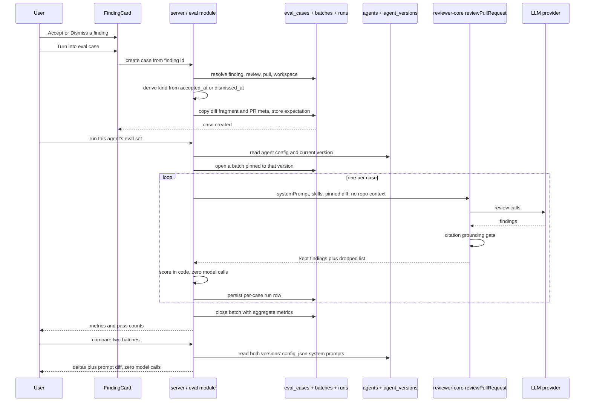
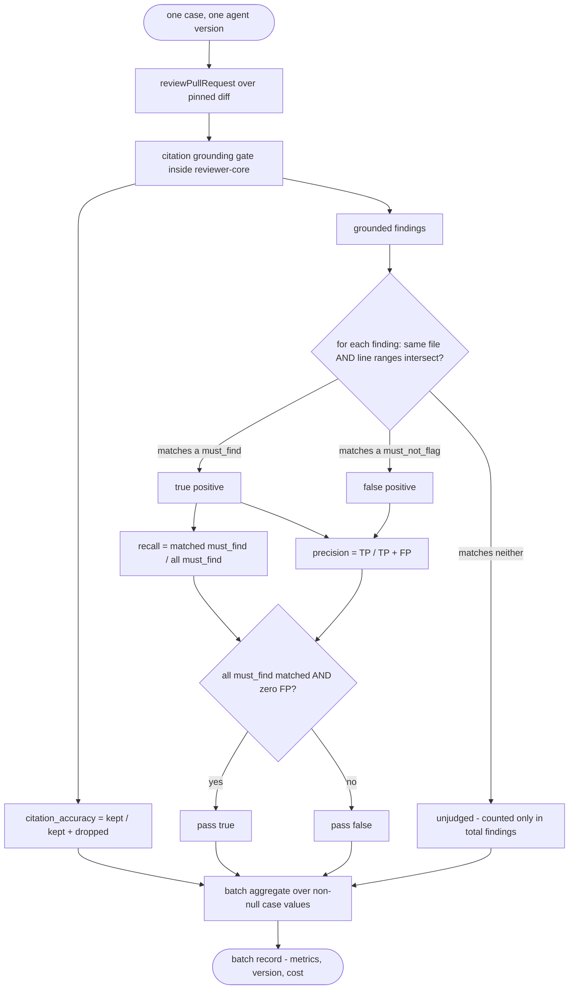

# Eval Pipeline

Status: draft. Scope drafted 2026-08-20.
Modules: server, client

Filename follows the bare-name convention of `specs/skills-feature.md` and
`specs/conventions-extractor.md` (course-homework specs), not the
`SPEC-NN-*.md` series (`SPEC-01`–`SPEC-03`). It therefore carries no Spec ID
and is not part of that numbering. Its structure follows
`specs/SPEC-03-pr-brief-and-why-timeline.md`, because the underlying
situation is the same one: **the starter ships the scaffolding and wires none
of it.**

## Problem & User

Someone edits a review agent's system prompt, swaps its model, or links a new
skill. Today there is no way to answer "did that make the agent better or
worse?" other than opening a PR and reading the findings by eye. Every earlier
lesson added capability to the reviewer; none added a way to tell whether a
change to it was an improvement or a regression.

The dataset for answering that already exists and is already being collected.
Every finding carries `accepted_at` / `dismissed_at`
(`server/src/db/schema/reviews.ts:45-46`), written by
`POST /findings/:id/(accept|dismiss)` (`modules/reviews/routes.ts:28,176-179`)
and rendered as Accept/Dismiss on every finding card
(`client/.../FindingCard/FindingCard.tsx:60-61,101-122`). The starter's own
code comments say so out loud: *"These decisions are the dataset later lessons
build on (eval cases from accept/dismiss…)"* (`modules/reviews/findings.ts:6-10`).
So no synthetic scenarios need inventing — an accepted finding is a
*should-find*, a dismissed one is a *should-not-flag*.

As with SPEC-03, the scaffolding is extensive, unused, and **not quite the
right shape** — which is why the decisions have to be written down.

1. **Two tables exist, never written.** `eval_cases` and `eval_runs`
   (`server/src/db/schema/eval.ts:7-20,22-35`), shipped in the **initial
   migration** — `0000_init.sql:116,129` with FKs at `:376-377`, not a later
   one (verified against all 19 migrations, `0000`–`0018`, and
   `migrations/meta/_journal.json`; `git log` on `schema/eval.ts` shows only
   the squashed-snapshot commit `587c46a`). Nothing in `server/src` reads or
   writes them: the only references are the re-exports at
   `db/schema.ts:39,77-78` (verified by grep for `evalCases` / `evalRuns`).
2. **Contracts exist, and they are one aggregation level short.**
   `EvalCaseInput`, `EvalRunRecord`, `EvalRunResult`, `EvalTrendPoint`,
   `EvalDashboard` (`vendor/shared/contracts/eval-ci.ts:20-89`) over the base
   `EvalRun` / `EvalCase` / `EvalOwnerKind`
   (`contracts/knowledge.ts:75-101`). But `EvalRunRecord` is **per case**
   (`case_id`, `case_name`) while `EvalTrendPoint` is **per set**
   (`pass_rate` only makes sense across cases) and `EvalDashboard.recent_runs`
   is typed as `EvalRunRecord[]`. The product needs "run the whole set, once,
   at one agent version" as a first-class object; the contract can express
   only the per-case row. `expected_output` is `z.unknown()`
   (`eval-ci.ts:27`), so the one shape the scorer depends on absolutely is the
   one nothing defines.
3. **The run→version link is missing entirely.** `eval_runs`
   (`schema/eval.ts:22-35`) has `case_id, ran_at, actual_output, pass, recall,
   precision, citation_accuracy, duration_ms, cost_usd` — **no column records
   which agent version, system prompt, or model was live when the run
   happened.** The requested "compare v6 → v7" view cannot be built over that:
   two runs a week apart are indistinguishable from two runs of the same
   config. D-3 decides this.
4. **The client copy is fully pre-authored and the UI is absent.**
   `client/messages/en/eval.json` (84 lines) already holds `dashboard`,
   `caseEditor`, `evalsTab` and `page` blocks — metric labels, the recent-runs
   table headers, the case-editor's Diff / PR-meta tabs, the JSON-validity
   badge, the breadcrumbs. `client/messages/en/agents.json:46-53` already
   lists an `evals` editor tab. Yet `AgentEditor` renders Config/Skills/Context
   only (`AgentEditor/constants.ts:11-15`, `AgentEditor.tsx:25-31`), there is
   no Eval Dashboard entry in `client/src/vendor/ui/nav.ts:20-53`, and grep
   finds zero client references to any eval contract. Same posture
   `specs/skills-feature.md` §2 took: **the pre-authored i18n is the source of
   truth for scope and wording**, not a later draft.
5. **The version history the comparison needs already works.**
   `agents.version` (`schema/agents.ts:33`) and `agent_versions`
   (`:38-49`, composite PK `(agent_id, version)`, `config_json`) are live:
   `AgentsRepository.update` bumps the version and snapshots the config on
   every config-affecting change (`modules/agents/repository.ts:112-146`), and
   the snapshot carries `system_prompt` **and** the linked skill ids
   (`:148-167`). The doc comment there says the reason out loud —
   *"reproducibility for eval"*. This is the prompt-diff source; it does not
   need building.
6. **…but a skill change is invisible to it.** `isConfigChange`
   (`modules/agents/helpers.ts`) covers only `agents`-table columns.
   `POST /agents/:id/skills` (`modules/agents/routes.ts:152-165`) links,
   unlinks and reorders skills **without bumping `agents.version`**, and
   editing a skill's *body* creates a `skill_versions` row that never touches
   the agent at all. Since enabled linked skills do reach the prompt
   (`modules/reviews/run-executor.ts:228-239,270`), "I changed a skill" — one
   of the three changes this feature exists to measure — would be recorded as
   "nothing changed". D-4.

So the work is: define the one undefined shape (`expected_output`), close the
two recording gaps (which version ran; which runs belong to one batch), build
a code-only scorer, and wire a server module plus two client surfaces whose
copy is already written.

## Goals / Non-goals

### Goals

- **One click turns a decided finding into an eval case.** An accepted finding
  → a `must_find` expectation at its `file:start_line-end_line`; a dismissed
  finding → a `must_not_flag` expectation over the same region.
- **Inputs are pinned at creation, never re-derived.** The case stores its own
  copy of the diff fragment and PR meta, so a run in October is comparable
  with a run in August.
- **A run executes the agent over every case in its set**, at one recorded
  agent version, as one batch.
- **Scoring is 100% code — zero model calls.** `recall`, `precision` and
  `citation_accuracy` are computed by file+line-range intersection and by the
  already-shipped grounding gate.
- **Runs are comparable across agent versions**: run history, per-metric
  trend, and a side-by-side "v6 → v7" view with the system-prompt diff.
- **An "Evals" tab in the Agent Editor** (case list + metrics + run) and an
  **"Eval Dashboard"** sidebar page, both driven by the already-authored
  `client/messages/en/eval.json`.
- **A lesson self-check** `./scripts/verify-l06.sh`, following
  `scripts/verify-l03.sh`'s fail-fast multi-lane pattern.

### Non-goals (this iteration)

- **Skill-owned eval cases.** `owner_kind` is `'skill' | 'agent'`
  (`knowledge.ts:87`) and stays that way in the schema, but only `'agent'` is
  implemented and exercised here (D-9).
- **Reproducing a production review's full prompt.** A live review also feeds
  the model repo-intel callers, a repo map, Project Context specs, and the
  derived intent block (`run-executor.ts:228-286`) — all derived from a clone
  and an index that a stored diff does not have. An eval run deliberately
  omits them (D-2). Eval numbers measure *relative* movement of prompt +
  skills, not absolute production quality (E-9).
- **Any change to `reviewer-core`.** `reviewPullRequest`
  (`reviewer-core/src/review/run.ts:43-100`) and `parseUnifiedDiff`
  (`reviewer-core/src/index.ts:16`) are consumed exactly as they are.
- **Auto-creating a case on every accept/dismiss.** The pre-authored copy
  calls the set a *"gold set"* (`eval.json:5`); a curated set is the point.
  Creation is always an explicit click (D-6).
- **Mutating agent config from the eval screens** — no "promote"/"revert"
  action (D-8, Q-2). The compare view is read-only.
- **The Stats and CI editor tabs.** `agents.json:46-53` lists them and the
  mockup shows them; both are separate unbuilt features. Their absence must
  not block the Evals tab's layout.
- **`conformance_checks` / `composed_reviews`** (`schema/eval.ts:37-56`) —
  they share the file, not the feature.
- **A harness-side skill eval for `pr-description`** (an
  `evals/skills/pr-description/pr-description.eval.ts` following the existing
  `skillTask`+judge pattern in `evals/`) — a separate, no-deadline follow-up
  in the `evals/` package, tracked outside this spec.
- **MCP / pre-push CLI parity**, mirroring SPEC-01/02/03's deferral.

## User stories

- As a reviewer who just accepted a finding about a leaked Stripe key, I click
  "Turn into eval case" on that card and the agent now has a regression test
  asserting it still catches that at `src/config.ts:12`.
- As the same reviewer, after dismissing a false-positive style nit, I turn
  *that* into a case so a future prompt edit that resurrects the nit shows up
  as a precision drop instead of as nothing.
- As an agent author, I open the agent's Evals tab, see its 8+ cases with
  pass/fail, and run them all with one button.
- As that author, I edit the system prompt, run the set again, and read
  recall/precision/citation side by side against the previous run — with the
  prompt diff shown, so I know exactly which edit moved which number.
- As that author, I deliberately weaken the prompt, run again, and watch
  precision fall — proving the harness is sensitive enough to be worth
  trusting.
- As a workspace owner, I open the Eval Dashboard and see each agent's current
  recall/precision/citation with a trend sparkline, so a regression is visible
  without opening each agent.
- As a cost-conscious user, I see what a run will cost before I press the
  button, and what the last one actually cost afterwards.

## Acceptance criteria (EARS)

### Creating a case from a real finding

- **AC-1** WHEN a user activates "Turn into eval case" on a finding that has
  been **accepted**, the system shall create one eval case whose
  `expected_output` contains exactly one `must_find` expectation carrying that
  finding's `file`, `start_line` and `end_line`. (verify: integration test
  asserting the persisted `expected_output`)
- **AC-2** WHEN a user activates it on a finding that has been **dismissed**,
  the system shall create one eval case whose `expected_output` contains
  exactly one `must_not_flag` expectation over that finding's file and line
  range. (verify: integration test)
- **AC-3** The expectation kind shall be derived **server-side** from the
  finding's persisted `accepted_at` / `dismissed_at`
  (`db/schema/reviews.ts:45-46`), never taken from the request body. IF the
  finding has neither timestamp set, THEN the system shall refuse to create a
  case and shall create nothing. (verify: integration test with a pending
  finding; unit test asserting a body-supplied kind is ignored)
- **AC-4** The action shall be offered in the UI only on a finding that is
  already accepted or dismissed — the same two booleans the card already
  derives (`FindingCard.tsx:60-61`). (verify: component test, all three states)
- **AC-5** The system shall resolve the finding, its review and its pull
  request through the existing `findingContext` join
  (`modules/reviews/repository.ts:115-119`) and shall 404 for a finding
  outside the caller's workspace — the exact barrier `actOnFinding` already
  applies (`modules/reviews/findings.ts:17-20`). (verify: integration test —
  finding of workspace A addressed from workspace B)
- **AC-6** The created case's owner shall be the agent that produced the
  finding, taken from `reviews.agent_id` (`db/schema/reviews.ts:18`), with
  `owner_kind: 'agent'`. IF that review has no `agent_id`, THEN the system
  shall refuse rather than guess an owner. (verify: integration test with a
  null `agent_id`)
- **AC-7** The system shall copy the case's inputs at creation time and shall
  never re-derive them at run time: `input_diff` from the persisted
  `pr_files.patch` rows for the finding's file
  (`db/schema/pulls.ts:36-45`), reassembled into a unified diff the same way
  `diffFromPrFiles` already does (`modules/reviews/diff-loader.ts:30-43`);
  `input_files` the file path list; `input_meta` the PR title and body.
  (verify: integration test asserting the case's stored diff is unchanged
  after the source PR is refreshed)
- **AC-8** IF no `pr_files` row with a non-null `patch` exists for the
  finding's file, THEN the system shall refuse to create the case and shall
  say why, rather than storing an empty `input_diff`. (verify: integration
  test)
- **AC-9** The system shall record the source finding's id in the created
  case's expectation, as provenance. (verify: integration test)
- **AC-10** A user shall be able to edit a case's name, `input_diff`,
  `input_meta` and `expected_output` after creation, and to delete a case.
  `expected_output` shall be validated against its contract on save and the
  editor shall show validity before saving — the `caseEditor.validJson` /
  `invalidJson` copy already authored (`eval.json:54-55`). (verify:
  integration test on an invalid payload; component test on the badge)

### The expectation shape

- **AC-11** The system shall define `expected_output` as an explicit,
  versioned contract in `@devdigest/shared` — a discriminating `version`
  field, a `must_find[]` array and a `must_not_flag[]` array, each entry
  carrying `file`, `start_line`, `end_line`, an optional advisory `severity`
  and `category`, an optional human `title`, and an optional
  `source_finding_id`. It shall replace the `z.unknown()` placeholder at
  `eval-ci.ts:27` for read and write, and shall be hand-mirrored into **both**
  `server/src/vendor/shared` and `client/src/vendor/shared` per root
  `AGENTS.md`. (verify: unit test on the schema; unit test asserting the two
  vendored copies are byte-identical)
- **AC-12** Only `file`, `start_line` and `end_line` shall participate in
  matching. `severity`, `category` and `title` shall be advisory display data
  and shall never affect a metric. (verify: unit test — two expectations
  differing only in `severity` score identically)
- **AC-13** The persisted `expected_output` shall be re-parsed against its
  contract on **read** as well as on write, so a row written by an earlier
  shape degrades to a clearly-marked unusable case instead of crashing the
  page or the run. (verify: integration test with a hand-corrupted row)

### Running a set

- **AC-14** WHEN a user runs an agent's eval set, the system shall execute the
  agent once per case in that set and shall record all resulting per-case rows
  as **one batch**. (verify: integration test — 8 cases produce 8 `eval_runs`
  rows sharing one batch)
- **AC-15** The system shall record, on the batch, the agent's `version` as it
  was at the moment the batch started, plus the provider and model actually
  used. (verify: integration test asserting the recorded version equals
  `agents.version`)
- **AC-16** WHERE the agent's config changes mid-batch, the batch shall keep
  the version it started with and shall not mix two configs into one
  comparison. (verify: integration test updating the agent between cases)
- **AC-17** Each case shall be executed by `reviewPullRequest`
  (`reviewer-core/src/review/run.ts`) over `parseUnifiedDiff(case.input_diff)`,
  with `systemPrompt`, `model`, `strategy` and the agent's **enabled** linked
  skill bodies resolved exactly as the production path resolves them
  (`run-executor.ts:228-239`), and with the PR description taken from
  `input_meta`. (verify: unit test on the assembled `ReviewInput`)
- **AC-18** The eval run shall pass **no** repo-intel callers digest, no repo
  map, no Project Context specs and no derived intent block — the four inputs
  a production review adds from a live clone/index
  (`run-executor.ts:241-250,266-279`) — so that the same case yields the same
  prompt regardless of clone or index state. (verify: unit test asserting
  those keys are absent from the assembled `ReviewInput`)
- **AC-19** The system shall persist, per case run: the model's output, the
  three metrics, `pass`, `duration_ms` and `cost_usd`, using the same
  field shapes `agent_runs` already uses (`db/schema/runs.ts:8-32`). (verify:
  integration test against the mock provider's returned usage)
- **AC-20** IF a single case's run fails — provider error, unparseable diff,
  schema-invalid response after the adapter's retries — THEN the system shall
  record that case as failed with its reason and shall continue the remaining
  cases, mirroring the per-agent failure isolation `executeRuns` already
  applies (`run-executor.ts:159-167`). (verify: integration test with a
  provider that throws on the third case)
- **AC-21** IF **every** case in a batch fails, THEN the batch shall be
  recorded with null metrics and an explicit failed state, and shall not be
  rendered as a score of zero. (verify: integration test)

### Scoring — code only, zero model calls

- **AC-22** The scorer shall make **zero** LLM calls. Every metric shall be
  computed arithmetically from the run's findings and the case's expectations.
  (verify: integration test asserting the mock provider's `complete` and
  `completeStructured` call counts equal exactly the review engine's own
  calls, and that scoring adds none)
- **AC-23** An actual finding shall be said to **match** an expectation when,
  and only when, `finding.file === expectation.file` AND
  `[finding.start_line, finding.end_line]` intersects
  `[expectation.start_line, expectation.end_line]`. (verify: unit test table —
  same file/overlap, same file/adjacent-no-overlap, different file/same lines)
- **AC-24** `recall` shall be the share of the case's `must_find`
  expectations matched by at least one actual finding. WHERE a case has no
  `must_find` expectation, `recall` shall be recorded as **null**, not as
  `1.0`. (verify: unit tests, both branches)
- **AC-25** `precision` shall be `TP / (TP + FP)` where `TP` is the number of
  actual findings matching a `must_find` expectation and `FP` is the number of
  actual findings matching a `must_not_flag` expectation. Findings matching
  neither shall be excluded from both terms. WHERE `TP + FP` is zero,
  `precision` shall be recorded as **null**, not as `1.0`. (verify: unit
  tests, including the all-unjudged case)
- **AC-26** The system shall additionally record the **total** number of
  findings the run produced, so that a change that sprays extra findings
  outside every annotated region is visible even though AC-25 does not move
  (E-6). (verify: integration test)
- **AC-27** `citation_accuracy` shall be the share of the model's raw findings
  that survived the already-shipped citation-grounding gate — computed from
  `reviewPullRequest`'s outcome as `kept / (kept + dropped)` using
  `outcome.dropped` (`reviewer-core/src/review/run.ts:205-234`,
  `grounding.ts:52-84`). It shall make no model call and shall introduce no
  second grounding implementation. WHERE the run produced no findings at all,
  it shall be recorded as **null**. (verify: unit test with a stub whose
  findings cite a file absent from the case diff)
- **AC-28** The system shall compute `recall` and `precision` over the
  **grounded** finding set (`outcome.review.findings`, already post-gate at
  `run.ts:222-223`), and `citation_accuracy` over the **pre-gate** set. The
  ordering shall be stated wherever the metrics are documented. (verify: unit
  test asserting a finding dropped by grounding lowers citation accuracy and
  does not count toward recall)
- **AC-29** A case shall be recorded as `pass: true` when every `must_find`
  expectation matched AND no actual finding matched any `must_not_flag`
  expectation; otherwise `pass: false`. (verify: unit test per branch)
- **AC-30** Batch-level metrics shall be the unweighted mean of the per-case
  values that are non-null, and the batch shall record how many cases
  contributed to each mean, so a mean over 2 of 8 cases is not read as a mean
  over 8. (verify: unit test with a mixed null/non-null set)

### Comparing two runs

- **AC-31** The system shall serve a comparison of any two batches of the same
  agent, carrying each batch's metrics, its recorded agent version, its cost,
  and the per-metric delta. (verify: integration test)
- **AC-32** The comparison shall include both batches' system prompts, read
  from `agent_versions.config_json`
  (`modules/agents/repository.ts:148-167`), so the diff shown is the config
  that actually ran and not the agent's current config. IF a snapshot for a
  recorded version is missing, THEN the comparison shall render the metrics
  and state the prompt is unavailable, rather than substituting the current
  prompt. (verify: integration test with a deleted snapshot row)
- **AC-33** Comparison, dashboard and history reads shall make **zero** model
  calls regardless of how many batches they cover. (verify: integration test)

### Client surfaces

- **AC-34** The Agent Editor shall gain an **Evals** tab, added to `TABS`
  (`AgentEditor/constants.ts:11-15`) so it appears in the bar *and* in the
  derived `TAB_KEYS` URL allow-list, using the already-authored
  `agents.editor.tabs.evals` label (`agents.json:50`). (verify: component
  test asserting `?tab=evals` renders the tab and does not snap back to
  Config)
- **AC-35** The Evals tab shall render the agent's metrics and its case list
  with per-case pass/fail and last-recall, plus "New case" and per-case Run /
  Edit / Delete actions, using the pre-authored `eval.evalsTab.*` keys, and
  shall render `evalsTab.emptyCases` when the agent has no cases. (verify:
  component tests, populated and empty)
- **AC-36** A new **Eval Dashboard** page shall be added to the sidebar's
  `SKILLS LAB` group (`client/src/vendor/ui/nav.ts:41-53`) — the group the
  pre-authored breadcrumb `page.crumbSkillsLab` (`eval.json:77`) already
  places it under. (verify: component test on the nav registry)
- **AC-37** The dashboard shall render, per agent, the three current metrics
  and a trend, and a recent-runs table with the columns the pre-authored
  `dashboard.table.*` keys name — ran-at, recall, precision, citation, pass,
  cost (`eval.json:22-29`). (verify: component test)
- **AC-38** The dashboard and the per-agent detail view shall reuse the
  vendored chart primitives — `MetricCard`, `Sparkline`, `LineChart`
  (`client/src/vendor/ui/charts/index.ts:3-7`) — imported from the
  `@devdigest/ui` barrel only, per `client/AGENTS.md`, and shall add no new
  chart component. (verify: component test; manual — import review)
- **AC-39** The metric line chart shall be rendered with a y-domain covering
  the full `0..1` range. `LineChart`'s defaults are `yMin = 0.6, yMax = 1.0`
  (`charts/LineChart.tsx:22-23`), passed straight to Recharts'
  `YAxis domain` (`:46`), which **clips** points below `0.6` — precisely the
  region a deliberately-broken prompt lands in (E-7). (verify: component test
  asserting the passed domain; manual — render with a 0.3 precision point)
- **AC-40** All eval data fetching shall go through `src/lib/hooks/*` wrappers
  over `src/lib/api.ts`, never an ad-hoc `fetch` in a component, per
  `client/AGENTS.md`. (verify: manual — code review)
- **AC-41** New client copy shall extend the existing pre-authored namespaces
  without redefining any key already present in `client/messages/en/eval.json`
  or `agents.json`. Genuinely new copy is limited to: the finding card's
  "Turn into eval case" action (the `prReview.finding` block currently has
  `accept`/`dismiss`/`learn`/`replyToAuthor` only,
  `prReview.json:2-13`), the dashboard's run-all-agents action, and the
  compare view. (verify: unit test asserting no key collision)

### Access, safety, cost

- **AC-42** Every eval route shall resolve tenancy via
  `getContext(container, req)` before any work — the barrier every existing
  module applies (`modules/agents/routes.ts:145-147`,
  `modules/reviews/findings.ts:17-20`). (verify: integration test per route,
  cross-workspace)
- **AC-43** A case's `owner_id` shall be verified to name an agent **in the
  caller's workspace** before the case is created or updated. `EvalCaseInput`
  types it as a bare `z.string()` (`eval-ci.ts:22`), so an unverified value is
  a direct IDOR — a case attached to another workspace's agent. (verify:
  integration test with a foreign agent id)
- **AC-44** `eval_runs` carries no workspace column
  (`schema/eval.ts:22-35`); every read of a run shall therefore be scoped
  through its case's `workspace_id` (or its batch's), never by run id alone.
  (verify: integration test reading a foreign run by id)
- **AC-45** The run route shall be rate-limited at the same rate as the other
  model-spending routes — 10 requests per minute
  (`modules/reviews/routes.ts:41-44,62-66`). Note rate limiting is fully
  disabled under `NODE_ENV=test` (`server/AGENTS.md`), so the test must enable
  it explicitly. (verify: integration test)
- **AC-46** The system shall cap a case's `input_diff` size on write, below
  the app's hardcoded 1 MB `bodyLimit` (`server/AGENTS.md`), and shall reject
  an oversized case with a clear error rather than accepting a case that can
  only ever fail at run time. (verify: integration test)
- **AC-47** Before a run is started the UI shall state how many model calls it
  will make and the last comparable run's cost; a fan-out action across
  several agents shall state the multiplied figure. (verify: component test)
- **AC-48** The system shall log a batch's outcome with agent id, version,
  case count, metrics, model, tokens and cost — and shall never log
  `input_diff` contents, the assembled prompt, or the raw model response,
  the rule `run-executor.ts` and `intent-service.ts:36-39` already state.
  (verify: manual — code review)
- **AC-49** Route params and bodies shall be declared as zod schemas on the
  route, not hand-parsed in the handler, per `server/AGENTS.md`. (verify:
  manual — code review)

### Process / Definition of Done

- **AC-50** At least one agent shall have an eval set of **≥ 8 cases**, mixing
  both expectation kinds, every one of them created from a real finding.
  (verify: manual — the seeded/created set, counted in the UI)
- **AC-51** The validation experiment shall be run and its numbers recorded:
  run the set, edit the system prompt, run again — recall and/or precision
  move; then deliberately weaken the prompt and run again — precision drops.
  Both movements shall be visible in the compare view. (verify: manual — the
  two comparisons, screenshotted)
- **AC-52** A `./scripts/verify-l06.sh` shall exist and exit 0, following
  `scripts/verify-l03.sh`'s conventions exactly: `set -euo pipefail`, ordered
  fail-fast lanes that name the failing lane, local binaries invoked directly
  (`./node_modules/.bin/tsc`, `./node_modules/.bin/vitest`) and never via
  `pnpm <script>` (root `INSIGHTS.md` records
  `ERR_PNPM_ABORTED_REMOVE_MODULES_DIR_NO_TTY` in non-interactive shells),
  `**/*.it.test.ts` excluded so the gate passes with Docker stopped, and a
  prerequisite check that fails with an actionable message when
  `node_modules` is missing. It is invoked directly as a path, not as a
  `pnpm verify:l06` script — this repo has no root `package.json` and no such
  script exists. (verify: run it on a clean checkout with Docker stopped)
- **AC-53** This Spec and the Development Plan derived from it shall be
  committed **before** the first line of feature code for this feature.
  (verify: manual — `git log` review)

## Edge cases

- **E-1 The source diff is deleted out from under the case.**
  `GET /pulls/:id` **deletes and reinserts** every `pr_files` and `pr_commits`
  row on each successful refresh (`modules/pulls/routes.ts:232-244`). A case
  that referenced its PR instead of copying the patch would silently change
  meaning — or lose its input entirely — the next time anyone opened the PR.
  This is the concrete reason AC-7's pinning is mandatory rather than an
  optimisation.
- **E-2 The finding's line numbers are new-side diff lines, and so are the
  expectations.** `findings.start_line/end_line` are the coordinates the
  grounding gate checks against new-side hunk lines
  (`grounding.ts:24-39,73`). An expectation copied from a finding therefore
  only means anything against the pinned diff it came from. Editing a case's
  `input_diff` without editing its expectations silently invalidates them.
- **E-3 Deleting a case rewrites history.** `eval_runs.case_id` cascades on
  delete (`schema/eval.ts:24-26`). If batch aggregates were derived by
  querying the surviving rows, deleting one case would retroactively change
  the score of every past run — the direct argument for D-3's stored,
  immutable batch record.
- **E-4 Two accepted findings on the same file and overlapping lines.** Two
  separate cases would both be satisfied by one finding, and a single case
  with two `must_find` entries can be fully satisfied by one broad finding
  spanning both ranges. AC-23's intersection rule is many-to-many by
  construction; the metric is "expectations matched", not "findings used".
- **E-5 An expectation on a full-file-kind finding.** `groundFindings` exempts
  `secret_leak`, `lethal_trifecta`, `phantom` and `hook` from the line check —
  they need only the file to be present (`grounding.ts:16,59-70`). Such a
  finding's persisted `start_line`/`end_line` may not intersect any hunk at
  all, so a `must_find` expectation copied from one can be unsatisfiable under
  AC-23's strict range rule even when the agent behaves correctly.
- **E-6 Precision is blind to unannotated noise.** Under AC-25, findings that
  match neither list are excluded from both terms. A prompt edit that doubles
  the agent's output without touching any annotated region leaves precision
  unchanged. AC-26's total-findings counter exists so that regression is still
  visible; Q-1 records that the metric definition itself remains open.
- **E-7 A precision drop can render off the chart.** `LineChart` defaults to
  `domain=[0.6, 1.0]` (`charts/LineChart.tsx:22-23,46`). The homework's own
  validation experiment deliberately pushes precision down; at 0.3 the line
  simply leaves the plot area, so the experiment appears to show nothing.
  AC-39.
- **E-8 A skill change is invisible to `agents.version`.**
  `POST /agents/:id/skills` (`modules/agents/routes.ts:152-165`) does not go
  through `AgentsRepository.update`, and `isConfigChange`
  (`modules/agents/helpers.ts`) has no skill field — so linking, unlinking or
  reordering skills leaves the version untouched, and editing a skill's body
  changes only `skill_versions`. Two batches labelled "v7" can therefore have
  run different prompts. D-4.
- **E-9 An eval run's prompt is not a production review's prompt.** A real run
  adds callers, repo map, Project Context specs and the intent block
  (`run-executor.ts:241-250,266-279`); an eval run has none of them (AC-18).
  Absolute eval scores are therefore not predictions of production quality —
  only movement between two eval batches is meaningful. Presenting the number
  as "how good this agent is" would overstate it.
- **E-10 `strategy: 'auto'` picks its path from diff size.**
  `reviewPullRequest` chooses map-reduce for large multi-file diffs
  (`review/run.ts:29-35`), which means a case's cost and call count depend on
  its pinned diff. Because the diff is pinned, this stays deterministic — but
  a large case costs several calls, not one, and AC-47's estimate must not
  claim otherwise.
- **E-11 A model that finds nothing scores three nulls.** Recall is `0` (it
  missed real `must_find` items) but precision (AC-25) and citation accuracy
  (AC-27) are undefined, not perfect. Rendering an empty run as `1.00 / 1.00`
  would be the single most misleading thing this feature could do.
- **E-12 A case whose `expected_output` predates the contract.** The column is
  untyped `jsonb` (`schema/eval.ts:18`) and the contract is `z.unknown()`
  today (`eval-ci.ts:27`). Any shape can already be written. AC-13's re-parse
  on read is what keeps one bad row from breaking the tab — the same
  degradation contract SPEC-03 AC-40 applies to `pr_brief.json`.
- **E-13 Prompt injection from a case's own diff.** `input_diff` is
  attacker-influenced content (it came from a PR) that is fed into a review
  prompt. It travels the standard `assemblePrompt` path, which already wraps
  the diff as untrusted — this feature introduces no new boundary, but it does
  introduce a way to *store* such content and replay it on demand.
- **E-14 A concurrent second run of the same set.** Two batches started at
  once double the spend and produce two rows a reader will try to compare as
  "before and after" when they are the same config. Rate limiting cannot be
  relied on to prevent it: it is fully disabled under `NODE_ENV=test`
  (`server/AGENTS.md`).
- **E-15 The agent is deleted while it owns cases.** `eval_cases.owner_id` is
  a plain `uuid` with **no foreign key** to `agents` (`schema/eval.ts:13`), so
  deleting an agent leaves orphan cases that cascade only with the workspace.
  The case list must handle an owner that no longer exists.
- **E-16 Provider returns no cost.** `cost_usd` is nullable throughout
  (`schema/eval.ts:34`, `contracts/knowledge.ts:82`); the cost column and the
  cost delta must render null without inventing a figure — the same case
  SPEC-03 E-20 records.
- **E-17 An agent with fewer than two batches.** The dashboard's `delta` block
  (`eval-ci.ts:80-84`) is non-nullable in the contract, but the first run has
  nothing to be a delta from. The UI must show "first run" rather than a
  delta of zero, which reads as "no change".

## Non-functional requirements

Checked against the `security` skill (OWASP Top 10:2025); non-security
categories are covered where this feature actually implicates them.

**Security**

- **A01 Broken access control / tenant isolation.** Three distinct IDOR
  surfaces, only one of which the schema helps with. `eval_cases` has
  `workspace_id` (`schema/eval.ts:9-11`); `eval_runs` has none
  (`:22-35`), so run reads must be scoped through the case or batch (AC-44).
  Worst of the three: `EvalCaseInput.owner_id` is an unconstrained
  `z.string()` (`eval-ci.ts:22`) — accepting it without verifying the agent
  belongs to the caller's workspace attaches a case to a foreign agent and
  leaks its metrics (AC-43). Deny-by-default via `getContext` on every route
  (AC-42), the barrier every shipped module already uses.
- **A05 Injection / prompt injection.** `input_diff` is stored,
  attacker-influenced text replayed into an LLM prompt (E-13). It travels the
  standard `assemblePrompt` path with its existing untrusted wrapping — this
  feature must not build a second prompt path that bypasses it (AC-17).
- **A05 XSS.** Case names, notes, `input_diff`, expectation titles and the
  model's own `rationale`/`title` are all rendered in the client. They go
  through the centralized `react-markdown` instance
  (`client/src/vendor/ui/primitives/Markdown.tsx`, per `client/AGENTS.md`) or
  render as plain text — never `dangerouslySetInnerHTML`, never a second
  renderer. A stored diff is code, and code is the highest-risk stored-XSS
  payload in this product.
- **A06 Insecure design / cost abuse.** This is the feature's sharpest
  non-obvious risk: one click multiplies. Eight cases is eight review runs;
  the mockup's "Run all agents" is *agents × cases* reviews from one button —
  the largest single-click spend in the product. Mitigations: explicit action
  only, a 10/min rate limit matching the other model-spending routes (AC-45),
  a pre-click estimate including the fan-out multiplier (AC-47), a capped
  `input_diff` (AC-46), and per-batch persisted cost so the spend is auditable
  (AC-19).
- **A08 Integrity.** `expected_output` and `actual_output` are untyped `jsonb`
  columns fed by request bodies and model output respectively. Both are
  schema-validated on write and re-validated on read (AC-11, AC-13); nothing
  from a request body is spread into a database write; `owner_kind` is
  enum-constrained at the DB level (`schema/eval.ts:12`) and must be at the
  API level too.
- **A09 Logging.** Ids, versions, counts, metrics, tokens, cost — never
  `input_diff` contents, the assembled prompt, or the raw model response
  (AC-48).
- **A10 Exceptional conditions / fail-closed.** A failed case does not fail
  the batch (AC-20); an all-failed batch records null metrics rather than
  zeros (AC-21); an undefined metric is null rather than a flattering `1.0`
  (AC-24, AC-25, AC-27, E-11); a missing version snapshot degrades the compare
  view rather than substituting the current prompt (AC-32).

**Cost.** Every model call this feature makes is a review call it was
explicitly asked to make; scoring, dashboard, history and comparison are all
zero-call (AC-22, AC-33). Per-case and per-batch cost is persisted (AC-19) so
the claim is auditable rather than asserted. Note `strategy: 'auto'` can turn
one case into several calls (E-10).

**Performance.** Reads are indexed row lookups and small per-owner scans; a
batch is dominated by provider latency and is inherently serial per case. No
concrete latency or timeout target has been agreed (Q-4). Whether a batch runs
cases concurrently is a Development Plan question, bounded by AC-45's rate
limit and by not exceeding the provider's own limits.

**Availability / degradation.** Every degraded path renders content rather
than an error: a failed case (AC-20), an all-failed batch (AC-21), a corrupt
expectation (AC-13, E-12), a missing prompt snapshot (AC-32), an orphaned
agent (E-15), a null cost (E-16), a first run with no delta (E-17).

**Observability.** The feature's primary observable is the difference between
*a real regression*, *a metric that is undefined*, and *a run that failed* —
three states a reader would otherwise flatten into "the number went down".
Null-not-1.0 (AC-24/25/27), the contributing-case counts on batch means
(AC-30), the total-findings counter (AC-26) and the recorded agent version
(AC-15) are what make a moved number interpretable.

**Maintainability / configuration.** A new server module under
`server/src/modules/eval/` following routes → service → port ← adapter,
registered with one import and one entry in `modules/index.ts:30-46`, checked
by `pnpm arch:check`. It reads the agents repository and the reviews
repository as a consumer module — `modules/blast/` is the precedent. Metric
computation belongs in a pure, I/O-free scorer module so it is unit-testable
without a database or a provider. Engineering caps (diff size cap, fan-out
cap) belong in the module's own `constants.ts`, per
`project-context/constants.ts`. Any contract change is hand-mirrored into
**both** `server/src/vendor/shared` and `client/src/vendor/shared` (root
`AGENTS.md` — no sync script), and any schema change goes through
`pnpm db:generate`, never a hand-edited migration (`server/AGENTS.md`
do-not-touch).

## Module interaction / API contracts

Two modules are touched. **server**: a new `eval` module owning case CRUD,
one-click creation from a finding, batch execution over
`reviewPullRequest`, a pure code-only scorer, and the dashboard/comparison
aggregates. **client**: an Evals tab in the Agent Editor, an Eval Dashboard
page with a per-agent detail view and a compare view, and one new action on
the finding card. **`reviewer-core` is not touched** — it is consumed exactly
as it is (AC-17, AC-27).

**Contracts this Spec requires** (shapes, not implementations):

- An **`EvalExpectation`** shape replacing `expected_output`'s `z.unknown()`
  (`eval-ci.ts:27`): `version`, `must_find[]`, `must_not_flag[]`, each entry
  `{ file, start_line, end_line, severity?, category?, title?,
  source_finding_id? }` (AC-11, AC-12).
- A **create-from-finding** contract: PR-scoped, taking a finding id and
  optionally a case name; everything else server-derived (AC-1–AC-9).
- A **batch** shape — the level `EvalRunRecord` (`eval-ci.ts:33-45`) cannot
  express: `{ id, owner_kind, owner_id, agent_version, provider, model,
  ran_at, cases_total, cases_passed, recall, precision, citation_accuracy,
  contributing counts, duration_ms, cost_usd }` — and a `batch_id` on each
  per-case run row. `EvalDashboard.recent_runs` (`:86`) should carry batches,
  not per-case rows, for the recent-runs table the mockup and
  `dashboard.table.*` describe (D-3).
- A **comparison** contract: two batch records, per-metric deltas, cost delta,
  and both versions' system prompts (AC-31, AC-32).
- **`EvalTrendPoint`** (`eval-ci.ts:57-64`) is reused as-is, reinterpreted as
  one point *per batch*, which is what its `pass_rate` field already implies.
- **Storage**: `eval_cases` used as-is; `eval_runs` gains a nullable
  `batch_id`; a new batch table is added (D-3). All via
  `schema/eval.ts` + `pnpm db:generate`, never a hand-edited migration.
- **Unchanged**: `reviewPullRequest`, `groundFindings`, `parseUnifiedDiff`,
  `assemblePrompt`, the agents module's version/snapshot behaviour, the
  findings accept/dismiss routes, and `conformance_checks`/`composed_reviews`.

## UX improvements

1. **The action must not appear before a decision exists.** The whole design
   rests on the expectation kind being *derived* from accept/dismiss
   (AC-3). On a pending finding there is nothing to derive, so offering the
   button there would force the user to state an expectation the system then
   ignores. `FindingCard` already computes both booleans
   (`FindingCard.tsx:60-61`); gate on them (AC-4).
2. **Say which kind of case the click just created.** "Turn into eval case"
   does two opposite things depending on which button the user pressed
   earlier. The confirmation must say *"will assert this IS found"* or
   *"will assert this is NOT flagged"* — otherwise the most important fact
   about the case is invisible at the moment it is created.
3. **Don't let the mockup's button row drive the layout.** The reference
   screenshot shows Accept / Dismiss / Learn / Reply-to-author / Turn-into-
   eval-case. `FindingCard.tsx:101-122` renders Accept and Dismiss only —
   `learn` and `replyToAuthor` exist as *copy* (`prReview.json:8-9`) with no
   implementation. Adding a fifth button to a two-button row is a different
   layout problem than the mockup shows.
4. **Never render an undefined metric as a perfect score.** An agent that
   found nothing has undefined precision and undefined citation accuracy
   (E-11). `1.00` in a green tile for "the agent did nothing" is the worst
   available failure mode. Show an explicit "n/a" and say why.
5. **Say how many cases a mean covers.** A batch mean over 2 non-null cases
   out of 8 (AC-30) looks identical to a mean over 8. `dashboard.casesSummary`
   (`eval.json:5`) already has the slot for a count; use it honestly.
6. **The chart must show the drop the experiment is designed to produce.**
   `LineChart`'s `[0.6, 1.0]` default domain (`charts/LineChart.tsx:22-23`)
   clips exactly the range a deliberately-broken prompt produces. The single
   most likely way this feature silently fails its own acceptance criterion
   (AC-39, E-7).
7. **Label every run with the version that ran it.** The mockup's `v3..v7`
   tags are not decoration — without them a metric trend is a line with no
   cause. The version is only meaningful if it is recorded at run time
   (AC-15), and only honest if the caveat about skills not bumping it is
   surfaced (E-8, D-4).
8. **Show the prompt diff, not the current prompt.** The compare view's value
   is "this edit caused this delta". Reading the agent's *current* prompt
   instead of the two snapshots would attribute the delta to whatever the
   prompt happens to say today (AC-32).
9. **State the cost before the click, with the multiplier.** "Run all agents"
   is the largest one-click spend in the product. `dashboard.runEval` is
   already parameterised with a count (`eval.json:7`); the estimate should be
   calls and money, not just case count (AC-47).
10. **Follow the pre-authored copy; flag what it doesn't cover.**
    `eval.json` is complete for the dashboard, case editor and Evals tab —
    and contains **no** strings for "Run all agents", "Compare runs",
    "Promote", or a prompt diff. That absence is informative: those are the
    parts of the mockup that were never specified in copy, and they are
    exactly the parts this spec scopes most cautiously (D-8, Q-2). The same
    "pre-built i18n is source of truth" discipline `specs/skills-feature.md`
    §2 applied.
11. **"Gold set" is a promise about curation.** `dashboard.casesSummary`
    (`eval.json:5`) calls the case set a gold set. That is only true if cases
    are deliberately chosen, which is why creation stays a click and never a
    side effect of accept/dismiss (D-6).
12. **A first run is not a delta of zero.** `EvalDashboard.delta`
    (`eval-ci.ts:80-84`) is non-nullable; rendering `0.0` for an agent's first
    batch reads as "no change" when it means "nothing to compare" (E-17).
13. **Say that eval scores are relative, not absolute.** An eval run is
    deliberately missing the repo context a production review gets (AC-18,
    E-9). A `0.62` recall tile with no framing will be read as "this agent
    catches 62% of real bugs", which it is not.

## Inputs and provenance

| Section | Grounded in |
|---|---|
| Problem & User | `server/src/db/schema/eval.ts:7-35`; `db/migrations/0000_init.sql:116,129,376-377` + `migrations/meta/_journal.json` + `git log` on `schema/eval.ts` (only `587c46a`); `db/schema.ts:39,77-78` and a grep of `server/src` showing no other reference; `vendor/shared/contracts/eval-ci.ts:20-89`; `contracts/knowledge.ts:75-101`; `db/schema/reviews.ts:18,45-46`; `modules/reviews/findings.ts:6-10,17-20`; `modules/reviews/routes.ts:28,176-179`; `client/.../FindingCard/FindingCard.tsx:60-61,101-122`; `client/messages/en/eval.json`; `client/messages/en/agents.json:46-53`; `client/.../AgentEditor/constants.ts:11-15`; `AgentEditor.tsx:25-31`; `client/src/vendor/ui/nav.ts:20-53` and a grep of `client/src` showing no eval references; `db/schema/agents.ts:33,38-49`; `modules/agents/repository.ts:112-167`; `modules/agents/helpers.ts`; `modules/agents/routes.ts:152-165`; `modules/reviews/run-executor.ts:228-239,270`; `specs/SPEC-03-pr-brief-and-why-timeline.md` (structural template) |
| Goals / Non-goals | The user's relayed brief and scope decisions (2026-08-20); `contracts/knowledge.ts:87`; `run-executor.ts:228-286`; `reviewer-core/src/review/run.ts:43-100`; `reviewer-core/src/index.ts:16,28`; `client/messages/en/eval.json:5`; `db/schema/eval.ts:37-56`; `evals/README.md` + `evals/skills/` listing; SPEC-01/02/03 Non-goals (MCP/CLI deferral) |
| User stories | The user's relayed brief and the described mock screenshots (2026-08-20); `client/messages/en/eval.json` (pre-authored surface copy) |
| Acceptance criteria | `db/schema/reviews.ts:18,45-46`; `db/schema/pulls.ts:36-45`; `db/schema/eval.ts:7-35`; `db/schema/agents.ts:33,38-49`; `db/schema/runs.ts:8-32`; `modules/reviews/findings.ts:11-33`; `modules/reviews/repository.ts:115-119`; `modules/reviews/routes.ts:28,41-44,62-66,176-179`; `modules/reviews/diff-loader.ts:30-43`; `modules/reviews/run-executor.ts:159-167,228-286`; `modules/agents/repository.ts:112-167`; `modules/agents/routes.ts:145-147,152-165`; `modules/index.ts:30-46`; `reviewer-core/src/review/run.ts:29-35,43-100,205-234`; `reviewer-core/src/grounding.ts:16,24-39,52-84`; `vendor/shared/contracts/eval-ci.ts:22,27,33-45,57-64,80-86`; `client/.../AgentEditor/constants.ts:11-15`; `client/src/vendor/ui/nav.ts:41-53`; `client/src/vendor/ui/charts/index.ts:3-7`; `client/src/vendor/ui/charts/LineChart.tsx:22-23,46`; `client/messages/en/eval.json:5,7,22-29,54-55,77`; `client/messages/en/agents.json:50`; `client/messages/en/prReview.json:2-13`; `scripts/verify-l03.sh`; `server/AGENTS.md`; `client/AGENTS.md`; root `AGENTS.md`; root `INSIGHTS.md` (pnpm non-TTY abort); the user's relayed acceptance criteria (≥8 cases, one click, both kinds, visible metric movement, zero LLM calls in the scorer, green lesson self-check) |
| Edge cases | `modules/pulls/routes.ts:232-244`; `db/schema/eval.ts:13,18,24-26,34`; `reviewer-core/src/grounding.ts:16,24-39,59-73`; `reviewer-core/src/review/run.ts:29-35,205-234`; `run-executor.ts:241-250,266-279`; `modules/agents/routes.ts:152-165`; `modules/agents/helpers.ts`; `client/src/vendor/ui/charts/LineChart.tsx:22-23,46`; `vendor/shared/contracts/eval-ci.ts:27,80-84`; `contracts/knowledge.ts:82`; `server/AGENTS.md` (rate limiting disabled in test, 1 MB bodyLimit); `specs/SPEC-03-...md` E-20 (null cost precedent) |
| Non-functional requirements | `security` skill (OWASP Top 10:2025) — A01/A05/A06/A08/A09/A10; `db/schema/eval.ts:9-12,22-35`; `vendor/shared/contracts/eval-ci.ts:22`; `modules/agents/routes.ts:145-147`; `modules/reviews/findings.ts:17-20`; `modules/reviews/routes.ts:41-44,62-66`; `modules/reviews/run-executor.ts`; `modules/reviews/intent-service.ts:36-39`; `modules/index.ts:30-46`; `modules/blast/` (consumer-module precedent); `project-context/constants.ts`; `client/AGENTS.md` (centralized markdown, hooks-only fetching, UI barrel); `server/AGENTS.md` (zod routes, bodyLimit, do-not-touch migrations); root `AGENTS.md` (vendored-contract manual mirroring, `pnpm db:generate`) |
| Module interaction / API contracts | `vendor/shared/contracts/eval-ci.ts:20-89`; `contracts/knowledge.ts:75-101`; `db/schema/eval.ts:7-35`; `db/schema/agents.ts:38-49`; `modules/agents/repository.ts:148-167`; `reviewer-core/src/review/run.ts:43-100,205-234`; `reviewer-core/src/index.ts:16,28`; `modules/index.ts:30-46`; root `AGENTS.md`; `mermaid-diagram` skill for both diagrams |
| UX improvements | The described mock screenshots (2026-08-20); `client/messages/en/eval.json` (full read); `client/messages/en/prReview.json:2-13`; `client/messages/en/agents.json:46-53`; `client/.../FindingCard/FindingCard.tsx:60-61,101-122`; `client/src/vendor/ui/charts/LineChart.tsx:22-23,46`; `client/src/vendor/ui/charts/MetricCard.tsx:6-20`; `vendor/shared/contracts/eval-ci.ts:80-84`; `specs/skills-feature.md` §2 (pre-built i18n as source of truth) |
| Decisions recorded | D-1…D-9 decided by this agent on the cited code; the ≥8-case set, the one-click requirement, the zero-LLM-call scorer, the two expectation kinds and the validation experiment are direct user requirements relayed 2026-08-20 |

## Untrusted inputs

| Input | Source | Trust boundary |
|---|---|---|
| `finding_id` on the create-from-finding route | Client | Untrusted. Zod-validated; resolved through `findingContext` and workspace-checked before any write (AC-5). |
| `owner_id` on `EvalCaseInput` | Client, typed as a bare `z.string()` (`eval-ci.ts:22`) | Untrusted **and unconstrained** — the primary IDOR surface here. Must be verified to name an agent in the caller's workspace on every create and update (AC-43). |
| `expected_output` on create/update | Client | Untrusted. Schema-validated on write and re-validated on read (AC-11, AC-13); line numbers are data compared arithmetically, never used to index anything. |
| `input_diff` (user-supplied on edit) | Client, or copied from `pr_files.patch` | Untrusted. Size-capped below the 1 MB bodyLimit (AC-46); parsed by `parseUnifiedDiff`, which must degrade on malformed input rather than throw into the route; rendered as text, never as HTML. |
| `input_diff` (replayed into a prompt) | Originally PR/repo content, author-controllable | Untrusted. Reaches the model only through the standard `assemblePrompt` path with its existing untrusted wrapping (AC-17, E-13). |
| `input_meta` PR title/body | PR author | Untrusted. Same treatment as `prDescription` on the production path. |
| Model response — findings, titles, rationale | LLM output over untrusted input | Untrusted. Schema-validated by the review engine; grounded by `groundFindings` before scoring; rendered through the centralized markdown instance or as plain text. |
| Model-authored `file` paths in findings | LLM output | Untrusted. Used **only** for string comparison against expectations and diff paths (AC-23) — never to read, write or resolve a filesystem location. |
| Stored `eval_cases.expected_output` / `eval_runs.actual_output` rows | Own database, untyped `jsonb` (`schema/eval.ts:18,28`) | Untrusted for shape. Re-validated on read; a malformed row degrades (AC-13, E-12). |
| Stored `agent_versions.config_json` | Own database, untyped `jsonb` | Untrusted for shape — already parsed through `AgentVersionConfig` (`modules/agents/helpers.ts`). The compare view must not bypass that. |
| Batch / run / case ids in route params | Client | Untrusted. Zod-validated; every run read scoped through its case or batch, since `eval_runs` carries no workspace column (AC-44). |

## Decisions recorded

- **D-1 The expectation shape is defined here, because nothing else defines
  it.** `EvalCaseInput.expected_output` is `z.unknown()` (`eval-ci.ts:27`) and
  the column is untyped `jsonb` (`schema/eval.ts:18`), so the one input the
  scorer depends on absolutely is the one with no contract. A versioned
  `{ must_find[], must_not_flag[] }` shape carrying `file` + line range per
  entry is the minimum the AC-23 matching rule needs, and the `version`
  discriminator is what lets AC-13's read-side re-parse degrade honestly
  instead of crashing. Advisory `severity`/`category`/`title` are carried for
  display and provenance but deliberately excluded from matching (AC-12) —
  including them would make a metric move when a model merely re-labels a
  finding it correctly found.
- **D-2 An eval run deliberately runs a *thinner* prompt than production.** A
  production review injects repo-intel callers, a repo map, Project Context
  specs and the intent block (`run-executor.ts:241-250,266-279`), every one
  of which is derived from a clone and an index whose state changes over time.
  Including them would make two runs of the same agent, months apart,
  incomparable — which is the one thing this feature exists to make possible.
  So they are excluded (AC-18), and the honest consequence is recorded rather
  than hidden: eval numbers measure relative movement of prompt + skills, not
  absolute review quality (E-9, UX-13).
- **D-3 Add a batch record; do not derive batch aggregates from surviving
  run rows.** The scaffolding has no level between "one case run" and
  "everything", and the requested compare view needs exactly that level: one
  execution of one set at one agent version. Two options were weighed.
  *Rejected*: two nullable columns on `eval_runs` (`batch_id`,
  `agent_version`) with the set-level view computed by aggregation — minimal
  schema, but `eval_runs.case_id` cascades on delete
  (`schema/eval.ts:24-26`), so deleting one case would retroactively rewrite
  the score of every past batch that included it (E-3). *Chosen*: a new
  batch table storing the aggregate as an immutable measurement at close
  time, with a nullable `batch_id` on `eval_runs` pointing at it — history
  then survives case deletion, and the dashboard reads one row instead of
  aggregating on every load. Cost: the aggregate is stored twice. Both tables
  change through `schema/eval.ts` + `pnpm db:generate`; `db/migrations/**` is
  do-not-touch (`server/AGENTS.md`). Because "storing a derived aggregate to
  make it immutable" is a non-obvious tradeoff — the same class of decision
  `docs/adr/0005-composite-key-brief-persistence.md` recorded for `pr_brief` —
  **this warrants a short ADR** (`docs/adr/0006-*`), authored after
  implementation by `doc-writer`, not by this spec.
- **D-4 The recorded version is `agents.version`, and its blind spot is
  documented rather than fixed here.** `agent_versions.config_json` already
  snapshots `system_prompt` *and* the linked skill ids on every config change
  (`modules/agents/repository.ts:148-167`) — its own comment says
  *"reproducibility for eval"* — so it is the right source for the compare
  view's prompt diff (AC-32). But linking/reordering skills
  (`modules/agents/routes.ts:152-165`) and editing a skill's body do **not**
  bump `agents.version` (`modules/agents/helpers.ts`), so one of the three
  changes this feature measures is invisible to it (E-8). Making
  skill-linking bump the agent version is a change to shipped, live behaviour
  in another module with its own users; this spec records the gap, requires it
  be surfaced in the UI (UX-7), and leaves the fix to Q-3 rather than
  smuggling a behaviour change into an eval feature.
- **D-5 Precision counts only annotated findings.** The student's brief
  defines precision as "the share of actual findings that are not noise",
  which taken literally puts *all* findings in the denominator — under which
  an agent that sprays extra findings anywhere outside the annotated regions
  *raises* its precision by dilution. The alternative extreme, `TP / all
  findings`, punishes every legitimate finding a case did not annotate; since
  a case built from one real finding carries one annotation, that would peg
  precision near `1/N` and make the metric useless. Chosen:
  `TP / (TP + FP)` over annotated regions only (AC-25), with unjudged
  findings excluded from both terms and counted separately (AC-26) so the
  spray case is still visible. The residual blind spot is recorded (E-6) and
  the definition itself is left open for the coordinator (Q-1).
- **D-6 Case creation is always an explicit click, never a side effect of
  accept/dismiss.** The pre-authored copy calls the set a *"gold set"*
  (`eval.json:5`), and auto-creating a case per decision would make the set a
  log rather than a curated benchmark — every duplicate, every mis-click and
  every low-value nit permanently in the regression suite, each one costing a
  model call on every future run.
- **D-7 The expectation kind is derived server-side, never sent by the
  client.** The finding's `accepted_at`/`dismissed_at`
  (`db/schema/reviews.ts:45-46`) is the decision; a client-supplied kind could
  disagree with it and would turn the dataset's whole premise — "the
  reviewer's own decisions *are* the eval set" — into a second, unreliable
  opinion (AC-3).
- **D-8 The compare view is read-only; there is no "Promote".** The mockup's
  "Promote v7" button has nothing to act on: `agents` *is* the live config and
  `agent_versions` is pure history (`schema/agents.ts:8-49`) — there is no
  active-version pointer, and editing the prompt has *already* made v7 live
  (`modules/agents/repository.ts:112-146`). The only coherent action in that
  position is the opposite one, *revert to v6*, which would mean a new
  config-mutating endpoint reachable from an eval screen. Out of scope this
  iteration (Q-2). Note the pre-authored copy contains no "promote" string
  either (UX-10).
- **D-9 Agents only; `owner_kind: 'skill'` stays unimplemented.** The enum
  (`contracts/knowledge.ts:87`) and the column (`schema/eval.ts:12`) keep
  both values so no migration is needed later, but every route, metric and
  screen in this iteration is agent-scoped. The homework's acceptance criteria
  are all agent-level, and a skill has no system prompt, no model and no
  version of its own to run against — it is an input to an agent, not a
  runnable unit.

## Open questions

- **Q-1 — the precision denominator.** D-5 chose `TP / (TP + FP)` over
  annotated regions, with the dilution blind spot recorded (E-6) and a
  total-findings counter as compensation (AC-26). Whether the coordinator
  prefers the brief's literal reading, or a stricter `TP / all findings`, is
  the one scoring choice worth confirming before implementation — it is a
  one-line change in the scorer and a large change in what the number means.
  `[NEEDS CLARIFICATION: keep annotated-only precision, or switch denominator?]`
- **Q-2 — whether the compare view should be able to change the agent.** D-8
  scopes it read-only. If a "revert to this version" action is wanted, it
  needs a new config-mutating endpoint and a decision about whether reverting
  bumps the version again (preserving history) or rewinds it (destroying it).
  `[NEEDS CLARIFICATION: is a revert action in scope for this lesson?]`
- **Q-3 — whether skill changes should bump `agents.version`.** E-8/D-4
  record the gap. Fixing it means changing `isConfigChange` and the skills
  link route, which affects the agents module's shipped behaviour beyond this
  feature. Left as an explicit gap.
  `[NEEDS CLARIFICATION: fix in this lesson, or record and surface only?]`
- **Q-4 — latency, timeout and concurrency targets for a batch.** No per-case
  timeout, no total-batch budget, and no decision on whether cases run
  serially or in parallel has been agreed. Recorded as an explicit gap rather
  than a guessed threshold, as SPEC-01 Q7, SPEC-02 Q9 and SPEC-03 Q-2 did.
- **Q-5 — the `verify-l06.sh` lane set.** AC-52 fixes the script's
  conventions, not its lanes. Which suites it narrows to — and whether it
  includes `reviewer-core`, which `verify-l03.sh` deliberately excluded
  (`scripts/verify-l03.sh:31-37`) — is a Development Plan choice.
- **Q-6 — full-file-kind findings as `must_find` expectations.** E-5 shows a
  `secret_leak`-kind finding can hold line numbers that intersect no hunk,
  making an expectation copied from it unsatisfiable under AC-23's strict
  range rule. Whether such cases should degrade to a file-only match — the
  same exemption `grounding.ts:16,59-70` already grants those kinds — is
  unresolved. `[NEEDS CLARIFICATION: file-only matching for full-file kinds?]`
